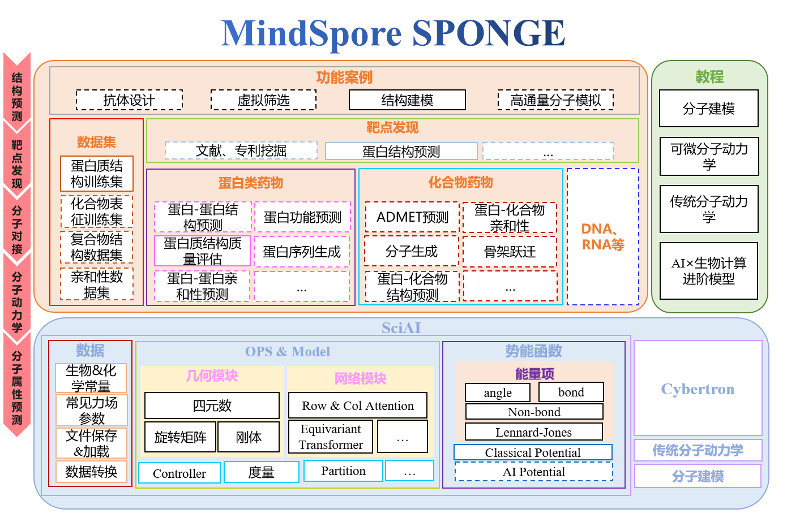

MindSPONGE 简介
===============

MindSPONGE是一款基于MindSpore的计算生物领域套件，支持分子动力学、蛋白质折叠等常用功能。

分子模拟或建模过程与AI模型训练/推理过程具有高度一致的逻辑，因此分子模拟原则上可以与AI训练/推理模式进行统一。MindSPONGE将分子模拟与AI训练/推理统一到同一套编程架构下，整体架构视图如下：

*MindSPONGE Architecture*

与传统分子模拟软件不同，AI分子模拟库具有全新的特性，例如：

1. 自动微分技术取代手动的导数编程，为不同的能量函数或构建复杂打分函数提供了统一的编程范式；
2. 完全兼容神经网络模型，支持分子模拟内的AI推理，或模拟作为引擎的AI训练；
3. 端到端可微的建模方法可以实现物理模型的元优化；
4. 分级式的代码架构，在底层采用高效语言实现算子；对用户提供面向对象的Python API方便用户自定义功能；
5. 多后端自动适配，用户只需要写一份简单的Python代码，即可在多种后端如GPU、NPU上进行加速执行；
6. 自动并行支持的高通量模拟，用户不必区分单机或多机执行的代码，可在一个硬件单元上并发多个体系的模拟，无需进行特殊的MPI编程。

在这些新特性的加持下，分子模拟与AI的统一框架可以支持广泛的分子建模与应用场景，例如：

- 基于AI改进力场或增强抽样的分子模拟；
- 数据驱动+物理驱动的分子对接；
- 蛋白质结构的预测与力场优化；
- 高通量的分子模拟；
- 分子设计等。

MindSPONGE 安装说明
-------------------

硬件支持情况
~~~~~~~~~~~~

+---------------+-----------------+------+
| 硬件平台      | 操作系统        | 状态 |
+===============+=================+======+
| Ascend 910    | Ubuntu-x86      | ✔️   |
+---------------+-----------------+------+
|               | Ubuntu-aarch64  | ✔️   |
+---------------+-----------------+------+
|               | EulerOS-aarch64 | ✔️   |
+---------------+-----------------+------+
|               | CentOS-x86      | ✔️   |
+---------------+-----------------+------+
|               | CentOS-aarch64  | ✔️   |
+---------------+-----------------+------+
| GPU CUDA 10.1 | Ubuntu-x86      | ✔️   |
+---------------+-----------------+------+

前置依赖
~~~~~~~~

-  Python>=3.7
-  MindSpore>=2.0

MindSpore安装教程请参考\ `MindSpore官网 <https://www.mindspore.cn/install>`__\ 。

源码安装
~~~~~~~~

.. code:: 

    git clone https://gitee.com/mindspore/mindscience.git
    cd mindscience/MindSPONGE

- 安装依赖

  .. code::

      pip install -r requirements.txt

- 昇腾后端

  若使用Cybetron，开启编译选项 ``c``\ 。

  .. code::

      bash build.sh -e ascend -c on

- GPU后端

  若使用Cybetron，开启编译选项 ``c``\ 。

  若使用传统分子动力学sponge，开启编译选项 ``t``\ 。

  .. code:: bash

      export CUDA_PATH={your_cuda_path}
      bash build.sh -e gpu -j32 -t on -c on

- 安装编译所得whl包

  .. code:: bash

      cd output/
      pip install mindsponge*.whl
      pip install cybertron*.whl # if "-c on" is used

SIG小组介绍
-----------

CO-CHAIR
~~~~~~~~

-  深圳湾实验室\ `杨奕 <https://gitee.com/helloyesterday>`__
-  北京昌平实验室\ `张骏 <https://gitee.com/jz_90>`__
-  北京昌平实验室\ `刘思睿 <https://gitee.com/sirui63>`__

SIG
~~~

MindSpore SPONGE SIG(Special Interesting
Group)是由一群有兴趣，有使命，旨在AI×生物计算领域做出一番成就的人组成的团队。

MindSpore SPONGE
SIG小组为广大科研人员，老师和学生提供高效易用的AI计算生物软件的同时，为在这个领域有着强大的能力或者浓厚的兴趣的人们提供了一个能够共同交流合作的平台。

SIG小组目前有着六位核心专家老师，加入SIG小组之后可以由老师带领团队进行科技调研以及代码仓功能的开发，当然也十分欢迎组员们使用MindSPONGE来进行自己的课题的调研。

在SIG小组中，我们会举办各种活动，包括暑期学校、公开课宣讲、科技分享会等大型活动，也有组内分享、知乎博文编写等多种小型活动，积极参与组内活动，能够获得非常多与老师们沟通交流的机会。

在8月15日结束的暑期学校活动中，我们邀请到了13位专家老师进行一场为期五天的授课，授课主题主要包括MindSpore基础，分子动力学以及AI
× Science进阶课程三大主题，详见\ `AI+科学计算|MindSpore
SPONGE暑期学校第二季 <https://www.bilibili.com/video/BV1pB4y167yS?spm_id_from=333.999.0.0&vd_source=94e532d8ff646603295d235e65ef1453>`__\ 。

在SIG小组中，我们还会发布众智任务和\ `开源实习任务 <https://gitee.com/mindspore/community/issues/I561LI?from=project-issue>`__\ ，欢迎大家来认领。

核心贡献者
~~~~~~~~~~

-  `高毅勤课题组 <https://www.chem.pku.edu.cn/gaoyq/>`__:
   `杨奕 <https://gitee.com/helloyesterday>`__\ ，\ `张骏 <https://gitee.com/jz_90>`__\ ，\ `刘思睿 <https://gitee.com/sirui63>`__\ ，\ `夏义杰 <https://gitee.com/xiayijie>`__\ ，\ `陈迪青 <https://gitee.com/dechin>`__\ ，\ `黄渝鹏 <https://gitee.com/gao_hyp_xyj_admin>`__\ 。

贡献指南
--------

-  如何贡献您的代码，请点击此处查看：\ `贡献指南 <https://gitee.com/mindspore/mindscience/blob/master/CONTRIBUTION.md#>`__\ 。

.. toctree::
   :glob:
   :maxdepth: 1
   :caption: 分子模拟简介

   intro/physics_driven
   intro/data_driven
   intro/physics_plus_data_driven

.. toctree::
   :glob:
   :maxdepth: 1
   :caption: 使用者指南

   user/simulation
   user/structure_prediction
   user/property_prediction
   user/design
   user/basic

.. toctree::
   :maxdepth: 1
   :caption: API参考

   mindsponge.cell
   mindsponge.common
   mindsponge.data
   mindsponge.metrics
   constant

.. toctree::
   :glob:
   :maxdepth: 1
   :caption: RELEASE NOTES

   RELEASE