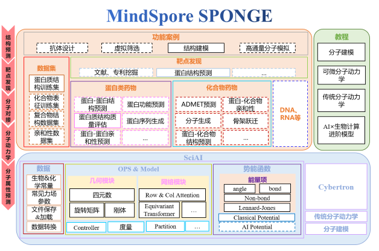

# MindSPONGE介绍

<a href="https://gitee.com/mindspore/docs/blob/master/docs/mindsponge/docs/source_zh_cn/intro.md" target="_blank"></a>

MindSpore SPONGE(Simulation Package tOwards Next GEneration molecular modelling)是基于[昇思MindSpore](https://www.mindspore.cn/)的计算生物领域套件，支持分子动力学、蛋白质折叠等常用功能，旨在于为广大的科研人员、老师及学生提供高效易用的AI计算生物软件。



## 安装教程

### 硬件支持情况

| 硬件平台      | 操作系统        | 状态 |
| :------------ | :-------------- | :--- |
| Ascend 910    | Ubuntu-x86      | ✔️ |
|               | Ubuntu-aarch64  | ✔️ |
|               | EulerOS-aarch64 | ✔️ |
|               | CentOS-x86      | ✔️ |
|               | CentOS-aarch64  | ✔️ |
| GPU CUDA 10.1 | Ubuntu-x86      | ✔️ |

### 前置依赖

- Python>=3.7
- MindSpore>=1.8

MindSpore安装教程请参考[MindSpore官网](https://www.mindspore.cn/install)。

### 源码安装

```bash
git clone https://gitee.com/mindspore/mindscience.git
cd mindscience/MindSPONGE
```

- 安装依赖

  ```bash
  pip install -r requirements.txt
  ```

- 昇腾后端

  ```bash
  bash build.sh -e ascend
  ```

- GPU后端

  若使用Cybetron，开启编译选项 `c`。

  若使用传统分子动力学sponge，开启编译选项 `t`。

  ```bash
  export CUDA_PATH={your_cuda_path}
  bash build.sh -e gpu -j32 -t on -c on
  ```

- 安装编译所得whl包

  ```bash
  cd output/
  pip install mindscience_sponge*.whl
  pip install mindscience_cybertron*.whl
  ```

## 案例初体验

### 蛋白质 violation 计算

蛋白质推理模型预测的pdb虽然在绝大多数原子上都准确预测出理想的键长和键角，然而原子间是否存在冲突以及肽键信息对于真实结构也尤为重要，violation 则计算了预测pdb的总原子间冲突程度以及肽键键长键角是否满足一定的限制条件。该计算数值对于评估预测蛋白质结构是否合理以及后续做蛋白质relax尤其重要。

violation计算公式如下:

$$
\begin{align}
\mathcal L_{viol} = \mathcal L_{bondlength }+\mathcal L_{bondangle }+\mathcal L_{clash } .
\end{align}
$$

```bash
import mindspore as ms
from mindspore import set_context
from mindspore import Tensor
from mindsponge.common.utils import get_pdb_info
from mindsponge.metrics.structure_violations import get_structural_violations

# set which gpu to use, in default use 0 card
ms.set_context(mode=ms.GRAPH_MODE, device_target="GPU", device_id=0)
input_pdb = "xxx.pdb"

# extract features from pdb
features = get_pdb_info(input_pdb)

violations = get_structural_violations(Tensor(features.get("atom14_gt_exists")).astype(ms.float32),
                                       Tensor(features.get("residue_index")).astype(ms.float32),
                                       Tensor(features.get("aatype")).astype(ms.int32),
                                       Tensor(features.get("residx_atom14_to_atom37")).astype(ms.int32),
                                       Tensor(features.get("atom14_gt_positions")).astype(ms.float32))
violation_all = violations[-1]
```

### 四元数与旋转矩阵转换

geometry模块提供基础四元数、旋转矩阵、向量操作。

```bash
from mindsponge.common.geometry import initial_affine
from mindsponge.common.geometry import quat_to_rot, rot_to_quat
# quaternion is a mindspore tensor
# rotation_matrix is a tuple of mindspore tensor, length is 9
# translation is a tuple of mindsproe tensor, length is 3
quat, rot, trans = initial_affine(128) # 128 is the num of residues
transformed_rot = quat_to_rot(quat)
transformed_quat = rot_to_quat(rot)
```

### 一个简单的分子动力学模拟案例

```bash
import numpy as np
import mindspore as ms
from mindspore import set_context
from mindsponge import Sponge
from mindsponge import Molecule
from mindsponge import ForceFieldBase
from mindsponge import DynamicUpdater
from mindsponge.potential import BondEnergy, AngleEnergy
from mindsponge.callback import WriteH5MD, RunInfo
from mindsponge.function import VelocityGenerator
from mindsponge.control import LeapFrog

set_context(mode=ms.GRAPH_MODE, device_target="GPU")

system = Molecule(
    atoms=['O', 'H', 'H'],
    coordinate=[[0, 0, 0], [0.1, 0, 0], [-0.0333, 0.0943, 0]],
    bond=[[[0, 1], [0, 2]]],
)

bond_energy = BondEnergy(
    index=system.bond,
    force_constant=[[345000, 345000]],
    bond_length=[[0.1, 0.1]],
)

angle_energy = AngleEnergy(
    index=[[1, 0, 2]],
    force_constant=[[383]],
    bond_angle=[[109.47 / 180 * np.pi]],
)

energy = ForceFieldBase(energy=[bond_energy, angle_energy])

velocity_generator = VelocityGenerator(300)
velocity = velocity_generator(system.coordinate.shape, system.atom_mass)

opt = DynamicUpdater(
    system,
    integrator=LeapFrog(system),
    time_step=1e-3,
    velocity=velocity,
)

md = Sponge(system, energy, opt)

run_info = RunInfo(10)
cb_h5md = WriteH5MD(system, 'test.h5md', save_freq=10, write_velocity=True, write_force=True)

md.run(1000, callbacks=[run_info, cb_h5md])
```

## SIG小组介绍

### CO-CHAIR

- 深圳湾实验室[杨奕](https://gitee.com/helloyesterday)
- 北京昌平实验室[张骏](https://gitee.com/jz_90)
- 北京昌平实验室[刘思睿](https://gitee.com/sirui63)

### SIG

MindSpore SPONGE SIG(Special Interesting Group)是由一群有兴趣，有使命，旨在AI×生物计算领域做出一番成就的人组成的团队。

MindSpore SPONGE SIG小组为广大科研人员，老师和学生提供高效易用的AI计算生物软件的同时，为在这个领域有着强大的能力或者浓厚的兴趣的人们提供了一个能够共同交流合作的平台。

SIG小组目前有着六位核心专家老师，加入SIG小组之后可以由老师带领团队进行科技调研以及代码仓功能的开发，当然也十分欢迎组员们使用MindSPONGE来进行自己的课题的调研。

在SIG小组中，我们会举办各种活动，包括暑期学校、公开课宣讲、科技分享会等大型活动，也有组内分享、知乎博文编写等多种小型活动，积极参与组内活动，能够获得非常多与老师们沟通交流的机会。

在8月15日结束的暑期学校活动中，我们邀请到了13位专家老师进行一场为期五天的授课，授课主题主要包括MindSpore基础，分子动力学以及AI × Science进阶课程三大主题，详见[AI+科学计算|MindSpore SPONGE暑期学校第二季](https://www.bilibili.com/video/BV1pB4y167yS?spm_id_from=333.999.0.0&vd_source=94e532d8ff646603295d235e65ef1453)。

在SIG小组中，我们还会发布众智任务和[开源实习任务](https://gitee.com/mindspore/community/issues/I561LI?from=project-issue)，欢迎大家来认领。

### 核心贡献者

- [高毅勤课题组](https://www.chem.pku.edu.cn/gaoyq/):  [杨奕](https://gitee.com/helloyesterday)，[张骏](https://gitee.com/jz_90)，[刘思睿](https://gitee.com/sirui63)，[夏义杰](https://gitee.com/xiayijie)，[陈迪青](https://gitee.com/dechin)，[黄渝鹏](https://gitee.com/gao_hyp_xyj_admin)。

## 贡献指南

- 如何贡献您的代码，请点击此处查看：[贡献指南](https://gitee.com/mindspore/mindscience/blob/master/CONTRIBUTION.md#)。
