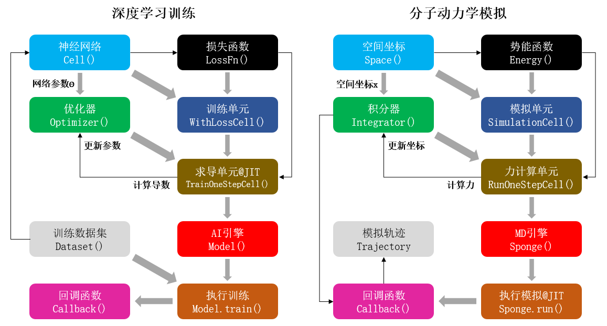

# 融合驱动

如下表格中展示了部分当前较为流行的分子动力学模拟软件。

|         | 原型/初版 | 开发语言      | 开发团队所在国 |
| :------ | :-------- | :------------ | :------------- |
| CHARMM  | 1969/1983 | Fortran       | 美国           |
| AMBER   | 1975/2002 | Fortran/C/C++ | 美国           |
| GROMOS  | 1978/1996 | Fortran/C++   | 瑞士           |
| GROMACS | 1991      | C             | 荷兰/瑞典      |
| LAMMPS  | 1995      | C++           | 美国           |
| NAMD    | 1995      | C++           | 美国           |
| OpenMM  | 2009      | C++/Python    | 美国           |

随着IT技术的发展，科学计算领域也在随之发生着变化。这一方面体现在各种新硬件的推出，比如基于GPU芯片的加速设备已经在科学计算中得到了大量的应用，极大地加快了科学计算的速度。而另一方面则在于各种新算法的出现，特别是以AlphaFold为代表的基于人工智能AI（artificial intelligent）的算法，展示了AI可以在科学计算中实现很多曾经无法实现或难以企及的目标。

而跟IT技术的快速更新换代相比，前面提到的这些主流MD模拟软件的程序架构却几乎都没有发生特别大的变化。以今天的眼光来看，这些“历史悠久”的MD模拟软件存在着许多先天缺陷，举例来说：

1. 程序框架老旧，且灵活性差，如果想要在原有程序上添加新的算法，往往需要对程序代码进行大幅改动。特别对于第三方的开发者来说，想要在程序中实现自己开发的算法难度非常大。
2. 程序多基于CPU进行编写，如果要在GPU等计算加速设备上运行这些程序并实现有效的加速，就必须对程序进行整体改动。不但工程量浩大，且往往会导致之前由第三方人员开发的算法失效。
3. 程序多用C/C++甚至Fortran语言编写，难以兼容目前主流的以Python语言为前端语言的AI框架。这导致近些年来开发的一些基于AI的算法难以真正地在MD模拟软件中得到广泛应用。

这些问题制约了MD模拟的发展，特别是阻碍了MD模拟与AI框架的融合。北京大学、深圳湾实验室、昌平实验室高毅勤教授课题组同华为合作，基于华为全场景AI框架昇思MindSpore开发了新一代智能MD模拟软件。相比于传统MD模拟软件，基于昇思MindSpore框架的MindSPONGE有以下几个优势：

首先，借助框架“自动微分（automatic differentiation）”的功能，可大幅简化分子力场的代码形式。在数学上，MD模拟通过分子力场给出的势能函数计算每个原子的受力，从而模拟出分子的运动轨迹。但使用一般程序语言编写的势能函数代码无法直接用来计算原子受力，也就是势能函数相对于原子坐标的负梯度，这部分的代码必须另外编写。因此传统的MD模拟软件不但要编写势能函数的代码，还需要事先求解势能函数对原子坐标的导数，也就是原子受力的解析表达式，然后将这部分公式也写到程序代码中。这样一来，无论是理论推导还是代码编写层面的工作量都会大幅增加，同时也让程序变得更加复杂，这也是编写传统MD模拟程序的难点之一。另外，需要手工求解势能函数这一点也极大地限制了分子力场采用数学形式更加复杂的势能函数，否则其函数的导数将难以求解，这也制约了分子力场的发展。而使用昇思MindSpore的“自动微分”功能可以直接计算函数的导数，因此在MindSPONGE中编写分子力场只需编写势能函数的代码即可，原子受力即势能函数对原子坐标的负梯度可以直接通过自动微分计算，无需再另外编写单独的代码。这不但大幅减少了代码编写的工作量，也在很大程度上简化了MD模拟程序结构的复杂度，同时也极大地拓宽了分子力场可以采用的数学模型的范围。

其次，可以大幅简化软件对不同硬件设备的适配。MD模拟软件是一类计算量超大的科学计算程序，因此在实际使用中往往需要进行并行化计算，或者使用GPU等计算加速设备进行计算。对于传统的MD模拟程序来说，除了“科学”上的功能之外，对程序进行并行化或GPU设备的移植等“工程”上的工作才是整个软件项目中最复杂、最困难的地方。这就迫使开发人员必须既当科学家，又当工程师，导致成为一名合格的MD模拟程序开发人员的学习周期长、难度大。而昇思MindSpore本身就支持多种硬件设备，使得MindSPONGE可以在CPU、GPU和华为昇腾Ascend芯片上运行，只需修改一行代码便可移植到不同的硬件设备上运行。此外，由于昇思MindSpore还具备“自动并行”（automatic parallelism）的能力，只需简单修改代码就让MindSPONGE实现程序的并行化计算。因此，科研人员使用MindSPONGE进行开发自己的算法，可以更多地去专注于程序的“科学”功能。

最后，“端到端可微” （end-to-end differentiable）赋能MD模拟程序，可实现很多传统MD模拟完全无法实现的功能。“端到端可微”MD模拟是指MD模拟从输入坐标到计算力再到更新坐标的整个过程都是可微，这对于MD模拟来说是一种革命性的技术。使用传统MD模拟无法直接获知模拟的最终结果同输入坐标或参数的关系，一旦模拟的结果不符合预期，科研人员只能通过个人经验不断地调整起始坐标或程序参数，再反复进行模拟直到获得理想的结果。而在“端到端可微”MD模拟中，由于可以直接求解输出结果相对输入坐标或参数的导数，因此科研人员可以像运行一般的AI优化算法那样，直接对MD模拟过程本身进行优化，从而获得理想的结果，避免了“反复尝试”的过程。这即是一种“元优化”（meta-optimization）过程，例如著名的蛋白质结构预测程序AlphaFold2中，蛋白质打分函数的优化算法便是一种“元优化”算法。

因此相比MD模拟传统软件，基于AI框架的MD模拟更简单、开发更高效、使用更“智能”。我们还为MindSPONGE设计了一套独一无二的程序架构，将MD模拟完全变成了一种特殊AI训练过程，从而真正实现了“智能的”MD模拟。在介绍这套独特的程序架构之前，让我们思考一个问题，那就是MD模拟和AI训练有什么相似之处吗？乍一看，AI和MD之间似乎根本没有直接的关系，但是如果仔细一想就会发现，其实两者都是在做某种“优化”：

*图1 深度学习训练与分子动力学模拟的对比。左：基于MindSpore人工智能框架进行神经网络参数训练过程的示意图。右：基于MindSPONGE进行分子动力学模拟过程的示意图。其中每个方块代表一种程序模块，灰色粗箭头为模块地组合过程，而黑色箭头表示数据更新流程。*

如上图所示，AI训练的过程是优化器（optimizer）以损失函数（loss function）为优化目标，通过计算神经网络参数（parameter）的梯度，从而对网络模型的参数进行更新；而MD模拟则是积分器（integrator）根据势能（potential）函数计算原子受力，即势能函数相对原子坐标（coordinate）的负梯度，从而对体系的原子坐标进行更新。因此，我们完全可以将MD模拟看作一种特殊的AI训练过程，这一过程跟一般AI训练唯一不同的地方在于，MD模拟过程中不需要单独提供训练数据集（training dataset），或者换句话说，体系的原子坐标本身既是“参数”也是“训练集”。因此，MD模拟在某种程度上可以看成是一种特殊的AI训练过程，使用这种“类AI”架构编写的MD模拟软件不但能在最大程度上兼容AI框架的各种算子和功能模块，而且还具备以下优势：

1. 完全模块化的程序设计。MindSPONGE的每个功能模块都可进行替换和单独开发，方便开发者在程序中加入自己的算法。同时还允许用户根据自身需求自由地组装各个模块，从而实现各种不同的功能。
2. 可以实现高通量的模拟。批量训练（mini-batch training）是AI框架的最基本功能之一，而采用“类AI”架构的MindSPONGE同样可以实现MD模拟的“批量化”，即高通量计算。
3. 天然的“端到端可微”过程。“端到端可微”MD模拟是一种革命性的MD模拟方式，能实现很多传统MD所不能提供的功能，例如力场优化等。