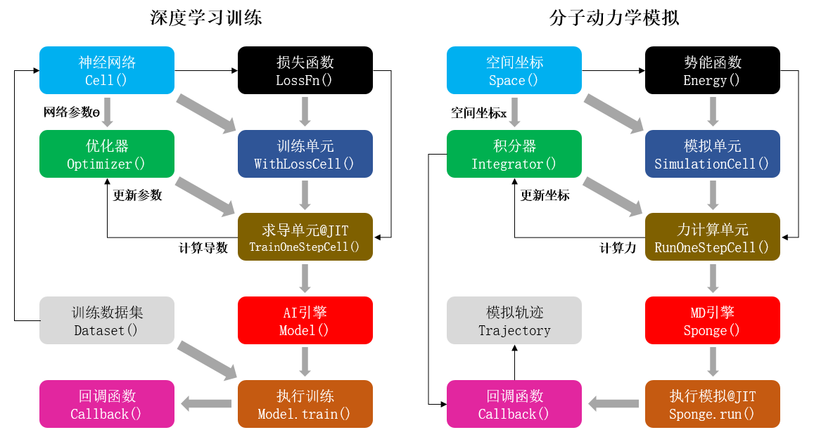

# 为什么需要下一代分子模拟软件

## 分子动力学模拟

分子动力学MD(molecular dynamics)模拟是一种根据分子力场(force field)所描述的势能(potential energy)函数模拟分子的微观运动，从而计算分子体系的物理和化学性质的科学计算工具。目前，MD模拟在化学、生物、物理、制药、材料、环境等领域有着广泛的应用。

早在上世纪六七十年代，就已经出现了针对特定体系的MD模拟程序，而经过几十年的发展，目前市面上已经有了很多通用型的MD模拟软件，他们大多都已经有了几十年的开发历史，产品成熟，且这些软件绝大多数都由西方发达国家开发，特别是由美国开发的软件更是占到大半以上。

国产MD模拟软件不但数量很少，且用户群体也基本上都局限在很小的范围，可以说跟这些“流行”的MD模拟软件还有着不小的差距。

## “流行”MD模拟软件的先天缺陷

- 程序框架老旧，且灵活性差，如果想要在原有程序上添加新的算法，往往需要对程序代码进行大幅改动。

- 程序多基于CPU进行编写，如果要在GPU等计算加速设备上运行这些程序并实现有效的加速，就必须对程序进行整体改动。不但工程量浩大，且往往会导致之前由第三方人员开发的算法失效。

- 程序多用C/C++甚至Fortran语言编写，难以兼容目前主流的以Python语言为前端语言的AI框架。

这些问题都严重制约了MD模拟的发展。特别是最后一条与AI框架的兼容性问题，更是一个严重阻碍AI技术对MD模拟进行“智能化”改造的技术壁垒。

## 完全基于AI框架的MD模拟软件

为了从根本上解决MD模拟软件的先天缺陷，就需要开发完全基于AI框架的MD模拟软件，实现AI算法与MD模拟的无缝结合。

这几十年来，IT技术的发展日新月异，科学计算领域也在随之发生着变化。一方面体现在各种新硬件的推出，比如基于GPU芯片的加速设备已经在科学计算中得到了大量的应用，极大地加快了科学计算的速度。而另一方面则在于各种新算法的出现，特别是以AlphaFold为代表的基于人工智能AI(artificial intelligent)的算法，展示了AI可以在科学计算中实现很多曾经无法实现或难以企及的目标。

在国内，华为同高毅勤教授课题组合作，基于华为全场景AI框架MindSpore开发了新一代智能MD模拟软件MindSPONGE。

相比于传统MD模拟软件，基于AI框架MindSpore的“智能”MD模拟软件MindSPONGE有几个优势：

- 借助MindSpore“自动微分(automatic differentiation)”的功能，可以大幅简化分子力场的代码形式。

- 基于MindSpore编写的程序可以大幅简化软件对不同硬件设备的适配。

- “端到端可微(end-to-end differentiable)”的MD模拟程序。

## 基于自动微分简化分子力场代码形式

在数学上，MD模拟通过分子力场给出的势能函数计算每个原子的受力，从而模拟出分子的运动轨迹。但使用一般程序语言编写的势能函数代码无法直接用来计算原子受力，也就是原子坐标相对于势能函数的负梯度。

因此传统的MD模拟软件不但要编写势能函数的代码，还需要事先求解势能函数对原子坐标的导数，也就是原子受力的解析表达式。因此，无论是理论推导还是代码编写层面的工作量都会大幅增加，也会让程序变得更加复杂，这也是编写传统MD模拟程序的难点之一。

另外，需要手工求解势能函数这一点也极大地限制了分子力场采用数学形式更加复杂的势能函数，否则其函数的导数将难以求解，这也制约了分子力场的发展。

MindSpore的“自动微分”功能，可以直接计算函数的导数，因此基于MindSpore编写分子力场只需编写势能函数的代码即可，原子受力即原子坐标对势能函数的负梯度可以直接通过“自动微分”计算，这不但大幅减少了代码编写的工作量，也在很大程度上简化了MD模拟程序结构的复杂度，同时也极大地拓宽了分子力场可以采用的数学模型的范围。

## 简化软件对不同硬件设备的适配

MD模拟软件是一类计算量超大的科学计算程序，因此在实际使用中往往需要进行并行化计算，或者使用GPU等计算加速设备进行计算。

对于传统的MD模拟程序来说，在实现了程序“科学”上的功能之后，对程序进行并行化或GPU设备的移植等“工程”上的工作才是整个软件项目中最复杂、最困难的地方。

MindSpore能在CPU、GPU和昇腾(Ascend)AI加速芯片上运行，使用MindSpore编写的程序只需修改一行代码便可移植到不同的硬件设备上。此外，MindSpore还具备“自动并行(automatic parallelism)”的能力，只需简单修改代码就能自动实现程序的并行化计算。

因此，基于MindSpore开发MD模拟程序，可以使科学家们专注于程序的“科学”功能，而将“工程”上的问题交由MindSpore本身来处理。

## “端到端可微”的MD模拟程序

MindSpore具备“高阶自动微分”的能力，可以自动求解函数的高阶导数，能够编写出“端到端可微(end-to-end differentiable)”的MD模拟程序。

“端到端可微”MD模拟是指MD模拟从输入坐标到计算力再到更新坐标的整个过程都是可微，这对于MD模拟来说是一种革命性的技术。在“端到端可微”MD模拟中，由于可以直接求解输出结果相对输入坐标或参数的导数，因此科研人员可以像运行一般的AI优化算法那样，直接对MD模拟过程本身进行优化，从而获得理想的结果，避免了“反复尝试”的过程。这即是一种“元优化(meta-optimization)”过程。

“端到端可微”被认为是下一代MD模拟的重要特征。

## “类AI”架构编写的MD模拟软件

基于AI框架的MD模拟软件相比传统软件架构更简单、开发更高效、使用更“智能”，还能实现很多传统软件所不能实现的功能。认真思考就会发现，AI训练和MD模拟这两个看似完全不同的过程，存在着许多相似的地方。

如图所示，AI训练的过程是优化器(optimizer)以损失函数(loss function)为优化目标，通过提供的训练数据集(training dataset)计算神经网络参数的梯度，从而对网络模型的参数进行更新。而MD模拟则是积分器(integrator)根据势能函数计算原子受力，即势能函数相对原子坐标的负梯度，从而对原子坐标进行更新。因此，MD模拟在某种程度上可以看成是一种特殊的AI训练过程。这种按照AI训练的过程来编写MD模拟程序即为“类AI”框架的MD模拟程序。

这种“类AI”框架的MD模拟程序还具备模块化、高通量、“端到端可微”等优点。目前，华为跟高毅勤教授课题组合作开发的MindSPONGE即是根据该架构编写的一款下一代智能MD模拟软件。

