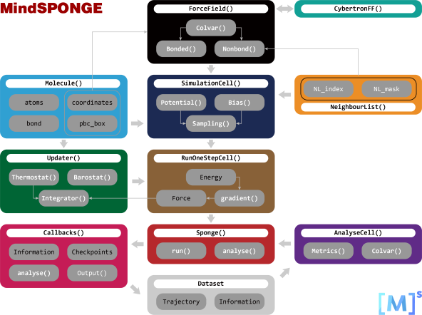

# 物理驱动

<a href="https://gitee.com/mindspore/docs/blob/master/docs/mindsponge/docs/source_zh_cn/sponge.md" target="_blank"></a>

在MindSPONGE软件包中内置了两种分子动力学模拟软件，第一种是基于C++/CUDA完成的传统分子动力学模拟软件，第二种是基于传统分子动力学，使用MindSpore所完成的可微分子动力学模拟软件。

## 传统分子动力学

传统分子动力学是基于C++/CUDA所完成的分子动力学模拟程序。不同于其他传统分子动力学模拟软件，传统分子动力学具有编程模块化的特点，代码可读性强，易于开发者与使用者进行个性化修改。传统分子动力学的结构如下图所示：


### 安装

请参考[MindSPONGE安装教程](https://www.mindspore.cn/mindsponge/docs/zh-CN/master/mindsponge/intro.html#%E5%AE%89%E8%A3%85%E6%95%99%E7%A8%8B)。

传统分子动力学安装可使用源码编译安装。

```bash
git clone https://gitee.com/mindspore/mindscience.git
cd {PATH}/mindscience/MindSPONGE
```

在使用传统分子动力学时，开启编译选项 `t`。

```bash
bash build.sh -e gpu -j32 -t on
```

安装编译所得whl包。

```bash
cd {PATH}/mindscience/MindSPONGE/output
pip install mindscience_sponge*.whl
```

### 基本使用

传统分子动力学的基本流程为：

1. 终端中最先输出各个模块用到的初始化信息。

2. 程序正式开始运行模拟。

3. 按一定模拟迭代步数输出能量，温度等系统信息。

4. 运行完毕，输出运行耗时和估计计算速度。

传统分子动力学中自带tip4p水模型，通过输入最简命令，可直接运行。

```bash
./SPONGE
```

将"mdin.txt"文件重命名为"mdin.txt1"。

```bash
./SPONGE -mdin mdin.txt1
```

在 -mdin XXX的XXX文件中出现的调控参数A = B，等价于在命令行加入指令-A B。例如：

```bash
./SPONGE -mdin mdin.txt -dt 2e-3
```

在指令文件中形如

```bash
{
    A=B
    C=D
}
```

的格式，等价于：

```bash
XXX_A=B
XXX_C=D
```

分子模拟体系基本输入输出文件参数：

```bash
mdout=mdout.txt     #记录各种能量和温度等参数
mdinfo=mdinfo.txt   #记录初始化和结束时整个模拟的各种参数信息文件
box=box.txt         #记录体系周期性盒子大小信息的文件
crd=mdcrd.dat       #记录体系原子坐标的文件
rst=restart         #记录体系此时速度和坐标的文件

# 体系初始坐标和速度
coordinate_in_file = tip4p_2880_system/Ih_coordinate.txt
velocity_in_file = tip4p_2880_system/Ih_velocity.txt

# 体系的各种基本拓扑信息
residue_in_file = tip4p_2880_system/Ih_residue.txt
mass_in_file = tip4p_2880_system/Ih_mass.txt
charge_in_file = tip4p_2880_system/Ih_charge.txt
LJ_in_file = tip4p_2880_system/Ih_lj.txt
exclude_in_file = tip4p_2880_system/Ih_exclude.txt
virtual_atom_in_file = tip4p_2880_system/Ih_vatom.txt
bond_in_file = tip4p_2880_system/Ih_bond.txt
```

力场拓扑信息和坐标速度信息也可从Amber格式文件中获取。

```bash
-amber_parm7
-amber_rst7
```

### 案例

在代码仓中获取[传统分子动力学教程](https://gitee.com/mindspore/mindscience/tree/master/MindSPONGE/applications/molecular_dynamics/tradition)。

## 可微分子动力学

可微分子动力学是一款基于MindSpore开发的模块化、高通量、端到端可微的下一代智能分子模拟程序库。就如同在开篇中所说，AI训练和MD模拟这两个看似完全不同的过程，存在着许多相似的地方。可微分子动力学软件即为一款源自该想法所完成的“类AI”框架的分子动力学模拟软件。

可微分子动力学的结构如下图所示：



### 安装

可微分子动力学的安装流程与MindSPONGE的安装流程一致，请参考[MindSPONGE安装教程](https://www.mindspore.cn/mindsponge/docs/zh-CN/master/mindsponge/intro.html#%E5%AE%89%E8%A3%85%E6%95%99%E7%A8%8B)。

### 基本使用

可微分子动力学的基本使用方法可参考[案例初体验](https://www.mindspore.cn/mindsponge/docs/zh-CN/master/mindsponge/intro.html#%E6%A1%88%E4%BE%8B%E5%88%9D%E4%BD%93%E9%AA%8C)以及后续的API介绍文档[MindSPONGE APIs](https://www.mindspore.cn/mindsponge/docs/zh-CN/master/mindsponge.html)。

### 案例

在代码仓中可获取[可微分子动力学教程](https://gitee.com/mindspore/mindscience/tree/master/MindSPONGE/tutorials/basic)。
