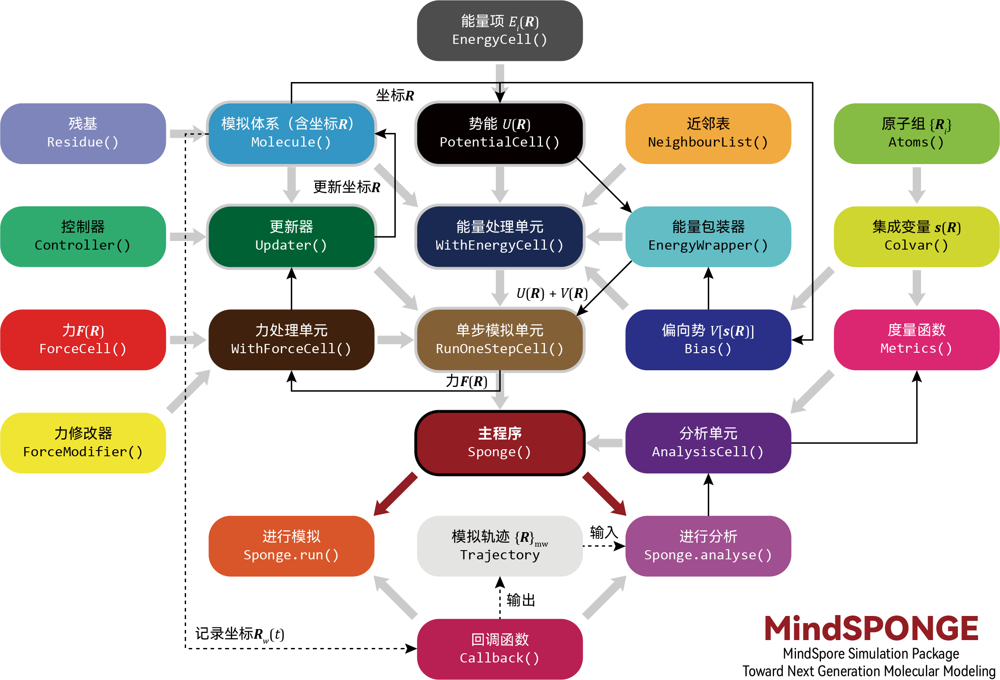
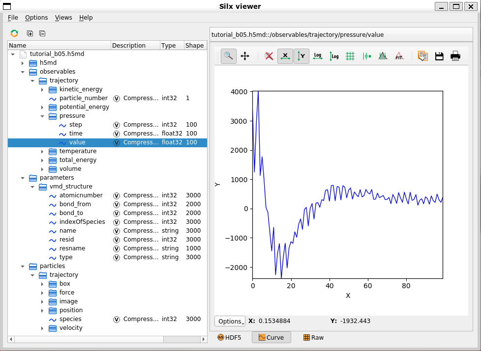

# 分子模拟

<a href="https://gitee.com/mindspore/docs/blob/r2.0.0-alpha/docs/mindsponge/docs/source_zh_cn/user/simulation.md" target="_blank"></a>

MindSPONGE采取了一种独一无二的 “类AI”分子模拟程序架构：



该架构的特点在于其将分子模拟变成了一种特殊的AI训练过程，这使得MindSPONGE可以像使用MindSpore对训练网络模型那样进行分子动力学模拟。

首先，MindSpore和MindSPONGE都需要设置三个基础单元（Cell）或功能模块，而且MindSpore和MindSPONGE的这三个基础单元之间有着一一对应的关系：

| MindSpore |           | MindSPONGE |           |
| :-------- | :-------- | :--------- | :-------- |
| 网络模型  | network   | 模拟体系   | system    |
| 损失函数  | loss_fn   | 势能函数   | potential |
| 优化器    | optimizer | 更新器     | updater   |

在设置好三个功能模块后，还需要将它们进行封装，这样才能执行训练或者模拟。

例如，一个典型的MindSpore训练网络的代码为：

```python
from mindspore.nn import WithLossCell
from mindspore.train import Model
from mindspore.train import LossMonitor
from mindspore.train import ModelCheckpoint, CheckpointConfig
# 组合方式一：
model = Model(network, loss_fn, optimizer)
# 组合方式二：
loss_net = WithLossCell(network, loss_fn)
model = Model(loss_net, optimizer=optimizer)
# 设置回调函数：
monitor_cb = LossMonitor(16)
ckpoint_cb = ModelCheckpoint('network', config=CheckpointConfig(32))
# 执行训练过程：
model.train(1024, dataset, callbacks=[monitor_cb, ckpoint_cb])
```

而使用MindSPONGE进行分子动力学模拟的代码则同上面的代码非常类似：

```python
from mindsponge import SimulationCell
from mindsponge import Sponge
from mindsponge.callback import RunInfo
from mindsponge.callback import WriteH5MD
# 组合方式一：
md = Sponge(system, potential, updater)
# 组合方式二：
sim = SimulationCell(system, potential, cutoff=1.0)
md = Sponge(sim, optimizer= updater)
# 设置回调函数：
run_info = RunInfo(10)
cb_h5md = WriteH5MD(system, 'traj.h5md', save_freq=10)
# 执行模拟过程：
md.run(1000, callbacks=[run_info, cb_h5md])
```

可以看到，在MindSpore有两种封装方式，一种是直接使用MindSpore的顶层模块Model将网络模型network、损失函数loss_fn以及优化器optimizer三者进行封装，这种情况适用于最简单的监督式学习的训练。而另外一种封装方式，则是先使用WithLossCell模块将网络模型network和损失函数loss_fn封装起来，然后再用Model模块将封装好的WithLossCell模块和优化器optimizer封装起来。这种情况适用于较为复杂的训练，例如使用MindSpore进行生成对抗网络GANs（generative adversarial networks）的训练便可以通过重载WithLossCell的方式实现。

而MindSPONGE用于对三大功能模块进行封装的顶层模块是Sponge，同样也有两种方式对三大基础单元进行封装。第一种是直接用Sponge将模拟体系system、势能函数potential以及更新器updater进行封装，这种情况同样也是适用于最普通的模拟。而另外一种则是先使用SimulationCell将模拟体系system和势能函数potential进行封装，然后在将封装好的SimulationCell同更新器updater一起封装在Sponge中。这种情况可以通过调整SimulationCell的参数实现一些比较复杂的模拟功能，如调整阶段（cutoff）半径以及设置偏向势（bias potential）等。

在封装完三大基础单元后，MindSpore通过调用Model模块的train()函数执行训练过程，而MindSPONGE则通过调用Sponge模块的run()函数执行模拟过程。在MindSpore可以通过使用不同的回调（callback）函数来处理训练过程中的信息（不涉及改变计算图），例如使用LossMonitor()函数监视训练过程中的参数变化，以及使用ModelCheckpoint()函数保存网络参数等。而MindSPONGE同样也可以使用回调函数来处理模拟过程中的信息，例如使用RunInfo()函数打印训练过程的参数信息，以及使用WriteH5MD()将模拟过程中体系坐标的变化记录为模拟轨迹（trajectory）。

## 体系（分子）模块：System(Molecule)

体系（分子）模块用于描述分子体系的化学性质，例如化学成分、拓扑信息、空间坐标等。体系模拟的基类（父类）是mindsponge.system.Molecule，其包含的参数主要有：

- 原子名（atom_name）：体系中各个原子的原子名（atom name），用于区分不同原子
- 原子类型（atom_type）：体系中各个原子的原子类型（atom type），用于设定力场参数
- 原子质量（atom_mass）：体系中各个原子的质量
- 原子电荷（atom_charge）：体系中各个原子的点电荷
- 坐标（coordinate）：体系原子的空间坐标
- 周期性盒子（pbc_box）：周期性边界条件“原胞”盒子的尺寸
- 键（bond）：原子间的键连接关系（不区分单双键）
- 残基（residue）：用于区分大分子中的分子片段或体系中的不同分子（注：Molecule中residue的概念跟PDB文件中的residue类似，每个residue不仅用于表示单个氨基酸残基，也用于表示单个小分子，如水分子和无机盐离子等）

Molecule类可以通过人为传入上述的参数进行初始化：

```python
from mindsponge import Molecule

system = Molecule(
    atom_name=['O', 'H1', 'H2'],
    atom_type=['OW', 'HW', 'HW'],
    atom_mass=[16, 1.008, 1.008],
    coordinate=[
        [0, 0, 0],
        [0.1, 0, 0],
        [-0.0333, 0.0943, 0]
        ],
    bond=[[[0, 1], [0, 2]]],
)
```

而对于蛋白质分子，则可以使用Molecule类的子类Protein类，通过读取PDB文件进行初始化：

```bash
    from mindsponge import Protein
    system = Protein(pdb='protein.pdb')
```

## 势能（力场）模块：Potential (Force Field)

势能模块用于描述模拟过程中所使用的势能函数，势能模块的基类（父类）是mindsponge.potential.PotentialCell。而经典分子模拟一般使用分子力场（force field）作为势能函数，在MindSPONGE则为力场模块。力场模块的基类是mindsponge.potential.ForceFieldBase，其为PotentialCell的子类。经典分子力场一般包含不同的能量项，常见的能量项有键长（bond length）、键角（bond angles）、二面角（dihedral angles）、库伦（Coulomb）相互作用、范德华（van der Waals）相互作用等。在mindsponge.potential.energy中内置了一些常用的能量项，可以将这些能量项以列表（list）的形式传入ForceFieldBase以对其进行初始化：

```python
from mindsponge import ForceFieldBase
from mindsponge.potential.energy import *
bond_energy = BondEnergy(bond_index, force_constant=rk_init, bond_length=req_init)
angle_energy = AngleEnergy(angle_index, force_constant=tk_init, bond_angle=teq_init)
dihedral_energy = DihedralEnergy(dihedral_index, force_constant=pk_init, periodicity=pn_init, phase=phase_init)
ele_energy = CoulombEnergy(atom_charge=system.atom_charge)
vdw_energy = LennardJonesEnergy(sigma=sigma, epsilon=epsilon)
potential = ForceFieldBase(
    energy=[bond_energy,
            angle_energy,
            dihedral_energy,
            ele_energy,
            vdw_energy],
)
```

而对于成套的分子力场，也可以使用ForceFieldBase的子类ForceField类，通过传入体系模块和力场参数文件的方式进行初始化，例如建立一个AMBER FF14SB力场的势能函数：

```bash
    from mindsponge import ForceField
    potential = ForceField(system, 'AMBER.FF14SB')
```

这里的字符串'AMBER.FF14SB'本质上是一个YAML格式力场参数文件的文件名。MindSPONGE读取力场参数的规则是，首先在当前目录下寻找是否存在一个同名文件，如果有则读取该文件，如果没有则会继续在mindsponge.data.forcefield目录中寻找并读取同名文件。

注意，如果使用ForceField类建立势能函数，那么其初始化过程中会对传入的体系（分子）模块system的原子类型（atom_type）等力场相关的参数进行重构。这是因为不同分子力场的原子类型（atom type）往往并不相同，而MindSPONGE在使用体系模块进行建模时，并没有像绝大多数传统的MD模拟软件那样要求在建模前就指定分子力场。所以在很多情况下，体系（分子）模块在初始化的时候并没有设定原子类型（atom_type），所以在使用ForceField建立势能函数时，会根据体系（分子）模块中的原子名（atom_name）来自动设置原子类型（atom_type）、电荷（atom_charge）、质量（atom_mass）。

## 更新器（优化器）模块：Updater (Optimizer)

在MindSPONGE中，更新器Updater用于在模拟过程中更新模拟体系的原子坐标。更新器Updater本质上其实是一个优化器（optimizer），其基类mindsponge.optimizer.Updater也是mindspore.nn.Optimizer的子类。实际上MindSpore的优化器，如Adam等可以直接作为MindSPONGE的更新器使用，此时的模拟过程就相当于对模拟体系进行能量极小化（energy minimization）。

而MindSPONGE的更新器（Updater）可以通过不同的“控制器”（controller）对模拟过程进行细致的调控。控制器（Controller）的基类（父类）是mindsponge.control.Controller，可以用来调节和更新模拟过程中体系的坐标（coordinate）、速度（velocity）、力（force）、能量（energy）、动能（kinetics）、维里（virial）、周期性盒子（PBC box）七个变量。常见的控制器（Controller）包括积分器（Integrator）、控温器（Thermostat）、控压器（Barostat）以及约束（Constraint）等。基类的更新器（Updater）可以通过接受一个控制器类的列表（list）进行初始化，而在模拟过程中会按照列表中控制器的顺序更新相应的参数：

```python
from mindsponge import Updater
from mindsponge.control import VelocityVerlet
from mindsponge.control import Langevin
from mindsponge.control import BerendsenBarostat
from mindsponge.control import Lincs

integrator = VelocityVerlet(system, thermostat=Langevin(system, 300))

opt = Updater(
    system,
    controller=[
    integrator,
        Lincs(system, 'h-bonds’),
        BerendsenBarostat(system, 1)
    ],
velocity=velocity,
time_step=1e-3,
)
```

而对于一般的分子动力学模拟来说，则可以使用更新器（Updater）的子类mindsponge.control.MolecularDynamics来作为更新，直接设置积分器（integrator）、控温器（thermostat）、控压器（barostat）以及约束（constraint）来进行初始化：

```python
from mindsponge import MolecularDynamics
from mindsponge.control import VelocityVerlet
from mindsponge.control import Langevin
from mindsponge.control import BerendsenBarostat
from mindsponge.control import Lincs

opt = MolecularDynamics (
    system,
    integrator=VelocityVerlet(system),
    thermostat=Langevin(system, 300),
    barostat=BerendsenBarostat(system, 1),
    constraint=Lincs(system, 'h-bonds'),
    velocity=velocity,
    time_step=1e-3,
)
```

## 核心模拟单元：SimulationCell

前面介绍过，除了直接用MindSPONGE的顶层模块Sponge将三大功能模块，也就是体系（分子）模块、势能（力场）模块以及更新器（优化器）模块进行封装外，也可以先使用SimulationCell将体系（分子）模块、势能（力场）模块进行封装。除了封装两大模块外，SimulationCell在初始化时还可以设置近邻表（neighbour list）、偏向势（bias potential）以及势能后处理方式（wrapper）等：

```python
from mindsponge import SimulationCell
from mindsponge.partition import NeighbourList
from mindsponge.potential.bias import MetaD
from mindsponge.core.wrapper import ReplicaExchange

neighbour_list = NeighbourList(system, cutoff=1, use_grids=True)

simulation = SimulationCell(
    system=system,
    potential=potential,
    neighbour_list=neighbour_list,
    bias=MetaDynamics(colvar=colvar),
    wrapper=ReplicaExchange(steps=100),
    )
```

## 回调函数：Callback

在AI框架中，回调函数（callback）用来进行一些不改变计算图的操作，例如监视和记录训练过程中损失函数的变化、验证训练过程中的参数是否达标、根据验证结果中止训练过程等。而在MindSPONGE中，同样可以使用Callback来实现那些不影响模拟过程的操作，例如监视重要的模拟参数、记录模拟轨迹、计算模拟过程中的物理量和CVs（collective variables）等。

目前MindSPONGE内置了两个Callback函数：

- RunInfo：用于打印模拟过程的中间量，如能量、温度、压强等。
- WriteH5MD：输出H5MD格式的模拟轨迹。

## 模拟轨迹文件：H5MD

MindSPONGE采用H5MD作为记录模拟轨迹的默认文件格式。H5MD (HDF5 Molecular Data）是比利时布鲁塞尔自由大学的Pierre de Buyl博士等人于2014年提出的一种基于HDF5（Hierarchical Data Format 5）格式的MD模拟轨迹文件格式[1]。

德国斯图加特大学的Jonas Landsgesell和Sascha Ehrhardt和开发了一款[VMD插件](https://github.com/h5md/VMD-h5mdplugin)，安装后可以用VMD查看H5MD格式的模拟轨迹文件。但此插件存在Bug，且自2019以后就不再更新。我们Fork了[原版仓库](https://gitee.com/helloyesterday/VMD-h5mdplugin)，修正了bug，并在原版程序的基础上进行了小幅修改，增加了坐标的单位转换等功能，并将默认的文件扩展名由.h5改为.h5md。此外，也可以使用[MDAnalysis](https://www.mdanalysis.org/)来读取H5MD文件的模拟轨迹信息。

得益于HDF5的多层级数据结构，H5MD除了可以记录模拟轨迹之外，本身也具有非常强大的可扩展性，可以记录模拟过程中的相关数据。MindSPONGE将模拟过程中的势能（potential energy）、动能（kinetic energy）、温度（temperature）、压强（pressure）等信息记录在了H5MD文件的observables目录中。这些信息可以使用一些HDF5阅读器来进行查看，例如[Silx Viewer](https://www.silx.org/doc/silx/latest/)：



## 使用教程

使用MindSPONGE进行分子动力学模拟的教程可在[MindScience仓库](https://gitee.com/mindspore/mindscience/tree/r0.2.0-alpha/MindSPONGE/tutorials/basic)进行查看。

## 参考文献

[1] de Buyl, P.; Colberg, P. H.; Höfling, F. H5MD: A Structured, Efficient, and Portable File Format for Molecular Data [J]. Comput Phys Commun 2014, 185(6): 1546-1553.