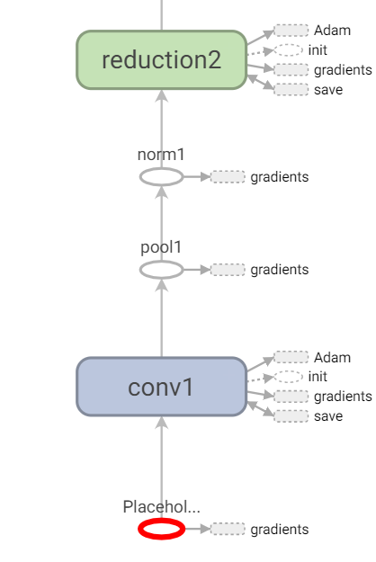
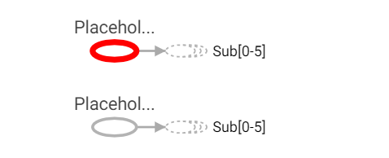
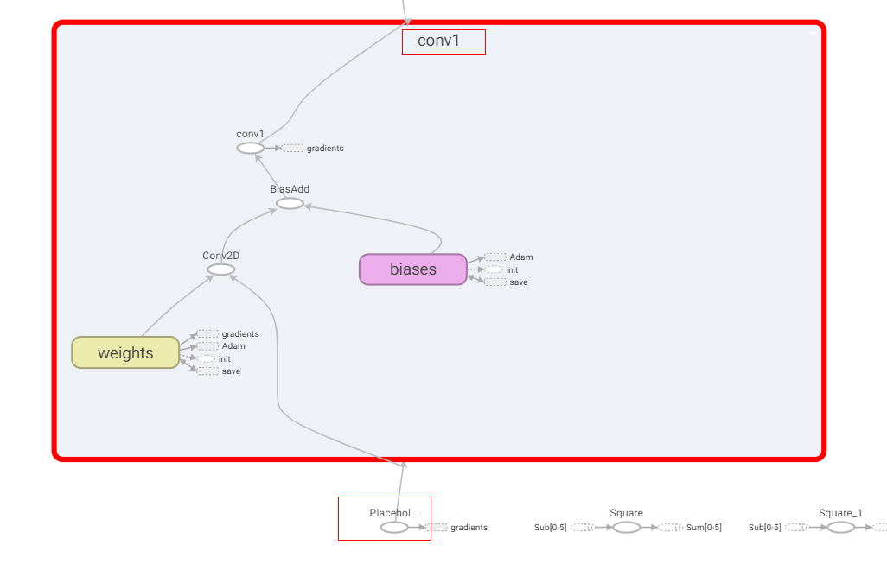

# Migration Script

Translator: [zhangxiaoxiao](https://gitee.com/zhangxiaoxiao16)

<a href="https://gitee.com/mindspore/docs/blob/master/docs/mindspore/migration_guide/source_en/migration_script.md" target="_blank"></a>

## Overview

This document describes how to migrate network scripts from the TensorFlow or PyTorch framework to MindSpore。

## Migrating the TensorFlow Script to MindSpore

Migrate scripts by reading the TensorBoard graphs。

1. The [PoseNet](https://arxiv.org/pdf/1505.07427v4.pdf) implemented by TensorFlow is used as an example to show how to use TensorBoard to read graphs, write MindSpore code, and migrate [TensorFlow Models](https://github.com/kentsommer/tensorflow-posenet) to MindSpore.

   > The PoseNet code mentioned here is based on Python2. You need to make some syntax changes to run on Python3. Details are not described here.

2. Rewrite the code, use `tf.summary` interface, save the log required by TensorBoard, start TensorBoard.

3. The following figure shows the opened TensorBoard, and it's for reference only. This may vary depending on how the log is generated. The figure displayed on TensorBoard may vary in the log generation mode.

   

4. Find the Placeholder of three inputs, view the figure and read the code, and the second and third inputs are used only for loss calculation.

   

   

   

   So far, we can preliminarily follow three steps to construct a network model:

   Step 1, the first input will compute six outputs in the backbone in the three inputs of the network.

   Step 2, the result of step 1, the second and third inputs are used to calculate the loss in the loss subnet.

   Step 3, construct the reverse network by using `TrainOneStepCell` automatic differentiation. Use the Adam optimizer and attributes provided by TensorFlow to write the corresponding MindSpore optimizer to update parameters. The network backbone can write as follows:

   ```python
   import mindspore
   from mindspore import nn
   from mindspore.nn import TrainOneStepCell
   from mindspore.nn import Adam

   # combine backbone and loss
   class PoseNetLossCell(nn.Cell):
       def __init__(self, backbone, loss):
           super(PoseNetLossCell, self).__init__()
           self.pose_net = backbone
           self.loss = loss
       def construct(self, input_1, input_2, input_3):
           p1_x, p1_q, p2_x, p2_q, p3_x, p3_q = self.poss_net(input_1)
           loss = self.loss(p1_x, p1_q, p2_x, p2_q, p3_x, p3_q, input_2, input_3)
           return loss

   # define backbone
   class PoseNet(nn.Cell):
       def __init__(self):
           super(PoseNet, self).__init__()
       def construct(self, input_1):
           """do something with input_1, output num 6"""
           return p1_x, p1_q, p2_x, p2_q, p3_x, p3_q

   # define loss
   class PoseNetLoss(nn.Cell):
       def __init__(self):
           super(PoseNetLoss, self).__init__()

       def construct(self, p1_x, p1_q, p2_x, p2_q, p3_x, p3_q, poses_x, poses_q):
           """do something to calc loss"""
           return loss

   # define network
   backbone = PoseNet()
   loss = PoseNetLoss()
   net_with_loss = PoseNetLossCell(backbone, loss)
   opt = Adam(net_with_loss.trainable_params(), learning_rate=0.001, beta1=0.9, beta2=0.999, eps=1e-08, use_locking=False)
   net_with_grad = TrainOneStepCell(net_with_loss, opt)
   ```

5. Next, let's implement the computing logic in the backbone.

   The first input passes through a subgraph named conv1, and the computing logic can be obtained by looking at the following figure:

   

   input->Conv2D->BiasAdd->ReLU, although the operator name after BiasAdd is conv1, it actually executes ReLU.

   

   Then, the first subgraph conv1 can be defined as follows. Specific parameters are aligned with those in the original project:

   ```python
   class Conv1(nn.Cell):
       def __init__(self):
           super(Conv1, self).__init__()
           self.conv = Conv2d()
           self.relu = ReLU()
       def construct(self, x):
           x = self.conv(x)
           x = self.relu(x)
           return x
   ```

   By observing the TensorBoard figure and code, we find that the subnet of the conv type defined in the original TensorFlow project can be copied as the subnet of MindSpore to reduce repeated code.

   TensorFlow project conv subnet definition:

   ```python
   def conv(self,
                input,
                k_h,
                k_w,
                c_o,
                s_h,
                s_w,
                name,
                relu=True,
                padding=DEFAULT_PADDING,
                group=1,
                biased=True):
           # Verify that the padding is acceptable
           self.validate_padding(padding)
           # Get the number of channels in the input
           c_i = input.get_shape()[-1]
           # Verify that the grouping parameter is valid
           assert c_i % group == 0
           assert c_o % group == 0
           # Convolution for a given input and kernel
           convolve = lambda i, k: tf.nn.conv2d(i, k, [1, s_h, s_w, 1], padding=padding)
           with tf.variable_scope(name) as scope:
               kernel = self.make_var('weights', shape=[k_h, k_w, c_i / group, c_o])
               if group == 1:
                   # This is the common-case. Convolve the input without any further complications.
                   output = convolve(input, kernel)
               else:
                   # Split the input into groups and then convolve each of them independently
                   input_groups = tf.split(3, group, input)
                   kernel_groups = tf.split(3, group, kernel)
                   output_groups = [convolve(i, k) for i, k in zip(input_groups, kernel_groups)]
                   # Concatenate the groups
                   output = tf.concat(3, output_groups)
               # Add the biases
               if biased:
                   biases = self.make_var('biases', [c_o])
                   output = tf.nn.bias_add(output, biases)
               if relu:
                   # ReLU non-linearity
                   output = tf.nn.relu(output, name=scope.name)
               return output
   ```

   The MindSpore subnet is defined as follows:

   ```python
   from mindspore import nn
   from mindspore.nn import Conv2d, ReLU

   class ConvReLU(nn.Cell):
       def __init__(self, channel_in, kernel_size, channel_out,  strides):
           super(ConvReLU, self).__init__()
           self.conv = Conv2d(channel_in, channel_out, kernel_size, strides, has_bias=True)
           self.relu = ReLU()

       def construct(self, x):
           x = self.conv(x)
           x = self.relu(x)
           return x
   ```

   Based on the data flow direction and operator attributes in the TensorBoard, the backbone computing logic can be written as follows:

   ```python
   from mindspore.nn import MaxPool2d
   import mindspore.ops as ops


   class LRN(nn.Cell):
       def __init__(self, radius, alpha, beta, bias=1.0):
           super(LRN, self).__init__()
           self.lrn = ops.LRN(radius, bias, alpha, beta)
       def construct(self, x):
           return self.lrn(x)


   class PoseNet(nn.Cell):
       def __init__(self):
           super(PoseNet, self).__init__()
           self.conv1 = ConvReLU(3, 7, 64, 2)
           self.pool1 = MaxPool2d(3, 2, pad_mode="SAME")
           self.norm1 = LRN(2, 2e-05, 0.75)
           self.reduction2 = ConvReLU(64, 1, 64, 1)
           self.conv2 = ConvReLU(64, 3, 192, 1)
           self.norm2 = LRN(2, 2e-05, 0.75)
           self.pool2 = MaxPool2d(3, 2, pad_mode="SAME")
           self.icp1_reduction1 = ConvReLU(192, 1, 96, 1)
           self.icp1_out1 = ConvReLU(96, 3, 128, 1)
           self.icp1_reduction2 = ConvReLU(192, 1, 16, 1)
           self.icp1_out2 = ConvReLU(16, 5, 32, 1)
           self.icp1_pool = MaxPool2d(3, 1, pad_mode="SAME")
           self.icp1_out3 = ConvReLU(192, 5, 32, 1)
           self.icp1_out0 = ConvReLU(192, 1, 64, 1)
           self.concat = ops.Concat(axis=1)
           self.icp2_reduction1 = ConvReLU(256, 1, 128, 1)
           self.icp2_out1 = ConvReLU(128, 3, 192, 1)
           self.icp2_reduction2 = ConvReLU(256, 1, 32, 1)
           self.icp2_out2 = ConvReLU(32, 5, 96, 1)
           self.icp2_pool = MaxPool2d(3, 1, pad_mode="SAME")
           self.icp2_out3 = ConvReLU(256, 1, 64, 1)
           self.icp2_out0 = ConvReLU(256, 1, 128, 1)
           self.icp3_in = MaxPool2d(3, 2, pad_mode="SAME")
           self.icp3_reduction1 = ConvReLU(480, 1, 96, 1)
           self.icp3_out1 = ConvReLU(96, 3, 208, 1)
           self.icp3_reduction2 = ConvReLU(480, 1, 16, 1)
           self.icp3_out2 = ConvReLU(16, 5, 48, 1)
           self.icp3_pool = MaxPool2d(3, 1, pad_mode="SAME")
           self.icp3_out3 = ConvReLU(480, 1, 64, 1)
           self.icp3_out0 = ConvReLU(480, 1, 192, 1)
           """etc"""
           """..."""

       def construct(self, input_1):
           """do something with input_1, output num 6"""
           x = self.conv1(input_1)
           x = self.pool1(x)
           x = self.norm1(x)
           x = self.reduction2(x)
           x = self.conv2(x)
           x = self.norm2(x)
           x = self.pool2(x)
           pool2 = x

           x = self.icp1_reduction1(x)
           x = self.icp1_out1(x)
           icp1_out1 = x

           icp1_reduction2 = self.icp1_reduction2(pool2)
           icp1_out2 = self.icp1_out2(icp1_reduction2)

           icp1_pool = self.icp1_pool(pool2)
           icp1_out3 = self.icp1_out3(icp1_pool)

           icp1_out0 = self.icp1_out0(pool2)

           icp2_in = self.concat((icp1_out0, icp1_out1, icp1_out2, icp1_out3))
           """etc"""
           """..."""

           return p1_x, p1_q, p2_x, p2_q, p3_x, p3_q
   ```

   Correspondingly, the loss computing logic may be written as follows:

   ```python
   class PoseNetLoss(nn.Cell):
       def __init__(self):
           super(PoseNetLoss, self).__init__()
           self.sub = ops.Sub()
           self.square = ops.Square()
           self.reduce_sum = ops.ReduceSum()
           self.sqrt = ops.Sqrt()

       def construct(self, p1_x, p1_q, p2_x, p2_q, p3_x, p3_q, poses_x, poses_q):
           """do something to calc loss"""
           l1_x = self.sqrt(self.reduce_sum(self.square(self.sub(p1_x, poses_x)))) * 0.3
           l1_q = self.sqrt(self.reduce_sum(self.square(self.sub(p1_q, poses_q)))) * 150
           l2_x = self.sqrt(self.reduce_sum(self.square(self.sub(p2_x, poses_x)))) * 0.3
           l2_q = self.sqrt(self.reduce_sum(self.square(self.sub(p2_q, poses_q)))) * 150
           l3_x = self.sqrt(self.reduce_sum(self.square(self.sub(p3_x, poses_x)))) * 1
           l3_q = self.sqrt(self.reduce_sum(self.square(self.sub(p3_q, poses_q)))) * 500
           return l1_x + l1_q + l2_x + l2_q + l3_x + l3_q
   ```

   Ultimately, your training script should look like this:

   ```python
   if __name__ == "__main__":
       backbone = PoseNet()
       loss = PoseNetLoss()
       net_with_loss = PoseNetLossCell(backbone, loss)
       opt = Adam(net_with_loss.trainable_params(), learning_rate=0.001, beta1=0.9, beta2=0.999, eps=1e-08, use_locking=False)
       net_with_grad = TrainOneStepCell(net_with_loss, opt)
       """dataset define"""
       model = Model(net_with_grad)
       model.train(epoch_size, dataset)
   ```

   In this way, the model script is basically migrated from TensorFlow to MindSpore. Then, various MindSpore tools and computing policies are used to optimize the precision.

## Migrating the PyTorch Script to MindSpore

Read the PyTorch script to migrate directly.

1. The PyTorch subnet module usually inherits `torch.nn.Module`, and MindSpore usually inherits `mindspore.nn.Cell`. The forward method needs to be re-written for the forward calculation logic of the PyTorch subnet module, and the construct method needs to be rewritten for the forward calculation logic of the MindSpore subnet module.

2. Take the migration of the Bottleneck class in MindSpore as an example.

   PyTorch project code

   ```python
   # defined in PyTorch
   class Bottleneck(nn.Module):
       def __init__(self, inplanes, planes, stride=1, mode='NORM', k=1, dilation=1):
           super(Bottleneck, self).__init__()
           self.mode = mode
           self.relu = nn.ReLU(inplace=True)
           self.k = k

           btnk_ch = planes // 4
           self.bn1 = nn.BatchNorm2d(inplanes)
           self.conv1 = nn.Conv2d(inplanes, btnk_ch, kernel_size=1, bias=False)

           self.bn2 = nn.BatchNorm2d(btnk_ch)
           self.conv2 = nn.Conv2d(btnk_ch, btnk_ch, kernel_size=3, stride=stride, padding=dilation,
                                  dilation=dilation, bias=False)

           self.bn3 = nn.BatchNorm2d(btnk_ch)
           self.conv3 = nn.Conv2d(btnk_ch, planes, kernel_size=1, bias=False)

           if mode == 'UP':
               self.shortcut = None
           elif inplanes != planes or stride > 1:
               self.shortcut = nn.Sequential(
                   nn.BatchNorm2d(inplanes),
                   self.relu,
                   nn.Conv2d(inplanes, planes, kernel_size=1, stride=stride, bias=False)
               )
           else:
               self.shortcut = None

       def _pre_act_forward(self, x):
           residual = x

           out = self.bn1(x)
           out = self.relu(out)
           out = self.conv1(out)

           out = self.bn2(out)
           out = self.relu(out)
           out = self.conv2(out)

           out = self.bn3(out)
           out = self.relu(out)
           out = self.conv3(out)

           if self.mode == 'UP':
               residual = self.squeeze_idt(x)
           elif self.shortcut is not None:
               residual = self.shortcut(residual)

           out += residual

           return out

       def squeeze_idt(self, idt):
           n, c, h, w = idt.size()
           return idt.view(n, c // self.k, self.k, h, w).sum(2)

       def forward(self, x):
           out = self._pre_act_forward(x)
           return out

   ```

   Based on the differences in defining convolution parameters between PyTorch and MindSpore, the definition can be translated as follows:

   ```python
   from mindspore import nn
   import mindspore.ops as ops

   # defined in MindSpore
   class Bottleneck(nn.Cell):
       def __init__(self, inplanes, planes, stride=1, k=1, dilation=1):
           super(Bottleneck, self).__init__()
           self.mode = mode
           self.relu = nn.ReLU()
           self.k = k

           btnk_ch = planes // 4
           self.bn1 = nn.BatchNorm2d(num_features=inplanes, momentum=0.9)
           self.conv1 = nn.Conv2d(in_channels=inplanes, out_channels=btnk_ch, kernel_size=1, pad_mode='pad', has_bias=False)

           self.bn2 = nn.BatchNorm2d(num_features=btnk_ch, momentum=0.9)
           self.conv2 = nn.Conv2d(in_channels=btnk_ch, out_channels=btnk_ch, kernel_size=3, stride=stride, pad_mode='pad', padding=dilation, dilation=dilation, has_bias=False)

           self.bn3 = nn.BatchNorm2d(num_features=btnk_ch, momentum=0.9)
           self.conv3 = nn.Conv2d(in_channels=btnk_ch, out_channels=planes, kernel_size=1, pad_mode='pad', has_bias=False)

           self.shape = ops.Shape()
           self.reshape = ops.Reshape()
           self.reduce_sum = ops.ReduceSum()

           if mode == 'UP':
               self.shortcut = None
           elif inplanes != planes or stride > 1:
               self.shortcut = nn.SequentialCell([
                   nn.BatchNorm2d(num_features=inplanes, momentum=0.9),
                   nn.ReLU(),
                   nn.Conv2d(in_channels=inplanes, out_channels=planes, kernel_size=1, stride=stride, pad_mode='pad', has_bias=False)
               ])
           else:
               self.shortcut = None

       def _pre_act_forward(self, x):
           residual = x

           out = self.bn1(x)
           out = self.relu(out)
           out = self.conv1(out)

           out = self.bn2(out)
           out = self.relu(out)
           out = self.conv2(out)

           out = self.bn3(out)
           out = self.relu(out)
           out = self.conv3(out)

           if self.shortcut is not None:
               residual = self.shortcut(residual)

           out += residual
           return out

       def construct(self, x):
           out = self._pre_act_forward(x)
           return out
   ```

3. PyTorch backpropagation is usually implemented by `loss.backward()`, and parameter update is implemented by `optimizer.step()`. In MindSpore, these parameters do not need to be explicitly invoked by the user and can be transferred to the `TrainOneStepCell` class for backpropagation and gradient update. Finally, the training script should look like this:

   ```python
   # define dataset
   dataset = ...

   # define backbone and loss
   backbone = Net()
   loss = NetLoss()

   # combine backbone and loss
   net_with_loss = WithLossCell(backbone, loss)

   # define optimizer
   opt = ...

   # combine forward and backward
   net_with_grad = TrainOneStepCell(net_with_loss, opt)

   # define model and train
   model = Model(net_with_grad)
   model.train(epoch_size, dataset)
   ```

PyTorch and MindSpore have similar definitions of some basic APIs, such as [mindspore.nn.SequentialCell](https://www.mindspore.cn/docs/api/en/master/api_python/nn/mindspore.nn.SequentialCell.html#mindspore.nn.SequentialCell) and [torch.nn.Sequential](https://pytorch.org/docs/stable/generated/torch.nn.Sequential.html#torch.nn.Sequential). In addition, some operator APIs may be not the same. This section lists some common API comparisons. For more information, see the [MindSpore and PyTorch API mapping](https://www.mindspore.cn/docs/note/en/master/index.html#operator_api) on MindSpore's official website.

|              PyTorch              |                     MindSpore                      |
| :-------------------------------: | :------------------------------------------------: |
|           tensor.view()           |     mindspore.ops.operations.Reshape()(tensor)     |
|           tensor.size()           |      mindspore.ops.operations.Shape()(tensor)      |
|         tensor.sum(axis)          | mindspore.ops.operations.ReduceSum()(tensor, axis) |
| torch.nn.Upsample[mode: nearest]  |   mindspore.ops.operations.ResizeNearestNeighbor   |
| torch.nn.Upsample[mode: bilinear] |      mindspore.ops.operations.ResizeBilinear       |
|          torch.nn.Linear          |                 mindspore.nn.Dense                 |
|       torch.nn.PixelShuffle       |       mindspore.ops.operations.DepthToSpace        |

It should be noticed that although `torch.nn.MaxPool2d` and `mindspore.nn.MaxPool2d` are similar in interface definition, and MindSpore actually invokes the `MaxPoolWithArgMax` operator during training on Ascend. The function of this operator is the same as that of TensorFlow, during the migration, and the MindSpore output after the MaxPool layer is inconsistent with that of PyTorch. Theoretically, it's not affect the final training result.
