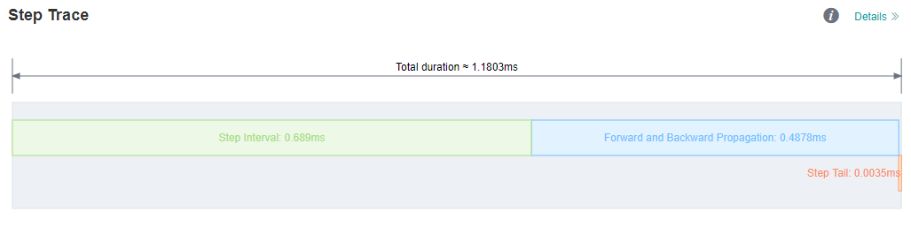
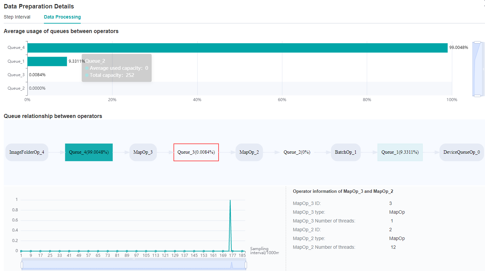
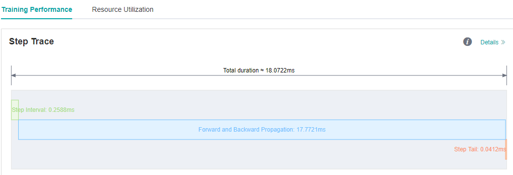
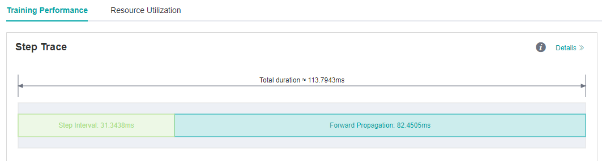
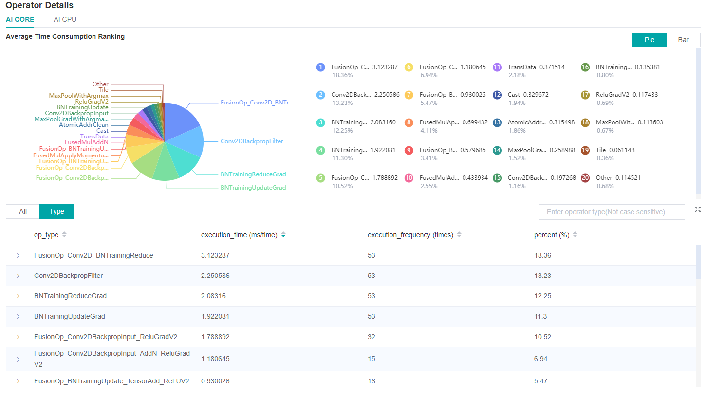
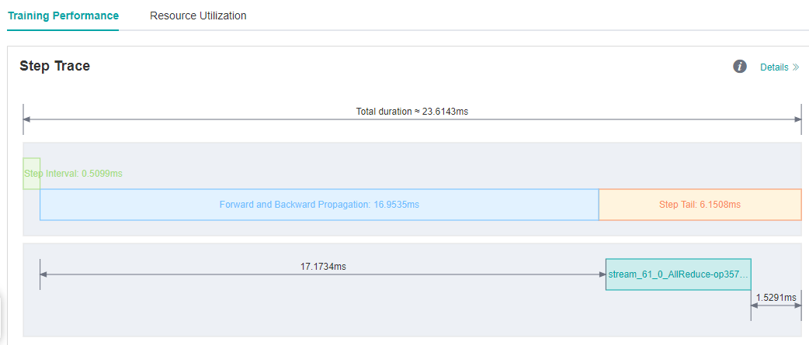
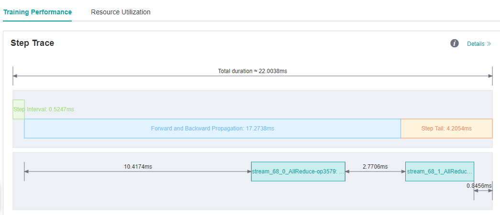

# Using Performance Profiling Tool

<a href="https://gitee.com/mindspore/docs/blob/master/docs/mindspore/migration_guide/source_en/performance_optimization.md" target="_blank"></a>

Profiler provides performance tuning ability for MindSpore, and provides easy-to-use and rich debugging functions in operator performance, data processing performance, etc., helping users quickly locate and solve performance problems.

This chapter introduces the common methods and cases of performance tuning in neural networks, as well as the resolution of some common problems.

## Quick Start

Please refer to the tutorials for the function introduction and instructions of MindSpore Profiler.

[Performance Profiling（Ascend）](https://www.mindspore.cn/mindinsight/docs/en/master/performance_profiling_ascend.html)

[Performance Profiling（GPU）](https://www.mindspore.cn/mindinsight/docs/en/master/performance_profiling_gpu.html)

[Cluster Performance Profiling (Ascend)](https://www.mindspore.cn/mindinsight/docs/en/master/performance_profiling_ascend_of_cluster.html)

This section will introduce the common use of MindSpore Profiler through three typical cases.

### Case 1: Long Step Interval

We run ResNet50 training script in MindSpore [ModelZoo](https://gitee.com/mindspore/models/tree/master ) with batch size set to 32, and we find that each step cost almost 90ms.
As we observed on the MindInsight UI page, the step interval in the step trace is too long, which may indicate that performance can be optimized in the dataset processing process.



*Figure 1: Long Step Interval in Step Trace*

Looking at the ```Step Interval``` tab in ```Data Preparation details``` page, we can see that the ratio of full queues in ```Host Queue``` is low, which can be preliminarily determined that the performance related to dataset processing can be improved.


*Figure 2: Data Preparation Details -- Step Interval*

Switch to the ```Data Processing``` tab to find which operator is slower.



*Figure 3: Data Preparation Details -- Data Processing*

By observing the ```Queue relationship between operators```, we find that the average usage of ```Queue_3``` is relatively inefficient.

Therefore, it can be determined that we can adjust the corresponding dataset operators, ```MapOp_3```, to achieve better performance.
We can refer to [Optimizing the Data Processing](https://www.mindspore.cn/docs/programming_guide/en/master/optimize_data_processing.html ) to adjust dataset operators to improve dataset performance.

We observe that the ```num_parallel_workers``` parameter of map operator is 1(default value) in ResNet50 training script, code is shown below:

```python
if do_train:
    trans = [
        C.RandomCropDecodeResize(image_size, scale=(0.08, 1.0), ratio=(0.75, 1.333)),
        C.RandomHorizontalFlip(prob=0.5),
        C.Normalize(mean=mean, std=std),
        C.HWC2CHW()
    ]
else:
    trans = [
        C.Decode(),
        C.Resize(256),
        C.CenterCrop(image_size),
        C.Normalize(mean=mean, std=std),
        C.HWC2CHW()
    ]

data_set = data_set.map(operations=trans, input_columns="image")
```

Therefore we try to increase the 'num_parallel_workers' parameter to 12 and run training script again. Optimization code is shown below:

```python
data_set = data_set.map(operations=trans, input_columns="image", num_parallel_workers=12)
```

We see on the MindInsight UI page that step interval is shorten from 72.8ms to 0.25ms.



*Figure 4: Step Interval is Shorten*

### Case 2: Long Forward Propagation Interval

We run VGG16 eval script in MindSpore [ModelZoo](https://gitee.com/mindspore/models/tree/master ) , and each step cost almost 113.79ms.

As we observed on the MindInsight UI page, the forward propagation in the step trace is too long, which may indicate that operators performance can be optimized.



*Figure 5: Long FP interval in Step Trace*

From the details page of ```Operator Time Consumption Ranking``` we find that ```MatMul``` operator is time-consuming.



*Figure 6: Finding operators that can be optimized via the details page of Operator Time Consumption Ranking*

Usually float16 type can be used to improve operator performance if there is no difference in accuracy between float16 and float32 type. We can refer to
[Enabling Mixed Precision](https://www.mindspore.cn/docs/programming_guide/en/master/enable_mixed_precision.html ) to improve operators performance.

Optimization code is shown below:

```python
from mindspore import context
...
network = vgg16(config.num_classes, config, phase="test")
network.add_flags_recursive(fp16=True)
```

We run eval script again after set ```fp16``` flag, and the forward propagation interval is shorten from 82.45ms to 16.89ms.


*Figure 7: FP interval is shorten from 82.45ms to 16.89ms*

### Case 3: Optimize The Step Tail

We run ResNet50 training script with 8 processes in MindSpore [ModelZoo](https://gitee.com/mindspore/models/tree/master ) , set batch size to 32, and each step cost about 23.6ms.
We still want to improve the performance.

As we observed on the MindInsight UI page, step interval and FP/BP interval can not be improved more, so we try to optimize step tail.



*Figure 8: Step Trace with Long Step Tail*

Step Tail is the duration for performing parameter aggregation and update operations in parallel training.
Normally, AllReduce gradient synchronization waits until all the inverse operators are finished, i.e., all the gradients of all weights are computed before synchronizing the gradients of all machines at once, but with AllReduce tangent,
we can synchronize the gradients of some weights as soon as they are computed, so that the gradient synchronization and the gradient computation of the remaining operators can be performed in parallel,
hiding this part of the AllReduce gradient synchronization time. The slicing strategy is usually a manual attempt to find an optimal solution (supporting slicing greater than two segments).
As an example, ResNet50 network has 160 weights, and [85, 160] indicates that the gradient synchronization is performed immediately after the gradient is calculated for the 0th to 85th weights,
and the gradient synchronization is performed after the gradient is calculated for the 86th to 160th weights.

Optimization code is shown below:

```python
from mindspore import context
from resnet50_imagenet2012_config.yaml import config
...

if config.net_name == "resnet50" or config.net_name == "se-resnet50":
    # AllReduce split
    context.set_auto_parallel_context(all_reduce_fusion_config=[85, 160])
else:
    # Another split stratety
    context.set_auto_parallel_context(all_reduce_fusion_config=[180, 313])
init()
```

We run ResNet50 8P script again after set the ```all_reduce_fusion_config``` parameter and see that the step tail is shorten from 6.15ms to 4.20ms.



*Figure 9: Step Tail is shorten from 6.15ms to 4.20ms*

## FAQ

### Startup Failure

If you encounter the error of startup failure, you can check whether you encountered one of the following situations:

- There is no space left in the system, or the remaining space is too small to run profiling tool.
- Mismatched versions of MindSpore and Ascend AI processor software package.
