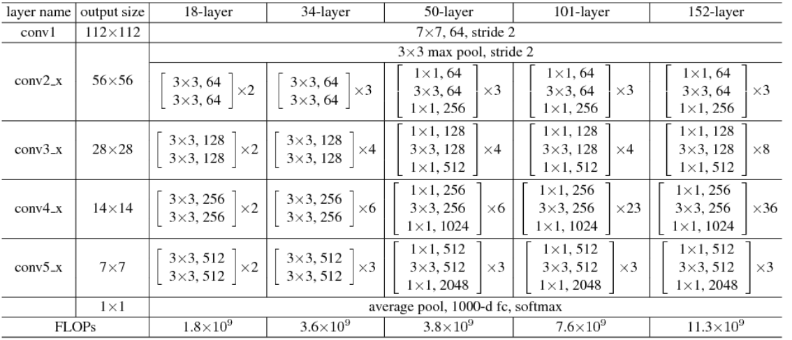

# Network Migration Debugging Example

Translator: [AQUA](https://gitee.com/Liu-HongYe)

<!-- TOC -->

- [Network Migration Debugging Example](#network-migration-debugging-example)
    - [Analysis and Reproduce of the Network](#analysis-and-reproduce-of-the-network)
        - [Determine the Migration Target](#determine-the-migration-target)
            - [ResNet50 Migration Example](#resnet50-migration-example)
        - [Reproduce the Migration Target](#reproduce-the-migration-target)
        - [Reproduce the Single Step Results](#reproduce-the-single-step-results)
    - [Script Development](#script-development)
        - [Pre-script Development Analysis](#pre-script-development-analysis)
            - [ResNet50 Migration Example](#resnet50-migration-example-1)
        - [Data Preprocessing](#data-preprocessing)
            - [ResNet50 Migration Example](#resnet50-migration-example-2)
        - [Subnet Development](#subnet-development)
            - [ResNet50 Migration Example](#resnet50-migration-example-3)
        - [Other Modules](#other-modules)
            - [ResNet50 migration example](#resnet50-migration-example)
        - [Hyperparameters Comparison](#hyperparameters-comparison)
            - [ResNet50 Migration Example](#resnet50-migration-example-4)
    - [Process Hitting](#process-hitting)
        - [Stand-alone Training](#stand-alone-training)
            - [ResNet50 Migration Example](#resnet50-migration-example-5)
        - [Distributed training](#distributed-training)
            - [ResNet50 Migration Example](#resnet50-migration-example-6)
        - [Inference](#inference)
            - [ResNet50 Migration Example](#resnet50-migration-example-7)
        - [Problem Location](#problem-location)
    - [Precision tuning](#precision-tuning)
    - [Performance Tuning](#performance-tuning)
        - [Analyzing Profiling Data](#analyzing-profiling-data)
        - [Common Problems and Corresponding Optimization Methods](#common-problems-and-corresponding-optimization-methods)
            - [MindData Performance](#minddata-performance)
            - [Multi-machine Synchronization Performance](#multi-machine-synchronization-performance)
            - [Operator Performance](#operator-performance)
            - [Framework Performance](#framework-performance)
            - [Other General Optimization Methods](#other-general-optimization-methods)

<!-- /TOC -->

<a href="https://gitee.com/mindspore/docs/blob/master/docs/mindspore/migration_guide/source_en/sample_code.md" target="_blank"></a>

This chapter will introduce the basic steps of network migration, common tools, ideas for locating problems and solutions with use cases.

Here we take the classical network ResNet50 as an example and introduce the network migration method in detail with codes.

## Analysis and Reproduce of the Network

### Determine the Migration Target

The first step of network migration is to determine the migration goal. Usually the delivery goal of a deep neural network includes the following four parts.

1. network implementation: this is the most basic part of the migration goal. Sometimes a single neural network may have different versions, a single version may be implemented differently, or a single neural network may adopt different configurations of hyperparameters, and these differences will have some impacts on the final convergence accuracy and performance. Usually, we take the neural network author's own implementation as the standard, but we can also refer to the official implementations of different frameworks (e.g., TensorFlow, PyTorch, etc.) or other mainstream open source toolkits (e.g., MMDetection).
2. dataset: the same neural network and parameters often vary greatly in datasets, so we need to confirm the dataset used for the migration network. The data content of some datasets will be updated frequently, and it is necessary to pay attention to the version of the dataset, the ratio of training data to test data division, etc. when using the dataset.
3. convergence accuracy: different frameworks, GPU models, and whether the training is distributed will have an impact on the accuracy, so we need to analyze the framework, hardware and other information of the counterpart when determining the migration target.
4. training performance: the same as convergence accuracy, training performance is mainly affected by the network script, framework performance, GPU hardware itself and whether the training is distributed or not.

#### ResNet50 Migration Example

ResNet50 is a classic deep neural network in CV, which attracts more developers' attention and replication, and the syntax of PyTorch is more similar to MindSpore, so we choose PyTorch as the benchmark framework.

The official PyTorch implementation script can be found at [torchvision model](https://github.com/pytorch/vision/blob/master/torchvision/models/resnet.py) or [Nvidia PyTorch implementation script](https://github.com/NVIDIA/DeepLearningExamples/tree/master/PyTorch/Classification/ConvNets/resnet50v1.5), which includes implementations of the mainstream ResNet family of networks (ResNet18, ResNet18, ResNet18, ResNet18, and ResNet18). (ResNet18, ResNet34, ResNet50, ResNet101, ResNet152). The dataset used for ResNet50 is ImageNet2012, and the convergence accuracy can be found in [PyTorch Hub](https://pytorch.org/hub/) pytorch_vision_resnet/#model-description).

Developers can run PyTorch-based ResNet50 scripts directly on the benchmark hardware environment and then evaluate the performance of the model, or they can refer to the official data on the same hardware environment. For example, when we benchmark the Nvidia DGX-1 32GB (8x V100 32GB) hardware, we can refer to [Nvidia's official ResNet50 performance data](https://github.com/NVIDIA/DeepLearningExamples/tree/master/PyTorch/Classification/ConvNets/resnet50v15#training-performance-nvidia-dgx-1-32gb-8x-v100-32gb).

### Reproduce the Migration Target

Once the network migration target is determined, the next thing to do is to reproduce the metrics. When there is an accuracy/performance gap between the network we developed in MindSpore and the benchmark script, we often use the benchmark data as a base line to analyze the difference between the migration script and the benchmark script step by step. If the benchmark script cannot reproduce the metrics, then the MindSpore scripts we develop based on the benchmark will not be able to achieve the migration goals. When reproducing migration metrics, it is not only important to reproduce the training phase, but also the inference phase.

It is important to note that for some networks, using the same hardware environment and scripts, the final convergence accuracy and performance may be slightly different from the results presented by the original authors, which is a normal range of fluctuation and should be taken into account when migrating the network.

### Reproduce the Single Step Results

The main purpose of reproducing the single Step results is for the next script development and network tuning. For complex neural networks, the complete training takes days or even months, and only if the final training accuracy and results are used as reference, it will greatly reduce the development efficiency. Therefore, we need to reproduce the results of a single Step in advance, i.e., get the state of the network after executing only the first Step (the state is the result after data preprocessing, weight initialization, forward calculation, loss calculation, reverse gradient calculation and optimizer update, covering all aspects of network training), and use it as a reference to start the subsequent development work.

## Script Development

### Pre-script Development Analysis

Before starting the actual script development, a benchmark script analysis is performed. The purpose of the script analysis is to identify missing operators or features in MindSpore compared to the benchmark framework. The methodology can be found in the [Script Evaluation Tutorial](https://www.mindspore.cn/docs/migration_guide/en/master/script_analysis.html).

MindSpore already supports most of the common [functions](https://www.mindspore.cn/docs/programming_guide/en/master/index.html) and [operators](https://www.mindspore.cn/docs/note/en/master/operator_list.html). MindSpore supports both dynamic graph (PyNative) mode and static graph (Graph) mode, dynamic graph mode is flexible and easy to debug, so dynamic graph mode is mainly used for network debugging. Static graph mode has good performance and is mainly used for whole network training. When analyzing missing operators and functions, these two modes should be analyzed separately.

If missing operators and functions are found, we can first consider combining the missing operators and functions based on the current operators or functions, and for mainstream CV and NLP networks, new missing operators can generally be solved by combining existing operators.

The combined operator can be implemented by means of a cell, which is the case in MindSpore for [nn class operator](https://gitee.com/mindspore/mindspore/tree/master/mindspore/python/mindspore/nn). For example, the following `ReduceSumExp` operator is a combination of the existing `Exp`, `ReduceSum`, and `Log` suboperators.

```python
class ReduceLogSumExp(Cell):
    def __init__(self, axis, keep_dims=False):
        super(ReduceLogSumExp, self).__init__()
        validator.check_value_type('axis', axis, [int, list, tuple], self.cls_name)
        validator.check_value_type('keep_dims', keep_dims, [bool], self.cls_name)
        self.axis = axis
        self.exp = ops.Exp()
        self.sum = ops.ReduceSum(keep_dims)
        self.log = ops.Log()

    def construct(self, x):
        exp = self.exp(x)
        sumexp = self.sum(exp, self.axis)
        logsumexp = self.log(sumexp)
        return logsumexp
```

If the missing functions and operators cannot be circumvented, or if the performance of the combined operators is poor and seriously affects the training and inference of the network, you can contact [MindSpore Community](https://gitee.com/mindspore/mindspore/issues) for feedback and we will have a dedicated staff to solve it for you.

#### ResNet50 Migration Example

The following is the structure of the ResNet family of networks.



The PyTorch implementation of the ResNet50 script is referenced in the [torchvision model](https://github.com/pytorch/vision/blob/master/torchvision/models/resnet.py).

We can analyze it based on both operator and functional aspects.

- Algorithm analysis

| PyTorch operator       | MindSpore operator | supported |
| ---------------------- | ------------------ | ---------------------- |
| `nn.Conv2D`            | `nn.Conv2d`        | yes                    |
| `nn.BatchNorm2D`       | `nn.BatchNom2d`    | yes                    |
| `nn.ReLU`              | `nn.ReLU`          | yes                    |
| `nn.MaxPool2D`         | `nn.MaxPool2d`     | yes                    |
| `nn.AdaptiveAvgPool2D` | none              |  no                    |
| `nn.Linear`            | `nn.Dense`         | yes                    |
| `torch.flatten`        | `nn.Flatten`       | yes                    |

Note: For PyTorch scripts, MindSpore provides the [PyTorch operator mapping tool](https://www.mindspore.cn/docs/programming_guide/en/master/index.html#operator_api ), which can directly query whether the operator is supported.

- Feature Analysis

| Pytorch Features          | MindSpore Features                    |
| ------------------------- | ------------------------------------- |
| `nn.init.kaiming_normal_` | `initializer(init='HeNormal')`        |
| `nn.init.constant_`       | `initializer(init='Constant')`        |
| `nn.Sequential`           | `nn.SequentialCell`                   |
| `nn.Module`               | `nn.Cell`                             |
| `nn.distibuted`           | `context.set_auto_parallel_context`   |
| `torch.optim.SGD`         | `nn.optim.SGD` or `nn.optim.Momentum` |

(Since the interface design of MindSpore and PyTorch are not exactly the same, only the key functions are listed here for comparison)

After the operator and function analysis, we found that compared to PyTorch, MindSpore has no missing functions, but the missing operator `nn.AdaptiveAvgPool` is missing. In the ResNet50 network, the input image shape is fixed and uniform as `N,3,224,224`, where N is the batch size, 3 is the number of channels, 224 and 224 are the width and height of the image, respectively, and the operators that change the image size in the network are `Conv2d` and `Maxpool2d`, the effect of these two operators on the shape is fixed, so the input and output shapes of `nn.AdaptiveAvgPool2D` can be determined in advance, as long as we calculate the input and output shapes of `nn.AvgPool` or `nn.ReduceMean`, so the absence of this operator is replaceable and does not affect the training of the network.

### Data Preprocessing

To understand the implementation of a neural network, it is necessary to know the input data of the network first, so data preprocessing is the first part of the script development.MindSpore has designed a module dedicated to data processing - MindData, and data preprocessing with MindData consists of the following steps.

1. Importing the data path and reading the data file.
2. parsing the data.
3. data processing (e.g. common data slicing, shuffle, data augmentation, etc.).
4. data distribution (distribution of data in batch_size units, distributed training involves multi-machine distribution).

In the process of reading and parsing data, MindSpore provides a more friendly data format - [MindRecord](https://www.mindspore.cn/docs/programming_guide/en/master/convert_dataset.html). Users can convert the dataset in regular format to MindSpore data format, i.e. MindRecord, so that it can be easily loaded into MindSpore for training. At the same time, MindSpore is optimized for performance in some scenarios, and better performance can be obtained by using the MindRecord data format.

Data processing is usually the most time-consuming phase of data preparation, and most of the operations on data are included in this step, such as Resize, Rescale, Crop, etc. in CV-like networks. MindSpore provides a set of common data processing integration interfaces, which can be called directly by users without implementing them. These integration interfaces not only improve the user-friendliness, but also improve the performance of data preprocessing and reduce the time consuming data preparation during training. For details, please refer to the [Data Preprocessing Tutorial](https://www.mindspore.cn/docs/programming_guide/en/master/optimize_data_processing.html).

In the data distribution, MindData provides an extremely simple API, which can be used to combine and repeat data by directly calling batch and repeat operations.

When the above 4 steps are completed, we can theoretically get the exact same data after processing the dataset using MindSpore script and alignment script (if there are operations that introduce random cases need to be removed).

#### ResNet50 Migration Example

The ResNet50 network uses the ImageNet2012 dataset with the following PyTorch code for data pre-processing:

```python
# sample execution (requires torchvision)
from PIL import Image
from torchvision import transforms
input_image = Image.open(filename)
preprocess = transforms.Compose([
    transforms.Resize(256),
    transforms.CenterCrop(224),
    transforms.ToTensor(),
    transforms.Normalize(mean=[0.485, 0.456, 0.406], std=[0.229, 0.224, 0.225]),
])
input_tensor = preprocess(input_image)
input_batch = input_tensor.unsqueeze(0) # create a mini-batch as expected by the model
```

By looking at the above code, we find that the data preprocessing of ResNet50 mainly does Resize, CenterCrop, and Normalize operations, and there are two ways to implement these operations in MindSpore, one is to use MindSpore's data processing module MindData to call the encapsulated MindSpore's data processing module MindData to call the encapsulated data preprocessing interface, or through [Custom Dataset](https://www.mindspore.cn/docs/programming_guide/en/master/dataset_loading.html#loading-user-defined-dataset). Here it is more recommended for developers to choose the first way, which not only can reduce the development of repetitive code and the introduction of errors, but also can get better data processing performance. For more information about MindData data processing, please refer to the Data Pipeline section in [Programming Guide](https://www.mindspore.cn/docs/programming_guide/en/master/index.html).

The following data processing functions are developed based on MindData:

```python
def create_dataset(dataset_path, do_train, repeat_num=1, batch_size=32, target="Ascend", distribute=False):
    # device number: total number of devices of training
    # rank_id: the sequence of current device of training
    device_num, rank_id = _get_rank_info()
    if distribute:
        init()
        rank_id = get_rank()
        device_num = get_group_size()
    else:
        device_num = 1
    if device_num == 1:
        # standalone training
        # num_paralel_workers: parallel degree of data process
        # shuffle: whether shuffle data or not
        data_set = ds.ImageFolderDataset(dataset_path, num_parallel_workers=8, shuffle=True)
    else:
        # distributing traing (meaning of num_parallel_workers and shuffle is same as above)
        # num_shards: total number devices for distribute training, which equals number shard of data
        # shard_id: the sequence of current device in all distribute training devices, which equals the data shard sequence for current device
        data_set = ds.ImageFolderDataset(dataset_path, num_parallel_workers=8, shuffle=True, num_shards=device_num, shard_id=rank)

    # define data operations
    trans = []
    if do_train:
        trans += [
            C.RandomHorizontalFlip(prob=0.5)
        ]

    trans += [
        C.Resize((256, 256)),
        C.CenterCrop(224),
        C.Rescale(1.0 / 255.0, 0.0),
        C.Normalize([0.485, 0.456, 0.406], [0.229, 0.224, 0.225]),
        C.HWC2CHW()
    ]

    type_cast_op = C2.TypeCast(mstype.int32)

    # call data operations by map
    data_set = data_set.map(operations=type_cast_op, input_columns="label", num_parallel_workers=8)
    data_set = data_set.map(operations=trans, input_columns="image", num_parallel_workers=8)

    # batchinng data
    data_set = data_set.batch(batch_size, drop_remainder=True)
    # repeat data, usually repeat_num equals epoch_size
    data_set = data_set.repeat(repeat_num)

    return data_set
```

In the above code we can find that for common classical datasets (e.g. ImageNet2012), MindData also provides us with `ImageFolderDataset` interface to read the raw data directly, which saves the workload of reading files by hand-written code. Note that MindData creates datasets with different parameters for single-machine training and multi-machine distributed training, and distributed training requires two additional parameters `num_shard` and `shard_id`.

### Subnet Development

Usually subnet development consists of two parts: training subnets and loss subnets, where the training subnets can be divided or not depending on the complexity of the network. Developing a large neural network script directly can be overwhelming, so we can separate different modules or submodules of the network as a single subnet to ensure that each subnet is developed in parallel without interfering with each other. After the subnets are developed, we can also fix the subnet inputs and weights to form a comparison with the subnet code of the alignment script, which can be used as test cases for subsequent network development.

During the accuracy tuning phase, we often encounter situations where the accuracy is not up to standard, and then we revisit the developed scripts and troubleshoot them line by line. It is much easier to find suspicious points from dozens of operators than from hundreds of operators, especially when the same subnet is invoked many times, which can reduce a lot of work when we troubleshoot by subnet.

#### ResNet50 Migration Example

Analyzing the ResNet50 network code, it can be divided into the following main subnets.

- conv1x1, conv3x3: convolution with different kernel_size is defined.
- BasicBlock: the smallest subnet of ResNet18 and ResNet34 in the ResNet family of networks, consisting of Conv, BN, ReLU and residuals.
- BottleNeck: The smallest sub-network of ResNet50, ResNet101 and ResNet152 in the ResNet family of networks, with an additional layer of Conv, BN and ReLU compared to BasicBlock, and the convolution position of downsampling has been changed.
- ResNet: A network that encapsulates the structure of BasicBlock, BottleNeck and Layer, different ResNet series networks can be constructed by passing different parameters. In this structure, some PyTorch self-defined initialization functions are also used.

Based on the above subnetwork division, we redevelop the above development in conjunction with MindSpore syntax.

Redeveloping the weight initialization (also directly using [MindSpore's defined weight initialization methods](https://www.mindspore.cn/docs/api/en/master/api_python/mindspore.common.initializer.html)).

```python
def _conv_variance_scaling_initializer(in_channel, out_channel, kernel_size):
    fan_in = in_channel * kernel_size * kernel_size
    scale = 1.0
    scale /= max(1., fan_in)
    stddev = (scale ** 0.5) / .87962566103423978
    mu, sigma = 0, stddev
    weight = truncnorm(-2, 2, loc=mu, scale=sigma).rvs(out_channel * in_channel * kernel_size * kernel_size)
    weight = np.reshape(weight, (out_channel, in_channel, kernel_size, kernel_size))
    return Tensor(weight, dtype=mstype.float32)


def _weight_variable(shape, factor=0.01):
    init_value = np.random.randn(*shape).astype(np.float32) * factor
    return Tensor(init_value)


def calculate_gain(nonlinearity, param=None):
    """calculate_gain"""
    linear_fns = ['linear', 'conv1d', 'conv2d', 'conv3d', 'conv_transpose1d', 'conv_transpose2d', 'conv_transpose3d']
    res = 0
    if nonlinearity in linear_fns or nonlinearity == 'sigmoid':
        res = 1
    elif nonlinearity == 'tanh':
        res = 5.0 / 3
    elif nonlinearity == 'relu':
        res = math.sqrt(2.0)
    elif nonlinearity == 'leaky_relu':
        if param is None:
            negative_slope = 0.01
        elif not isinstance(param, bool) and isinstance(param, int) or isinstance(param, float):
            # True/False are instances of int, hence check above
            negative_slope = param
        else:
            raise ValueError("negative_slope {} not a valid number".format(param))
        res = math.sqrt(2.0 / (1 + negative_slope ** 2))
    else:
        raise ValueError("Unsupported nonlinearity {}".format(nonlinearity))
    return res


def _calculate_fan_in_and_fan_out(tensor):
    """_calculate_fan_in_and_fan_out"""
    dimensions = len(tensor)
    if dimensions < 2:
        raise ValueError("Fan in and fan out can not be computed for tensor with fewer than 2 dimensions")
    if dimensions == 2:  # Linear
        fan_in = tensor[1]
        fan_out = tensor[0]
    else:
        num_input_fmaps = tensor[1]
        num_output_fmaps = tensor[0]
        receptive_field_size = 1
        if dimensions > 2:
            receptive_field_size = tensor[2] * tensor[3]
        fan_in = num_input_fmaps * receptive_field_size
        fan_out = num_output_fmaps * receptive_field_size
    return fan_in, fan_out


def _calculate_correct_fan(tensor, mode):
    mode = mode.lower()
    valid_modes = ['fan_in', 'fan_out']
    if mode not in valid_modes:
        raise ValueError("Mode {} not supported, please use one of {}".format(mode, valid_modes))
    fan_in, fan_out = _calculate_fan_in_and_fan_out(tensor)
    return fan_in if mode == 'fan_in' else fan_out


def kaiming_normal(inputs_shape, a=0, mode='fan_in', nonlinearity='leaky_relu'):
    fan = _calculate_correct_fan(inputs_shape, mode)
    gain = calculate_gain(nonlinearity, a)
    std = gain / math.sqrt(fan)
    return np.random.normal(0, std, size=inputs_shape).astype(np.float32)
```

Redevelopment of convolution operators with 3x3 and 1x1 convolution kernels.

```python
# conv3x3 and conv1x1
def _conv3x3(in_channel, out_channel, stride=1):  
    weight_shape = (out_channel, in_channel, 3, 3)
    # unlike pytorch, weight initialization is introduced when define conv2d
    weight = Tensor(kaiming_normal(weight_shape, mode="fan_out", nonlinearity='relu'))
    return nn.Conv2d(in_channel, out_channel, kernel_size=3, stride=stride, padding=0, pad_mode='same', weight_init=weight)


def _conv1x1(in_channel, out_channel, stride=1):
    # unlike pytorch, weight initialization is introduced when define conv2d
    weight_shape = (out_channel, in_channel, 1, 1)
    weight = Tensor(kaiming_normal(weight_shape, mode="fan_out", nonlinearity='relu'))
    return nn.Conv2d(in_channel, out_channel, kernel_size=1, stride=stride,
                     padding=0, pad_mode='same', weight_init=weight)
```

Redevelopment of BasicBlock and BottleNeck.

```python
class BasicBlock(nn.Cell):
    def __init__(self,
                 in_channel,
                 out_channel,
                 stride=1):
        super(BasicBlock, self).__init__()
        self.conv1 = _conv3x3(in_channel, out_channel, stride=stride)
        self.bn1d = _bn(out_channel)
        self.conv2 = _conv3x3(out_channel, out_channel, stride=1)
        self.bn2d = _bn(out_channel)
        self.relu = nn.ReLU()

        self.down_sample = False
        if stride != 1 or in_channel != out_channel:
            self.down_sample = True

        self.down_sample_layer = None
        if self.down_sample:
            self.down_sample_layer = nn.SequentialCell([_conv1x1(in_channel, out_channel, stride,), _bn(out_channel)])

    def construct(self, x):
        identity = x

        out = self.conv1(x)
        out = self.bn1d(out)
        out = self.relu(out)

        out = self.conv2(out)
        out = self.bn2d(out)

        if self.down_sample:
            identity = self.down_sample_layer(identity)

        out = out + identity
        out = self.relu(out)

        return out


class BottleNeck(nn.Cell):
    expansion = 4

    def __init__(self,
                 in_channel,
                 out_channel,
                 stride=1):
        super(BottleNeck, self).__init__()
        self.stride = stride
        channel = out_channel // self.expansion
        self.conv1 = _conv1x1(in_channel, channel, stride=1)
        self.bn1 = _bn(channel)
        self.conv2 = _conv3x3(channel, channel, stride=stride)
        self.bn2 = _bn(channel)
        self.conv3 = _conv1x1(channel, out_channel, stride=1)
        self.bn3 = _bn_last(out_channel)
        self.relu = nn.ReLU()
        self.down_sample = False
        if stride != 1 or in_channel != out_channel:
            self.down_sample = True
        self.down_sample_layer = None
        if self.down_sample:
            self.down_sample_layer = nn.SequentialCell([_conv1x1(in_channel, out_channel, stride), _bn(out_channel)])
    def construct(self, x):
        identity = x
        out = self.conv1(x)
        out = self.bn1(out)
        out = self.relu(out)
        out = self.conv2(out)
        out = self.bn2(out)
        out = self.relu(out)
        out = self.conv3(out)
        out = self.bn3(out)
        if self.down_sample:
            identity = self.down_sample_layer(identity)

        out = out + identity
        out = self.relu(out)
        return out
```

Redevelopment of the whole ResNet family of nets.

```python
class ResNet(nn.Cell):
    def __init__(self,
                 block,
                 layer_nums,
                 in_channels,
                 out_channels,
                 strides,
                 num_classes):
        super(ResNet, self).__init__()

        if not len(layer_nums) == len(in_channels) == len(out_channels) == 4:
            raise ValueError("the length of layer_num, in_channels, out_channels list must be 4!")

        self.conv1 = _conv7x7(3, 64, stride=2)
        self.bn1 = _bn(64)
        self.relu = ops.ReLU()
        self.maxpool = nn.MaxPool2d(kernel_size=3, stride=2, pad_mode="same")

        self.layer1 = self._make_layer(block,
                                       layer_nums[0],
                                       in_channel=in_channels[0],
                                       out_channel=out_channels[0],
                                       stride=strides[0])
        self.layer2 = self._make_layer(block,
                                       layer_nums[1],
                                       in_channel=in_channels[1],
                                       out_channel=out_channels[1],
                                       stride=strides[1])
        self.layer3 = self._make_layer(block,
                                       layer_nums[2],
                                       in_channel=in_channels[2],
                                       out_channel=out_channels[2],
                                       stride=strides[2])
        self.layer4 = self._make_layer(block,
                                       layer_nums[3],
                                       in_channel=in_channels[3],
                                       out_channel=out_channels[3],
                                       stride=strides[3])

        self.mean = ops.ReduceMean(keep_dims=True)
        self.flatten = nn.Flatten()
        self.end_point = _fc(out_channels[3], num_classes)

    def _make_layer(self, block, layer_num, in_channel, out_channel, stride):
        layers = []

        resnet_block = block(in_channel, out_channel, stride=stride)
        layers.append(resnet_block)
        for _ in range(1, layer_num):
            resnet_block = block(out_channel, out_channel, stride=1)
            layers.append(resnet_block)
        return nn.SequentialCell(layers)

    def construct(self, x):
        x = self.conv1(x)
        x = self.bn1(x)
        x = self.relu(x)
        c1 = self.maxpool(x)

        c2 = self.layer1(c1)
        c3 = self.layer2(c2)
        c4 = self.layer3(c3)
        c5 = self.layer4(c4)

        out = self.mean(c5, (2, 3))
        out = self.flatten(out)
        out = self.end_point(out)

        return out
```

Constructing the whole ResNet50 network by passing in information about the number of layers of ResNet50.

```python
def resnet50(class_num=1000):
    return ResNet(ResidualBlock,
                  [3, 4, 6, 3],
                  [64, 256, 512, 1024],
                  [256, 512, 1024, 2048],
                  [1, 2, 2, 2],
                  class_num)
```

After the above steps, the MindSpore-based ResNet50 whole network structure and each sub-network structure have been developed, and the next step is to develop other modules.

### Other Modules

Other modules usually include: reverse construction, gradient clipping, optimizer, learning rate generation, etc. These modules either have a single structure or rely on the results of the developed subnets in order to compare with the benchmark script. The development of scripts for these modules is less difficult than subnet development.

#### ResNet50 migration example

For additional training configurations, see [Configuration Information for NVIDIA Training ResNet50](https://github.com/NVIDIA/DeepLearningExamples/tree/master/PyTorch/Classification/ConvNets/resnet50v1.5#default-configuration), the training of ResNet50 mainly involves the following items.

- SGD + Momentum optimizer is used.
- WeightDecay function is used (but gamma and bias of BatchNorm are not used).
- The cosine LR schedule is used.
- Label Smoothing is used.

Implemented cosine LR schedule.

```python
def _generate_cosine_lr(lr_init, lr_end, lr_max, total_steps, warmup_steps):
    """
    Applies cosine decay to generate learning rate array.

    Args:
       lr_init(float): init learning rate.
       lr_end(float): end learning rate
       lr_max(float): max learning rate.
       total_steps(int): all steps in training.
       warmup_steps(int): all steps in warmup epochs.

    Returns:
       np.array, learning rate array.
    """
    decay_steps = total_steps - warmup_steps
    lr_each_step = []
    for i in range(total_steps):
        if i < warmup_steps:
            lr_inc = (float(lr_max) - float(lr_init)) / float(warmup_steps)
            lr = float(lr_init) + lr_inc * (i + 1)
        else:
            linear_decay = (total_steps - i) / decay_steps
            cosine_decay = 0.5 * (1 + math.cos(math.pi * 2 * 0.47 * i / decay_steps))
            decayed = linear_decay * cosine_decay + 0.00001
            lr = lr_max * decayed
        lr_each_step.append(lr)
    return lr_each_step
```

Implemented SGD optimizer with Momentum, and applied WeightDecay to all weights except gamma and bias of BN.

```python
from mindspore.nn import Momentum

net = resnet50(class_num=1000)
lr = _generate_cosine_lr()
momentum = 0.875
weight_decay = 1/32768

decayed_params = []
no_decayed_params = []
for param in net.trainable_params():
    if 'beta' not in param.name and 'gamma' not in param.name and 'bias' not in param.name:
        decayed_params.append(param)
    else:
        no_decayed_params.append(param)

group_params = [{'params': decayed_params, 'weight_decay': weight_decay},
                {'params': no_decayed_params},
                {'order_params': net.trainable_params()}]
opt = Momentum(group_params, lr, momentum)
```

Define Loss Function and implement Label Smoothing.

```python
import mindspore.nn as nn
from mindspore import Tensor
from mindspore import dtype as mstype
from mindspore.nn import LossBase
import mindspore.ops as ops

# define cross entropy loss
class CrossEntropySmooth(LossBase):
    """CrossEntropy"""
    def __init__(self, sparse=True, reduction='mean', smooth_factor=0., num_classes=1000):
        super(CrossEntropySmooth, self).__init__()
        self.onehot = ops.OneHot()
        self.sparse = sparse
        self.on_value = Tensor(1.0 - smooth_factor, mstype.float32)
        self.off_value = Tensor(1.0 * smooth_factor / (num_classes - 1), mstype.float32)
        self.ce = nn.SoftmaxCrossEntropyWithLogits(reduction=reduction)

    def construct(self, logit, label):
        if self.sparse:
            label = self.onehot(label, ops.shape(logit)[1], self.on_value, self.off_value)
        loss = self.ce(logit, label)
        return loss

# define loss with label smooth
label_smooth_factor = 0.1
loss = CrossEntropySmooth(sparse=True, reduction="mean",smooth_factor=label_smooth_factor, num_classes=1000)
```

### Hyperparameters Comparison

When the subnetworks have been opened, the last step to do is to align the hyperparameters with the alignment script to ensure the network structure is consistent. It should be noted that the same set of hyperparameters may have different accuracy performance on different frameworks, so it is not necessary to strictly follow the hyperparameters of the peer script when migrating the network, and fine tuning can be done without changing the network structure.

#### ResNet50 Migration Example

In the training of ResNet50, the following hyperparameters are mainly involved.

- momentum =0.875
- batch_size = 256
- learning rate = 0.256
- learing rate schedule = cosine
- weight_decay = 1/32768
- label_smooth = 0.1
- epoch size = 90

## Process Hitting

After the above steps, we have finished developing the necessary scripts for network migration, and the next step is to break through the stand-alone training, distributed training, and inference processes.

### Stand-alone Training

#### ResNet50 Migration Example

For a better reading of the code, it is recommended to organize the script according to the following structure.

```text
.
└──resnet
  ├── README.md
  ├── scripts
    ├── run_distribute_train.sh
    ├── run_eval.sh
    ├── run_standalone_train.sh
  ├── src
    ├── resnet18_cifar10_config.yaml
    ├── resnet18_imagenet2012_config.yaml
    ├── resnet34_imagenet2012_config.yaml
    ├── resnet50_cifar10_config.yaml
    ├── resnet50_imagenet2012_Ascend_config.yaml
    ├── resnet50_imagenet2012_config.yaml
    ├── resnet50_imagenet2012_GPU_config.yaml
    ├── resnet101_imagenet2012_config.yaml
    ├── se-resnet50_imagenet2012_config.yaml
    ├── dataset.py
    ├── CrossEntropySmooth.py
    ├── lr_generator.py
    └── resnet.py
  ├── eval.py
  └── train.py
```

train.py is defined as follows:

```python
import os
import argparse
import ast
from mindspore import context
from mindspore import Tensor
from mindspore.nn import Momentum
from mindspore import Model
from mindspore.train.callback import ModelCheckpoint, CheckpointConfig, LossMonitor, TimeMonitor
from mindspore import FixedLossScaleManager
from mindspore import load_checkpoint, load_param_into_net
from mindspore.communication import init, get_rank, get_group_size
from mindspore import set_seed
import mindspore.nn as nn
import mindspore.common.initializer as weight_init
from src.lr_generator import get_lr
from src.CrossEntropySmooth import CrossEntropySmooth
from resnet50_imagenet2012_config.yaml import config

set_seed(1)

from src.resnet import resnet50 as resnet
from src.dataset import create_dataset as create_dataset

if __name__ == '__main__':
    ckpt_save_dir = config.checkpoint_path

    # init context
    context.set_context(mode=context.GRAPH_MODE, save_graphs=False)
    # create dataset
    dataset = create_dataset(dataset_path=config.data_path, do_train=True, repeat_num=1,
                             batch_size=config.batch_size)
    step_size = dataset.get_dataset_size()

    # define net
    net = resnet(class_num=config.class_num)
    for _, cell in net.cells_and_names():
        if isinstance(cell, nn.Conv2d):
           cell.weight.set_data(weight_init.initializer(weight_init.XavierUniform(),
                                                        cell.weight.shape,
                                                        cell.weight.dtype))
        if isinstance(cell, nn.Dense):
           cell.weight.set_data(weight_init.initializer(weight_init.TruncatedNormal(),
                                                        cell.weight.shape,
                                                        cell.weight.dtype))
    lr = get_lr(lr_init=config.lr_init, lr_end=config.lr_end, lr_max=config.lr_max,
                warmup_epochs=config.warmup_epochs, total_epochs=config.epoch_size,
                steps_per_epoch=step_size, lr_decay_mode=config.lr_decay_mode)
    lr = Tensor(lr)

    # define opt
    decayed_params = []
    no_decayed_params = []
    for param in net.trainable_params():
        if 'beta' not in param.name and 'gamma' not in param.name and 'bias' not in param.name:
            decayed_params.append(param)
        else:
            no_decayed_params.append(param)

    group_params = [{'params': decayed_params, 'weight_decay': config.weight_decay},
                    {'params': no_decayed_params},
                    {'order_params': net.trainable_params()}]
    opt = Momentum(group_params, lr, config.momentum, loss_scale=config.loss_scale)
    # define loss, model
    loss = CrossEntropySmooth(sparse=True, reduction="mean", smooth_factor=config.label_smooth_factor, num_classes=config.class_num)
    loss_scale = FixedLossScaleManager(config.loss_scale, drop_overflow_update=False)
    model = Model(net, loss_fn=loss, optimizer=opt, loss_scale_manager=loss_scale, metrics={'acc'},
                  amp_level="O2", keep_batchnorm_fp32=False)
    # define callbacks
    time_cb = TimeMonitor(data_size=step_size)
    loss_cb = LossMonitor()
    cb = [time_cb, loss_cb]
    if config.save_checkpoint:
        config_ck = CheckpointConfig(save_checkpoint_steps=config.save_checkpoint_epochs * step_size, keep_checkpoint_max=config.keep_checkpoint_max)
        ckpt_cb = ModelCheckpoint(prefix="resnet", directory=ckpt_save_dir, config=config_ck)
        cb += [ckpt_cb]

    # train model
    dataset_sink_mode = True
    model.train(config.epoch_size, dataset, callbacks=cb, sink_size=dataset.get_dataset_size(),
                dataset_sink_mode=dataset_sink_mode)
```

Note: For codes in other files in the directory, refer to MindSpore model_zoo's [ResNet50 implementation](https://gitee.com/mindspore/models/tree/master/official/cv/resnet)(this script incorporates other ResNet family networks and ResNet-SE networks, and the specific implementation may differ from the benchmark script).

### Distributed training

Distributed training has no impact on the network structure compared to stand-alone training, and can be done by modifying the stand-alone script by calling the distributed training interface provided by MindSpore, as described in [Distributed Training Tutorial](https://www.mindspore.cn/docs/programming_guide/en/master/distributed_training.html).

#### ResNet50 Migration Example

Add the following interface to the standalone training script.

```python
import os
import argparse
import ast
from mindspore import context
from mindspore.communication import init, get_rank, get_group_size
from resnet50_imagenet2012_config.yaml import config

# ...
device_id = int(os.getenv('DEVICE_ID')) # get the current device id
context.set_context(device_id=device_id)
# enable distribute training
context.set_auto_parallel_context(device_num=config.device_num,
                                  parallel_mode=ParallelMode.DATA_PARALLEL, gradients_mean=True)
# init distribute training
init()
```

Modify the create_dataset interface to shard the data on data load to support distributed training by.

```python
import mindspore.dataset as ds
from mindspore.communication import init, get_rank, get_group_size
# ....
device_num, rank_id = _get_rank_info()
if device_num == 1:
    # standalone training
    data_set = ds.Cifar10Dataset(config.data_path, num_parallel_workers=8, shuffle=True)
else:
    # distribute training
    data_set = ds.Cifar10Dataset(config.data_path, num_parallel_workers=8, shuffle=True,
                                 num_shards=device_num, shard_id=rank_id)
# ...
```

### Inference

The inference process differs from training in the following ways.

- No need to define losses and optimizers.
- No need for repeat operations when constructing the dataset.
- Need to load trained CheckPoint after network definition.
- Define the metric for computing inference accuracy.

#### ResNet50 Migration Example

Modified inference script:

```python
import os
import argparse
from mindspore import context
from mindspore import set_seed
from mindspore import Model
from mindspore import load_checkpoint, load_param_into_net

set_seed(1)

from src.resnet import resnet50 as resnet
from src.dataset import create_dataset
from resnet50_imagenet2012_config.yaml import config


if __name__ == '__main__':
    target = config.device_target

    # init context
    context.set_context(mode=context.GRAPH_MODE, device_target=target, save_graphs=False)
    device_id = int(os.getenv('DEVICE_ID'))
    context.set_context(device_id=device_id)

    # create dataset
    dataset = create_dataset(dataset_path=config.data_path, do_train=False, batch_size=config.batch_size)
    step_size = dataset.get_dataset_size()

    # define net
    net = resnet(class_num=config.class_num)

    # load checkpoint
    param_dict = load_checkpoint(config.checkpoint_path)
    load_param_into_net(net, param_dict)
    net.set_train(False)

    # define model
    model = Model(net, metrics={'top_1_accuracy', 'top_5_accuracy'})

    # eval model
    res = model.eval(dataset)
    print("result:", res, "ckpt=", config.checkpoint_path)
```

### Problem Location

You may encounter some interruptions in the training during the process, you can refer to the [Network Training Debug Tutorial](https://www.mindspore.cn/docs/migration_guide/en/master/neural_network_debug.html) to locate and solve them.

## Precision tuning

After hitting the flow, you can get the accuracy of network training by both training and inference steps. Usually, it is difficult to reproduce the accuracy of the alignment script at once, and we need to gradually improve the accuracy by accuracy tuning, which is less intuitive, less efficient, and more work than performance tuning.

## Performance Tuning

Usually, we refer to performance tuning to improve training performance with a fixed dataset, network size, and number of hardware, while improving performance by changing dataset size, network size, and number of hardware is obvious and out of the scope of this paper.

Unless the performance problem has seriously hindered the accuracy debugging, the performance tuning must be placed after the accuracy has reached the standard, which has two main reasons: first, many modifications will affect the performance when locating the accuracy problem, making the already tuned performance again not up to standard, which may waste the workload; second, the performance tuning may introduce new accuracy problems, and if there is no accuracy that has reached the standard as a caretaker, the difficulty of locating the accuracy problem introduced this time will be greatly increased later.

### Analyzing Profiling Data

Analyzing Profiling data is an essential step in the performance tuning phase, and MindSpore's performance and precision tuning tool [MindInsight](https://www.mindspore.cn/mindinsight/docs/en/master/index.html) provides a rich set of performance and precision tuning methods, and the most important information for performance tuning is the Profiling data. In the iteration trajectory, you can see very detailed information about the start run time, end run time, number of calls and call order of each operator, which is very helpful for our performance tuning. The way to generate Profiling data is as follows:

```python
from mindspore.profiler import Profiler
from mindspore import Model, nn, context

# init context
context.set_context(mode=context.GRAPH_MODE, device_target='Ascend', device_id=int(os.environ["DEVICE_ID"]))

# init profiler, profiling data will be stored under folder ./data by default
profiler = Profiler()

# start training
Model.train()

# end training，parse profiling data to readable text
profiler.analyse()
```

For more detailed usage of Profiling, you can refer to [Profiling Performance Analysis Methods](https://www.mindspore.cn/mindinsight/docs/en/master/performance_profiling.html).

After obtaining Profiling data, we can analyze the performance bottleneck stages and operators, and then perform performance optimization, which can be referred to [Performance Tuning Guide](https://www.mindspore.cn/docs/migration_guide/en/master/performance_optimization.html).

### Common Problems and Corresponding Optimization Methods

#### MindData Performance

Single-Step performance jitter and data queues that remain empty for a period of time are caused by poor performance of the data preprocessing part, which makes the data processing speed unable to keep up with the single-Step iteration speed, and these two phenomena usually occur in pairs.

When the data processing speed is slow, the queue is gradually depleted from the initial full queue to an empty queue, and the training process will start waiting for the empty queue to be filled with data, and the network will continue the single-step training only once new data is filled. Since there is no queue as buffer for data processing, the performance jitter of data processing is directly reflected in the performance of single-Step, so it will also cause single-Step performance jitter.

#### Multi-machine Synchronization Performance

When distributed training is performed, after the forward propagation and gradient computation are completed during a Step, each machine starts to synchronize the AllReduce gradient, and the AllReduce synchronization time is mainly affected by the number of weights and machines.

Normally, AllReduce gradient synchronization waits until all the inverse operators are finished, i.e., all the gradients of all weights are computed before synchronizing the gradients of all machines at once, but with AllReduce tangent, we can synchronize the gradients of some weights as soon as they are computed, so that the gradient synchronization and the gradient computation of the remaining operators can be This way, the gradient synchronization and the gradient computation of the remaining operators can be performed in parallel, hiding this part of the AllReduce gradient synchronization time. The slicing strategy is usually a manual attempt to find an optimal solution (supporting slicing greater than two segments).
As an example, [ResNet50 network](https://gitee.com/mindspore/models/blob/master/official/cv/resnet/train.py) has 160 weights and [85, 160] means that the gradient synchronization is performed immediately after the gradient is calculated for the 0th to 85th weights, and the gradient synchronization is performed after the gradient is calculated for the 86th to 160th weights. The code implementation is as follows:

```python
from mindspore import context
from resnet50_imagenet2012_config.yaml import config
...

device_id = int(os.getenv('DEVICE_ID'))
context.set_context(device_id=device_id)
context.set_auto_parallel_context(device_num=config.device_num,
                                  parallel_mode=ParallelMode.DATA_PARALLEL, gradients_mean=True)
set_algo_parameters(elementwise_op_strategy_follow=True)
if config.net_name == "resnet50" or config.net_name == "se-resnet50":
    # AllReduce split
    context.set_auto_parallel_context(all_reduce_fusion_config=[85, 160])
else:
    # Another split stratety
    context.set_auto_parallel_context(all_reduce_fusion_config=[180, 313])
init()
```

#### Operator Performance

The situation that a single operator takes a long time and the performance of the same operator varies greatly under different shapes or different datatypes is mainly caused by the operator performance problem, which usually has the following two solutions.

1. Use less computationally intensive data types. For example, there is no significant difference in precision between float16 and float32 for the same operator, so use the less computationally intensive float16 format.
2. Use other operators with the same algorithm to circumvent it.

If you find any arithmetic with poor performance, we suggest you contact [MindSpore Community](https://gitee.com/mindspore/mindspore/issues) for feedback, and we will optimize it as soon as we confirm the performance problem.

#### Framework Performance

If there are too many conversion operators (TransData, Cast-like operators) and they take too much time, we can analyze the necessity of Cast operators if we add them manually, and remove the redundant Cast and TransData operators if they have no impact on the accuracy.

If MindSpore automatically generates too many conversion operators, it may be that the MindSpore framework is not fully optimized for some special cases, you can contact [MindSpore Community](https://gitee.com/mindspore/mindspore/issues) for feedback.

#### Other General Optimization Methods

- Using mixed precision training

    The mixed precision training method accelerates the process of deep neural network training by using a mixture of single precision and half precision data formats, while maintaining the network accuracy that can be achieved with single precision training. Mixed precision training accelerates the computation process while reducing memory usage and access, and allows for training larger models or batch sizes on specific hardware.

    For details, please refer to the [Mixed precision tutorial](https://www.mindspore.cn/docs/programming_guide/en/master/enable_mixed_precision.html).

- Enabling graph kernel fusion

    Graph-calculus fusion is a network performance optimization technique unique to MindSpore. It can automatically analyze and optimize existing network computation graph logic and combine with target hardware capabilities to perform computation reduction and substitution, operator splitting and fusion, operator special case compilation, etc. to improve the utilization of device computation resources and achieve overall optimization of network performance. Compared with traditional optimization techniques, graph computation fusion has unique advantages such as joint optimization of multiple operators across boundaries, cross-layer collaboration with operator compilation, and instant compilation of operators based on Polyhedral. In addition, graph fusion only requires the user to open the corresponding configuration, and then the whole optimization process can be completed automatically, without the need for additional sensing by the network developer, allowing the user to focus on the network algorithm implementation.

    The scenarios for graph fusion include: scenarios with high performance requirements for network execution time; scenarios where custom combinatorial operators are implemented by splicing basic operators, and where automatic fusion of these basic operators is desired to improve the performance of the custom combinatorial operators.

    For details, please refer to the [tutorial on graph arithmetic fusion](https://www.mindspore.cn/docs/programming_guide/en/master/enable_graph_kernel_fusion.html).
