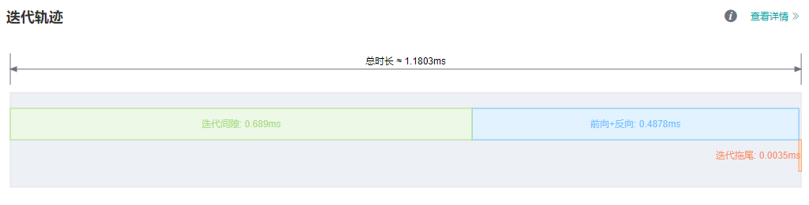
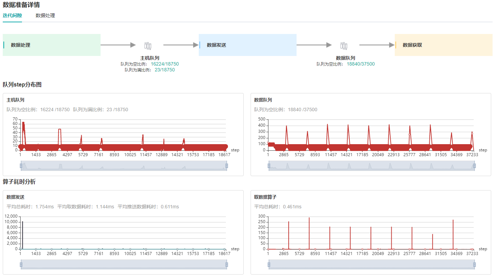
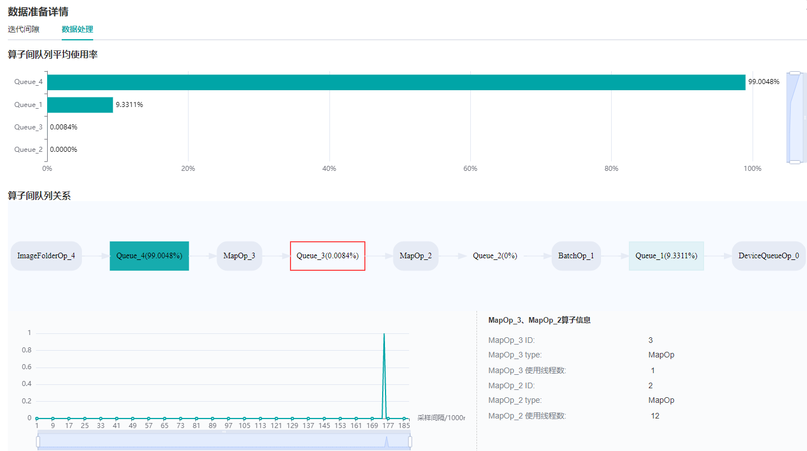
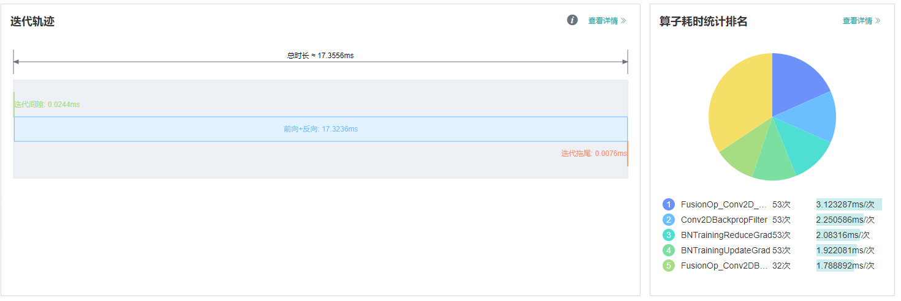
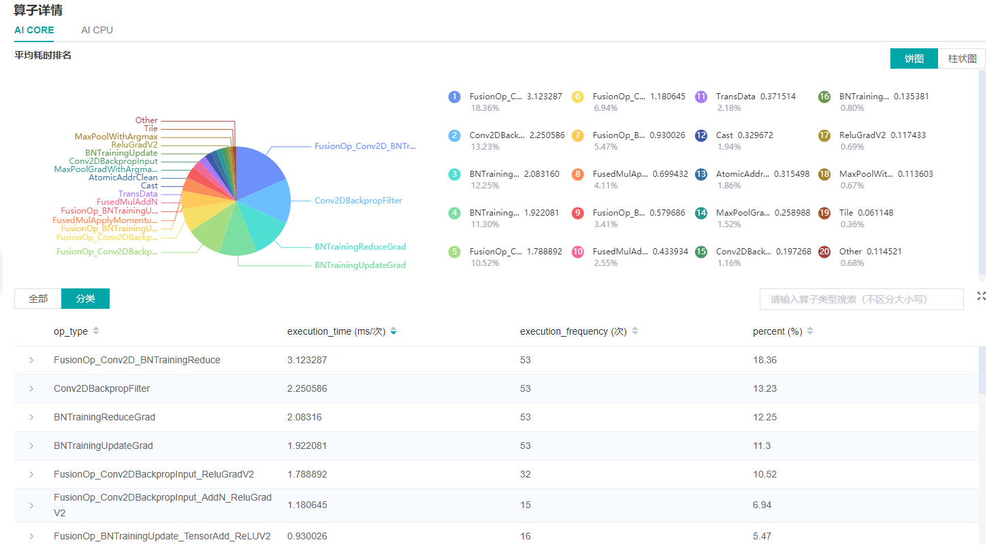
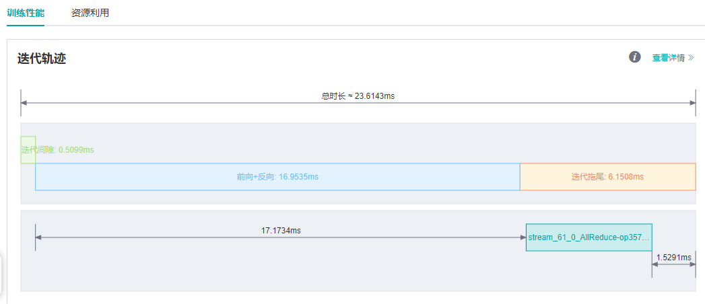

# 性能调试

<a href="https://gitee.com/mindspore/docs/blob/r1.6/docs/mindspore/migration_guide/source_zh_cn/performance_optimization.md" target="_blank"></a>

Profiler为MindSpore提供了性能调优能力，针对算子性能、数据处理性能等提供了易用、丰富的调试功能，帮助用户快速定位、解决性能问题。

本章将介绍性能调优的常见方法及案例，以及一些常见问题的处理。

## 快速入门

Profiler的功能介绍及使用说明请参见教程：

[性能调试（Ascend）](https://www.mindspore.cn/mindinsight/docs/zh-CN/r1.6/performance_profiling_ascend.html)

[性能调试（GPU）](https://www.mindspore.cn/mindinsight/docs/zh-CN/r1.6/performance_profiling_gpu.html)

[集群性能调试（Ascend）](https://www.mindspore.cn/mindinsight/docs/zh-CN/r1.6/performance_profiling_ascend_of_cluster.html)

本节将通过三个典型案例介绍Profiler工具的常见使用方式。

### 案例一：迭代间隙过长

在MindSpore [ModelZoo](https://gitee.com/mindspore/models/tree/master )中运行ResNet50单卡训练脚本，batch size设置为32，发现单step时间约为90ms，性能较差。
通过MindInsight性能分析页面观察到迭代轨迹中的迭代间隙过长，这通常说明数据是性能瓶颈点。



*图1： 迭代轨迹中的迭代间隙过长*

查看数据准备详情页面中的迭代间隙标签页，我们观察到，数据队列在前期有较多的数据，后期数据的个数变为0，原因是前期在图编译阶段已经开始了数据集的加载和增强，队列中随即缓存了多条数据；
而后期正常训练开始后，队列中的数据被消费的速度要快于被生产的速度，因此数据队列逐渐变为空，说明此时数据变成了瓶颈。观察主机队列也是同样的情况。综合分析，正常训练过程中，
数据处理为性能瓶颈点。 因此，需要进入数据准备详情页面中的数据处理标签页来查看具体问题。



*图2：数据准备详情页面——迭代间隙*

通过观察数据处理标签页的```算子间队列关系```，我们发现，```Queue_3```及其之后的队列使用率较低，即```MapOp_3```作为生产者生产数据的速度较慢，因此可以判定```MapOp_3```的性能还有优化空间，尝试对该算子进行性能优化。



*图3：数据准备详情页面——数据处理*

针对数据处理算子的性能优化，可以参考[优化数据处理](https://www.mindspore.cn/docs/programming_guide/zh-CN/r1.6/optimize_data_processing.html )页面。
查看ResNet50网络中数据处理的代码部分，发现map算子的num_parallel_workers参数没有设置，默认为1，代码如下：

```python
if do_train:
    trans = [
        C.RandomCropDecodeResize(image_size, scale=(0.08, 1.0), ratio=(0.75, 1.333)),
        C.RandomHorizontalFlip(prob=0.5),
        C.Normalize(mean=mean, std=std),
        C.HWC2CHW()
    ]
else:
    trans = [
        C.Decode(),
        C.Resize(256),
        C.CenterCrop(image_size),
        C.Normalize(mean=mean, std=std),
        C.HWC2CHW()
    ]

data_set = data_set.map(operations=trans, input_columns="image")
```

将num_parallel_workers参数调整为12后，再次运行训练脚本，优化参考代码如下：

```python
data_set = data_set.map(operations=trans, input_columns="image", num_parallel_workers=12)
```

通过MindInsight性能分析页面观察迭代轨迹，可以看到迭代间隙时长由72.8ms缩短到0.25ms，单step时长由90ms缩短到18.07ms。


*图4：迭代轨迹中迭代间隙缩短*

### 案例二：前向运行时间长

在MindSpore [ModelZoo](https://gitee.com/mindspore/models/tree/master )中运行VGG16模型的推理脚本，发现单step时间约为113.79ms，性能较差。
通过MindInsight性能分析页面观察到迭代轨迹中的前向运行时间很长。在单卡训练或推理过程中，前向耗时长通常考虑是否有算子的耗时时长可以优化。



*图5：迭代轨迹中，前向运行时间过长*

打开算子耗时统计详情页面，在算子详情页面中发现MatMul算子耗时占比较高。



*图6：通过算子耗时详情页面寻找可优化算子*

对于算子耗时优化，在float16和float32格式精度无明显差别的前提下，通常可使用计算量更小的float16格式來提高性能，参考[使能混合精度](https://www.mindspore.cn/docs/programming_guide/zh-CN/r1.6/enable_mixed_precision.html )页面。

优化参考代码如下：

```python
from mindspore import context
...
network = vgg16(config.num_classes, config, phase="test")
network.add_flags_recursive(fp16=True)
```

在设置float16格式后，再次运行推理脚本，通过MindInsight性能分析页面观察迭代轨迹，可以看到前向运行时长由82.45ms缩短到16.89ms，单step耗时大大缩短。如下图所示：


*图7：迭代轨迹中前向耗时缩短*

### 案例三： 优化迭代拖尾

在MindSpore [ModelZoo](https://gitee.com/mindspore/models/tree/master )中运行ResNet50 8卡训练脚本，batch size设置为32，单step时间为23.6ms，期望能继续提高单step时间。
通过MindInsight性能分析页面观察迭代轨迹，发现迭代间隙与前反向已经没有多少优化的空间，考虑迭代拖尾是否可以优化。



*图8：迭代轨迹中迭代拖尾耗时情况*

迭代拖尾时间包含AllReduce梯度同步、参数更新等操作。正常情况下，AllReduce梯度同步会等所有反向算子执行结束，也就是对所有权重都计算出梯度后再一次性同步所有机器的梯度，
而使用AllReduce切分，我们可以在计算出一部分权重的梯度后，立刻进行这部分权重的梯度同步，这样梯度同步和剩余算子的梯度计算可以并行执行，也就隐藏了这部分AllReduce梯度同步的时间。
切分策略通常是手动尝试，寻找一个最优的方案（支持切分大于两段）。以ResNet50网络为例，该网络共有160个权重，[85, 160]表示第0至85个权重计算完梯度后立刻进行梯度同步，第86至160个权重计算完后再进行梯度同步，这里共切分两段，因此需要进行两次梯度同步。优化参考代码如下：

```python
from mindspore import context
from resnet50_imagenet2012_config.yaml import config
...

if config.net_name == "resnet50" or config.net_name == "se-resnet50":
    # AllReduce split
    context.set_auto_parallel_context(all_reduce_fusion_config=[85, 160])
else:
    # Another split stratety
    context.set_auto_parallel_context(all_reduce_fusion_config=[180, 313])
init()
```

对AllReduce进行切分后，再次运行ResNet50 8P脚本，通过MindInsight性能分析页面观察迭代轨迹，迭代拖尾时间由6.15ms缩短到4.20ms。如下图所示：


*图9：迭代拖尾耗时变短*

## 常见问题

### 启动失败

如您遇到启动失败的报错，请排查是否遇到了以下情况：

- 系统内存已无可用空间或剩余可用空间过小。
- MindSpore版本和昇腾AI处理器配套软件包版本不匹配。
