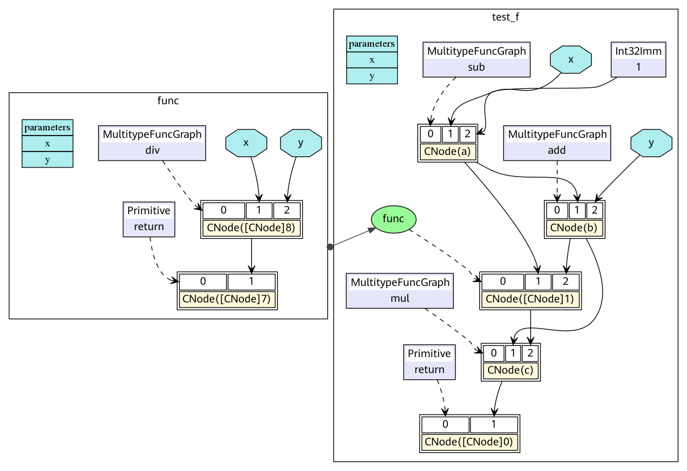
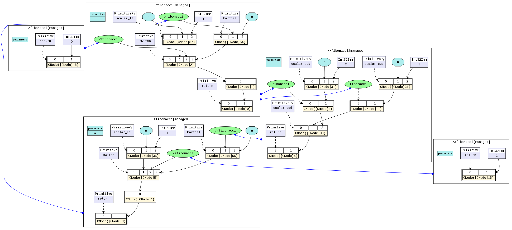

# MindSpore IR (MindIR)

`Linux` `Windows` `Ascend` `GPU` `Framework Development` `Intermediate` `Model Development` `Expert` `Contributor`

<a href="https://gitee.com/mindspore/docs/blob/r1.3/docs/mindspore/note/source_en/design/mindir.md" target="_blank"></a>

## Overview

An intermediate representation (IR) is a representation of a program between the source and target languages, which facilitates program analysis and optimization for the compiler. Therefore, the IR design needs to consider the difficulty in converting the source language to the target language, as well as the ease-of-use and performance of program analysis and optimization.

MindSpore IR (MindIR) is a function-style IR based on graph representation. Its core purpose is to serve automatic differential transformation. Automatic differentiation uses the transformation method based on the function-style programming framework. Therefore, IR uses the semantics close to that of the ANF function. In addition, a manner of representation based on an explicit dependency graph is used by referring to excellent designs of Sea of Nodes[1] and Thorin[2]. For the specific introduction of ANF-IR, please refer to [MindSpore IR Syntax](#syntax).

When a model compiled using MindSpore runs in the graph mode `context.set_context(mode=context.GRAPH_MODE)` and `context.set_context(save_graphs=True)` is set in the configuration, some intermediate files will be generated during graph compliation. These intermediate files are called IR files. Currently, there are three IR files:

- .ir file: An IR file that describes the model structure in text format and can be directly viewed using any text editors. We will also introduce how to view it in the following sections.

- .dat file: An IR file that describes the model structure more strictly than the .ir file. It contains more contents and can be directly viewed using any text editors.

- .dot file: An IR file that describes the topology relationships between different nodes. You can use this file by [graphviz](http://graphviz.org/) as the input to generate images for users to view the model structure. For models with multiple operators, it is recommended using the visualization component [MindInsight](https://www.mindspore.cn/mindinsight/docs/en/r1.3/dashboard.html#computational-graph-visualization) to visualize computing graphs.

## Syntax

ANF is a simple IR commonly used during functional programming. The ANF syntax is defined as follows:

```text
<aexp> ::= NUMBER | STRING | VAR | BOOLEAN | PRIMOP
          |  (lambda (VAR …) <exp>)
<cexp> ::= (<aexp> <aexp> …)
          |  (if <aexp> <exp> <exp>)
<exp> ::= (let ([VAR <cexp>]) <exp>) | <cexp> | <aexp>

```

Expressions in the ANF are classified into atomic expressions (aexp) and compound expressions (cexp). An atomic expression indicates a constant value, a variable, or an anonymous function. A compound expression consists of multiple atomic expressions, indicating that an anonymous function or primitive function call. The first input expression of a compound expression is the called function, and the other input expressions are the called parameters.

The syntax of MindIR is inherited from the ANF and is defined as follows:

```text
<ANode> ::= <ValueNode> | <ParameterNode>
<ParameterNode> ::= Parameter
<ValueNode> ::= Scalar | Named | Tensor | Type | Shape
               | Primitive | MetaFuncGraph | FuncGraph
<CNode> ::= (<AnfNode> …)
<AnfNode> ::= <CNode> | <ANode>
```

ANode in a MindIR corresponds to the atomic expression of ANF. ANode has two subclasses: ValueNode and ParameterNode. ValueNode refers to a constant node, which can carry a constant value (such as a scalar, symbol, tensor, type, and dimension), a primitive function (Primitive), a metafunction (MetaFuncGraph), or a common function (FuncGraph). In functional programming, the function definition itself is a value. ParameterNode refers to a parameter node, which indicates the formal parameter of a function.

CNode in a MindIR corresponds to the compound expression of ANF, indicating a function call.

During automatic differentiation of MindSpore, the gradient contribution of ParameterNode and CNode are calculated, and the final gradient of ParameterNode is returned. The gradient of ValueNode is not calculated.

## Example

The following uses a program code segment as an example to help you understand MindIR.

```python
def func(x, y):
    return x / y

@ms_function
def test_f(x, y):
    a = x - 1
    b = a + y
    c = b * func(a, b)
    return c
```

The ANF corresponding to the Python code is as follows:

```python
lambda (x, y)
    let a = x - 1 in
    let b = a + y in
    let func = lambda (x, y)
        let ret = x / y in
        ret end in
    let %1 = func(a, b) in
    let c = b * %1 in
    c end
```

The corresponding MindIR is [ir.dot](https://gitee.com/mindspore/docs/blob/r1.3/docs/mindspore/note/source_en/design/images/ir/ir.dot).



In a MindIR, a function graph (FuncGraph) indicates the definition of a common function. A directed acyclic graph (DAG) usually consists of ParameterNode, ValueNode, and CNode, which clearly shows the calculation process from parameters to return values. As shown in the preceding figure, the `test_f` and `func` functions in the Python code are converted into two function graphs. The `x` and `y` parameters are converted into ParameterNode in the function graphs, and each expression is converted into a CNode. The first input of CNode links to the called functions, for example, `add`, `func`, and `return` in the figure. It should be noted that these nodes are all `ValueNode` because they are considered as constant function values. Other input of CNode links to the called parameters. The parameter values can be obtained from the ParameterNode, ValueNode, and other CNode.

In the ANF, each expression is bound as a variable by using the let expression, and the dependency on the expression output is represented by referencing the variable. In the MindIR, each expression is bound as a node, and the dependency is represented by using the directed edges between nodes.

## Saving IR

`context.set_context(save_graphs=True)` is used to save the intermediate code in each compilation phase. The intermediate code can be saved in two formats. One is the text format with the suffix `.ir`, and the other is the graphical format with the suffix `.dot`. When the network scale is small, you are advised to use the graphical format that is more intuitive. When the network scale is large, you are advised to use the text format that is more efficient.

You can run the graphviz command to convert a .dot file to the picture format. For example, you can run the `dot -Tpng *.dot -o *.png` command to convert a .dot file to a .png file.

Add the following code to `train.py`, When running the script, MindSpore will automatically store the IR files generated during compilation under the specified path.

```python
if __name__ == "__main__":
    context.set_context(save_graphs=True, save_graphs_path="path/to/ir/files")
```

Here, we run the training script on stand-alone computing device. When running on multiple computing devices, MindSpore will generate separate processes for each computing device. So, in multiple computing devices scenario, you are advised to read the ID of the current computing device from the training script and set an independent `save_graphs_path` for each decive to save the IR files to a different path. For example:

```python
device_id = os.getenv("DEVICE_ID")
context.set_context(save_graphs=True, save_graphs_path="path/to/ir/files"+device_id)
```

After the training command is executed, the following files are generated in the specified directory: the IR files starting with digits and underscores are generated during the ME diagram compilation. The calculation diagram is saved in each phase of the `pipeline`. Let's see the important phases, For examples, the `parse` phase parses the `construct` function of the entrance. The `symbol_resolve` phase recursively parses other functions and objects directly or indirectly referenced by the entry function. The `abstract_specialize` phase, type derivation and `shape` derivation are performed. The `optimize` phase, hardware-independent optimization is performed, The automatic differential and automatic parallel functions are also performed. The `validate` phase, the compiled compute graph is verified. The `task_emit` phase, the computing graph is transferred to the backend for further processing. The calculation graph is executed in the `execute` phase.

```text
.
├── 00_parse_[xxxx].ir
├── 00_parse.dat
├── 00_parse.dot
├── 01_symbol_resolve_[xxxx].ir
├── 01_symbol_resolve.dat
├── 01_symbol_resolve.dot
├── 02_combine_like_graphs_[xxxx].ir
├── 02_combine_like_graphs.dat
├── 02_combine_like_graphs.dot
├── 03_inference_opt_prepare_[xxxx].ir
├── 03_inference_opt_prepare.dat
├── 03_inference_opt_prepare.dot
├── 04_abstract_specialize_[xxxx].ir
├── 04_abstract_specialize.dat
├── 04_abstract_specialize.dot
├── 05_inline_[xxxx].ir
├── 05_inline.dat
├── 05_inline.dot
├── 06_py_pre_ad_[xxxx].ir
├── 06_py_pre_ad.dat
├── 06_py_pre_ad.dot
├── 07_pipeline_split_[xxxx].ir
├── 07_pipeline_split.dat
├── 07_pipeline_split.dot
├── 08_optimize_[xxxx].ir
├── 08_optimize.dat
├── 08_optimize.dot
├── 09_py_opt_[xxxx].ir
├── 09_py_opt.dat
├── 09_py_opt.dot
├── 10_validate_[xxxx].ir
├── 10_validate.dat
├── 10_validate.dot
├── 11_task_emit_[xxxx].ir
├── 11_task_emit.dat
├── 11_task_emit.dot
├── 12_execute_[xxxx].ir
├── 12_execute.dat
├── 12_execute.dot
...
```

## IR File Contents Introduction

The following is an example to describe the contents of the IR file.

```python
import mindspore.context as context
import mindspore.nn as nn
from mindspore import Tensor
from mindspore import dtype as mstype

context.set_context(mode=context.GRAPH_MODE, device_target="Ascend")
context.set_context(save_graphs=True, save_graphs_path="./ir_files")

class Net(nn.Cell):
    def __init__(self):
        super().__init__()

    def construct(self, x, y):
        x = x + y
        x = x * y
        return x

x = Tensor(3, mstype.float32)
y = Tensor(2, mstype.float32)
net = Net()
out = net(x, y)
print(out)
```

Use a text editing software (for example, vi) to open the `12_execute_[xxxx].ir` file. The file contents are as follows:

```text
 1 #IR entry      : @6_5_1_construct_wrapper.15
 2 #attrs         :
 3 check_set_strategy_valid_once_only : 1
 4 #Total params  : 2
 5
 6 %para1_x : <Tensor[Float32]x[const vector][]>
 7 %para2_y : <Tensor[Float32]x[const vector][]>
 8
 9 #Total subgraph : 1
10
11 subgraph attr:
12 check_set_strategy_valid_once_only : 1
13 subgraph @6_5_1_construct_wrapper.15() {
14   %0([CNode]8) = Add(%para1_x, %para2_y) primitive_attrs: {output_names: [output], input_names: [x, y]}
15       : (<Tensor[Float32]x[const vector][]>, <Tensor[Float32]x[const vector][]>) -> (<Tensor[Float32]x[const vector][]>)
16       # In file /home/workspace/mindspore/mindspore/ops/composite/multitype_ops/add_impl.py(129)/    return F.add(x, y)/
17       # In file demo.py(14)/        x = x + y/
18   %1([CNode]10) = Mul(%0, %para2_y) primitive_attrs: {output_names: [output], input_names: [x, y]}
19       : (<Tensor[Float32]x[const vector][]>, <Tensor[Float32]x[const vector][]>) -> (<Tensor[Float32]x[const vector][]>)
20       # In file /home/workspace/mindspore/mindspore/ops/composite/multitype_ops/mul_impl.py(48)/    return F.tensor_mul(x, y)/
21       # In file demo.py(15)/        x = x * y/
22   return(%1)
23       : (<Tensor[Float32]x[const vector][]>)
24 }
```

The above contents can be divided into two parts, the first part is the input list and the second part is the graph structure. The first line tells us the name of the top MindSpore graph about the network, `@6_5_1_construct_wrapper.15`, or the entry graph. Line 4 tells us how many inputs are in the network. Line 6 to 7 are the input list, which is in the format of `%para[No.]_[name] : <[data_type]x[shape]>`. Line 9 tells us the number of subgraphs parsed by the network. Line 11 to 24 indicate the graph structure, which contains several nodes, namely, `CNode`. In this example, there are only two nodes: `Add` in row 14 and `Mul` in row 18.

The `CNode` information format is as follows: including the node name, attribute, input node, output information, format, and source code parsing call stack. The ANF diagram is a unidirectional acyclic graph. So, the connection between nodes is displayed only based on the input relationshape. The source code parsing call stack reflects the relationship between the `CNode` and the script source code. For example, line 20 is parsed from line 21, and line 21 corresponds to `x = x * y` of the script.

```text
  %[No.]([debug_name]) = [OpName]([arg], ...) primitive_attrs: {[key]: [value], ...}
      : (<[input data_type]x[input shape]>, ...) -> (<[output data_type]x[output shape]>, ...)
      # Call stack for source code parsing
```

> After several optimizations by the compiler, the node may undergo several changes (such as operator splitting and operator merging). The source code parsing call stack information of the node may not be in a one-to-one correspondence with the script. This is only an auxiliary method.

## Function-style Semantics

Compared with traditional computational graphs, MindIR can not only express data dependency between operators, but also express rich function-style semantics.

### Higher-Order Functions

In a MindIR, a function is defined by a subgraph. However, the function itself can be transferred as the input or output of other higher-order functions.
In the following simple example, the `f` function is transferred as a parameter into the `g` function. Therefore, the `g` function is a higher-order function that receives function input, and the actual call site of the `f` function is inside the `g` function.

```python
@ms_function
def hof(x):
    def f(x):
        return x + 3
    def g(function, x):
        return function(x) * function(x)
    res = g(f, x)
    return res
```

The corresponding MindIR is [hof.dot](https://gitee.com/mindspore/docs/blob/r1.3/docs/mindspore/note/source_en/design/images/ir/hof.dot).


In the actual network training scripts, the automatic derivation generic function `GradOperation` and `Partial` and `HyperMap` that are commonly used in the optimizer are typical high-order functions. Higher-order semantics greatly improve the flexibility and simplicity of MindSpore representations.

### Control Flows

In a MindIR, control flows are expressed in the form of high-order function selection and calling. This form transforms a control flow into a data flow of higher-order functions, making the automatic differential algorithm more powerful. It not only supports automatic differentiation of data flows, but also supports automatic differentiation of control flows such as conditional jumps, loops, and recursion.

The following uses a simple Fibonacci instance as an example.

```python
@ms_function
def fibonacci(n):
    if(n < 1):
        return 0
    elif(n == 1):
        return 1
    else:
        return fibonacci(n-1) + fibonacci(n-2)
```

The corresponding MindIR is [cf.dot](https://gitee.com/mindspore/docs/blob/r1.3/docs/mindspore/note/source_en/design/images/ir/cf.dot).


`fibonacci` is a top-level function graph. Two function graphs at the top level are selected and called by `switch`. `✓fibonacci` is the True branch of the first `if`, and `✗fibonacci` is the False branch of the first `if`. `✓✗fibonacci` called in `✗fibonacci` is the True branch of `elif`, and `✗✗fibonacci` is the False branch of `elif`. The key is, in a MindIR, conditional jumps and recursion are represented in the form of higher-order control flows. For example, `✓✗fibonacci` and `✗fibonacci` are transferred in as parameters of the `switch` operator. `switch` selects a function as the return value based on the condition parameter. In this way, `switch` performs a binary selection operation on the input functions as common values and does not call the functions. The real function call is completed on CNode following `switch`.

### Free Variables and Closures

Closure is a programming language feature that refers to the combination of code blocks and scope environment. A free variable refers to a variable in the scope environment referenced in a code block instead of a local variable. In a MindIR, a code block is represented as a function graph. The scope environment can be considered as the context where the function is called. The capture method of free variables is value copy instead of reference.

A typical closure instance is as follows:

```python
@ms_function
def func_outer(a, b):
    def func_inner(c):
        return a + b + c
    return func_inner

@ms_function
def ms_closure():
    closure = func_outer(1, 2)
    out1 = closure(1)
    out2 = closure(2)
    return out1, out2
```

The corresponding MindIR is [closure.dot](https://gitee.com/mindspore/docs/blob/r1.3/docs/mindspore/note/source_en/design/images/ir/closure.dot).


In the example, `a` and `b` are free variables because the variables `a` and `b` in `func_inner` are parameters defined in the referenced parent graph `func_outer`. The variable `closure` is a closure, which is the combination of the function `func_inner` and its context `func_outer(1, 2)`. Therefore, the result of `out1` is 4, which is equivalent to `1+2+1`, and the result of `out2` is 5, which is equivalent to `1+2+2`.

## References

[1] C. Click and M. Paleczny. A simple graph-based intermediate representation.
SIGPLAN Not., 30:35–49, March 1995.

[2] Roland Leißa, Marcel Köster, and Sebastian Hack. A graph-based higher-order intermediate
representation. In Proceedings of the 13th Annual IEEE/ACM International Symposium on
Code Generation and Optimization, pages 202–212. IEEE Computer Society, 2015.
