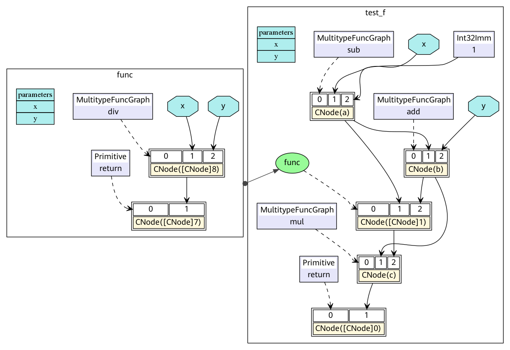

# MindSpore IR（MindIR）

`Linux` `Windows` `Ascend` `GPU` `框架开发` `中级` `模型开发` `高级` `贡献者`

<a href="https://gitee.com/mindspore/docs/blob/r1.3/docs/mindspore/note/source_zh_cn/design/mindir.md" target="_blank"></a>

## 简介

中间表示（IR）是程序编译过程中介于源语言和目标语言之间的程序表示，以方便编译器进行程序分析和优化，因此IR的设计需要考虑从源语言到目标语言的转换难度，同时考虑程序分析和优化的易用性和性能。

MindIR是一种基于图表示的函数式IR，其最核心的目的是服务于自动微分变换。自动微分采用的是基于函数式编程框架的变换方法，因此IR采用了接近于ANF函数式的语义。此外，借鉴Sea of Nodes[1]和Thorin[2]的优秀设计，采用了一种基于显性依赖图的表示方式。关于ANF-IR的具体介绍，可以参考[MindSpore IR文法定义](#id2)。

在图模式`context.set_context(mode=context.GRAPH_MODE)`下运行用MindSpore编写的模型时，若配置中设置了`context.set_context(save_graphs=True)`，运行时会输出一些图编译过程中生成的一些中间文件，我们称为IR文件。当前主要有三种格式的IR文件：

- ir后缀结尾的IR文件：一种比较直观易懂的以文本格式描述模型结构的文件，可以直接用文本编辑软件查看。在下文中我们也将介绍此文件的查看方式。
- dat后缀结尾的IR文件：一种相对于ir后缀结尾的文件格式定义更为严谨的描述模型结构的文件，包含的内容更为丰富，可以直接用文本编辑软件查看。
- dot后缀结尾的IR文件：描述了不同节点间的拓扑关系，可以用[graphviz](http://graphviz.org)将此文件作为输入生成图片，方便用户直观地查看模型结构。对于算子比较多的模型，推荐使用可视化组件[MindInsight](https://www.mindspore.cn/mindinsight/docs/zh-CN/r1.3/dashboard.html#id5)对计算图进行可视化。

## 文法定义

ANF是函数式编程中常用且简洁的中间表示，其文法定义如下所示：

```text
<aexp> ::= NUMBER | STRING | VAR | BOOLEAN | PRIMOP
          |  (lambda (VAR …) <exp>)
<cexp> ::= (<aexp> <aexp> …)
          |  (if <aexp> <exp> <exp>)
<exp> ::= (let ([VAR <cexp>]) <exp>) | <cexp> | <aexp>

```

ANF中表达式分为原子表达式（aexp）和复合表达式（cexp），原子表达式表示一个常数值或一个变量或一个匿名函数；复合表达式由多个原子表达式复合组成，表示一个匿名函数或原语函数调用，组合的第一个输入是调用的函数，其余输入是调用的参数。

MindIR文法继承于ANF，其定义如下所示：

```text
<ANode> ::= <ValueNode> | <ParameterNode>
<ParameterNode> ::= Parameter
<ValueNode> ::= Scalar | Named | Tensor | Type | Shape
               | Primitive | MetaFuncGraph | FuncGraph
<CNode> ::= (<AnfNode> …)
<AnfNode> ::= <CNode> | <ANode>
```

MindIR中的ANode对应于ANF的原子表达式，ANode有两个子类分别为ValueNode和ParameterNode。ValueNode表示常数节点，可承载一个常数值（标量、符号、张量、类型、维度等），也可以是一个原语函数（Primitive）或一个元函数（MetaFuncGraph）或一个普通函数（FuncGraph），因为在函数式编程中函数定义本身也是一个值。ParameterNode是参数节点，表示函数的形参。

MindIR中CNode对应于ANF的复合表达式，表示一次函数调用。

在MindSpore自动微分时，会计算ParameterNode和CNode的梯度贡献，并返回最终ParameterNode的梯度，而不计算ValueNode的梯度。

## 示例

下面以一段程序作为示例，对比理解MindIR。

```python
def func(x, y):
    return x / y

@ms_function
def test_f(x, y):
    a = x - 1
    b = a + y
    c = b * func(a, b)
    return c
```

这段Python代码对应的ANF表达为：

```python
lambda (x, y)
    let a = x - 1 in
    let b = a + y in
    let func = lambda (x, y)
        let ret = x / y in
        ret end in
    let %1 = func(a, b) in
    let c = b * %1 in
    c end
```

对应的MindIR为[ir.dot](https://gitee.com/mindspore/docs/blob/r1.3/docs/mindspore/note/source_zh_cn/design/images/ir/ir.dot)：



在MindIR中，一个函数图（FuncGraph）表示一个普通函数的定义，函数图一般由ParameterNode、ValueNode和CNode组成有向无环图，可以清晰地表达出从参数到返回值的计算过程。在上图中可以看出，python代码中两个函数`test_f`和`func`转换成了两个函数图，其参数`x`和`y`转换为函数图的ParameterNode，每一个表达式转换为一个CNode。CNode的第一个输入链接着调用的函数，例如图中的`add`、`func`、`return`。值得注意的是这些节点均是`ValueNode`，因为它们被理解为常数函数值。CNode的其他输入链接这调用的参数，参数值可以来自于ParameterNode、ValueNode和其他CNode。

在ANF中每个表达式都用let表达式绑定为一个变量，通过对变量的引用来表示对表达式输出的依赖，而在MindIR中每个表达式都绑定为一个节点，通过节点与节点之间的有向边表示依赖关系。

## 如何保存IR

通过`context.set_context(save_graphs=True)`来保存各个编译阶段的中间代码。被保存的中间代码有两种格式，一个是后缀名为`.ir`的文本格式，一个是后缀名为`.dot`的图形化格式。当网络规模不大时，建议使用更直观的图形化格式来查看，当网络规模较大时建议使用更高效的文本格式来查看。

DOT文件可以通过graphviz转换为图片格式来查看，例如将dot转换为png的命令是`dot -Tpng *.dot -o *.png`。

在训练脚本`train.py`中，我们在`set_context`函数中添加如下代码，运行训练脚本时，MindSpore会自动将编译过程中产生的IR文件存放到指定路径。

```python
if __name__ == "__main__":
    context.set_context(save_graphs=True, save_graphs_path="path/to/ir/files")
```

此处为单机版本的训练脚本。当运行的脚本使用多个计算设备时，MindSpore会为每一个计算设备生成一个独立的进程。因此我们建议用户在多卡版本的训练脚本中读取当前的计算设id，从而为每个设备设置独立的`save_graphs_path`实现将每个设备的IR文件保存在不同的路径下。例如：

```python
device_id = os.getenv("DEVICE_ID")
context.set_context(save_graphs=True, save_graphs_path="path/to/ir/files"+device_id)
```

执行训练命令后，在指定的目录生成如下文件。其中以数字下划线开头的IR文件是在ME编译图过程中输出的，`pipeline`各阶段分别会保存一次计算图。下面介绍比较重要的阶段，例如`parse`阶段会解析入口的`construct`函数；`symbol_resolve`阶段会递归解析入口函数直接或间接引用到的其他函数和对象；`abstract_specialize`阶段会做类型推导和`shape`推导；`optimize`阶段主要是进行和硬件无关的优化，自动微分与自动并行功能也是在该阶段展开；`validate`阶段会校验编译出来的计算图；`task_emit`阶段将计算图传给后端进一步处理；`execute`阶段会执行该计算图。

```text
.
├── 00_parse_[xxxx].ir
├── 00_parse.dat
├── 00_parse.dot
├── 01_symbol_resolve_[xxxx].ir
├── 01_symbol_resolve.dat
├── 01_symbol_resolve.dot
├── 02_combine_like_graphs_[xxxx].ir
├── 02_combine_like_graphs.dat
├── 02_combine_like_graphs.dot
├── 03_inference_opt_prepare_[xxxx].ir
├── 03_inference_opt_prepare.dat
├── 03_inference_opt_prepare.dot
├── 04_abstract_specialize_[xxxx].ir
├── 04_abstract_specialize.dat
├── 04_abstract_specialize.dot
├── 05_inline_[xxxx].ir
├── 05_inline.dat
├── 05_inline.dot
├── 06_py_pre_ad_[xxxx].ir
├── 06_py_pre_ad.dat
├── 06_py_pre_ad.dot
├── 07_pipeline_split_[xxxx].ir
├── 07_pipeline_split.dat
├── 07_pipeline_split.dot
├── 08_optimize_[xxxx].ir
├── 08_optimize.dat
├── 08_optimize.dot
├── 09_py_opt_[xxxx].ir
├── 09_py_opt.dat
├── 09_py_opt.dot
├── 10_validate_[xxxx].ir
├── 10_validate.dat
├── 10_validate.dot
├── 11_task_emit_[xxxx].ir
├── 11_task_emit.dat
├── 11_task_emit.dot
├── 12_execute_[xxxx].ir
├── 12_execute.dat
├── 12_execute.dot
...
```

## IR文件内容介绍

下面以一个简单的例子来说明IR文件的内容，执行以下一段训练代码：

```python
import mindspore.context as context
import mindspore.nn as nn
from mindspore import Tensor
from mindspore import dtype as mstype

context.set_context(mode=context.GRAPH_MODE, device_target="Ascend")
context.set_context(save_graphs=True, save_graphs_path="./ir_files")

class Net(nn.Cell):
    def __init__(self):
        super().__init__()

    def construct(self, x, y):
        x = x + y
        x = x * y
        return x

x = Tensor(3, mstype.float32)
y = Tensor(2, mstype.float32)
net = Net()
out = net(x, y)
print(out)
```

使用文本编辑软件（例如`vi`）打开执行完后输出的IR文件`12_execute_[xxxx].ir`，内容如下所示：

```text
 1 #IR entry      : @6_5_1_construct_wrapper.15
 2 #attrs         :
 3 check_set_strategy_valid_once_only : 1
 4 #Total params  : 2
 5
 6 %para1_x : <Tensor[Float32]x[const vector][]>
 7 %para2_y : <Tensor[Float32]x[const vector][]>
 8
 9 #Total subgraph : 1
10
11 subgraph attr:
12 check_set_strategy_valid_once_only : 1
13 subgraph @6_5_1_construct_wrapper.15() {
14   %0([CNode]8) = Add(%para1_x, %para2_y) primitive_attrs: {output_names: [output], input_names: [x, y]}
15       : (<Tensor[Float32]x[const vector][]>, <Tensor[Float32]x[const vector][]>) -> (<Tensor[Float32]x[const vector][]>)
16       # In file /home/workspace/mindspore/mindspore/ops/composite/multitype_ops/add_impl.py(129)/    return F.add(x, y)/
17       # In file demo.py(14)/        x = x + y/
18   %1([CNode]10) = Mul(%0, %para2_y) primitive_attrs: {output_names: [output], input_names: [x, y]}
19       : (<Tensor[Float32]x[const vector][]>, <Tensor[Float32]x[const vector][]>) -> (<Tensor[Float32]x[const vector][]>)
20       # In file /home/workspace/mindspore/mindspore/ops/composite/multitype_ops/mul_impl.py(48)/    return F.tensor_mul(x, y)/
21       # In file demo.py(15)/        x = x * y/
22   return(%1)
23       : (<Tensor[Float32]x[const vector][]>)
24 }
```

以上内容可分为两个部分，第一部分为输入列表，第二部分为图结构。 其中第1行告诉了我们该网络的顶图名称`@6_5_1_construct_wrapper.15`，也就是入口图。 第4行告诉了我们该网络有多少个输入。 第6-7行为输入列表，遵循`%para[序号]_[name] : <[data_type]x[shape]>`的格式。 第9行告诉我们该网络解析出来的子图数量。 第11-24行为图结构，含有若干节点，即`CNode`。该示例中只有2个节点,分别为14行的`Add`和18行的`Mul`。

`CNode`的信息遵循如下格式，包含节点名称、属性、输入节点、输出信息、格式、源码解析调用栈等信息，由于ANF图为单向无环图，所以这里仅根据输入关系体现节点与节点的连接关系。源码解析调用栈则体现了`CNode`与脚本源码之间的关系，例如第20行由第21行解析而来，而第21行能对应到脚本的`x = x * y`。

```text
%[序号]([debug_name]) = [OpName]([arg], ...) primitive_attrs: {[key]: [value], ...}
    : (<[输入data_type]x[输入shape]>, ...) -> (<[输出data_type]x[输出shape]>, ...)
    # 源码解析调用栈
```

> 需要注意的是经过编译器的若干优化处理后，节点可能经过了若干变幻（如算子拆分、算子融合等），节点的源码解析调用栈信息与脚本可能无法完全一一对应，这里仅作为辅助手段。

## 函数式语义

MindIR较传统计算图的一个重要特性是不仅可以表达算子之间的数据依赖，还可以表达丰富的函数式语义。

### 高阶函数

在MindIR中，函数的定义是由一个子图来定义，但其本身可以是一个被传递的值，作为其他高阶函数的输入或输出。
例如下面一个简单的示例中，函数`f`作为参数传入了函数`g`，因此函数`g`是一个接收函数输入的高阶函数，函数`f`真正的调用点是在函数`g`内部。

```python
@ms_function
def hof(x):
    def f(x):
        return x + 3
    def g(function, x):
        return function(x) * function(x)
    res = g(f, x)
    return res
```

对应的MindIR为[hof.dot](https://gitee.com/mindspore/docs/blob/r1.3/docs/mindspore/note/source_zh_cn/design/images/ir/hof.dot)：


在实际网络训练脚本中，自动求导泛函`GradOperation`和优化器中常用到的`Partial`和`HyperMap`都是典型的高阶函数。高阶语义极大地提升了MindSpore表达的灵活性和简洁性。

### 控制流

控制流在MindIR中是以高阶函数选择调用的形式表达。这样的形式把控制流转换为高阶函数的数据流，从而使得自动微分算法更加强大。不仅可以支持数据流的自动微分，还可以支持条件跳转、循环和递归等控制流的自动微分。

下面以一个简单的斐波那契用例来演示说明。

```python
@ms_function
def fibonacci(n):
    if(n < 1):
        return 0
    elif(n == 1):
        return 1
    else:
        return fibonacci(n-1) + fibonacci(n-2)
```

对应的MindIR为[cf.dot](https://gitee.com/mindspore/docs/blob/r1.3/docs/mindspore/note/source_zh_cn/design/images/ir/cf.dot)：


其中`fibonacci`是顶层函数图，在顶层中有两个函数图被`switch`选择调用。`✓fibonacci`是第一个`if`的True分支，`✗fibonacci`是第一个`if`的False分支。在`✗fibonacci`中被调用的`✓✗fibonacci`是`elif`的True分支，`✗✗fibonacci`是`elif`的False分支。这里需要理解的关键是在MindIR中，条件跳转和递归是以高阶控制流的形式表达的。例如，`✓fibonacci`和`✗fibonacci`是作为`switch`算子的参数传入，`switch`根据条件参数选择哪一个函数作为返回值。因此，`switch`是把输入的函数当成普通的值做了一个二元选择操作，并没有调用，而真正的函数调用是在紧随`switch`后的CNode上完成。

### 自由变量和闭包

闭包（closure）是一种编程语言特性，它指的是代码块和作用域环境的结合。自由变量(free variable)是指在代码块中引用作用域环境中的变量而非局部变量。在MindIR中，代码块是以函数图呈现的，而作用域环境可以理解为该函数被调用时的上下文环境，自由变量的捕获方式是值拷贝而非引用。

一个典型的闭包用例如下：

```python
@ms_function
def func_outer(a, b):
    def func_inner(c):
        return a + b + c
    return func_inner

@ms_function
def ms_closure():
    closure = func_outer(1, 2)
    out1 = closure(1)
    out2 = closure(2)
    return out1, out2
```

对应的MindIR为[closure.dot](https://gitee.com/mindspore/docs/blob/r1.3/docs/mindspore/note/source_zh_cn/design/images/ir/closure.dot)：


在例子中，`a`和`b`是自由变量，因为`func_inner`中变量`a`和`b`是引用的其父图`func_outer`中定义的参数。变量`closure`是一个闭包，它是函数`func_inner`与其上下文`func_outer(1, 2)`的结合。因此，`out1`的结果是4，因为其等价于`1+2+1`，`out2`的结果是5，因为其等价于`1+2+2`。

## 参考文献

[1] C. Click and M. Paleczny. A simple graph-based intermediate representation.
SIGPLAN Not., 30:35–49, March 1995.

[2] Roland Leißa, Marcel Köster, and Sebastian Hack. A graph-based higher-order intermediate
representation. In Proceedings of the 13th Annual IEEE/ACM International Symposium on
Code Generation and Optimization, pages 202–212. IEEE Computer Society, 2015.
