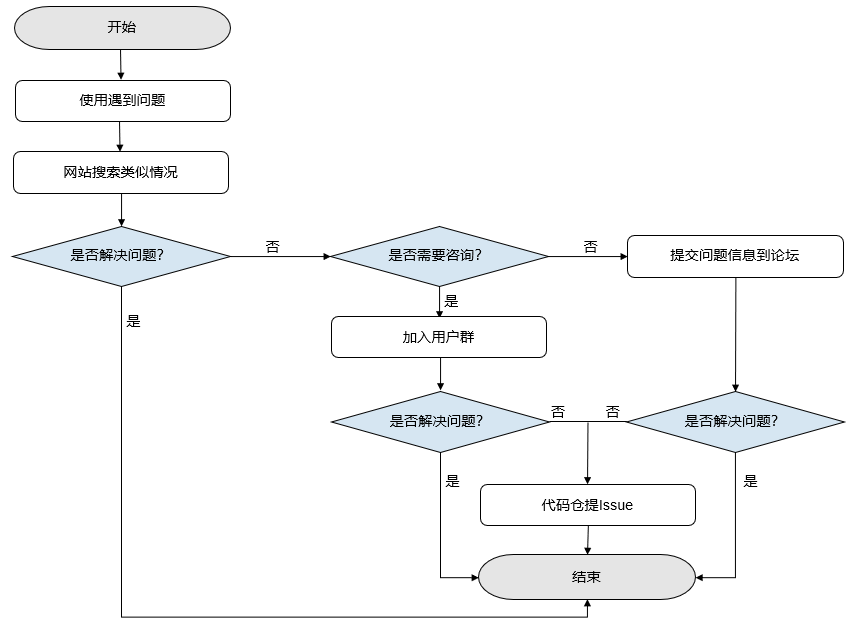

# 如何求助（求助路径）

本文将简述用户在使用MindSpore遇到问题时，如何使用官方提供的问题求助路径解决问题。MindSpore问题求助整体流程如图中所示，从用户使用MindSpore发现问题开始，直至选择到合适的问题解决方法。下面我们基于问题求助流程图对各种求助方法做解释说明。

- 网站搜索

    - 进入[官网搜索](https://www.mindspore.cn/search)。
    - 遇到问题时，首先推荐使用网站搜索方法，该方法操作简单、高效。
    - 在搜索框输入问题的关键词，点击搜索，可匹配出与关键词相关的内容。
    - 参考搜索结果，解决当前遇到的问题。

- 用户群咨询

    - QQ用户群号：486831414。
    - 如果网站搜索方法不能解决当前问题，可通过QQ用户群咨询，建议想要简单咨询的用户选取此方法。
    - 加群后可以与其他用户讨论交流，还有技术专家在群中提供帮助解答。
    - 通过专家的解答或和其他用户的交流来解决当前遇到的问题。

- 论坛求助

    - 如果用户想要详细的解决方法，可通过[MindSpore论坛](https://bbs.huaweicloud.com/forum/forum-1076-1.html)中发布问题求助帖获取解答。
    - 为提高问题解决速度与质量，发帖前请参考[发帖建议](https://bbs.huaweicloud.com/forum/thread-69695-1-1.html)，按照建议格式发帖。
    - 帖子发出后会有论坛版主负责将问题收录，并联系技术专家进行解答，问题将在三个工作日内解决。
    - 参考技术专家的解决方案，解决当前遇到的问题。

  如果在专家测试后确定是MindSpore功能有待完善，推荐用户在[MindSpore仓](https://gitee.com/mindspore)中创建ISSUE，所提问题会在后续的版本中得到修复完善。
