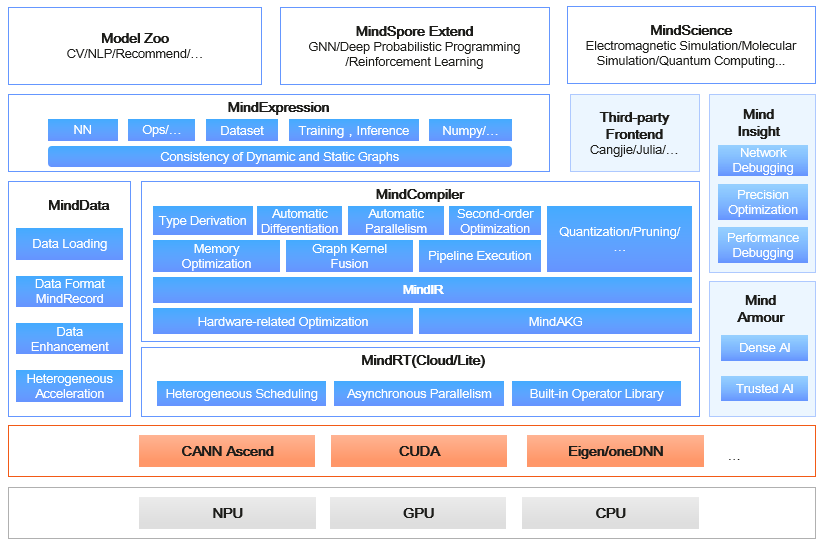

# Overall Architecture

`Ascend` `GPU` `CPU` `Device` `Beginner`

MindSpore is a deep learning framework in all scenarios, aiming to achieve easy development, efficient execution, and all-scenario coverage. Easy development features include API friendliness and low debugging difficulty. Efficient execution includes computing efficiency, data preprocessing efficiency, and distributed training efficiency. All-scenario coverage means that the framework supports cloud, edge, and device scenarios.

The following figure shows the overall MindSpore architecture:

- **ModelZoo**: ModelZoo provides available deep learning algorithm networks, and more developers are welcome to contribute new networks.
- **MindSpore Extend**: The expansion package of MindSpore expands the support of new fields, such as GNN/deep probabilistic programming/reinforcement learning, etc. We look forward to more developers to contribute and build together.
- **MindScience**：MindScience is a scientific computing kits for various industries based on the converged MindSpore framefork. It contains the industry-leading datasets, basic network structures, high-precision pre-trained models, and pre-and post-processing tools that accelerate application development of the scientific computing.
- **MindExpression**: Python-based frontend expression and programming interfaces. In the future, more frontends based on C/C++ will be provided. Cangjie, Huawei's self-developed programming language frontend, is now in the pre-research phase. In addition, Huawei is working on interconnection with third-party frontends  to introduce more third-party ecosystems.
- **MindData**: Provides functions and programming interfaces such as efficient data processing, loading of commonly used datasets, and supports users' flexible definition processing registration and pipeline parallel optimization
- **MindCompiler**: The core compiler of the layer, which implements three major functions based on the unified device-cloud MindIR, including hardware-independent optimization (type derivation, automatic differentiation, and expression simplification), hardware-related optimization (automatic parallelism, memory optimization, graph kernel fusion, and pipeline execution) and optimization related to deployment and inference (quantification and pruning).
- **MindRT**: MindSpore runtime system, which covers the cloud-side host-side runtime system, the device-side and the lightweight runtime system of the smaller IoT.
- **MindInsight**: Provides MindSpore's visual debugging and tuning tools, and supports users to debug and tune the training network.
- **MindArmour**: For enterprise-level applications, security and privacy protection related enhancements, such as anti-robustness, model security testing, differential privacy training, privacy leakage risk assessment, data drift detection, etc. technology.

