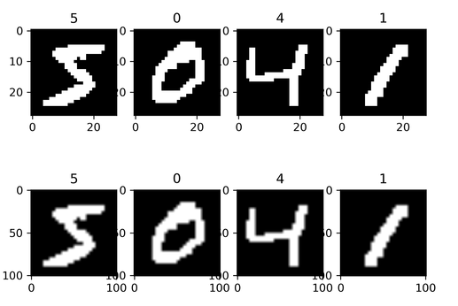
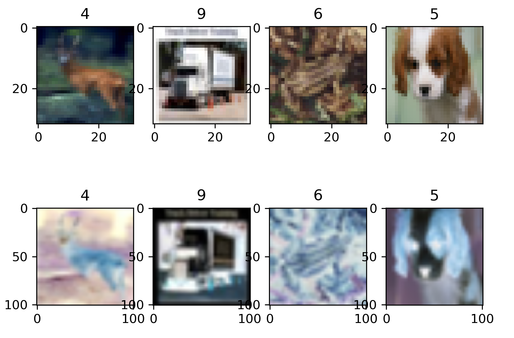
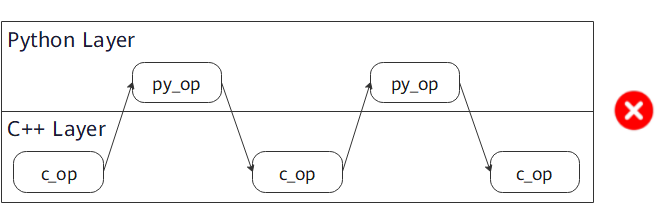

# Image Data Processing and Enhancement

`Ascend` `GPU` `CPU` `Data Preparation`

<!-- TOC -->

- [Image Data Processing and Enhancement](#image-data-processing-and-enhancement)
    - [Overview](#overview)
    - [c_transforms](#c_transforms)
        - [RandomCrop](#randomcrop)
        - [RandomHorizontalFlip](#randomhorizontalflip)
        - [Resize](#resize)
        - [Invert](#invert)
    - [py_transforms](#py_transforms)
        - [Compose](#compose)
    - [Usage Instructions](#usage-instructions)
    - [References](#references)

<!-- /TOC -->

<a href="https://gitee.com/mindspore/docs/blob/master/docs/mindspore/programming_guide/source_en/augmentation.md" target="_blank"></a>

## Overview

In a computer vision task, if the data volume is small or the scenario of the samples are simple, the training effect will be affected. In this case, you may preprocess images by performing data augmentation, so as to improve generalization of the model.

MindSpore provides the `c_transforms` and `py_transforms` modules for data augmentation. You can also customize functions or operators to augment data.

| Module        | Implementation                  | Description                                                                                          |
| ------------- | ------------------------------- | ---------------------------------------------------------------------------------------------------- |
| c_transforms  | Implemented based on C++.       | This module provides high performance.                                                               |
| py_transforms | Implemented based on Python PIL | This module provides multiple image augmentation methods and can convert PIL images to NumPy arrays. |

The following table lists the common data augmentation operators supported by MindSpore. For details about more data augmentation operators, see [MindSpore API](https://www.mindspore.cn/docs/api/en/master/api_python/mindspore.dataset.vision.html).

| Module        | Operator             | Description                                                        |
| ------------- | -------------------- | ------------------------------------------------------------------ |
| c_transforms  | RandomCrop           | Crops an image of a specified size at a random position.           |
|               | RandomHorizontalFlip | Flips the image horizontally based on the specified probability.   |
|               | Resize               | Resizes the image to the specified size.                           |
|               | Invert               | Inverts the image.                                                 |
| py_transforms | RandomCrop           | Crops an image of a specified size at a random position.           |
|               | Resize               | Resizes the image to the specified size.                           |
|               | Invert               | Inverts the image.                                                 |
|               | Compose              | Performs the data augmentation operations in the list in sequence. |

## c_transforms

The following describes how to use common data augmentation operators of the `c_transforms` module.

### RandomCrop

Crops the input image at a random position.

**Parameter description:**

- `size`: size of the cropped image.
- `padding`: number of padded pixels.
- `pad_if_needed`: specifies whether the original image needs to be padded when it is smaller than the cropped size.
- `fill_value`: fill value used in the constant fill mode.
- `padding_mode`: padding mode.

The following example uses a sequential sampler to load the CIFAR-10 dataset [1], randomly crops the loaded image to 10 in both length and width, outputs the image shapes and labels before and after cropping, and displays the cropped image.

Download [CIFAR-10 dataset](https://www.cs.toronto.edu/~kriz/cifar-10-binary.tar.gz) and decompress it to the specified path, execute the following command:

```python
import os
import requests
import tarfile
import zipfile
import shutil

def download_dataset(url, target_path):
    """download and decompress dataset"""
    if not os.path.exists(target_path):
        os.makedirs(target_path)
    download_file = url.split("/")[-1]
    if not os.path.exists(download_file):
        res = requests.get(url, stream=True)
        if download_file.split(".")[-1] not in ["tgz", "zip", "tar", "gz"]:
            download_file = os.path.join(target_path, download_file)
        with open(download_file, "wb") as f:
            for chunk in res.iter_content(chunk_size=512):
                if chunk:
                    f.write(chunk)
    if download_file.endswith("zip"):
        z = zipfile.ZipFile(download_file, "r")
        z.extractall(path=target_path)
        z.close()
    if download_file.endswith(".tar.gz") or download_file.endswith(".tar") or download_file.endswith(".tgz"):
        t = tarfile.open(download_file)
        names = t.getnames()
        for name in names:
            t.extract(name, target_path)
        t.close()

download_dataset("https://mindspore-website.obs.cn-north-4.myhuaweicloud.com/notebook/datasets/cifar-10-binary.tar.gz", "./datasets")
test_path = "./datasets/cifar-10-batches-bin/test"
train_path = "./datasets/cifar-10-batches-bin/train"
if not os.path.exists(test_path):
    os.makedirs(test_path)
if not os.path.exists(train_path):
    os.makedirs(train_path)
shutil.move("./datasets/cifar-10-batches-bin/test_batch.bin", test_path)
[shutil.move("./datasets/cifar-10-batches-bin/"+i, train_path) for i in os.listdir("./datasets/cifar-10-batches-bin/") if os.path.isfile("./datasets/cifar-10-batches-bin/"+i) and not i.endswith(".html")]
```

```text
./datasets/cifar-10-batches-bin
├── readme.html
├── test
│   └── test_batch.bin
└── train
    ├── batches.meta.txt
    ├── data_batch_1.bin
    ├── data_batch_2.bin
    ├── data_batch_3.bin
    ├── data_batch_4.bin
    └── data_batch_5.bin

2 directories, 8 files
```

```python
import matplotlib.pyplot as plt
import mindspore.dataset as ds
import mindspore.dataset.vision.c_transforms as c_trans

ds.config.set_seed(5)
ds.config.set_num_parallel_workers(1)

DATA_DIR = "./datasets/cifar-10-batches-bin/train/"

sampler = ds.SequentialSampler(num_samples=3)
dataset1 = ds.Cifar10Dataset(DATA_DIR, sampler=sampler)

random_crop = c_trans.RandomCrop([10, 10])
dataset2 = dataset1.map(operations=random_crop, input_columns=["image"])

image_list1, label_list1 = [], []
image_list2, label_list2 = [], []
for data1, data2 in zip(dataset1.create_dict_iterator(), dataset2.create_dict_iterator()):
    image_list1.append(data1['image'])
    label_list1.append(data1['label'])
    print("Source image Shape :", data1['image'].shape, ", Source label :", data1['label'])
    image_list2.append(data2['image'])
    label_list2.append(data2['label'])
    print("Cropped image Shape:", data2['image'].shape, ", Cropped label:", data2['label'])
    print("------")

num_samples = len(image_list1) + len(image_list2)
for i in range(num_samples):
    if i < len(image_list1):
        plt.subplot(2, len(image_list1), i + 1)
        plt.imshow(image_list1[i].asnumpy())
        plt.title(label_list1[i].asnumpy())
    else:
        plt.subplot(2, len(image_list2), i + 1)
        plt.imshow(image_list2[i % len(image_list2)].asnumpy())
        plt.title(label_list2[i % len(image_list2)].asnumpy())
plt.show()
```

The output is as follows:

```text
Source image Shape : (32, 32, 3) , Source label : 6
Cropped image Shape: (10, 10, 3) , Cropped label: 6
------
Source image Shape : (32, 32, 3) , Source label : 9
Cropped image Shape: (10, 10, 3) , Cropped label: 9
------
Source image Shape : (32, 32, 3) , Source label : 9
Cropped image Shape: (10, 10, 3) , Cropped label: 9
------
```

The following shows the cropped image.


### RandomHorizontalFlip

Randomly flips the input image horizontally.

**Parameter description:**

- `prob`: probability of flipping a single image.

The following example uses a random sampler to load the CIFAR-10 dataset [1], randomly flips the loaded image in the horizontal direction with a probability of 0.8, outputs the image shapes and labels before and after the flipping, and displays the flipped image.

Follow the steps above to download the CIFAR-10 dataset and store it as required.

```python
import matplotlib.pyplot as plt
import mindspore.dataset as ds
import mindspore.dataset.vision.c_transforms as c_trans

ds.config.set_seed(6)
ds.config.set_num_parallel_workers(1)

DATA_DIR = "./datasets/cifar-10-batches-bin/train/"

sampler = ds.RandomSampler(num_samples=4)
dataset1 = ds.Cifar10Dataset(DATA_DIR, sampler=sampler)

random_horizontal_flip = c_trans.RandomHorizontalFlip(prob=0.8)
dataset2 = dataset1.map(operations=random_horizontal_flip, input_columns=["image"])

image_list1, label_list1 = [], []
image_list2, label_list2 = [], []
for data1, data2 in zip(dataset1.create_dict_iterator(), dataset2.create_dict_iterator()):
    image_list1.append(data1['image'])
    label_list1.append(data1['label'])
    print("Source image Shape :", data1['image'].shape, ", Source label :", data1['label'])
    image_list2.append(data2['image'])
    label_list2.append(data2['label'])
    print("Flipped image Shape:", data2['image'].shape, ", Flipped label:", data2['label'])
    print("------")

num_samples = len(image_list1) + len(image_list2)
for i in range(num_samples):
    if i < len(image_list1):
        plt.subplot(2, len(image_list1), i + 1)
        plt.imshow(image_list1[i].asnumpy())
        plt.title(label_list1[i].asnumpy())
    else:
        plt.subplot(2, len(image_list2), i + 1)
        plt.imshow(image_list2[i % len(image_list2)].asnumpy())
        plt.title(label_list2[i % len(image_list2)].asnumpy())
plt.show()
```

The output is as follows:

```text
Source image Shape : (32, 32, 3) , Source label : 3
Flipped image Shape: (32, 32, 3) , Flipped label: 3
------
Source image Shape : (32, 32, 3) , Source label : 3
Flipped image Shape: (32, 32, 3) , Flipped label: 3
------
Source image Shape : (32, 32, 3) , Source label : 6
Flipped image Shape: (32, 32, 3) , Flipped label: 6
------
Source image Shape : (32, 32, 3) , Source label : 9
Flipped image Shape: (32, 32, 3) , Flipped label: 9
------
```

The following shows the flipped image.


### Resize

Resizes the input image.

**Parameter description:**

- `size`: target size of the image.
- `interpolation`: interpolation mode used during resizing.

The following example loads the MNIST dataset [2], resizes the loaded image to (101, 101), outputs the image shapes and labels before and after the resizing, and displays the resized image.

Download and decompress the MNIST dataset, store it in the `./datasets/MNIST_data/` path, execute the following command:

```python
import os
import requests

def download_dataset(dataset_url, path):
    filename = dataset_url.split("/")[-1]
    if not os.path.exists(path):
        os.makedirs(path)
    res = requests.get(dataset_url, stream=True)
    save_path = os.path.join(path, filename)
    with open(save_path, "wb") as f:
        for chunk in res.iter_content(chunk_size=512):
            if chunk:
                f.write(chunk)

train_path = "datasets/MNIST_Data/train"
test_path = "datasets/MNIST_Data/test"

download_dataset("https://mindspore-website.obs.myhuaweicloud.com/notebook/datasets/mnist/train-labels-idx1-ubyte", train_path)
download_dataset("https://mindspore-website.obs.myhuaweicloud.com/notebook/datasets/mnist/train-images-idx3-ubyte", train_path)
download_dataset("https://mindspore-website.obs.myhuaweicloud.com/notebook/datasets/mnist/t10k-labels-idx1-ubyte", test_path)
download_dataset("https://mindspore-website.obs.myhuaweicloud.com/notebook/datasets/mnist/t10k-images-idx3-ubyte", test_path)
```

```text
./datasets/MNIST_Data
├── test
│   ├── t10k-images-idx3-ubyte
│   └── t10k-labels-idx1-ubyte
└── train
    ├── train-images-idx3-ubyte
    └── train-labels-idx1-ubyte

2 directories, 4 files
```

```python
import matplotlib.pyplot as plt
import mindspore.dataset as ds
import mindspore.dataset.vision.c_transforms as c_trans

DATA_DIR = "./datasets/MNIST_Data/train/"

dataset1 = ds.MnistDataset(DATA_DIR, num_samples=4, shuffle=False)

resize = c_trans.Resize(size=[101, 101])
dataset2 = dataset1.map(operations=resize, input_columns=["image"])

image_list1, label_list1 = [], []
image_list2, label_list2 = [], []
for data1, data2 in zip(dataset1.create_dict_iterator(), dataset2.create_dict_iterator()):
    image_list1.append(data1['image'])
    label_list1.append(data1['label'])
    print("Source image Shape :", data1['image'].shape, ", Source label :", data1['label'])
    image_list2.append(data2['image'])
    label_list2.append(data2['label'])
    print("Flipped image Shape:", data2['image'].shape, ", Flipped label:", data2['label'])
    print("------")

num_samples = len(image_list1) + len(image_list2)
for i in range(num_samples):
    if i < len(image_list1):
        plt.subplot(2, len(image_list1), i + 1)
        plt.imshow(image_list1[i].asnumpy().squeeze(), cmap=plt.cm.gray)
        plt.title(label_list1[i].asnumpy())
    else:
        plt.subplot(2, len(image_list2), i + 1)
        plt.imshow(image_list2[i % len(image_list2)].asnumpy().squeeze(), cmap=plt.cm.gray)
        plt.title(label_list2[i % len(image_list2)].asnumpy())
plt.show()
```

The output is as follows:

```text
Source image Shape : (28, 28, 1) , Source label : 5
Flipped image Shape: (101, 101, 1) , Flipped label: 5
------
Source image Shape : (28, 28, 1) , Source label : 0
Flipped image Shape: (101, 101, 1) , Flipped label: 0
------
Source image Shape : (28, 28, 1) , Source label : 4
Flipped image Shape: (101, 101, 1) , Flipped label: 4
------
Source image Shape : (28, 28, 1) , Source label : 1
Flipped image Shape: (101, 101, 1) , Flipped label: 1
------
```

The following shows the resized image.



### Invert

Inverts the input image.

The following example loads the CIFAR-10 dataset [1], defines and performs the resizing and inverting operations on the loaded image, outputs the image shapes and labels before and after the resizing and inverting operations, and displays the inverted image.

Follow the steps above to download the CIFAR-10 data set and store it as required.

```python
import matplotlib.pyplot as plt
import mindspore.dataset as ds
import mindspore.dataset.vision.c_transforms as c_trans

ds.config.set_seed(8)

DATA_DIR = "./datasets/cifar-10-batches-bin/train/"

dataset1 = ds.Cifar10Dataset(DATA_DIR, num_samples=4, shuffle=True)

resize = c_trans.Resize(size=[101, 101])
invert = c_trans.Invert()
dataset2 = dataset1.map(operations=[resize, invert], input_columns=["image"])

image_list1, label_list1 = [], []
image_list2, label_list2 = [], []
for data1, data2 in zip(dataset1.create_dict_iterator(), dataset2.create_dict_iterator()):
    image_list1.append(data1['image'])
    label_list1.append(data1['label'])
    print("Source image Shape :", data1['image'].shape, ", Source label :", data1['label'])
    image_list2.append(data2['image'])
    label_list2.append(data2['label'])
    print("Flipped image Shape:", data2['image'].shape, ", Flipped label:", data2['label'])
    print("------")

num_samples = len(image_list1) + len(image_list2)
for i in range(num_samples):
    if i < len(image_list1):
        plt.subplot(2, len(image_list1), i + 1)
        plt.imshow(image_list1[i].asnumpy().squeeze(), cmap=plt.cm.gray)
        plt.title(label_list1[i].asnumpy())
    else:
        plt.subplot(2, len(image_list2), i + 1)
        plt.imshow(image_list2[i % len(image_list2)].asnumpy().squeeze(), cmap=plt.cm.gray)
        plt.title(label_list2[i % len(image_list2)].asnumpy())
plt.show()
```

The output is as follows:

```text
Source image Shape : (32, 32, 3) , Source label : 7
Flipped image Shape: (101, 101, 3) , Flipped label: 7
------
Source image Shape : (32, 32, 3) , Source label : 0
Flipped image Shape: (101, 101, 3) , Flipped label: 0
------
Source image Shape : (32, 32, 3) , Source label : 2
Flipped image Shape: (101, 101, 3) , Flipped label: 2
------
Source image Shape : (32, 32, 3) , Source label : 1
Flipped image Shape: (101, 101, 3) , Flipped label: 1
------
```

The following shows the inverted image.



## py_transforms

The following describes how to use common data augmentation operators of the `py_transforms` module.

### Compose

Receives a `transforms` list and applies the data augmentation operations in the list to dataset images in sequence.

The following example loads the CIFAR-10 dataset [1], defines the decoding, resizing, and data type conversion operations, applies the operations to the loaded image, outputs the image shapes and labels before and after the processing, and displays the processed image.

Follow the steps above to download the CIFAR-10 dataset and store it as required.

```python
import matplotlib.pyplot as plt
import mindspore.dataset as ds
import mindspore.dataset.vision.py_transforms as py_trans
from mindspore.dataset.transforms.py_transforms import Compose
from PIL import Image

ds.config.set_seed(8)

DATA_DIR = "./datasets/cifar-10-batches-bin/train/"

dataset1 = ds.Cifar10Dataset(DATA_DIR, num_samples=5, shuffle=True)

def decode(image):
    return Image.fromarray(image)

transforms_list = [
  decode,
  py_trans.Resize(size=(200,200)),
  py_trans.ToTensor()
]
compose_trans = Compose(transforms_list)
dataset2 = dataset1.map(operations=compose_trans, input_columns=["image"])

image_list, label_list = [], []
for data in dataset2.create_dict_iterator():
    image_list.append(data['image'])
    label_list.append(data['label'])
    print("Transformed image Shape:", data['image'].shape, ", Transformed label:", data['label'])

num_samples = len(image_list)
for i in range(num_samples):
    plt.subplot(1, len(image_list), i + 1)
    plt.imshow(image_list[i].asnumpy().transpose(1, 2, 0))
    plt.title(label_list[i].asnumpy())
plt.show()
```

The output is as follows:

```text
Transformed image Shape: (3, 200, 200) , Transformed label: 7
Transformed image Shape: (3, 200, 200) , Transformed label: 0
Transformed image Shape: (3, 200, 200) , Transformed label: 2
Transformed image Shape: (3, 200, 200) , Transformed label: 1
Transformed image Shape: (3, 200, 200) , Transformed label: 6
```

The following shows the processed image.


## Usage Instructions

Do not use `c_transforms` and `py_transforms` together because they apply to images in different ways and using them together will reduce the processing performance (Except for Eager Mode).

(Note: The mixed use of `c_transforms` and `py_transforms` in Eager mode is not affected by differences in operating modes.)


Using both C++ and Python will cause the cost of switching between them. You are advised not to use operators of the two modules together. However, it is acceptable to use a proper number of operators together.

**Recommended usage:**

- Use `py_transform` or `c_transform` separately.

    

- Use `py_transform` and then `c_transform`.

    

- Use `c_transform` and then `py_transform`.

    

**Not recommended:**

- Frequent switching between `c_transforms` and `py_transforms`.

    

## References

[1] Alex Krizhevsky. [Learning Multiple Layers of Features from Tiny Images](http://www.cs.toronto.edu/~kriz/learning-features-2009-TR.pdf).

[2] Y. LeCun, L. Bottou, Y. Bengio, and P. Haffner. [Gradient-based learning applied to document recognition](http://yann.lecun.com/exdb/publis/pdf/lecun-98.pdf).
