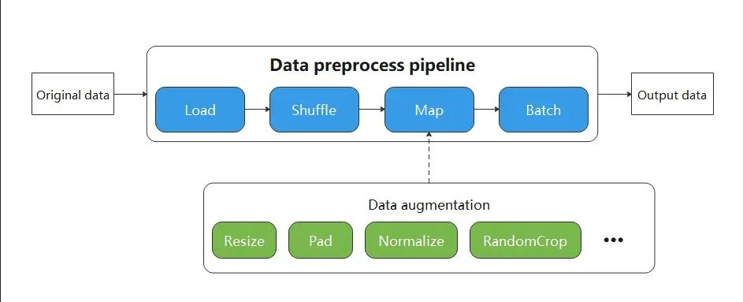

# Lightweight Data Processing

`Ascend` `GPU` `CPU` `Data Preparation`
<!-- TOC -->

- [Lightweight Data Processing](#lightweight-data-processing)

<!-- /TOC -->

<a href="https://gitee.com/mindspore/docs/blob/master/docs/mindspore/programming_guide/source_en/eager.md" target="_blank"></a>

When resource conditions permit, in order to pursue higher performance, data transformations are generally executed in the data pipeline mode. That is, users have to define the `map` operator which helps to execute augmentations in data pipeline. As shown in the figure below, the `map` operator contains 3 transformations: `Resize`, `Crop`, and `HWC2CHW`. When the pipeline starts, the `map` operator will apply these transformations to data in sequence.



Although the data pipeline can process input data quickly, the code of defining pipeline seems heavy while sometimes users just want to focus on the data transformations and perform them on small-scale data. In this case, data pipeline is not necessary.

Therefore, MindSpore provides a lightweight data processing way to execute these data augmentations, called `Eager mode`.

In `Eager mode`, the execution of data augmentations will not rely on the `map` operator but can be called directly as callable functions. The code will be simpler since the results are obtained immediately. It is recommended to be used in lightweight scenarios such as small data enhancement experiments and model inference.


MindSpore currently supports executing various data augmentations in `Eager mode`, as shown below. For more details, please refer to the API documentation.

- [vision module](https://www.mindspore.cn/docs/api/en/master/api_python/mindspore.dataset.vision.html)

    - Submodule c_transforms, an image enhancement operator based on OpenCV.
    - Submodule py_transforms, an image enhancement operator based on Pillow.

- [text module](https://www.mindspore.cn/docs/api/en/master/api_python/mindspore.dataset.text.html#mindspore-dataset-text-transforms)

    - Submodule transforms, text processing operators.

- [transforms module](https://www.mindspore.cn/docs/api/en/master/api_python/mindspore.dataset.transforms.html)

    - Submodule c_transforms, a general-purpose data enhancement operator based on C++.
    - Submodule py_transforms, a general-purpose data augmentation operator based on Python.

Note: In chapters [Image Processing and Enhancement](https://www.mindspore.cn/docs/programming_guide/en/master/augmentation.html), [Text Processing and Enhancement](https://www.mindspore.cn/docs/programming_guide/en/master/tokenizer.html), all data enhancement operators can be executed in Eager mode.

## example

The following example introduces how to execute data augmentations in `Eager mode`.

> To use `Eager mode`, just treat the data augmentations as an executable function and call them directly.

### data preparation

Download the image and save it to the specified location.

```python
import os
import requests

requests.packages.urllib3.disable_warnings()

def download_dataset(dataset_url, path):
    filename = dataset_url.split("/")[-1]
    save_path = os.path.join(path, filename)
    if os.path.exists(save_path):
        return
    if not os.path.exists(path):
        os.makedirs(path)
    res = requests.get(dataset_url, stream=True, verify=False)
    with open(save_path, "wb") as f:
        for chunk in res.iter_content(chunk_size=512):
            if chunk:
                f.write(chunk)
    print("The {} file is downloaded and saved in the path {} after processing".format(os.path.basename(dataset_url), path))

download_dataset("https://obs.dualstack.cn-north-4.myhuaweicloud.com/mindspore-website/notebook/datasets/banana.jpg", ".")
```

### vision

This example will mix the `c_tranforms` and `py_transforms` operators from the `vision` module to transform a given image.

You only need to focus on what data augmentations have to use, not any code for the data pipeline.

The Eager mode of the vision operator supports `numpy.array` or `PIL.Image` type data as input parameters.

```python
import numpy as np
from PIL import Image
import matplotlib.pyplot as plt
import mindspore.dataset.vision.c_transforms as C
import mindspore.dataset.vision.py_transforms as P

img_ori = Image.open("banana.jpg").convert("RGB")
print("Image.type: {}, Image.shape: {}".format(type(img_ori), img_ori.size))

# Define a Resize op from c_transform and execute it immediately
op1 = C.Resize(size=(320))
img = op1(img_ori)
print("Image.type: {}, Image.shape: {}".format(type(img), img.shape))

# Define a CenterCrop op from c_transform and execute it immediately
op2 = C.CenterCrop((280, 280))
img = op2(img)
print("Image.type: {}, Image.shape: {}".format(type(img), img.shape))

# Define a Pad op from py_transform and execute it immediately
# Before calling Pad, you need to call ToPIL()
op3 = P.ToPIL()
op4 = P.Pad(40)
img = op4(op3(img))
print("Image.type: {}, Image.shape: {}".format(type(img), img.size))

# Show the result
plt.subplot(1, 2, 1)
plt.imshow(img_ori)
plt.title("original image")
plt.subplot(1, 2, 2)
plt.imshow(img)
plt.title("transformed image")
plt.show()
```

The output is as follows:

```text
Image.type: <class 'PIL.Image.Image'>, Image.shape: (356, 200)
Image.type: <class 'numpy.ndarray'>, Image.shape: (320, 570, 3)
Image.type: <class 'numpy.ndarray'>, Image.shape: (280, 280, 3)
Image.type: <class 'PIL.Image.Image'>, Image.shape: (360, 360)
```

The following shows the processed image.


Augmentation operators that support to be run in Eager Mode are listed as follows: [mindspore.dataset.transforms](https://www.mindspore.cn/docs/api/en/master/api_python/mindspore.dataset.transforms.html), [mindspore.dataset.vision](https://www.mindspore.cn/docs/api/en/master/api_python/mindspore.dataset.vision.html), [mindspore.dataset.text.transforms](https://www.mindspore.cn/docs/api/en/master/api_python/mindspore.dataset.text.html#mindspore-dataset-text-transforms).

### text

This example will transform the given text using the `tranforms` operator in the `text` module.

Eager mode of the text operator supports `numpy.array` type data as input parameters.

```python
import mindspore.dataset.text.transforms as text
from mindspore import dtype as mstype

# Define a WhitespaceTokenizer op and execute it immediately
txt = "Welcome to Beijing !"
txt = text.WhitespaceTokenizer()(txt)
print("Tokenize result: {}".format(txt))

# Define a ToNumber op and execute it immediately
txt = ["123456"]
to_number = text.ToNumber(mstype.int32)
txt = to_number(txt)
print("ToNumber result: {}, type: {}".format(txt, type(txt[0])))
```

```text
Tokenize result: ['Welcome' 'to' 'Beijing' '!']
ToNumber result: [123456], type: <class 'numpy.int32'>
```

### transforms

This example will transform the given data using the operators of `c_tranforms` in the `transforms` module.

Eager mode of transforms operator supports `numpy.array` type data as input parameters.

```python
import numpy as np
import mindspore.dataset.transforms.c_transforms as trans

# Define a Fill op and execute it immediately
data = np.array([1, 2, 3, 4, 5])
fill = trans.Fill(0)
data = fill(data)
print("Fill result: ", data)

# Define a OneHot op and execute it immediately
label = np.array(2)
onehot = trans.OneHot(num_classes=5)
label = onehot(label)
print("OneHot result: ", label)
```

```text
Fill result:  [0 0 0 0 0]
OneHot result:  [0 0 1 0 0]
```
