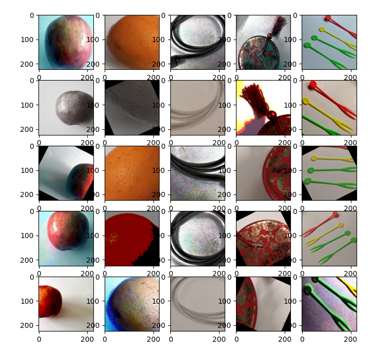

# Application of Auto Augmentation

`Ascend` `GPU` `CPU` `Data Preparation`

<!-- TOC -->

- [Application of Auto Augmentation](#application-of-auto-augmentation)
    - [Overview](#overview)
    - [Auto Augmentation on ImageNet](#auto-augmentation-on-imagenet)
    - [References](#references)

<!-- /TOC -->

<a href="https://gitee.com/mindspore/docs/blob/master/docs/mindspore/programming_guide/source_en/enable_auto_augmentation.md" target="_blank"></a>

## Overview

Auto Augmentation [1] finds a suitable image augmentation scheme for a specific dataset by searching through a series of image augmentation sub-policies. The `c_transforms` module of MindSpore provides various C++ operators that are used in Auto Augmentation. Users can also customize functions or operators to implement Auto Augmentation. For more details about the MindSpore operators, see the [API document](https://www.mindspore.cn/docs/api/en/master/api_python/mindspore.dataset.vision.html).

The mapping between MindSpore operators and Auto Augmentation operators is as follows:

| Auto Augmentation Operators | MindSpore Operators | Introduction |
| :------: | :------ | ------ |
| shearX | RandomAffine | Horizontal shear |
| shearY | RandomAffine | Vertical shear |
| translateX | RandomAffine | Horizontal translation |
| translateY | RandomAffine | Vertival translation |
| rotate | RandomRotation | Rotational transformation |
| color | RandomColor | Color transformation |
| posterize | RandomPosterize | Decrease the number of color channels |
| solarize | RandomSolarize | Invert all pixels within the specified threshold range |
| contrast | RandomColorAdjust | Contrast adjustment |
| sharpness | RandomSharpness | Sharpness adjustment |
| brightness | RandomColorAdjust | Brightness adjustment |
| autocontrast | AutoContrast | Maximize image contrast |
| equalize | Equalize | Equalize image histogram |
| invert | Invert | Image inversion |

## Auto Augmentation on ImageNet

This tutorial uses the implementation of Auto Augmentation on the ImageNet dataset as an example.

The data augmentation policy for the ImageNet dataset contains 25 sub-policies, and each sub-policy contains two transformations. A combination of sub-policies is randomly selected for each image in a batch, and each transformation in the sub-policy is executed based on a preset probability.

Users can use the `RandomSelectSubpolicy` interface of the `c_transforms` module in MindSpore to implement Auto Augmentation. The standard data augmentation method in ImageNet classification training includes the following steps:

- `RandomCropDecodeResize`: Randomly crop then decode.

- `RandomHorizontalFlip`: Randomly flip horizontally.

- `Normalize`: Normalize the data.

- `HWC2CHW`: Change image channel.

Add Auto Augmentation transformation after the `RandomCropDecodeResize` as follows:

1. Import related modules.

    ```python
    import matplotlib.pyplot as plt

    import mindspore.dataset as ds
    import mindspore.dataset.transforms.c_transforms as c_transforms
    import mindspore.dataset.vision.c_transforms as c_vision
    from mindspore import dtype as mstype
    ```

2. Define the mapping from the MindSpore operators to the Auto Augmentation operators.

    ```python
    # define Auto Augmentation operators
    PARAMETER_MAX = 10

    def float_parameter(level, maxval):
        return float(level) * maxval /  PARAMETER_MAX

    def int_parameter(level, maxval):
        return int(level * maxval / PARAMETER_MAX)

    def shear_x(level):
        v = float_parameter(level, 0.3)
        return c_transforms.RandomChoice([c_vision.RandomAffine(degrees=0, shear=(-v,-v)), c_vision.RandomAffine(degrees=0, shear=(v, v))])

    def shear_y(level):
        v = float_parameter(level, 0.3)
        return c_transforms.RandomChoice([c_vision.RandomAffine(degrees=0, shear=(0, 0, -v,-v)), c_vision.RandomAffine(degrees=0, shear=(0, 0, v, v))])

    def translate_x(level):
        v = float_parameter(level, 150 / 331)
        return c_transforms.RandomChoice([c_vision.RandomAffine(degrees=0, translate=(-v,-v)), c_vision.RandomAffine(degrees=0, translate=(v, v))])

    def translate_y(level):
        v = float_parameter(level, 150 / 331)
        return c_transforms.RandomChoice([c_vision.RandomAffine(degrees=0, translate=(0, 0, -v,-v)), c_vision.RandomAffine(degrees=0, translate=(0, 0, v, v))])

    def color_impl(level):
        v = float_parameter(level, 1.8) + 0.1
        return c_vision.RandomColor(degrees=(v, v))

    def rotate_impl(level):
        v = int_parameter(level, 30)
        return c_transforms.RandomChoice([c_vision.RandomRotation(degrees=(-v, -v)), c_vision.RandomRotation(degrees=(v, v))])

    def solarize_impl(level):
        level = int_parameter(level, 256)
        v = 256 - level
        return c_vision.RandomSolarize(threshold=(0, v))

    def posterize_impl(level):
        level = int_parameter(level, 4)
        v = 4 - level
        return c_vision.RandomPosterize(bits=(v, v))

    def contrast_impl(level):
        v = float_parameter(level, 1.8) + 0.1
        return c_vision.RandomColorAdjust(contrast=(v, v))

    def autocontrast_impl(level):
        return c_vision.AutoContrast()

    def sharpness_impl(level):
        v = float_parameter(level, 1.8) + 0.1
        return c_vision.RandomSharpness(degrees=(v, v))

    def brightness_impl(level):
        v = float_parameter(level, 1.8) + 0.1
        return c_vision.RandomColorAdjust(brightness=(v, v))
    ```

3. Define the Auto Augmentation policy for the ImageNet dataset.

    ```python
    # define the Auto Augmentation policy
    imagenet_policy = [
        [(posterize_impl(8), 0.4), (rotate_impl(9), 0.6)],
        [(solarize_impl(5), 0.6), (autocontrast_impl(5), 0.6)],
        [(c_vision.Equalize(), 0.8), (c_vision.Equalize(), 0.6)],
        [(posterize_impl(7), 0.6), (posterize_impl(6), 0.6)],
        [(c_vision.Equalize(), 0.4), (solarize_impl(4), 0.2)],

        [(c_vision.Equalize(), 0.4), (rotate_impl(8), 0.8)],
        [(solarize_impl(3), 0.6), (c_vision.Equalize(), 0.6)],
        [(posterize_impl(5), 0.8), (c_vision.Equalize(), 1.0)],
        [(rotate_impl(3), 0.2), (solarize_impl(8), 0.6)],
        [(c_vision.Equalize(), 0.6), (posterize_impl(6), 0.4)],

        [(rotate_impl(8), 0.8), (color_impl(0), 0.4)],
        [(rotate_impl(9), 0.4), (c_vision.Equalize(), 0.6)],
        [(c_vision.Equalize(), 0.0), (c_vision.Equalize(), 0.8)],
        [(c_vision.Invert(), 0.6), (c_vision.Equalize(), 1.0)],
        [(color_impl(4), 0.6), (contrast_impl(8), 1.0)],

        [(rotate_impl(8), 0.8), (color_impl(2), 1.0)],
        [(color_impl(8), 0.8), (solarize_impl(7), 0.8)],
        [(sharpness_impl(7), 0.4), (c_vision.Invert(), 0.6)],
        [(shear_x(5), 0.6), (c_vision.Equalize(), 1.0)],
        [(color_impl(0), 0.4), (c_vision.Equalize(), 0.6)],

        [(c_vision.Equalize(), 0.4), (solarize_impl(4), 0.2)],
        [(solarize_impl(5), 0.6), (autocontrast_impl(5), 0.6)],
        [(c_vision.Invert(), 0.6), (c_vision.Equalize(), 1.0)],
        [(color_impl(4), 0.6), (contrast_impl(8), 1.0)],
        [(c_vision.Equalize(), 0.8), (c_vision.Equalize(), 0.6)],
    ]
    ```

4. Add Auto Augmentation transformations after the `RandomCropDecodeResize` operation.

    ```python
    def create_dataset(dataset_path, do_train, repeat_num=1, batch_size=32, shuffle=True, num_samples=5, target="Ascend"):
        # create a train or eval imagenet2012 dataset for ResNet-50
        dataset = ds.ImageFolderDataset(dataset_path, num_parallel_workers=8,
                                   shuffle=shuffle, num_samples=num_samples)

        image_size = 224
        mean = [0.485 * 255, 0.456 * 255, 0.406 * 255]
        std = [0.229 * 255, 0.224 * 255, 0.225 * 255]

        # define map operations
        if do_train:
            trans = [
                c_vision.RandomCropDecodeResize(image_size, scale=(0.08, 1.0), ratio=(0.75, 1.333)),
            ]

            post_trans = [
                c_vision.RandomHorizontalFlip(prob=0.5),
            ]
        else:
            trans = [
                c_vision.Decode(),
                c_vision.Resize(256),
                c_vision.CenterCrop(image_size),
                c_vision.Normalize(mean=mean, std=std),
                c_vision.HWC2CHW()
            ]
        dataset = dataset.map(operations=trans, input_columns="image")
        if do_train:
            dataset = dataset.map(operations=c_vision.RandomSelectSubpolicy(imagenet_policy), input_columns=["image"])
            dataset = dataset.map(operations=post_trans, input_columns="image")
        type_cast_op = c_transforms.TypeCast(mstype.int32)
        dataset = dataset.map(operations=type_cast_op, input_columns="label")
        # apply the batch operation
        dataset = dataset.batch(batch_size, drop_remainder=True)
        # apply the repeat operation
        dataset = dataset.repeat(repeat_num)

        return dataset
    ```

5. Verify the effects of Auto Augmentation.

    ```python
    # Define the path to image folder directory. This directory needs to contain sub-directories which contain the images.
    DATA_DIR = "/path/to/image_folder_directory"
    dataset = create_dataset(dataset_path=DATA_DIR, do_train=True, batch_size=5, shuffle=False, num_samples=5)

    epochs = 5
    itr = dataset.create_dict_iterator()
    fig=plt.figure(figsize=(8, 8))
    columns = 5
    rows = 5

    step_num = 0
    for ep_num in range(epochs):
        for data in itr:
            step_num += 1
            for index in range(rows):
                fig.add_subplot(rows, columns, ep_num * rows + index + 1)
                plt.imshow(data['image'].asnumpy()[index])
    plt.show()
    ```

    > For better visualization, only five images are read from the dataset without performing `shuffle`, `Normalize`, nor `HWC2CHW` operations.

    

    The images above visualize the effect of Auto Augmentation. The horizontal direction displays five images in one batch, and the vertical direction displays five batches.

## References

[1] [AutoAugment: Learning Augmentation Policies from Data](https://arxiv.org/abs/1805.09501).
