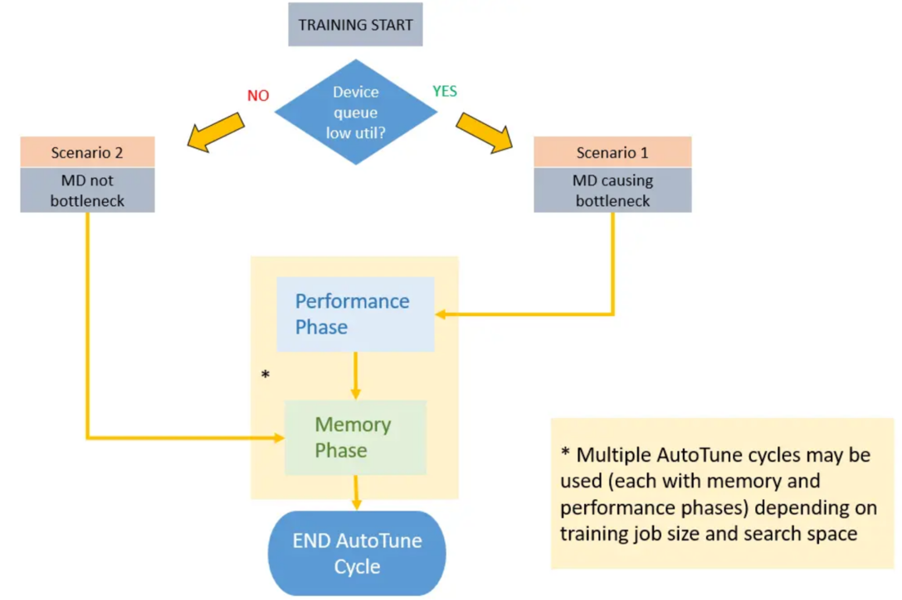

# Dataset AutoTune for Dataset Pipeline

`Ascend` `GPU` `Data Preparation`

<a href="https://gitee.com/mindspore/docs/blob/r1.6/docs/mindspore/programming_guide/source_en/enable_dataset_autotune.md" target="_blank"></a>

## Overview

MindSpore provides a tool named Dataset AutoTune for optimizing dataset.
The Dataset AutoTune can automatically tune Dataset pipelines to improve performance.

This feature can automatically detect a bottleneck operator in the dataset pipeline and respond by automatically adjusting tunable parameters for dataset ops, like increasing the number of parallel workers or updating the prefetch size of dataset ops.



With Dataset AutoTune enabled, MindSpore will sample dataset statistics at a given interval, which is tuneable by the user.

Once Dataset AutoTune collects enough information, it will analyze whether the performance bottleneck is on the dataset side or not.
If so, it will adjust the parallelism and speedup the dataset pipeline.
If not, Dataset AutoTune will also try to reduce the memory usage of the dataset pipeline to release memory for CPU.

> Dataset AutoTune is disabled by default.

## Enable Dataset AutoTune

To enable Dataset AutoTune:

```python
import mindspore.dataset as ds
ds.config.set_enable_autotune(True)
```

## Time Interval for Dataset AutoTune

To set the time interval (in milliseconds) for dataset pipeline autotuning:

```python
import mindspore.dataset as ds
ds.config.set_autotune_interval(100)
```

To query the time interval (in milliseconds) for dataset pipeline autotuning:

```python
import mindspore.dataset as ds
print("time interval:", ds.config.get_autotune_interval())
```

## Constraints

- Dataset AutoTune is currently available for sink mode only (dataset_sink_mode=True).When it is set to enable in non-sink mode (dataset_sink_mode=False), no tuning will be happened.

- Both Dataset Profiling and Dataset Autotune cannot be enabled concurrently,otherwise it will lead to unwork of Dataset AutoTune or Profiling. A warning message will result if you enable Dataset AutoTune first and then Dataset Profiling, or viceversa.Please make sure Profiling is disabled when using Dataset Autotune.

## Example

Take ResNet training as example.

### Dataset AutoTune Config

To enable Dataset AutoTune, only one statement is needed.

```python
# dataset.py of ResNet in ModelZoo
# models/official/cv/resnet/src/dataset.py

def create_dataset(...)
    """
    create dataset for train or test
    """
    # enable Dataset AutoTune
    ds.config.set_enable_autotune(True)

    # define dataset
    data_set = ds.Cifar10Dataset(data_path)
    ...
```

### Start Training

Start the training process as described in [resnet/README.md](https://gitee.com/mindspore/models/blob/master/official/cv/resnet/README.md). Dataset AutoTune will display its analysis result through LOG messages.

```text
[INFO] [auto_tune.cc:73 LaunchThread] Launching Dataset AutoTune thread
[INFO] [auto_tune.cc:35 Main] Dataset AutoTune thread has started.
[INFO] [auto_tune.cc:191 RunIteration] Run Dataset AutoTune at epoch #1
[INFO] [auto_tune.cc:203 RecordPipelineTime] Epoch #1, Average Pipeline time is 21.6624 ms. The avg pipeline time for all epochs is 21.6624ms
[INFO] [auto_tune.cc:231 IsDSaBottleneck] Epoch #1, Device Connector Size: 0.0224, Connector Capacity: 1, Utilization: 2.24%, Empty Freq: 97.76%
epoch: 1 step: 1875, loss is 1.1544309
epoch time: 72110.166 ms, per step time: 38.459 ms

[WARNING] [auto_tune.cc:236 IsDSaBottleneck] Utilization: 2.24% < 75% threshold, dataset pipeline performance needs tuning.
[WARNING] [auto_tune.cc:297 Analyse] Op (MapOp(ID:3)) is slow, input connector utilization=0.975806, output connector utilization=0.298387, diff= 0.677419 > 0.35 threshold.
[WARNING] [auto_tune.cc:253 RequestNumWorkerChange] Added request to change "num_parallel_workers" of Operator: MapOp(ID:3)From old value: [2] to new value: [4].
[WARNING] [auto_tune.cc:309 Analyse] Op (BatchOp(ID:2)) getting low average worker cpu utilization 1.64516% < 35% threshold.
[WARNING] [auto_tune.cc:263 RequestConnectorCapacityChange] Added request to change "prefetch_size" of Operator: BatchOp(ID:2)From old value: [1] to new value: [5].
epoch: 2 step: 1875, loss is 0.64530635
epoch time: 24519.360 ms, per step time: 13.077 ms

[WARNING] [auto_tune.cc:236 IsDSaBottleneck] Utilization: 0.0213516% < 75% threshold, dataset pipeline performance needs tuning.
[WARNING] [auto_tune.cc:297 Analyse] Op (MapOp(ID:3)) is slow, input connector utilization=1, output connector utilization=0, diff= 1 > 0.35 threshold.
[WARNING] [auto_tune.cc:253 RequestNumWorkerChange] Added request to change "num_parallel_workers" of Operator: MapOp(ID:3)From old value: [4] to new value: [6].
[WARNING] [auto_tune.cc:309 Analyse] Op (BatchOp(ID:2)) getting low average worker cpu utilization 4.39062% < 35% threshold.
[WARNING] [auto_tune.cc:263 RequestConnectorCapacityChange] Added request to change "prefetch_size" of Operator: BatchOp(ID:2)From old value: [5] to new value: [9].
epoch: 3 step: 1875, loss is 0.9806979
epoch time: 17116.234 ms, per step time: 9.129 ms

...

[INFO] [profiling.cc:703 Stop] MD Autotune is stopped.
[INFO] [auto_tune.cc:52 Main] Dataset AutoTune thread is finished.
[INFO] [auto_tune.cc:53 Main] Printing final tree configuration
[INFO] [auto_tune.cc:66 PrintTreeConfiguration] CifarOp(ID:5) num_parallel_workers: 2 prefetch_size: 2
[INFO] [auto_tune.cc:66 PrintTreeConfiguration] MapOp(ID:4) num_parallel_workers: 1 prefetch_size: 2
[INFO] [auto_tune.cc:66 PrintTreeConfiguration] MapOp(ID:3) num_parallel_workers: 10 prefetch_size: 2
[INFO] [auto_tune.cc:66 PrintTreeConfiguration] BatchOp(ID:2) num_parallel_workers: 8 prefetch_size: 17
[INFO] [auto_tune.cc:55 Main] Suggest to set proper num_parallel_workers for each Operation or use global setting API: mindspore.dataset.config.set_num_parallel_workers
[INFO] [auto_tune.cc:57 Main] Suggest to choose maximum prefetch_size from tuned result and set by global setting API: mindspore.dataset.config.set_prefetch_size
```

Some analysis to explain the meaning of the log information:

- **How to check process of Dataset AutoTune:**

   Dataset AutoTune displays common status log information at INFO level. However, when AutoTune detects a bottleneck in the dataset pipeline, it will try to modify the parameters of dataset pipeline ops, and display this analysis log information at WARNING level.

- **How to read LOG messages:**

  The initial configuration of the dataset pipeline is suboptimal (Utilization Device Connector is low).

  ```text
  [INFO] [auto_tune.cc:231 IsDSaBottleneck] Epoch #1, Device Connector Size: 0.0224, Connector Capacity: 1, Utilization: 2.24%, Empty Freq: 97.76%
  [WARNING] [auto_tune.cc:236 IsDSaBottleneck] Utilization: 2.24% < 75% threshold, dataset pipeline performance needs tuning.
  ```

  Then, Dataset AutoTune increases the number of parallel workers from 2 to 4 for MapOp(ID:3) and increases the prefetch size from 1 to 5 for BatchOp(ID:2).

  ```text
  [WARNING] [auto_tune.cc:297 Analyse] Op (MapOp(ID:3)) is slow, input connector utilization=0.975806, output connector utilization=0.298387, diff= 0.677419 > 0.35 threshold.
  [WARNING] [auto_tune.cc:253 RequestNumWorkerChange] Added request to change "num_parallel_workers" of Operator: MapOp(ID:3)From old value: [2] to new value: [4].
  [WARNING] [auto_tune.cc:309 Analyse] Op (BatchOp(ID:2)) getting low average worker cpu utilization 1.64516% < 35% threshold.
  [WARNING] [auto_tune.cc:263 RequestConnectorCapacityChange] Added request to change "prefetch_size" of Operator: BatchOp(ID:2)From old value: [1] to new value: [5].
  ```

  After tuning the configuration of the dataset pipeline, the step time is reduced.

  ```text
  epoch: 1 step: 1875, loss is 1.1544309
  epoch time: 72110.166 ms, per step time: 38.459 ms
  epoch: 2 step: 1875, loss is 0.64530635
  epoch time: 24519.360 ms, per step time: 13.077 ms
  epoch: 3 step: 1875, loss is 0.9806979
  epoch time: 17116.234 ms, per step time: 9.129 ms
  ```

  At the end of training, an improved configuration is created by Dataset AutoTune.
  For num_parallel_workers, Dataset AutoTune suggests to set new value for each Operation or using global setting API.
  For prefetch_size, Dataset AutoTune suggests to choose the maximum value and set by global setting API.

  ```text
  [INFO] [auto_tune.cc:66 PrintTreeConfiguration] CifarOp(ID:5) num_parallel_workers: 2 prefetch_size: 2
  [INFO] [auto_tune.cc:66 PrintTreeConfiguration] MapOp(ID:4) num_parallel_workers: 1 prefetch_size: 2
  [INFO] [auto_tune.cc:66 PrintTreeConfiguration] MapOp(ID:3) num_parallel_workers: 10 prefetch_size: 2
  [INFO] [auto_tune.cc:66 PrintTreeConfiguration] BatchOp(ID:2) num_parallel_workers: 8 prefetch_size: 17
  [INFO] [auto_tune.cc:55 Main] Suggest to set proper num_parallel_workers for each Operation or use global setting API: mindspore.dataset.config.set_num_parallel_workers
  [INFO] [auto_tune.cc:57 Main] Suggest to choose maximum prefetch_size from tuned result and set by global setting API: mindspore.dataset.config.set_prefetch_size
  ```

### Before Next Training

Before starting the next training process, users can apply the recommended configuration changes to the dataset Python scripts.
This allows the dataset pipeline to be run at an improved speed from the beginning of the training process.

By the way, MindSpore also provides APIs to set the global value of num_parallel_workers and prefetch_size.

Please refer to [mindspore.dataset.config](https://www.mindspore.cn/docs/api/en/r1.6/api_python/mindspore.dataset.config.html):

- [mindspore.dataset.config.set_num_parallel_workers](https://www.mindspore.cn/docs/api/en/r1.6/api_python/mindspore.dataset.config.html#mindspore.dataset.config.set_num_parallel_workers)
- [mindspore.dataset.config.set_prefetch_size](https://www.mindspore.cn/docs/api/en/r1.6/api_python/mindspore.dataset.config.html#mindspore.dataset.config.set_prefetch_size)

