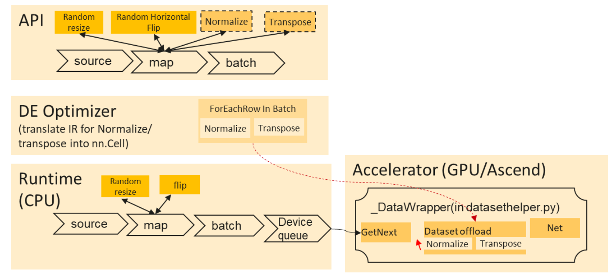

# Enabling Offload for Dataset

`Ascend` `GPU` `CPU` `Data Preparation`

## Overview

The offload feature may speed up data processing by moving dataset operations from dataset pipeline to computation graph, allowing these operations to be run by the hardware accelerator. It will offload only the supported dataset operations at the end of the pipeline to the accelerator. This includes consecutive data augmentation operators which are used in the map data processing operator, granted they come at the end of the dataset pipeline. It can also split individual map data processing operator to allow for more of the individual dataset operations to be offloaded.

The current supported data augmentation operators which can be offloaded are:

| Operator Name |  Operator Path |  Operator Introduction |
|---------- |--------------|-------------|
|  HWC2CHW |  mindspore.dataset.vision.c_transforms.py | Transpose a Numpy image array from shape (H, W, C) to shape (C, H, W) |
|  Normalize |  mindspore.dataset.vision.c_transforms.py |  Normalize the input Numpy image array of shape (H, W, C) with the given mean and standard deviation |
| RandomColorAdjust |  mindspore.dataset.vision.c_transforms.py |  Perform a random brightness, contrast, saturation, and hue adjustment on the input PIL image |
| RandomHorizontalFlip |  mindspore.dataset.vision.c_transforms.py |  Randomly flip the input image horizontally with a given probability  |
| RandomSharpness |   mindspore.dataset.vision.c_transforms.py |  Adjust the sharpness of the input PIL Image by a random degree |
| RandomVerticalFlip |  mindspore.dataset.vision.c_transforms.py |  Randomly flip the input image vertically with a given probability |
| Rescale |   mindspore.dataset.vision.c_transforms.py |  Rescale the input image with the given rescale and shift |
| TypeCast |   mindspore.dataset.transforms.c_transforms.py |  Cast tensor to a given MindSpore data type |

## Offload Process

The following figures show the typical computation process of offload hardware accelerator in the given dataset pipeline.



Offload has two new API changes to let users enable this functionality:

1. A new argument “offload” is added to the map dataset processing operator.

2. A new API “set_auto_offload” is introduced to the dataset config.

To check if the data augmentation operators are offloaded to the accelerator, users can save and check the computation graph IR files which will have the related operator written before the model structure. The offload feature is currently available for both dataset sink mode (dataset_sink_mode=True) and dataset non-sink mode (dataset_sink_mode=False).

## Enabling Offload

There are two options to enable offload.  

### Option 1

Use the global config to set automatic offload. In this case, the offload argument for all map data processing operators will be set to True (see Option 2). However, if the offload argument is given for a specific map operator, it will have priority over the global config option.

```python
import mindspore.dataset as ds
ds.config.set_auto_offload(True)
```

### Option 2

Set the argument offload to True in the map data processing operator (by default it is set to None).  

```python
import mindspore.dataset as ds
import mindspore.dataset.vision.c_transforms as C

dataset = ds.ImageFolder(dir)
image_ops = [C.RandomCropDecodeResize(train_image_size), C.RandomHorizontalFlip(prob=0.5), C.Normalize(mean=mean, std=std), C.HWC2CHW()]
dataset = dataset.map(operations=type_cast_op, input_columns= "label")
dataset = dataset.map(operations=image_ops , input_columns="image", offload=True)
```

## Constraints

The offload hardware accelerator feature is still in development phase. The current usage is limited under the following constraints:

1. Offload feature does not support concatenated or zipped datasets currently.  

2. The map operation(s) you wish to offload must be the last map operations in the pipeline. This includes map operations done to other dataset columns, for instance, `dataset = dataset.map(operations=type_cast_op, input_columns= "label")` must come before `dataset = dataset.map(operations=image_ops , input_columns="image", offload=True)`.

3. Offload feature does not support map operations with a user specified `output_columns`.
