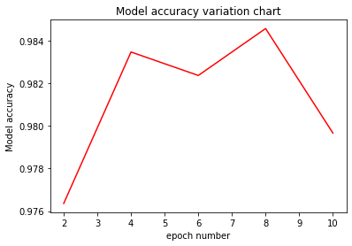

# Evaluating the Model during Training

`Ascend` `GPU` `CPU` `Model Running`

<a href="https://gitee.com/mindspore/docs/blob/master/docs/mindspore/programming_guide/source_en/evaluate_the_model_during_training.md" target="_blank"></a>

## Overview

For a complex network, epoch training usually needs to be performed for dozens or even hundreds of times. Before training, it is difficult to know when a model can achieve required accuracy in epoch training. Therefore, the accuracy of the model is usually validated at a fixed epoch interval during training and the corresponding model is saved. After the training is completed, you can quickly select the optimal model by viewing the change of the corresponding model accuracy. This section uses this method and takes the LeNet network as an example.

The procedure is as follows:

1. Define the callback function EvalCallBack to implement synchronous training and validation.
2. Define a training network and execute it.
3. Draw a line chart based on the model accuracy under different epochs and select the optimal model.

Source code address of this example: <https://gitee.com/mindspore/docs/blob/master/docs/sample_code/evaluate_the_model_during_training/evaluate_the_model_during_training.py>.

## Defining the Callback Function EvalCallBack

Implementation idea: The model accuracy is validated every n epochs. The model accuracy needs to be implemented in the custom callback function. For details about the usage, see [API Description](https://www.mindspore.cn/docs/api/en/master/api_python/mindspore.train.html#mindspore.train.callback.Callback).

Core implementation: Validation points are set in `epoch_end` of the callback function as follows:

`cur_epoch % eval_per_epoch == 0`: indicates that the model accuracy is validated every `eval_per_epoch` epoch.

- `cur_epoch`: indicates `epoch` value in the current training process.
- `eval_per_epoch`: indicates user-defined value, that is, the validation frequency.

Other parameters are described as follows:

- `model`: indicates the `Model` class in MindSpore.
- `eval_dataset`: indicates the validation dataset.
- `epoch_per_eval`: records the accuracy of the validation model and the corresponding number of epochs. The data format is `{"epoch": [], "acc": []}`.

```python
from mindspore.train.callback import Callback

class EvalCallBack(Callback):
    def __init__(self, model, eval_dataset, eval_per_epoch, epoch_per_eval):
        self.model = model
        self.eval_dataset = eval_dataset
        self.eval_per_epoch = eval_per_epoch
        self.epoch_per_eval = epoch_per_eval

    def epoch_end(self, run_context):
        cb_param = run_context.original_args()
        cur_epoch = cb_param.cur_epoch_num
        if cur_epoch % self.eval_per_epoch == 0:
            acc = self.model.eval(self.eval_dataset, dataset_sink_mode=False)
            self.epoch_per_eval["epoch"].append(cur_epoch)
            self.epoch_per_eval["acc"].append(acc["Accuracy"])
            print(acc)

```

## Defining and Executing the Training Network

In the `CheckpointConfig` parameter for saving the model, you need to calculate the number of steps in a single epoch, then set the `checkpointconfig` file according to the number of required steps to save the model weight parameter `ckpt` file. In this example, each epoch has 1875 steps. Based on the principle of validating once every two epochs, set `save_checkpoint_steps=eval_per_epoch*1875`. The variable `eval_per_epoch` is equal to 2.

The parameters are described as follows:

- `config_ck`: configures the information for saving the model.
    - `save_checkpoint_steps`: indicates the number of steps for saving the weight parameter `ckpt` file of the model.
    - `keep_checkpoint_max`: indicates the maximum number of model's weight parameter that can be saved.
- `ckpoint_cb`: configures the prefix information of the name and path for saving the model.
- `model`: indicates the `Model` class in MindSpore.
- `model.train`: indicates the `Model` class training function.
- `epoch_per_eval`: defines the number for collecting `epoch` and the dictionary of corresponding model accuracy information.
- `train_data`: indicates the training dataset.
- `eval_data`: indicates the validation dataset.

```python
from mindspore.train.callback import ModelCheckpoint, CheckpointConfig, LossMonitor
from mindspore import context, Model
from mindspore.nn import Accuracy

if __name__ == "__main__":
    context.set_context(mode=context.GRAPH_MODE, device_target="GPU")
    ckpt_save_dir = "./lenet_ckpt"
    eval_per_epoch = 2
    epoch_size =10

    ... ...

    # need to calculate how many steps are in each epoch, in this example, 1875 steps per epoch.
    config_ck = CheckpointConfig(save_checkpoint_steps=eval_per_epoch*1875, keep_checkpoint_max=15)
    ckpoint_cb = ModelCheckpoint(prefix="checkpoint_lenet",directory=ckpt_save_dir, config=config_ck)
    model = Model(network, net_loss, net_opt, metrics={"Accuracy": Accuracy()})

    epoch_per_eval = {"epoch": [], "acc": []}
    eval_cb = EvalCallBack(model, eval_data, eval_per_epoch, epoch_per_eval)

    model.train(epoch_size, train_data, callbacks=[ckpoint_cb, LossMonitor(375), eval_cb],
                dataset_sink_mode=False)
```

The output is as follows:

```text
epoch: 1 step: 375, loss is 2.298612
epoch: 1 step: 750, loss is 2.075152
epoch: 1 step: 1125, loss is 0.39205977
epoch: 1 step: 1500, loss is 0.12368304
epoch: 1 step: 1875, loss is 0.20988345
epoch: 2 step: 375, loss is 0.20582482
epoch: 2 step: 750, loss is 0.029070046
epoch: 2 step: 1125, loss is 0.041760832
epoch: 2 step: 1500, loss is 0.067035824
epoch: 2 step: 1875, loss is 0.0050643035
{'Accuracy': 0.9763621794871795}

... ...

epoch: 9 step: 375, loss is 0.021227183
epoch: 9 step: 750, loss is 0.005586236
epoch: 9 step: 1125, loss is 0.029125651
epoch: 9 step: 1500, loss is 0.00045874066
epoch: 9 step: 1875, loss is 0.023556218
epoch: 10 step: 375, loss is 0.0005807788
epoch: 10 step: 750, loss is 0.02574059
epoch: 10 step: 1125, loss is 0.108463734
epoch: 10 step: 1500, loss is 0.01950589
epoch: 10 step: 1875, loss is 0.10563098
{'Accuracy': 0.979667467948718}
```

Find the `lenet_ckpt` folder in the same directory. The folder contains five models and data related to a calculation graph. The structure is as follows:

```text
lenet_ckpt
├── checkpoint_lenet-10_1875.ckpt
├── checkpoint_lenet-2_1875.ckpt
├── checkpoint_lenet-4_1875.ckpt
├── checkpoint_lenet-6_1875.ckpt
├── checkpoint_lenet-8_1875.ckpt
└── checkpoint_lenet-graph.meta
```

## Defining the Function to Obtain the Model Accuracy in Different Epochs

Define the drawing function `eval_show`, load `epoch_per_eval` to `eval_show`, and draw the model accuracy variation chart based on different `epoch`.

```python
import matplotlib.pyplot as plt

def eval_show(epoch_per_eval):
    plt.xlabel("epoch number")
    plt.ylabel("Model accuracy")
    plt.title("Model accuracy variation chart")
    plt.plot(epoch_per_eval["epoch"], epoch_per_eval["acc"], "red")
    plt.show()

eval_show(epoch_per_eval)
```

The output is as follows:



You can easily select the optimal model weight parameter `ckpt` file based on the preceding figure.

## Summary

The MNIST dataset is used for training through the convolutional neural network LeNet5. This section describes how to validate a model during training, save the model weight parameter `ckpt` file corresponding to the `epoch`, and select the optimal model.
