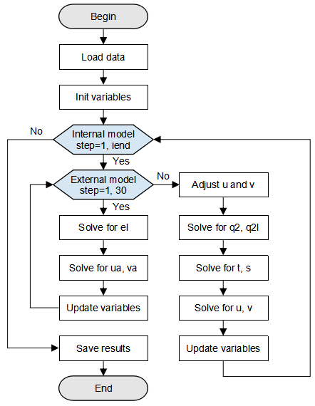

# Implementing Regional Ocean Model GOMO

`GPU` `High Performance Computing` `Whole Process`

<a href="https://gitee.com/mindspore/docs/blob/master/docs/mindspore/programming_guide/source_en/hpc_gomo.md" target="_blank"></a>&nbsp;&nbsp;

## Overview

Generalized Operator Modelling of the Ocean (GOMO) is a 3D regional ocean model based on OpenArray. It is a universal model developed by Huang Xiaomeng from Tsinghua University for ocean modeling and parallel computing ([Xiaomeng Huang et al, 2019](https://gmd.copernicus.org/articles/12/4729/2019/gmd-12-4729-2019.pdf)). The basic equations and algorithms in the GOMO model are derived from the POM2k model ([Blumberg and Mellor, 1987](http://www.sciepub.com/portal/downloads?doi=10.12691/ajmo-2-2-2&filename=ajmo-2-2-2.pdf)). The 3D ocean model plays an important role in the earth system modeling. Following the law of conservation of mass, the model simulates phenomena such as ocean currents and whirlpools to display the distribution of sea surface temperature and sea surface height and predict typhoons, tsunami and other phenomena in real time. Traditional ocean models have complex code implementation and run on CPUs. However, the GOMO model has its framework accelerated by MindSpore and runs on a GPU, which greatly improves the model performance.

The following describes how to use MindSpore to build and run the 3D ocean model GOMO on GPU.
> Download address of the complete sample code:
<https://gitee.com/mindspore/models/tree/master/research/hpc/ocean_model>.

The directory structure of the sample code is as follows:

```text
└── ocean_model
    ├── README.md                                  # descriptions about ocean model GOMO
    ├── scripts
    │    ├── run_distribute_train.sh               # launch distributed training for GPU
    ├──src
    │    ├── GOMO.py                               # GOMO model
    │    ├── Grid.py                               # grid initial
    │    ├── stencil.py                            # averaging and differential stencil oprator
    │    ├── op_operator.py                        # averaging and differential kernel operator
    │    ├── read_var.py                           # read variables from nc file
    ├── train.py                                   # train script
```

The overall execution process is as follows:

1. Prepare a seamount file as the ocean simulation dataset, and load and process the data.
2. Define GOMO variable initialization.
3. Define the GOMO model.
4. Load the dataset and perform training. After the training is complete, view the result and save the file.

## Preparations

### Installing Software Dependencies

1. Install MindSpore.

    Before the practice, ensure that MindSpore has been properly installed. If not, install MindSpore by following the [Installation Guide](https://www.mindspore.cn/install/en).

2. Install netCDF4.

    ```bash
    pip install netCDF4
    ```

### Preparing Data

Prepare a seamount file in netCDF format. The seamount problem proposed by Beckmann and Haidvogel is a widely used ideal test case for regional ocean models ([Beckmann and Haidvogel, 1993](https://journals.ametsoc.org/view/journals/phoc/23/8/1520-0485_1993_023_1736_nsofaa_2_0_co_2.xml?tab_body=fulltext-display)). Download the [seamount file](https://github.com/hxmhuang/GOMO/tree/master/bin/data).

## Loading Data

Load the seamount data file and read the initial variable values from the file script. The data type in the seamount file is float64, which needs to be converted into float32 for MindSpore computation. The script for loading and processing data is in the `src/read_var.py` script of the source code.

```python
import numpy as np
import netCDF4 as nc

# variable name list
params_name = ['z', 'zz', 'dz', 'dzz', 'dx', 'dy', 'cor', 'h', 'fsm', 'dum', 'dvm', 'art', 'aru', 'arv', 'rfe', 'rfw',
               'rfn', 'rfs', 'east_e', 'north_e', 'east_c', 'north_c', 'east_u', 'north_u', 'east_v', 'north_v', 'tb',
               'sb', 'tclim', 'sclim', 'rot', 'vfluxf', 'wusurf', 'wvsurf', 'e_atmos', 'ub', 'vb', 'uab', 'vab', 'elb',
               'etb', 'dt', 'uabw', 'uabe', 'vabs', 'vabn', 'els', 'eln', 'ele', 'elw', 'ssurf', 'tsurf', 'tbe', 'sbe',
               'sbw', 'tbw', 'tbn', 'tbs', 'sbn', 'sbs', 'wtsurf', 'swrad']

def load_var(file_obj, name):
    """load variable from nc data file"""
    data = file_obj.variables[name]
    data = data[:]
    data = np.float32(np.transpose(data, (2, 1, 0)))
    return data

def read_nc(file_path):
    """ put the load variable into the dict """
    variable = {}
    file_obj = nc.Dataset(file_path)
    for name in params_name:
        variable[name] = load_var(file_obj, name)
    return variable
```

## Defining GOMO Grid

A GOMO model deduces differential equations and boundary conditions based on momentum, energy, and law of conservation of mass, and determines seven equations to be solved. For details about formula derivation, see [this paper](https://gmd.copernicus.org/articles/12/4729/2019/gmd-12-4729-2019.pdf). Figure 1 shows an overall GOMO execution flowchart.

First, data is loaded from the seamount data for initializing model variables. After the initial value and model parameters are loaded, the computation is divided into two parts: internal mode and external mode. In external mode, the 2D sea surface elevation `el` and column-averaged velocity (ua, va) are mainly computed. In internal mode, the number of loops `iend` indicates the total number of time steps during training (set by users). The 3D array computations predominate in order to compute the turbulence kinetic energy `q2` and the turbulence length `q2l` that generates the turbulence kinetic energy, temperature `t` and salinity `s`, as well as the velocity fields `u` and `v` in the x and y directions. After the computation is complete, save the required variable result and end the training.



*Figure 1: GOMO model flowchart*

### Initializing Variables

```python
...
from src.GOMO import GOMO_init
...
if __name__ == "__main__":
    ...
    # define grid and init variable update
    net_init = GOMO_init(im, jm, kb, stencil_width)
    ...
```

### Defining GOMO Model

```python
def construct(self, etf, ua, uab, va, vab, el, elb, d, u, v, w, kq, km, kh, q2, q2l, tb, t, sb, s,
              rho, wubot, wvbot, ub, vb, egb, etb, dt, dhb, utb, vtb, vfluxb, et):
    """construct"""
    x_d, y_d, z_d = self.x_d, self.y_d, self.z_d
    q2b, q2lb = self.q2b, self.q2lb
    dx, dy = self.dx, self.dy
    # surface forcing
    w = w * (1 - self.z_h) + self.z_h * self.vfluxf
    # lateral_viscosity
    advx, advy, drhox, drhoy, aam = self.lateral_viscosity(dx, dy, u, v, dt, self.aam, ub, vb, x_d, y_d, z_d, rho, self.rmean)
    # mode_interaction
    adx2d, ady2d, drx2d, dry2d, aam2d, advua, advva, egf, utf, vtf = self.mode_interaction(advx, advy, drhox, drhoy, aam, x_d, y_d, d, uab, vab, ua, va, el)
    # ===========external model===========
    vamax = 0
    elf = 0
    for iext in range(1, 31):
        # external_el
        elf = self.external_el(x_d, y_d, d, ua, va, elb)
        # external_ua
        advua, uaf = self.external_ua(iext, x_d, y_d, elf, d, ua, va, uab, vab, el, elb, advua, aam2d, adx2d, drx2d, wubot)
        # external_va
        advva, vaf = self.external_va(iext, x_d, y_d, elf, d, ua, va, uab, vab, el, elb, advva, aam2d, ady2d, dry2d, wvbot)
        # external_update
        etf, uab, ua, vab, va, elb, el, d, egf, utf, vtf, vamax = self.external_update(iext, etf, ua, uab, va, vab, el, elb, elf, uaf, vaf, egf, utf, vtf, d)
    # ===========internal model===========
    if self.global_step != 0:
        # adjust_uv
        u, v = self.adjust_uv(u, v, utb, vtb, utf, vtf, dt)
        # internal_w
        w = self.internal_w(x_d, y_d, dt, u, v, etf, etb, vfluxb)
        # internal_q
        dhf, a, c, gg, ee, kq, km, kh, q2b_, q2, q2lb_, q2l = self.internal_q(x_d, y_d, z_d, etf, aam, q2b, q2lb, q2, q2l, kq, km, kh, u, v, w, dt, dhb, rho, wubot, wvbot, t, s)
        q2b = ops.Assign()(self.q2b, q2b_)
        q2lb = ops.Assign()(self.q2lb, q2lb_)
        # internal_t_t
        a, c, ee, gg, tb, t = self.internal_t_(t, tb, self.wtsurf, self.tsurf, self.swrad, self.tclim, self.tbe, self.tbw, self.tbn, self.tbs, x_d, y_d, z_d, dt, u, aam, self.h,  self.dum, v, self.dvm, w, dhf, etf, a, kh, self.dzz, c, self.dzz1, ee, gg, dx, self.dz, dy, self.fsm, dhb)
        # internal_t_s
        a, c, ee, gg, sb, s = self.internal_t_(s, sb, self.wssurf, self.ssurf, self.swrad0, self.sclim, self.sbe, self.sbw, self.sbn, self.sbs, x_d, y_d, z_d, dt, u, aam, self.h, self.dum, v, self.dvm, w, dhf, etf, a, kh, self.dzz, c, self.dzz1, ee, gg, dx, self.dz, dy, self.fsm, dhb)
        # dense
        rho = self.dens(s, t, self.zz, self.h, self.fsm)
        # internal_u
        uf, a, c, gg, ee, wubot = self.internal_u(x_d, z_d, dhf, u, v, w, ub, vb, egf, egb, ee, gg, self.cbc, km, advx, drhox, dt, dhb)
        # internal_v
        vf, a, c, gg, ee, wvbot = self.internal_v(y_d, z_d, dhf, u, v, w, ub, vb, egf, egb, ee, gg, self.cbc, km, advy, drhoy, dt, dhb)
        # adjust_ufvf
        u, v, ub, vb = self.adjust_ufvf(u, v, uf, vf, ub, vb)
    # internal_update
    egb, etb, dt, dhb, utb, vtb, vfluxb, et = self.internal_update(egf, etb, utf, vtf, etf, et)
    steps = ops.AssignAdd()(self.global_step, 1)

    return elf, etf, ua, uab, va, vab, el, elb, d, u, v, w, kq, km, kh, q2, q2l, tb, t, sb, s, rho, wubot, wvbot, \
           ub, vb, egb, etb, dt, dhb, utb, vtb, vfluxb, et, steps, vamax, q2b, q2lb
```

Call the defined GOMO model in the `__main__` function.

```python
...
from src.GOMO import GOMO
...
if __name__ == "__main__":
    ...
   # define GOMO model
    Model = GOMO(im=im, jm=jm, kb=kb, stencil_width=stencil_width, variable=variable, x_d=x_d, y_d=y_d, z_d=z_d,
                 q2b=q2b, q2lb=q2lb, aam=aam, cbc=cbc, rmean=rmean)
    ...
```

## Training Grid

### Running Script

After the training script is defined, call the shell script in the `scripts` directory to start training.
Run the following command to execute the script:

```text
sh run_distribute_train.sh <im> <jm> <kb> <step> <DATASET_PATH>
```

Pass the variables `im`, `jm`, `kb`, `step` and `DATASET_PATH` to the script, where:

- `im`, `jm`, `kb`: resolution of the simulated ocean region, which is related to the used data (the data resolution `im`, `jm` and `kb` given in the example are 65, 49 and 21, respectively).
- `step`: number of time steps during training (corresponding to `iend` in Figure 1).
- `DATASET_PATH`: training data path.

After the training is complete, the variable change values during the training are saved in the `train/outputs` directory. The following four variable values are saved every five time steps: east wind velocity (unit: m/s), north wind velocity (unit: m/s), position temperature (unit: K), and sea surface elevation (unit: m).

```text
└─outputs
    ├─u_5.npy
    ├─v_5.npy
    ├─t_5.npy
    ├─et_5.npy
    ├─u_10.npy
    ├─v_10.npy
    ├─t_10.npy
    ├─et_10.npy

```

In the preceding information:
`*.npy`: saved variables. File name format: *Variable name*_*Step count*.npy.

## References

1. Huang X, Huang X, Wang D, et al. OpenArray v1. 0: a simple operator library for the decoupling of ocean modeling and parallel computing[J]. Geoscientific Model Development, 2019, 12(11).
2. Blumberg A F, Mellor G L. A description of a three‐dimensional coastal ocean circulation model[J]. Three‐dimensional coastal ocean models, 1987, 4: 1-16.
3. Beckmann A, Haidvogel D B. Numerical simulation of flow around a tall isolated seamount. Part I: Problem formulation and model accuracy[J]. Journal of Physical Oceanography, 1993, 23(8): 1736-1753.
