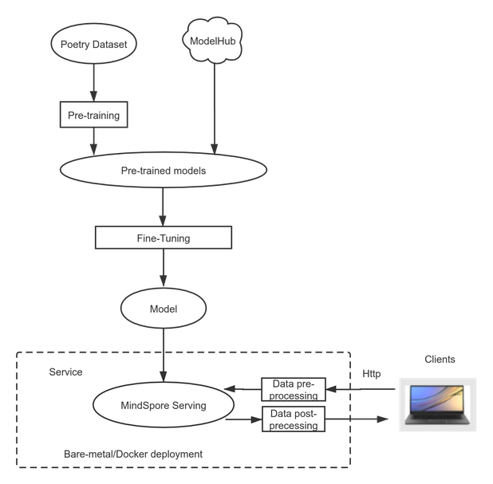
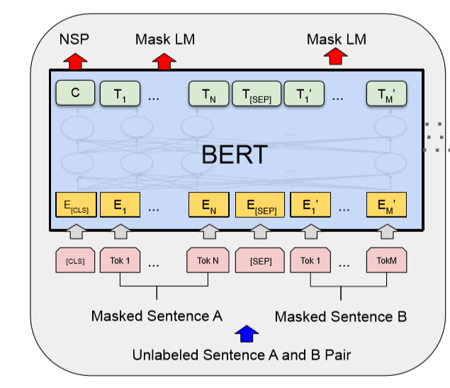

# Using the BERT Network to Implement Intelligent Poem Writing

`Linux` `Ascend` `Model Training` `Inference Application` `Expert`

<!-- TOC -->

- [Using the BERT Network to Implement Intelligent Poem Writing](#using-the-bert-network-to-implement-intelligent-poem-writing)
    - [Case Overview](#case-overview)
    - [Model Description](#model-description)
    - [Model Training](#model-training)
        - [Pre-training](#pre-training)
        - [Fine-tuning](#fine-tuning)
        - [Modifying a Model](#modifying-a-model)
    - [Sample Code](#sample-code)
    - [Implementation Procedure](#implementation-procedure)
        - [Basic Information](#basic-information)
        - [Data Preparation](#data-preparation)
        - [Training](#training)
        - [Inference Validation](#inference-validation)
    - [References](#references)

<!-- /TOC -->
<a href="https://gitee.com/mindspore/docs/blob/r1.5/docs/mindspore/programming_guide/source_en/nlp_bert_poetry.md" target="_blank"></a>

Poetry is an indispensable part of the five-millennium-old Chinese culture. When appreciating poetry, you can perceive the pure and vast world with ultimate sensibility and reduce stress and anxiety brought by the fast-paced world. As we know, one has to practice a skill a lot to become good at it. Today, let's see how the science-backed MindSpore trains a model to show its sense of arts!

## Case Overview

Use MindSpore to train an intelligent poem writing model and deploy the prediction service. The following flowchart shows the process:



Figure 1: Case flowchart

The following skips the process of pre-training BERT and directly describes the process of fine-tuning a pre-trained BERT-base model of MindSpore.

## Model Description

NLP-related networks are required to deal with poems. BERT, as a milestone model in the NLP domain, greatly promotes the development of the NLP community. The BERT model is proposed by Google and uses the Encoder structure in Transformer. It stacks multiple layers of Encoders and uses the attention mechanism to achieve the state of the art (SOTA) effect in multiple general language understanding evaluation (GLUE) tasks.

This attention mechanism is different from the RNN structure and can be used for high-level parallel computing. In this way, the computing power of the Ascend 910 AI Processor can be fully utilized to achieve optimal performance.

## Model Training

There are two steps: pre-training and fine-tuning. Pre-training is first performed on a large amount of unlabeled data. It is expected that the model can master a common human language semantic mechanism through this process. Then, in the fine-tuning phase, training is performed on labeled data in a specific segmented domain to complete a specific task.

### Pre-training

Pre-training is self-coding training performed on unlabeled data. Therefore, the design of training tasks is especially important. Pre-training in BERT includes two tasks: masked language model (MLM) and next sentence prediction (NSP).

- The **MLM task** randomly replaces some tokens with the [MASK] labels during input, and then predicts the original tokens based on the context through the attention mechanism.

- The input of a BERT model is two sentences: A and B. When data is built, positions of A and B are randomly exchanged at a 50% probability. The **NSP task** is used to predict whether A and B are originally connected.

Since the MLM task does not exist in the actual task, a pre-training NSP task that better matches the actual task type is added based on the MLM task.

In the preceding description, the pre-training process does not require a task data label. Such an MLM training task is essentially a denoising self-coding model. Therefore, BERT may perform pre-training by using massive unlabeled data. Through tasks set in the pre-training stage, BERT can learn basic semantic logic from unlabeled data and then complete specific task training in cooperation with the fine-tuning process.

The following figure shows the BERT model structure. If you enter two sentences in a Chinese model, each token corresponds to a Chinese character. [CLS] and [SEP] are inserted special tokens.



Figure 2: BERT model structure [1]

### Fine-tuning

Fine-tuning is used to add a layer of adaptation task to the end of the pre-trained BERT model and then perform a small amount of training on labeled data.

Fine-tuning modes are classified into two types: end-to-end fine-tuning and feature-based approach. The difference between the two modes lies in whether to modify parameters in the pre-trained BERT model at the fine-tuning stage. In most cases, end-to-end fine-tuning is used.

### Modifying a Model

BERT uses the Encoder structure. `attention_mask` is an all-ones vector. That is, each token can view tokens before and after it. This helps each token learn the entire sentence information and enhance the semantic understanding capability, therefore, BERT is not a generative model.

In the statement generation task, when the next token is generated, only the information about the previous token can be viewed. You need to change `attention_mask` to the lower triangular matrix so that the current token can view only the information about itself and the previous token.

The data used for fine-tuning is more than 40,000 poems without labels. The output of each token must be close to the output of the next labeled token, and the cross entropy is used as the loss function.


Figure 3 Training process

## Sample Code

Download the [sample code](https://mindspore-website.obs.cn-north-4.myhuaweicloud.com:443/DemoCode/bert_poetry_c.rar) and run the sample code to view the poem writing effect. The code structure is as follows:

```text
└─bert_poetry
  ├── src
    ├── bert_for_pre_training.py           # Encapsulating BERT-base forward and backward network class
    ├── bert_model.py                      # Defining the BERT forward network structure
    ├── finetune_config.py                 # Fine-tuning configuration file
    ├── fused_layer_norm.py                # Defining fused_layer_norm
    ├── __init__.py                        # __init__
    ├── utils.py                           # Defining the fine-tuning forward network structure
    ├── poetry_utils.py                    # Tokenizer
    └── poetry_dataset.py                  # Parsing poetry.txt and generating the required dataset
  ├── vocab.txt                            # Vocabulary
  ├── generator.py                         # Function used for generating poems during inference
  ├── poetry.py                            # Training, inference, and export functions

```

## Implementation Procedure

### Basic Information

Perform training and inference on the Ascend 910 AI Processor using MindSpore 0.7.0-beta.

### Data Preparation

A dataset containing [43030 poems](https://github.com/AaronJny/DeepLearningExamples/tree/master/keras-bert-poetry-generator): `poetry.txt`.

Pre-trained checkpoints of a BERT-base model: [Download from MindSpore](https://www.mindspore.cn/resources/hub/details/en?MindSpore/ascend/1.0/bert_base_v1.0_cn-wiki).

### Training

Modify the `pre_training_ckpt` path in `src/finetune_config.py`, load pre-trained checkpoints, set `batch_size` to bs, and set `dataset_path` to the path for storing poems. `BertConfig` is set to the base model by default.

```text
'dataset_path': '/your/path/to/poetry.txt',
'batch_size': bs,
'pre_training_ckpt': '/your/path/to/pre_training_ckpt',
```

Run the training command.

```bash
python poetry.py
```

### Inference Validation

Modify the `test_eval` function in `poetry.py` to randomly generate a poem, continue to complete a poem, or generate an acrostic poem.

The `generate_random_poetry` function is used to randomly generate and continue to complete a poem. If the input parameter `s` is empty, a poem is randomly generated. If the input parameter `s` is not empty, the poem writing continues based on the input value.

```python
    output = generate_random_poetry(poetrymodel, s='')         #随机生成
    output = generate_random_poetry(poetrymodel, s='天下为公')  #续写诗句
```

The `generate_hidden` function is used to generate an acrostic poem. The value of the input parameter `head` is the first word in each line of a poem.

```python
    output = generate_hidden(poetrymodel, head="人工智能")  #藏头诗
```

Run the inference command.

```bash
python poetry.py --train=False  --ckpt_path=/your/ckpt/path
```

By default, a randomly generated poem, a poem completed based on the input value, and an acrostic poem are generated in the script. The output poems are as follows:

A randomly generated poem:

```text
大堤柳暗，
春深树根。
东望一望，
断回还家。
山色渐风雨，
东风多雨禾。
无情与去，
万里所思。
```

A poem completed based on the input value:

```text
天下为公少，
唯君北向西。
远山无路见，
长水见人偏。
一路巴猿啸，
千峰楚客啼。
幽深有诗策，
无以话年华。
```

An acrostic poem:

```text
人君离别难堪望，
工部张机自少年。
智士不知身没处，
能令圣德属何年。
```

## References

[1] [BERT:Pre-training of Deep Bidirectional Transformers for Language Understanding](https://arxiv.org/abs/1810.04805)

[2] [https://github.com/AaronJny/DeepLearningExamples/](https://github.com/AaronJny/DeepLearningExamples/)

[3] [https://github.com/bojone/bert4keras](https://github.com/bojone/bert4keras)
