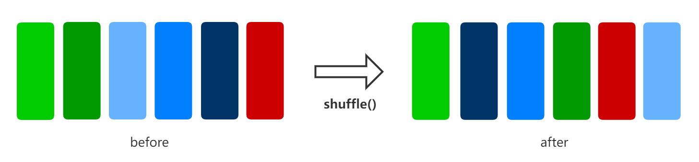
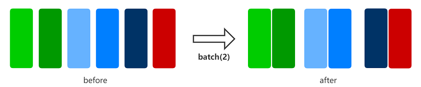
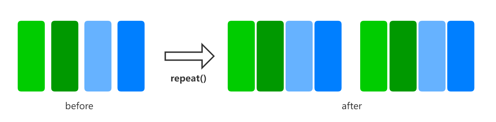
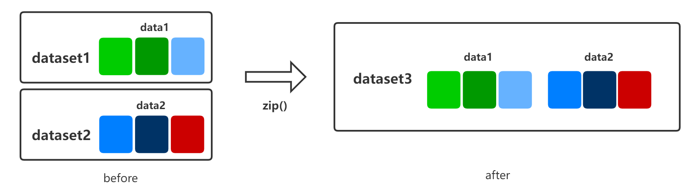
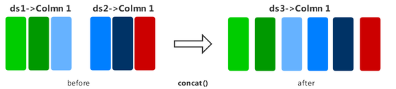

# General Data Processing

`Ascend` `GPU` `CPU` `Data Preparation`

<a href="https://gitee.com/mindspore/docs/blob/master/docs/mindspore/programming_guide/source_en/pipeline_common.md" target="_blank"></a>

## Overview

Data is the basis of deep learning. Good data input can play a positive role in the entire deep neural network training. Before training, data processing is performed on a loaded dataset for resolving problems such as an excessively large data volume and uneven sample distribution, thereby obtaining a more optimized data input.

Each dataset class of MindSpore provides multiple data processing operators. You can build a data processing pipeline to define the data processing operations to be used. In this way, data can be continuously transferred to the training system through the data processing pipeline during the training process.

The following table lists part of the common data processing operators supported by MindSpore. For more data processing operations, see [MindSpore API](https://www.mindspore.cn/docs/api/en/master/api_python/mindspore.dataset.html).

| Data Processing Operator | Description |
| ----  | ----           |
| shuffle | Randomly shuffles datasets. |
| map | Provides customized functions or operators for specified column data in a dataset. |
| batch | Divides datasets into batches to reduce the number of training steps and accelerate the training process. |
| repeat | Repeats a dataset to expand the data volume. |
| zip | Zips two datasets into one vertically. |
| concat | Concatenates two datasets into one horizontally. |

## Data Processing Operators

### shuffle

Randomly shuffles datasets.

> The larger the value of `buffer_size`, the higher the shuffle degree, but the more time and computing resources are consumed.



The following example builds a random dataset, then shuffles it, and finally shows the shuffled data result.

```python
import numpy as np
import mindspore.dataset as ds

ds.config.set_seed(0)

def generator_func():
    for i in range(5):
        yield (np.array([i, i+1, i+2]),)

dataset1 = ds.GeneratorDataset(generator_func, ["data"])

dataset1 = dataset1.shuffle(buffer_size=2)
for data in dataset1.create_dict_iterator():
    print(data)
```

The output is as follows:

```text
{'data': Tensor(shape=[3], dtype=Int64, value= [0, 1, 2])}
{'data': Tensor(shape=[3], dtype=Int64, value= [2, 3, 4])}
{'data': Tensor(shape=[3], dtype=Int64, value= [3, 4, 5])}
{'data': Tensor(shape=[3], dtype=Int64, value= [1, 2, 3])}
{'data': Tensor(shape=[3], dtype=Int64, value= [4, 5, 6])}
```

### map

Applies a specified function or operator to specified columns in a dataset to implement data mapping. You can customize the mapping function or use operators in `c_transforms` or `py_transforms` to augment image and text data.

> For details about how to use data augmentation, see [Image Data Processing and Enhancement](https://www.mindspore.cn/docs/programming_guide/en/master/augmentation.html) in the Programming Guide.


The following example builds a random dataset, defines a mapping function for data augmentation, applies the function to the dataset, and compares the data results before and after the mapping.

```python
import numpy as np
import mindspore.dataset as ds

def generator_func():
    for i in range(5):
        yield (np.array([i, i+1, i+2]),)

def pyfunc(x):
    return x*2

dataset = ds.GeneratorDataset(generator_func, ["data"])

for data in dataset.create_dict_iterator():
    print(data)

print("------ after processing ------")

dataset = dataset.map(operations=pyfunc, input_columns=["data"])

for data in dataset.create_dict_iterator():
    print(data)
```

The output is as follows:

```text
{'data': Tensor(shape=[3], dtype=Int64, value= [0, 1, 2])}
{'data': Tensor(shape=[3], dtype=Int64, value= [1, 2, 3])}
{'data': Tensor(shape=[3], dtype=Int64, value= [2, 3, 4])}
{'data': Tensor(shape=[3], dtype=Int64, value= [3, 4, 5])}
{'data': Tensor(shape=[3], dtype=Int64, value= [4, 5, 6])}
------ after processing ------
{'data': Tensor(shape=[3], dtype=Int64, value= [0, 2, 4])}
{'data': Tensor(shape=[3], dtype=Int64, value= [2, 4, 6])}
{'data': Tensor(shape=[3], dtype=Int64, value= [4, 6, 8])}
{'data': Tensor(shape=[3], dtype=Int64, value= [ 6,  8, 10])}
{'data': Tensor(shape=[3], dtype=Int64, value= [ 8, 10, 12])}
```

### batch

Divides datasets into batches in the training system to reduce the number of training steps and accelerate the training process.



The following example builds a random dataset, and then displays the batching results of the datasets that retain and do not retain redundant data. The batch size is 2.

```python
import numpy as np
import mindspore.dataset as ds

def generator_func():
    for i in range(5):
        yield (np.array([i, i+1, i+2]),)

dataset1 = ds.GeneratorDataset(generator_func, ["data"])

dataset1 = dataset1.batch(batch_size=2, drop_remainder=False)
for data in dataset1.create_dict_iterator():
    print(data)

print("------ drop remainder ------")

dataset2 = ds.GeneratorDataset(generator_func, ["data"])

dataset2 = dataset2.batch(batch_size=2, drop_remainder=True)
for data in dataset2.create_dict_iterator():
    print(data)
```

The output is as follows:

```text
{'data': Tensor(shape=[2, 3], dtype=Int64, value=
[[0, 1, 2],
 [1, 2, 3]])}
{'data': Tensor(shape=[2, 3], dtype=Int64, value=
[[2, 3, 4],
 [3, 4, 5]])}
{'data': Tensor(shape=[1, 3], dtype=Int64, value=
[[4, 5, 6]])}
------ drop remainder ------
{'data': Tensor(shape=[2, 3], dtype=Int64, value=
[[0, 1, 2],
 [1, 2, 3]])}
{'data': Tensor(shape=[2, 3], dtype=Int64, value=
[[2, 3, 4],
 [3, 4, 5]])}
```

### repeat

Repeats a dataset to expand the data volume.

> The operation sequence of `repeat` and `batch` affects the number of training batches. You are advised to place `repeat` after `batch`.



The following example builds a random dataset, repeats it twice, and finally shows the data result after repetition.

```python
import numpy as np
import mindspore.dataset as ds

def generator_func():
    for i in range(5):
        yield (np.array([i, i+1, i+2]),)

dataset1 = ds.GeneratorDataset(generator_func, ["data"])

dataset1 = dataset1.repeat(count=2)
for data in dataset1.create_dict_iterator():
    print(data)
```

The output is as follows:

```text
{'data': Tensor(shape=[3], dtype=Int64, value= [0, 1, 2])}
{'data': Tensor(shape=[3], dtype=Int64, value= [1, 2, 3])}
{'data': Tensor(shape=[3], dtype=Int64, value= [2, 3, 4])}
{'data': Tensor(shape=[3], dtype=Int64, value= [3, 4, 5])}
{'data': Tensor(shape=[3], dtype=Int64, value= [4, 5, 6])}
{'data': Tensor(shape=[3], dtype=Int64, value= [0, 1, 2])}
{'data': Tensor(shape=[3], dtype=Int64, value= [1, 2, 3])}
{'data': Tensor(shape=[3], dtype=Int64, value= [2, 3, 4])}
{'data': Tensor(shape=[3], dtype=Int64, value= [3, 4, 5])}
{'data': Tensor(shape=[3], dtype=Int64, value= [4, 5, 6])}
```

### zip

Zips two datasets into one vertically.

> If the column names in the two datasets are the same, the two datasets will not be zipped. Therefore, ensure that the column name is unique.<br>If the number of rows in the two datasets is different, the number of rows after zipping is the same as the smaller number of rows.

  

The following example builds two random datasets with different samples, zips columns, and displays the data result after zipping.

```python
import numpy as np
import mindspore.dataset as ds

def generator_func():
    for i in range(7):
        yield (np.array([i, i+1, i+2]),)

def generator_func2():
    for _ in range(4):
        yield (np.array([1, 2]),)

dataset1 = ds.GeneratorDataset(generator_func, ["data1"])
dataset2 = ds.GeneratorDataset(generator_func2, ["data2"])

dataset3 = ds.zip((dataset1, dataset2))

for data in dataset3.create_dict_iterator():
    print(data)
```

The output is as follows:

```text
{'data1': Tensor(shape=[3], dtype=Int64, value= [0, 1, 2]), 'data2': Tensor(shape=[2], dtype=Int64, value= [1, 2])}
{'data1': Tensor(shape=[3], dtype=Int64, value= [1, 2, 3]), 'data2': Tensor(shape=[2], dtype=Int64, value= [1, 2])}
{'data1': Tensor(shape=[3], dtype=Int64, value= [2, 3, 4]), 'data2': Tensor(shape=[2], dtype=Int64, value= [1, 2])}
{'data1': Tensor(shape=[3], dtype=Int64, value= [3, 4, 5]), 'data2': Tensor(shape=[2], dtype=Int64, value= [1, 2])}
```

### concat

Concatenates two datasets into one horizontally.

> Enter the column name in the dataset. The column data type and column data sequence must be the same.



The following example builds two random datasets, concatenates them by row, and displays the concatenated data result. Note that the same effect can be achieved by using the `+` operator.

```python
import numpy as np
import mindspore.dataset as ds

def generator_func():
    for _ in range(2):
        yield (np.array([0, 0, 0]),)

def generator_func2():
    for _ in range(2):
        yield (np.array([1, 2, 3]),)

dataset1 = ds.GeneratorDataset(generator_func, ["data1"])
dataset2 = ds.GeneratorDataset(generator_func2, ["data1"])

dataset3 = dataset1.concat(dataset2)

for data in dataset3.create_dict_iterator():
    print(data)
```

The output is as follows:

```text
{'data1': Tensor(shape=[3], dtype=Int64, value= [0, 0, 0])}
{'data1': Tensor(shape=[3], dtype=Int64, value= [0, 0, 0])}
{'data1': Tensor(shape=[3], dtype=Int64, value= [1, 2, 3])}
{'data1': Tensor(shape=[3], dtype=Int64, value= [1, 2, 3])}
```
