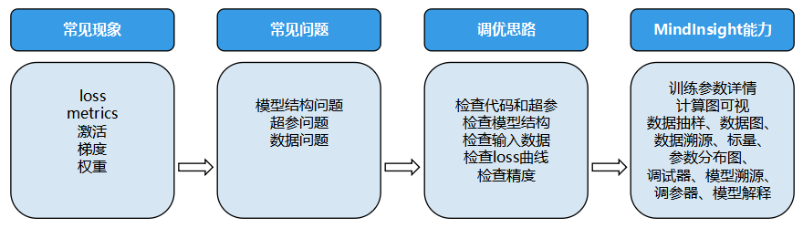
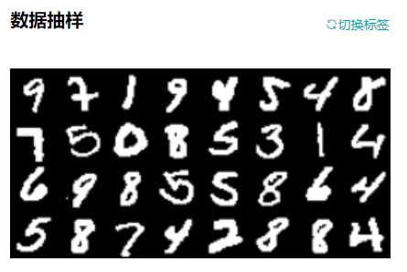

# 精度调优思路和方法

<a href="https://gitee.com/mindspore/docs/blob/r1.3/docs/mindspore/programming_guide/source_zh_cn/accuracy_optimization.md" target="_blank"></a>

模型训练的最终结果是为了得到一个精度达标的模型，而在AI训练过程中有时会遇到loss（模型损失值）无法下降，或者发散，metrics（模型度量指标）达不到预期等，造成无法得到一个理想精度的模型，这时候需要去进行分析训练过程中出现了什么样的问题，针对性地采用包括调整数据、调整超参、重构模型结构等方法，去解决模型精度调优过程中遇到的各种问题。

本文介绍MindSpore团队总结的精度调优的方法，及解决精度调优过程中问题的分析思路，并且将MindSpore中用于精度调优的工具做分类介绍。

## 常见精度问题分析

在精度调优实践中，发现异常现象是比较容易的。但是，如果我们对异常现象不够敏感、不会解释，还是会同问题根因失之交臂。下面对常见精度问题进行了解释，能够提高你对异常现象的敏感度，帮你更快定位精度问题。

### 精度问题的常见现象和原因

模型精度问题和一般的软件问题不同，定位周期一般也更长。在通常的程序中，程序输出和预期不符意味着存在bug（编码错误）。但是对一个深度学习模型来说，模型精度达不到预期，有着更复杂的原因和更多的可能性。由于模型精度要经过长时间的训练才能看到最终结果，定位精度问题通常会花费更长的时间。

#### 常见现象

精度问题的直接现象一般体现在loss（模型损失值）和metrics（模型度量指标）上。loss现象一般表现为：

1. loss跑飞，出现NAN，+/- INF，极大值。
2. loss不收敛、收敛慢。
3. loss为0等。

模型metrics一般表现为模型的accuracy、precision等metric达不到预期。

精度问题的直接现象较容易观察，借助MindInsight等可视化工具，还可以在梯度、权重、激活值等张量上观察到更多现象。常见现象如：

1. 梯度消失。
2. 梯度爆炸。
3. 权重不更新。
4. 权重变化过小。
5. 权重变化过大。
6. 激活值饱和等。

#### 常见原因

对精度问题的原因分析，可以简单分为超参问题、模型结构问题、数据问题、算法设计问题等类别：

- 超参问题。

    超参是模型和数据之间的润滑剂，超参的选择直接影响了模型对数据拟合效果的优劣。超参方面常见的问题如下：

    1. 学习率设置不合理（过大、过小）。

        学习率可以说是模型训练中最重要的超参了。学习率过大，会导致loss震荡，不能收敛到预期值。学习率过小，会导致loss收敛慢。应根据理论和经验合理选择学习率策略。
    2. loss_scale参数不合理。
    3. 权重初始化参数不合理等。
    4. epoch过大或过小。

        epoch数目直接影响模型是欠拟合还是过拟合。epoch过小，模型未训练到最优解就停止了训练，容易欠拟合；epoch过大，模型训练时间过长，容易在训练集上过拟合，在测试集上达不到最优的效果。应根据训练过程中验证集上模型效果的变化情况，合理选择epoch数目。
    5. batch size过大。

        batch size过大。batch size过大时，模型可能不能收敛到较优的极小值上，从而降低模型的泛化能力。

- 数据问题。

    1. 数据集问题。

        数据集的质量决定了算法效果的上限，如果数据质量差，再好的算法也难以得到很好的效果。常见数据集问题如下：

        1. 数据集中缺失值过多。

            数据集中存在缺失值、异常值，会导致模型学习到错误的数据关系。一般来说，应该从训练集中删除存在缺失值或异常值的数据，或者设置合理的默认值。数据标签错误是异常值的一种特殊情况，但是这种情况对训练的破坏性较大，应通过抽查输入模型的数据等方式提前识别这类问题。
        2. 每个类别中的样本数目不均衡。

            数据集中每个类别的样本数目不均衡，是指数据集中每个类别中的样本数目有较大差距。例如，图像分类数据集（训练集）中，大部分类别都有1000个样本，但是“猫”这一类别只有100个样本，就可以认为出现了样本数目不均衡的情况。样本数目不均衡会导致模型在样本数目少的类别上预测效果差。如果出现了样本数目不均衡，应该酌情增加样本量小的类别的样本。一般来说，有监督深度学习算法在每类5000个标注样本的情况下将达到可以接受的性能，当数据集中有1000万个以上的已标注样本时，模型的表现将会超过人类。
        3. 数据集中存在异常值。
        4. 训练样本不足。

            训练样本不足则是指训练集相对于模型容量太小。训练样本不足会导致训练不稳定，且容易出现过拟合。如果模型的参数量同训练样本数量不成比例，应该考虑增加训练样本或者降低模型复杂度。

        5. 数据的标签错误。

    2. 数据处理问题。

        常见数据处理问题如下：

        1. 常见数据处理算法问题。
        2. 数据处理参数不正确等。
        3. 未对数据进行归一化或标准化。

            未对数据进行归一化或标准化，是指输入模型的数据，各个维度不在一个尺度上。一般来说，模型要求各个维度的数据在-1到1之间，均值为0。如果某两个维度的尺度存在数量级的差异，可能会影响模型的训练效果，此时需要对数据进行归一化或标准化。

        4. 数据处理方式和训练集不一致。

            数据处理方式和训练集不一致是指在使用模型进行推理时，处理方式和训练集不一致。例如对图片的缩放、裁切、归一化参数和训练集不同，会导致推理时的数据分布和训练时的数据分布产生差异，可能会降低模型的推理精度。

            > 一些数据增强操作（如随机旋转，随机裁切等）一般只应用在训练集，推理时无需进行数据增强。

        5. 没有对数据集进行shuffle。

            没有对数据集进行shuffle，是指训练时未对数据集进行混洗。未进行shuffle，或者混洗不充分，会导致总是以相同的数据顺序更新模型，严重限制了梯度优化方向的可选择性，导致收敛点的选择空间变少，容易过拟合。

- 算法问题。

    - API使用问题。

         常见API使用问题如下：

         1. 使用API没有遵循MindSpore约束。

             使用API未遵循MindSpore约束，是指使用的API和真实应用的场景不匹配。例如，在除数中可能含有零的场景，应该考虑使用DivNoNan而非Div以避免产生除零问题。又例如，MindSpore中，DropOut第一个参数为保留的概率，和其它框架正好相反（其它框架为丢掉的概率），使用时需要注意。

         2. 构图时未遵循MindSpore construct约束。

             构图未遵循mindspore construct约束，是指图模式下的网络未遵循MindSpore静态图语法支持中声明的约束。例如，MindSpore目前不支持对带键值对参数的函数求反向。完整约束请见[静态图语法支持](https://www.mindspore.cn/docs/note/zh-CN/r1.3/static_graph_syntax_support.html)。

    - 计算图结构问题。

         计算图结构是模型计算的载体，计算图结构错误一般是实现算法时代码写错了。计算图结构方面常见的问题有：

         1. 算子使用错误（使用的算子不适用于目标场景）。

         2. 权重共享错误（共享了不应共享的权重）。

             权重共享错误，是指应该共享的权重未共享，或者不应该共享的权重共享了。通过MindInsight计算图可视，可以检查这一类问题。

         3. 节点连接错误（应该连接到计算图中的block未连接）。

             节点连接错误，是指计算图中各block的连接和设计不一致。如果发现节点连接错误，应该仔细检查脚本是否编写出错。

         4. 节点模式不正确。

             节点模式不正确，是指部分区分训练、推理模式的算子，需要按照实际情况设置模式。典型的包括：

             1）`BatchNorm`算子，训练时应打开`BatchNorm`的训练模式，此开关在调用`net.set_train(True)`的时候会自动打开。

             2）`DropOut`算子，推理时不应使用`DropOut`算子。

         5. 权重冻结错误（冻结了不应冻结的权重）。

             权重冻结错误，是指应该冻结的权重未冻结，或者不应该冻结的权重冻结了。在MindSpore中，冻结权重可以通过控制传入优化器的`params`参数来实现。未传入优化器的Parameter将不会被更新。可以通过检查脚本，或者查看MindInsight中的参数分布图确认权重冻结情况。

         6. loss函数有误。

             loss函数有误，是指loss函数算法实现错误，或者未选择合理的loss函数。例如，`BCELoss`和`BCEWithLogitsLoss`是不同的，应根据是否需要`sigmoid`函数合理选择。

         7. 优化器算法错误（如果自行实现了优化器）等。

    - 权重初始化问题。

        权重初始值是模型训练的起点，不合理的初始值将会影响模型训练的速度和效果。权重初始化方面常见问题如下：

        1. 权重初始值全部为0。

            权重初始值全为0，是指初始化后，权重值为0。这一般会导致权重更新问题，应使用随机值初始化权重。

        2. 分布式场景不同节点的权重初始值不同。

            分布式场景不同节点的权重初始值不同，是指初始化后，不同节点上的同名权重初始值不同。正常来说，MindSpore会对梯度做全局AllReduce操作。确保每个step结尾，权重更新量是相同的，从而保证每个step中，各个节点上的权重一致。如果初始化时各节点的权重不同，就会导致不同节点的权重在接下来的训练中处于不同的状态，会直接影响模型精度。分布式场景应通过固定相同的随机数种子等方式，确保权重的初始值一致。

- 相同现象存在多个可能原因导致精度问题定位难。

    以loss不收敛为例（下图），任何可能导致激活值饱和、梯度消失、权重更新不正确的问题都可能导致loss不收敛。例如错误地冻结了部分权重，使用的激活函数和数据不匹配（使用relu激活函数，输入值全部小于0），学习率过小等原因都是loss不收敛的可能原因。

    

    图1：相同现象存在多个可能原因导致精度问题定位难

#### 精度问题checklist

| 常见数据集问题 |  常见超参问题  | 常见计算图结构问题 |    常见数据处理算法问题    |           常见API使用问题           |         常见权重初始化问题         |
| :------------ | :------------ | :---------------- | :------------------------ | :--------------------------------- | :-------------------------------- |
| 数据集中缺失值 |   学习率过大   |    权重共享错误    | 未对数据进行归一化或标准化 |    使用API没有遵循MindSpore约束     |         权重初始值全部为0          |
| 每个类别中的样 |   学习率过小   |    权重冻结错误    | 数据处理方式和训练集不一致 | 构图时未遵循MindSpore construct约束 | 分布式场景不同节点的权重初始值不同 |
| 数据集中存在异 |   epoch过小    |    节点连接错误    |  没有对数据集进行shuffle   |                                     |                                    |
|  训练样本不足  |   epoch过大    |   节点模式不正确   |                            |                                     |                                    |
| 数据的标签错误 | batch size过大 |    loss函数有误    |                            |                                     |                                    |

### 常用的精度调试调优思路

遇到精度问题时，常用调试调优思路如下：

1. 检查代码和超参。

    代码是精度问题的重要源头，检查代码重在对脚本和代码做检查，力争在源头发现问题；模型结构体现了MindSpore对代码的理解。
2. 检查模型结构。

    检查模型结构重在检查MindSpore的理解和算法工程师的设计是否一致。
3. 检查输入数据。
4. 检查loss曲线。

    有的问题要到动态的训练过程中才会发现，检查输入数据和loss曲线正是将代码和动态训练现象结合进行检查。
5. 检查精度是否达到预期。

    检查精度是否达到预期则是对整体精度调优过程重新审视，并考虑调整超参、解释模型、优化算法等调优手段。

检查模型结构和超参重在检查模型的静态特征；检查输入数据和loss曲线则是将静态特征和动态训练现象结合检查；检查精度是否达到预期则是对整体精度调优过程重新审视，并考虑调整超参、解释模型、优化算法等调优手段。此外，熟悉模型和工具也很重要，为了帮助用户高效实施上述的精度调优思路，MindInsight提供了配套的能力，如下图。



图2 精度问题定位思路及MindInsight对应能力

下面将分别介绍这些思路。

#### 精度调优准备

1. 回顾算法设计，全面熟悉模型。

    精度调优前，要先对算法设计做回顾，确保算法设计明确。如果参考论文实现模型，则应回顾论文中的全部设计细节和超参选择情况；如果参考其它框架脚本实现模型，则应确保有一个唯一的、精度能够达标的标杆脚本；如果是新开发的算法，也应将重要的设计细节和超参选择明确出来。这些信息是后面检查脚本步骤的重要依据。

    精度调优前，还要全面熟悉模型。只有熟悉了模型，才能准确理解MindInsight提供的信息，判断是否存在问题，查找问题源头。因此，花时间理解模型算法和结构、理解模型中算子的作用和参数的含义、理解模型所用优化器的特性等模型要素是很重要的。动手分析精度问题细节前，建议先带着问题加深对这些模型要素的了解。

2. 熟悉[MindInsight](https://www.mindspore.cn/mindinsight/docs/zh-CN/r1.3/index.html)工具。

    定位精度问题时，建议使用MindInsight的[Summary训练信息收集](https://www.mindspore.cn/mindinsight/docs/zh-CN/r1.3/summary_record.html)功能，在脚本中加入`SummaryCollector`。如下训练代码片段所示，初始化`SummaryCollector`并加入到`model.train`的`callbacks`参数中：

    ```python
    # Init a SummaryCollector callback instance, and use it in model.train or model.eval
    summary_collector = SummaryCollector(summary_dir='./summary_dir', collect_freq=1)

    # Note: dataset_sink_mode should be set to False, else you should modify collect freq in SummaryCollector
    model.train(epoch=1, train_dataset=ds_train, callbacks=[summary_collector], dataset_sink_mode=False)

    ds_eval = create_dataset('./dataset_path')
    model.eval(ds_eval, callbacks=[summary_collector])
    ```

    使用训练看板[可视化功能](https://www.mindspore.cn/mindinsight/docs/zh-CN/r1.3/dashboard.html)查看训练过程数据：

    

    图3 训练看板

    需要在线调试模型时，参考[使用调试器](https://www.mindspore.cn/mindinsight/docs/zh-CN/r1.3/debugger.html)功能。

#### 检查代码和超参

代码是精度问题的重要源头，超参问题、模型结构问题、数据问题、算法设计和实现问题会体现在脚本中，对脚本做检查是定位精度问题很有效率的手段。检查代码主要依赖代码走读，建议使用小黄鸭调试法：在代码走读的过程中，耐心地向没有经验的“小黄鸭”解释每一行代码的作用，从而激发灵感，发现代码问题。检查脚本时，要注意检查脚本实现（包括数据处理、模型结构、loss函数、优化器等实现）同设计是否一致，如果参考了其它脚本，要重点检查脚本实现同其它脚本是否一致，所有不一致的地方都应该有充分合理的理由，否则就应修改。

检查脚本时，也要关注超参的情况，超参问题主要体现为超参取值不合理，例如

1. 学习率设置不合理；
2. `loss_scale`参数不合理；
3. 权重初始化参数不合理等。

MindInsight可以辅助用户对超参做检查，大多数情况下，`SummaryCollector`会自动记录常见超参，您可以通过MindInsight的训练参数详情功能和溯源分析功能查看超参。结合MindInsight模型溯源分析模块和脚本中的代码，可以确认超参的取值，识别明显不合理的超参。如果有标杆脚本，建议同标杆脚本一一比对超参取值，如果有默认参数值，则默认值也应一并比对，以避免不同框架的参数默认值不同导致精度下降或者训练错误。


图4 通过MindInsight训练参数详情查看模型超参

#### 检查模型结构

在模型结构方面，常见的问题有：

1. 算子使用错误（使用的算子不适用于目标场景，如应该使用浮点除，错误地使用了整数除）。
2. 权重共享错误（共享了不应共享的权重）。
3. 权重冻结错误（冻结了不应冻结的权重）。
4. 节点连接错误（应该连接到计算图中的block未连接）。
5. loss函数错误。
6. 优化器算法错误（如果自行实现了优化器）等。

建议通过检查模型代码的方式对模型结构进行检查。此外，MindInsight也可以辅助用户对模型结构进行检查。大多数情况下，`SummaryCollector`会自动记录计算图，通过MindInsight，用户可以方便地对计算图进行查看。


图5 通过MindInsight训练看板中的计算图模块查看模型结构

模型脚本运行后，建议使用MindInsight计算图可视模块查看模型结构，加深对计算图的理解，确认模型结构符合预期。若有标杆脚本，还可以同标杆脚本对照查看计算图，检查当前脚本和标杆脚本的计算图是否存在重要的差异。

考虑到模型结构一般都很复杂，期望在这一步就能发现所有的模型结构问题是不现实的。只要通过可视化的模型结构加深对计算图的理解，发现明显的结构问题即可。后面的步骤中，发现了更明确的精度问题现象后，我们还会回到这一步重新检查确认。

> MindInsight支持查看`SummaryCollector`记录的计算图和MindSpore context的`save_graphs`参数导出的pb文件计算图。请参考我们教程中的[计算图可视化](https://www.mindspore.cn/mindinsight/docs/zh-CN/r1.3/dashboard.html)部分了解更多信息。
>
> 脚本迁移工具可以将PyTorch、TensorFlow框架下编写的模型转换为MindSpore脚本，请访问教程[使用工具迁移模型定义脚本](https://www.mindspore.cn/mindinsight/docs/zh-CN/r1.3/migrate_3rd_scripts_mindconverter.html)以了解更多信息。

#### 检查输入数据

通过检查输入模型的数据，可以结合脚本判断数据处理流水线和数据集是否存在问题。输入数据的常见问题有：

1. 数据缺失值过多；
2. 每个类别中的样本数目不均衡；
3. 数据中存在异常值；
4. 数据标签错误；
5. 训练样本不足；
6. 未对数据进行标准化，输入模型的数据不在正确的范围内；
7. finetune和pretrain的数据处理方式不同；
8. 训练阶段和推理阶段的数据处理方式不同；
9. 数据处理参数不正确等。

MindInsight可以辅助用户对输入数据、数据处理流水线进行检查。大多数情况下，`SummaryCollector`会自动记录输入模型的数据（数据处理后的数据）和数据处理流水线参数。输入模型的数据会展示在“数据抽样”模块，数据处理流水线参数会展示在“数据图”模块和“数据溯源”模块。

通过MindInsight的数据抽样模块，可以检查输入模型的（数据处理流水线处理后的）数据。若数据明显不符合预期（例如数据被裁剪的范围过大，数据旋转的角度过大等），可以判断输入数据出现了一定的问题。

通过MindInsight的数据图和数据溯源模块，可以检查数据处理流水线的数据处理过程和具体参数取值，从而发现不合理的数据处理方法。



图6 通过MindInsight训练看板中的数据抽样模块查看输入模型的数据


图7 通过MindInsight训练看板中的数据图查看数据处理流水线

如果有标杆脚本，还可以同标杆脚本对照，检查数据处理流水线输出的数据是否和当前脚本的数据相同。例如，将数据处理流水线输出的数据保存为`npy`文件，然后使用`numpy.allclose`方法对标杆脚本和当前脚本的数据进行对比。如果发现不同，则数据处理阶段可能存在精度问题。

若数据处理流水线未发现问题，可以手动检查数据集是否存在分类不均衡、标签匹配错误、缺失值过多、训练样本不足等问题。

#### 检查loss曲线

很多精度问题会在网络训练过程中发现，常见的问题或现象有：

1. 权重初始化不合理（例如初始值为0，初始值范围不合理等）；
2. 权重中存在过大、过小值；
3. 权重变化过大；
4. 权重冻结不正确；
5. 权重共享不正确；
6. 激活值饱和或过弱（例如Sigmoid的输出接近1，Relu的输出全为0）；
7. 梯度爆炸、消失；
8. 训练epoch不足；
9. 算子计算结果存在NAN、INF；
10. 算子计算过程溢出（计算过程中的溢出不一定都是有害的）等。

上述这些问题或现象，有的可以通过loss表现出来，有的则难以观察。MindInsight提供了针对性的功能，可以观察上述现象、自动检查问题，帮助您更快定位问题根因。例如：

- MindInsight的参数分布图模块可以展示模型权重随训练过程的变化趋势；
- MindInsight的张量可视模块可以展示张量的具体取值，对不同张量进行对比；
- [MindInsight调试器](https://www.mindspore.cn/mindinsight/docs/zh-CN/r1.3/debugger.html)内置了种类丰富，功能强大的检查能力，可以检查权重问题（例如权重不更新、权重更新过大、权重值过大/过小）、梯度问题（例如梯度消失、梯度爆炸）、激活值问题（例如激活值饱和或过弱）、张量全为0、NAN/INF、算子计算过程溢出等问题。


图8 通过MindInsight训练看板中的标量可视模块查看loss曲线

大多数情况下，`SummaryCollector`会自动记录模型的loss曲线，可以通过MindInsight的标量可视模块查看。loss曲线能够反映网络训练的动态趋势，通过观察loss曲线，可以得到模型是否收敛、是否过拟合等信息。


图9 通过MindInsight参数分布图可以查看训练过程中的权重变化情况

大多数情况下，`SummaryCollector`会自动记录模型参数变化情况（默认记录5个参数），可以通过MindInsight的参数分布图模块查看。如果想要记录更多参数的参数分布图，请参考[SummaryCollector](https://www.mindspore.cn/docs/api/zh-CN/r1.3/api_python/mindspore.train.html#mindspore.train.callback.SummaryCollector)的`histogram_regular`参数，或参考[HistogramSummary](https://www.mindspore.cn/mindinsight/docs/zh-CN/r1.3/summary_record.html#summarysummarycollector)算子。


图10 通过MindInsight训练看板中的张量可视模块查看特定张量的具体取值

张量不会被自动记录，如果想要通过MindInsight查看张量的具体取值，请使用[TensorSummary](https://www.mindspore.cn/mindinsight/docs/zh-CN/r1.3/summary_record.html#summarysummarycollector)算子。

下面结合loss曲线的常见现象介绍使用MindInsight进行精度问题定位的思路。

1. loss跑飞。

    loss跑飞是指loss中出现了NAN、+/-INF或者特别大的值。loss跑飞一般意味着算法设计或实现存在问题。定位思路如下：

    1. 回顾脚本、模型结构和数据：

        1）检查超参是否有不合理的特别大/特别小的取值；

        2）检查模型结构是否实现正确，特别是检查loss函数是否实现正确；

        3）检查输入数据中是否有缺失值、是否有特别大/特别小的取值。

    2. 观察训练看板中的参数分布图，检查参数更新是否有明显的异常。若发现参数更新异常，可以结合调试器定位参数更新异常的原因。
    3. 使用调试器模块对训练现场进行检查。

        1）若loss值出现NAN、+/-INF，可使用“检查张量溢出”条件添加全局监测点，定位首先出现NAN、+/-INF的算子节点，检查算子的输入数据是否会导致计算异常（例如除零）。若是算子输入数据的问题，则可以针对性地加入小数值epsilon避免计算异常。

        2）若loss值出现特别大的值，可使用“检查过大张量”条件添加全局监测点，定位首先出现大值的算子节点，检查算子的输入数据是否会导致计算异常。若输入数据本身存在异常，则可以继续向上追踪产生该输入数据的算子，直到定位出具体原因。

        3）若怀疑参数更新、梯度等方面存在异常，可使用“检查权重变化过大”、“检查梯度消失”、“检查梯度过大”等条件设置监测点，定位到异常的权重或梯度，然后结合张量检查视图，逐层向上对可疑的正向算子、反向算子、优化器算子等进行检查。

2. loss收敛慢。

    loss收敛慢是指loss震荡、收敛速度慢，经过很长时间才能达到预期值，或者最终也无法收敛到预期值。相较于loss跑飞，loss收敛慢的数值特征不明显，更难定位。定位思路如下：

    1. 回顾脚本、模型结构和数据：

        1）检查超参是否有不合理的特别大/特别小的取值，特别是检查学习率是否设置过小或过大，学习率设置过小会导致收敛速度慢，学习率设置过大会导致loss震荡、不下降；

        2）检查模型结构是否实现正确，特别是检查loss函数、优化器是否实现正确；

        3）检查输入数据的范围是否正常，特别是输入数据的值是否过小。

    2. 观察训练看板中的参数分布图，检查参数更新是否有明显的异常。若发现参数更新异常，可以结合调试器定位参数更新异常的原因。
    3. 使用调试器模块对训练现场进程检查。

        1）可使用“检查权重变化过小”、“检查未变化权重”条件对可训练（未固定）的权重进行监测，检查权重是否变化过小。若发现权重变化过小，可进一步检查学习率取值是否过小、优化器算法是否正确实现、梯度是否消失，并做针对性的修复。

        2）可使用“检查梯度消失”条件对梯度进行监测，检查是否存在梯度消失的现象。若发现梯度消失，可进一步向上检查导致梯度消失的原因。例如，可以通过“检查激活值范围”条件检查是否出现了激活值饱和、Relu输出为0等问题。

    4. 其它loss现象。

        若训练集上loss为0，一般说明模型出现了过拟合，请尝试增大训练集大小。

#### 检查精度是否达到预期

MindInsight可以为用户记录每次训练的精度结果。在`model.train`和`model.eval`中使用同一个`SummaryCollector`实例时，会自动记录模型评估（metrics）信息。训练结束后，可以通过MindInsight的模型溯源模块检查训练结果精度是否达标。


图11 通过MindInsight溯源分析功能查看模型评估信息

1. 检查训练集上的精度。

    若训练集上模型的loss值、metric值未达到预期，可以参考以下思路进行定位和优化：

    1. 回顾代码、模型结构、输入数据和loss曲线，

        1）检查脚本，检查超参是否有不合理的值

        2）检查模型结构是否实现正确

        3）检查输入数据是否正确

        4）检查loss曲线的收敛结果和收敛趋势是否存在异常

    2. 尝试使用MindInsight溯源分析功能优化超参。溯源分析页面会对超参的重要性进行分析，用户应优先考虑调整重要性高的超参，从散点图中可以观察出超参和优化目标的关系，从而针对性地调整超参取值。

        

        图12 通过MindInsight溯源分析查看参数重要性

        

        图13 通过MindInsight溯源分析以散点图形式查看参数和优化目标的关系

    3. 尝试使用[MindInsight调参器](https://www.mindspore.cn/mindinsight/docs/zh-CN/r1.3/hyper_parameters_auto_tuning.html)优化超参。请注意，调参器通过执行多次完整训练的方式进行超参搜索，消耗的时间为网络一次训练用时的若干倍，如果网络一次训练耗时较长，则超参搜索将需要很长的时间。
    4. 尝试使用[MindInsight模型解释](https://www.mindspore.cn/mindinsight/docs/zh-CN/r1.3/model_explanation.html)功能优化模型和数据集。模型解释功能可以通过显著图可视化展示对分类结果最重要的区域，还可以通过评分体系提示应该对哪类标签进行优化。
    5. 尝试优化模型结构/算法。

2. 检查验证集上的精度。

    若训练集精度和验证集精度都未达到预期，则应首先参考上一节检查训练集精度。若训练集精度已达到预期，但是验证集精度未达到预期，大概率是模型出现了过拟合，处理思路如下：

    1. 检查验证集评估脚本的评估逻辑有无错误。特别是数据处理方式是否与训练集一致，推理算法有误错误，是否加载了正确的模型checkpoint。
    2. 增加数据量。包括增加样本量，进行数据增强和扰动等。
    3. 正则化。常见的技术如参数范数惩罚（例如向目标函数中添加一个正则项），参数共享（强迫模型的两个组件共享相同的参数值），提前中止训练等。
    4. 适当降低模型的规模。例如减少卷积层数等。

3. 检查测试集上的精度.

    若验证集和测试集精度都未达到预期，则应首先参考上一节检查验证集精度。若验证集精度已达到预期，但是测试集精度未达到预期，考虑到测试集的数据是模型从未见过的新数据，原因一般是测试集的数据分布和训练集的数据分布不一致。处理思路如下：

    1. 检查测试集评估脚本的评估逻辑有误错误。特别是数据处理方式是否与训练集一致，推理算法有误错误，是否加载了正确的模型CheckPoint。
    2. 检查测试集中的数据质量，例如数据的分布范围是否明显同训练集不同，数据是否存在大量的噪声、缺失值或异常值。

## 参考文档

### 可视化工具

训练过程中进行可视化数据采集时，可参考资料[收集Summary数据](https://www.mindspore.cn/mindinsight/docs/zh-CN/r1.3/summary_record.html)。

训练过程中进行可视化数据分析时，可参考资料[训练看板](https://www.mindspore.cn/mindinsight/docs/zh-CN/r1.3/dashboard.html)和[溯源和对比看板](https://www.mindspore.cn/mindinsight/docs/zh-CN/r1.3/lineage_and_scalars_comparison.html)。

### 数据问题处理

对数据进行标准化、归一化、通道转换等操作，在图片数据处理上，增加随机视野图片，随机旋转度图片等，另外数据混洗、batch和数据倍增等操作，可参考[数据处理](https://www.mindspore.cn/docs/programming_guide/zh-CN/r1.3/pipeline.html)、[数据增强](https://www.mindspore.cn/docs/programming_guide/zh-CN/r1.3/augmentation.html)和[自动数据增强](https://www.mindspore.cn/docs/programming_guide/zh-CN/r1.3/auto_augmentation.html)。

> 如何将数据增强增强操作应用到自定义数据集中，可以参考[mindspore.dataset.GeneratorDataset.map](https://www.mindspore.cn/docs/api/zh-CN/r1.3/api_python/dataset/mindspore.dataset.GeneratorDataset.html#mindspore.dataset.GeneratorDataset.map)算子。

### 超参问题处理

AI训练中的超参包含全局学习率，epoch和batch等，如果需要在不同的超参下，训练过程进行可视化时，可参考资料：[可视化的超参调优](https://www.mindspore.cn/mindinsight/docs/zh-CN/r1.3/hyper_parameters_auto_tuning.html)；如果需要设置动态学习率超参时，可参考资料：[学习率的优化算法](https://www.mindspore.cn/docs/programming_guide/zh-CN/r1.3/optim.html?#id3)。

### 模型结构问题处理

一般的处理模型结构问题，需要用到的操作有：模型结构的重构，选择合适的优化器或者损失函数等。

需要重构模型结构时，可参考资料：[Cell构建及其子类](https://www.mindspore.cn/docs/programming_guide/zh-CN/r1.3/cell.html)。

选择合适的损失函数，可参考资料：[损失函数算子支持列表](https://www.mindspore.cn/docs/api/zh-CN/r1.3/api_python/mindspore.nn.html#loss-functions)。

选择合适的优化器时，可参考资料：[优化器算子支持列表](https://www.mindspore.cn/docs/api/zh-CN/r1.3/api_python/mindspore.nn.html#optimizer-functions)。
