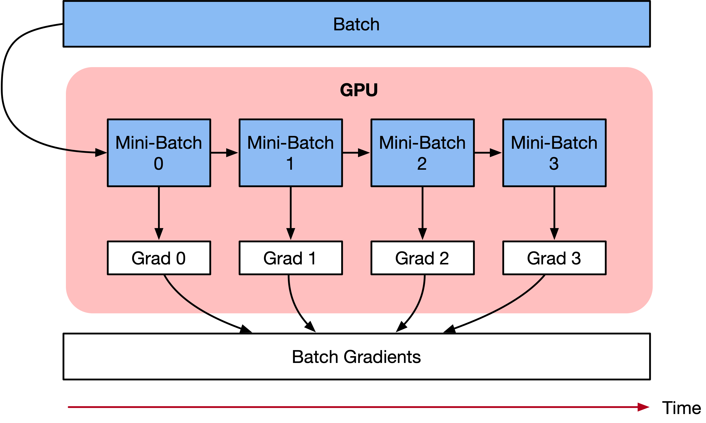

# 应用梯度累积算法

`GPU` `内存优化` `静态图`

<a href="https://authoring-modelarts-cnnorth4.huaweicloud.com/console/lab?share-url-b64=aHR0cHM6Ly9vYnMuZHVhbHN0YWNrLmNuLW5vcnRoLTQubXlodWF3ZWljbG91ZC5jb20vbWluZHNwb3JlLXdlYnNpdGUvbm90ZWJvb2svbW9kZWxhcnRzL21pbmRzcG9yZV9hcHBseV9ncmFkaWVudF9hY2N1bXVsYXRpb24uaXB5bmI=&imageid=65f636a0-56cf-49df-b941-7d2a07ba8c8c" target="_blank"></a>
&nbsp;&nbsp;
<a href="https://gitee.com/mindspore/docs/blob/r1.6/docs/mindspore/programming_guide/source_zh_cn/apply_gradient_accumulation.md" target="_blank"></a>

## 概述

本教程介绍梯度累积的训练算法，目的是为了解决由于内存不足，导致神经网络无法训练Batch size过大或者网络模型过大无法加载的OOM（Out Of Memory）问题。

## 梯度累积原理

梯度累积是一种训练神经网络的数据样本按Batch拆分为几个小Batch的方式，然后按顺序计算。

在进一步讨论梯度累积之前，我们来看看神经网络的计算过程。

深度学习模型由许多相互连接的神经网络单元所组成，在所有神经网络层中，样本数据会不断向前传播。在通过所有层后，网络模型会输出样本的预测值，通过损失函数然后计算每个样本的损失值（误差）。神经网络通过反向传播，去计算损失值相对于模型参数的梯度。最后这些梯度信息用于对网络模型中的参数进行更新。

优化器用于对网络模型模型权重参数更新的数学公式。以一个简单随机梯度下降(SGD)算法为例。

假设Loss Function函数公式为：

$$Loss(\theta)=\frac{1}{2}\left(h(x^{k})-y^{k}\right)^{2}$$

在构建模型时，优化器用于计算最小化损失的算法。这里SGD算法利用Loss函数来更新权重参数公式为：

$$\theta{i}=\theta_{i-1}-lr * grad_{i}$$

其中$\theta$是网络模型中的可训练参数（权重或偏差），lr是学习率，$grad_{i}$是相对于网络模型参数的损失。

梯度累积只计算神经网络模型，并不及时更新网络模型的参数，同时在计算的时候累积得到的梯度信息，最后统一使用累积的梯度来对参数进行更新。

$$accumulated=\sum_{i=0}^{N} grad_{i}$$

在不更新模型变量的时候，实际上是把原来的数据Batch分成几个小的Mini-Batch，每个step中使用的样本实际上是更小的数据集。

在N个step内不更新变量，使所有Mini-Batch使用相同的模型变量来计算梯度，以确保计算出来得到相同的梯度和权重信息，算法上等价于使用原来没有切分的Batch size大小一样。即：

$$\theta{i}=\theta_{i-1}-lr * \sum_{i=0}^{N} grad_{i}$$

最终在上面步骤中累积梯度会产生与使用全局Batch size大小相同的梯度总和。



当然在实际工程当中，关于调参和算法上有两点需要注意的：

1. **学习率 learning rate**：一定条件下，Batch size越大训练效果越好，梯度累积则模拟了Batch size增大的效果，如果accumulation steps为4，则Batch size增大了4倍，根据经验，使用梯度累积的时候需要把学习率适当放大。

2. **归一化 Batch Norm**：accumulation steps为4时进行Batch size模拟放大的效果，与真实Batch size相比，数据的分布其实并不完全相同，4倍Batch size的BN计算出来的均值和方差与实际数据均值和方差不太相同，因此有些实现中会使用Group Norm来代替Batch Norm。

## 梯度累积实现

下面教程内容将分别介绍在单机模式、Boost模式下实现梯度累积训练。

> 注意：`auto_parallel`以及`semi_auto_parallel`并行模式下不支持梯度累积的训练方式。

### 单机模式

单机模式下，主要通过将训练流程拆分为1)正向反向训练、2)参数更新和3)累积梯度清理，三个部分实现梯度累积。

下面以MNIST作为示范数据集，自定义简单模型实现梯度累积需要如下个步骤。

> 您可以在这里下载主要的训练样例代码：[train.py](https://gitee.com/mindspore/docs/blob/r1.6/docs/sample_code/gradient_accumulation/train.py)

由于需要使用models仓中的LeNet网络，请先执行如下命令拉取models仓的代码：

```bash
git clone https://gitee.com/mindspore/models.git -b r1.6
```

如果models仓不在系统路径中，需要在`train.py`代码起始部分添加以下两段代码。

```python
import sys
sys.path.append(models仓的路径)
```

#### 导入需要的库文件

下列是所需要的公共模块及MindSpore的模块及库文件。

```python
import argparse
import os
from collections.abc import Iterable

import mindspore.nn as nn
from mindspore import ParameterTuple
from mindspore import context, DatasetHelper, save_checkpoint
from mindspore.nn import Cell
import mindspore.ops as ops
from models.official.cv.lenet.src.dataset import create_dataset
from models.official.cv.lenet.src.lenet import LeNet5
```

#### 加载数据集

利用MindSpore的`dataset`提供的`MnistDataset`接口加载MNIST数据集，此部分代码由models中`lenet`目录下的[dataset.py](https://gitee.com/mindspore/models/blob/r1.6/official/cv/lenet/src/dataset.py)导入。

#### 定义网络

这里以LeNet网络为例进行介绍，当然也可以使用其它的网络，如ResNet-50、BERT等, 此部分代码由models中`lenet`目录下的[lenet.py](https://gitee.com/mindspore/models/blob/r1.6/official/cv/lenet/src/lenet.py)导入。

#### 定义训练流程

将训练流程拆分为正向反向训练、参数更新和累积梯度清理三个部分：

- `TrainForwardBackward` 计算loss和梯度，利用grad_sum实现梯度累加。
- `TrainOptim` 实现参数更新。
- `TrainClear` 实现对梯度累加变量grad_sum清零。

```python
_sum_op = ops.MultitypeFuncGraph("grad_sum_op")
_clear_op = ops.MultitypeFuncGraph("clear_op")

@_sum_op.register("Tensor", "Tensor")
def _cumulative_grad(grad_sum, grad):
    """Apply grad sum to cumulative gradient."""
    add = ops.AssignAdd()
    return add(grad_sum, grad)

@_clear_op.register("Tensor", "Tensor")
def _clear_grad_sum(grad_sum, zero):
    """Apply zero to clear grad_sum."""
    success = True
    success = ops.depend(success, ops.assign(grad_sum, zero))
    return success

class TrainForwardBackward(Cell):
    def __init__(self, network, optimizer, grad_sum, sens=1.0):
        super(TrainForwardBackward, self).__init__(auto_prefix=False)
        self.network = network
        self.network.set_grad()
        self.network.add_flags(defer_inline=True)
        self.weights = ParameterTuple(network.trainable_params())
        self.optimizer = optimizer
        self.grad_sum = grad_sum
        self.grad = ops.GradOperation(get_by_list=True, sens_param=True)
        self.sens = sens
        self.hyper_map = ops.HyperMap()

    def construct(self, *inputs):
        weights = self.weights
        loss = self.network(*inputs)
        sens = ops.Fill()(ops.DType()(loss), ops.Shape()(loss), self.sens)
        grads = self.grad(self.network, weights)(*inputs, sens)
        return ops.depend(loss, self.hyper_map(ops.partial(_sum_op), self.grad_sum, grads))

class TrainOptim(Cell):
    def __init__(self, optimizer, grad_sum):
        super(TrainOptim, self).__init__(auto_prefix=False)
        self.optimizer = optimizer
        self.grad_sum = grad_sum

    def construct(self):
        return self.optimizer(self.grad_sum)

class TrainClear(Cell):
    def __init__(self, grad_sum, zeros):
        super(TrainClear, self).__init__(auto_prefix=False)
        self.grad_sum = grad_sum
        self.zeros = zeros
        self.hyper_map = ops.HyperMap()

    def construct(self):
        success = self.hyper_map(ops.partial(_clear_op), self.grad_sum, self.zeros)
        return success
```

#### 定义训练模型

每个Mini-Batch通过正反向训练计算损失loss和梯度grad，通过mini_steps控制每次更新参数前的累加次数。达到累加次数后进行参数更新和累加梯度变量清零。

```python
class GradientAccumulation:
    def __init__(self, network, loss_fn, optimizer):
        self._network = network
        self._loss_fn = loss_fn
        self._optimizer = optimizer

        params = self._optimizer.parameters
        self._grad_sum = params.clone(prefix="grad_sum", init='zeros')
        self._zeros = params.clone(prefix="zeros", init='zeros')
        self._train_forward_backward = self._build_train_forward_backward_network()
        self._train_optim = self._build_train_optim()
        self._train_clear = self._build_train_clear()

    @staticmethod
    def _transform_callbacks(callbacks):
        """Transform callback to a list."""
        if callbacks is None:
            return []

        if isinstance(callbacks, Iterable):
            return list(callbacks)

        return [callbacks]

    def _build_train_forward_backward_network(self):
        """Build forward and backward network"""
        network = self._network
        network = nn.WithLossCell(network, self._loss_fn)
        loss_scale = 1.0
        network = TrainForwardBackward(network, self._optimizer, self._grad_sum, loss_scale).set_train()
        return network

    def _build_train_optim(self):
        """Build optimizer network"""
        network = TrainOptim(self._optimizer, self._grad_sum).set_train()
        return network

    def _build_train_clear(self):
        """Build clear network"""
        network = TrainClear(self._grad_sum, self._zeros).set_train()
        return network

    def train_process(self, epoch, train_dataset, mini_steps=None):
        """
        Training process. The data would be passed to network directly.
        """
        dataset_helper = DatasetHelper(train_dataset, dataset_sink_mode=False, epoch_num=epoch)

        for i in range(epoch):
            step = 0
            for k, next_element in enumerate(dataset_helper):
                loss = self._train_forward_backward(*next_element)
                if (k + 1) % mini_steps == 0:
                    step += 1
                    print("epoch:", i + 1, "step:", step, "loss is ", loss)
                    self._train_optim()
                    self._train_clear()

            train_dataset.reset()

        save_checkpoint(self._train_forward_backward, "gradient_accumulation.ckpt", )
```

#### 训练并保存模型

调用网络、优化器及损失函数，然后自定义`GradientAccumulation`的`train_process`接口，进行模型训练。

```python
if __name__ == "__main__":
    parser = argparse.ArgumentParser(description='MindSpore Grad Cumulative Example')
    parser.add_argument('--device_target', type=str, default="GPU", choices=['GPU'],
                        help='device where the code will be implemented (default: GPU)')
    parser.add_argument('--data_path', type=str, default="./Data",
                        help='path where the dataset is saved')
    args = parser.parse_args()

    context.set_context(mode=context.GRAPH_MODE, device_target=args.device_target)
    ds_train = create_dataset(os.path.join(args.data_path, "train"), 32)

    net = LeNet5(10)
    net_loss = nn.SoftmaxCrossEntropyWithLogits(sparse=True, reduction="mean")
    net_opt = nn.Momentum(net.trainable_params(), 0.01, 0.9)
    model = GradientAccumulation(net, net_loss, net_opt)

    print("============== Starting Training ==============")
    model.train_process(10, ds_train, mini_steps=4)
```

#### 实验结果

在经历了10轮epoch之后，在测试集上的精度约为96.31%。

**执行训练:**

1. 运行训练代码，查看运行结果。

    ```bash
    python train.py --data_path=./MNIST_Data
    ```

    输出如下，可以看到loss值随着训练逐步降低：

    ```text
    epoch: 1 step: 27 loss is  0.3660637
    epoch: 1 step: 28 loss is  0.25238192
    ...
    epoch: 3 step: 2 loss is  0.12296932
    epoch: 3 step: 3 loss is  0.15799297
    ...
    epoch: 10 step: 448 loss is  0.06443884
    epoch: 10 step: 449 loss is  0.0067842817
    ```

2. 查看保存的CheckPoint文件。

    训练过程中保存了CheckPoint文件`gradient_accumulation.ckpt`，即模型文件。

**验证模型:**

通过models中`lenet`目录下的[eval.py](https://gitee.com/mindspore/models/blob/r1.6/official/cv/lenet/train.py)，使用保存的CheckPoint文件，加载验证数据集，进行验证。

```bash
python eval.py --data_path=./MNIST_Data --ckpt_path=./gradient_accumulation.ckpt --device_target=GPU
```

输出如下，可以看到使用验证的数据集，正确率在96.31%左右，与batch_size为32的验证结果一致。

```text
============== Starting Testing ==============
============== {'Accuracy': 0.9631730769230769} ==============
```

### Boost模式

在Boost模式下，只要简单调用Boost的梯度累积接口，即可实现梯度累积的功能。这里同样以MNIST作为示范数据集，展示如何调用Boost接口来实现梯度累积功能。

> 你可以在这里下载主要的训练样例代码：[train_and_eval_boost.py](https://gitee.com/mindspore/docs/blob/r1.6/docs/sample_code/gradient_accumulation/train_and_eval_boost.py)

#### 导入需要的库文件

下列是所需要的公共模块及MindSpore的模块及库文件。

```python
import argparse
import os

import mindspore.nn as nn
from mindspore import Model, context
from mindspore.nn import WithLossCell, TrainOneStepCell, Accuracy
from mindspore.boost import GradientAccumulation
import mindspore.ops as ops
from mindspore.train.callback import LossMonitor, TimeMonitor
from mindspore import load_checkpoint, load_param_into_net

from models.official.cv.lenet.src.dataset import create_dataset
from models.official.cv.lenet.src.lenet import LeNet5
```

#### 加载数据集

利用MindSpore的`dataset`提供的`MnistDataset`接口加载MNIST数据集，此部分代码由models中`lenet`目录下的[dataset.py](https://gitee.com/mindspore/models/blob/r1.6/official/cv/lenet/src/dataset.py)导入。

#### 定义网络

这里以LeNet网络为例进行介绍，当然也可以使用其它的网络，如ResNet-50、BERT等, 此部分代码由models中`lenet`目录下的[lenet.py](https://gitee.com/mindspore/models/blob/r1.6/official/cv/lenet/src/lenet.py)导入。

#### 定义训练模型

我们可以调用MindSpore Boost下的`GradientAccumulation`来使能梯度累积，通过max_accumulation_step控制每次更新参数前的累加次数。

达到累加次数后进行参数更新和累加梯度变量清零，只需要基于`TrainOneStepCell`定义`TrainGradAccumulationStepsCell`来调用该接口即可。

```python
class TrainGradAccumulationStepsCell(TrainOneStepCell):
    """construct train accu step cell"""
    def __init__(self, network, optimizer, sens=1.0, max_accumulation_step=1):
        super(TrainGradAccumulationStepsCell, self).__init__(network, optimizer, sens)
        self.max_accumulation_step = max_accumulation_step
        self.grad_accumulation = GradientAccumulation(self.max_accumulation_step, self.optimizer)

    def construct(self, *inputs):
        loss = self.network(*inputs)
        sens = ops.fill(loss.dtype, loss.shape, self.sens)
        grads = self.grad(self.network, self.weights)(*inputs, sens)
        grads = self.grad_reducer(grads)
        loss = self.grad_accumulation(loss, grads)
        return loss
```

#### 训练模型并进行推理

定义好网络后即可进行训练，训练结束后加载训练过程中保存的ckpt文件进行推理，可以得到模型的精度。

```python
if __name__ == "__main__":
    parser = argparse.ArgumentParser(description='MindSpore Grad Cumulative Example')
    parser.add_argument('--device_target', type=str, default="Ascend", choices=['Ascend', 'GPU'],
                        help='device where the code will be implemented (default: Ascend)')
    parser.add_argument('--data_path', type=str, default="./Data",
                        help='path where the dataset is saved')
    args = parser.parse_args()

    context.set_context(mode=context.GRAPH_MODE, device_target=args.device_target)
    ds_train = create_dataset(os.path.join(args.data_path, "train"), 32)

    net = LeNet5(10)
    net_loss = nn.SoftmaxCrossEntropyWithLogits(sparse=True, reduction="mean")
    net_opt = nn.Momentum(net.trainable_params(), 0.01, 0.9)
    time_cb = TimeMonitor(data_size=ds_train.get_dataset_size())

    train_net = nn.WithLossCell(net, net_loss)
    train_net = TrainGradAccumulationStepsCell(train_net, net_opt, 1.0, 5)
    model = Model(train_net)

    print("============== Starting Training ==============")
    model.train(10, ds_train, callbacks=[time_cb, LossMonitor()])

    print("============== Starting Testing ==============")
    model = Model(net, net_loss, net_opt, metrics={"Accuracy": Accuracy()})
    ds_eval = create_dataset(os.path.join(args.data_path, "test"), 32, 1)
    if ds_eval.get_dataset_size() == 0:
        raise ValueError("Please check dataset size > 0 and batch_size <= dataset size")

    acc = model.eval(ds_eval)
    print("============== {} ==============".format(acc))

```

#### 实验结果

在经历了10轮epoch之后，在测试集上的精度约为98.30%。

1. 运行训练与推理代码，查看运行结果。

   ```bash
   python train_and_eval_boost.py --data_path=./MNIST_Data
   ```

   输出如下，可以看到loss值随着训练逐步降低：

   ```text
   epoch: 1 step: 1875 loss is  0.1889342879
   ...
   epoch: 5 step: 1875 loss is  0.11749879342
   ...
   epoch: 10 step: 1875 loss is  0.00029468764328
   ```

2. 查看推理精度，代码中会将checkpoint保存到当前目录，随后会加载该checkpoint推理。

    ```text
    ============== Starting Testing ==============
    ============== {'Accuracy': 0.983072916666} ==============
    ```

## 参考文献

- [1] Hermans, Joeri R., Gerasimos Spanakis, and Rico Möckel. "Accumulated gradient normalization." Asian Conference on Machine Learning. PMLR, 2017.
- [2] Lin, Yujun, et al. "Deep gradient compression: Reducing the communication bandwidth for distributed training." arXiv preprint arXiv:1712.01887 (2017).
- [3] [how-to-break-gpu-memory-boundaries-even-with-large-batch-sizes](https://towardsdatascience.com/how-to-break-gpu-memory-boundaries-even-with-large-batch-sizes-7a9c27a400ce)
- [4] [what-is-gradient-accumulation-in-deep-learning](https://towardsdatascience.com/what-is-gradient-accumulation-in-deep-learning-ec034122cfa)