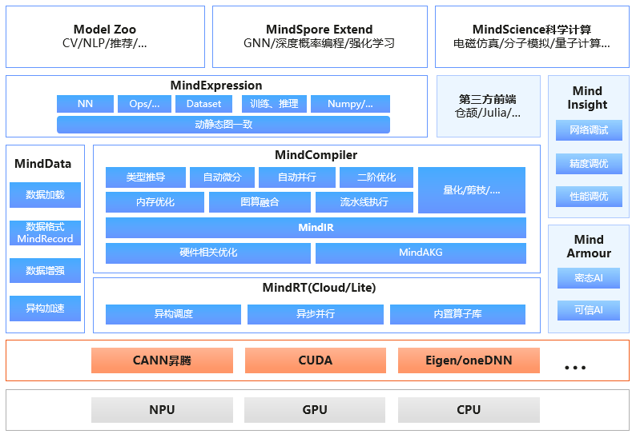

# MindSpore总体架构

`Ascend` `GPU` `CPU` `端侧` `入门`

昇思MindSpore是一个全场景深度学习框架，旨在实现易开发、高效执行、全场景覆盖三大目标，其中易开发表现为API友好、调试难度低，高效执行包括计算效率、数据预处理效率和分布式训练效率，全场景则指框架同时支持云、边缘以及端侧场景。

昇思MindSpore（后文用MindSpore代表）总体架构如下图所示，其中：

- **ModelZoo（网络样例）**：ModelZoo提供可用的深度学习算法网络，也欢迎更多开发者贡献新的网络。
- **MindSpore Extend（扩展层）**：MindSpore的扩展包，支持拓展新领域场景，如GNN/深度概率编程/强化学习等，期待更多开发者来一起贡献和构建。
- **MindScience（科学计算）**：MindScience是基于MindSpore融合架构打造的科学计算行业套件，包含了业界领先的数据集、基础模型、预置高精度模型和前后处理工具，加速了科学行业应用开发。
- **MindExpression（表达层）**：基于Python的前端表达与编程接口。同时未来计划陆续提供C/C++、华为自研编程语言前端-仓颉（目前还处于预研阶段）等第三方前端的对接工作，引入更多的第三方生态。
- **MindData（数据处理层）**：提供高效的数据处理、常用数据集加载等功能和编程接口，支持用户灵活的定义处理注册和pipeline并行优化。
- **MindCompiler（编译优化层）**：图层的核心编译器，主要基于端云统一的MindIR实现三大功能，包括硬件无关的优化（类型推导、自动微分、表达式化简等）、硬件相关优化（自动并行、内存优化、图算融合、流水线执行等）、部署推理相关的优化（量化、剪枝等）；其中，MindAKG是MindSpore的自动算子生成编译器，目前还在持续完善中。
- **MindRT（全场景运行时）**：MindSpore的运行时系统，包含云侧主机侧运行时系统、端侧以及更小IoT的轻量化运行时系统。
- **MindInsight（可视化调试调优工具）**：提供MindSpore的可视化调试调优等工具，支持用户对训练网络的调试调优。
- **MindArmour（安全增强包）**：面向企业级运用时，安全与隐式保护相关增强功能，如对抗鲁棒性、模型安全测试、差分隐私训练、隐私泄露风险评估、数据漂移检测等技术。

