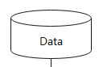
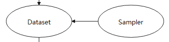
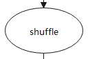
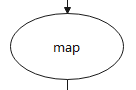
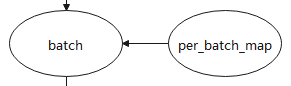

# Dataset

<!-- TOC -->

- [Dataset](#dataset)
    - [数据集](#数据集)
    - [数据集加载](#数据集加载)
    - [数据处理](#数据处理)
        - [Shuffle操作](#shuffle操作)
        - [Map操作](#map操作)
        - [Batch操作](#batch操作)

<!-- /TOC -->

<a href="https://gitee.com/mindspore/docs/blob/master/docs/mindspore/programming_guide/source_zh_cn/dataset_introduction.md" target="_blank"></a>

数据是深度学习的基础，高质量数据输入会在整个深度神经网络中起到积极作用。

在网络训练和推理流程中，原始数据一般存储在磁盘或数据库中，需要首先通过数据加载步骤将其读取到内存空间，转换成框架通用的张量（Tensor）格式，然后通过数据处理和增强步骤，将其映射到更加易于学习的特征空间，同时增加样本的数量和泛化性，最后输入到网络进行计算。

整体流程如下图所示：


本章节介绍`mindspore.dataset`(以下简称Dataset)中的数据加载、数据处理和增强等操作涉及到的一些基础概念。

## 数据集

  

数据集为一组样本的集合，数据集的一行即为一个样本包含一个或多个特征，此外还可能包含一个标签。数据集都需要符合一定规范要求，便于评估模型的效果。

Dataset支持多种格式数据集，包括MindSpore自研数据格式MindRecord，常用的公开图像数据集和文本数据集，用户自定义的数据集等。
详细的Mindspore支持的数据集请参考: [MindSpore支持数据集](https://www.mindspore.cn/docs/programming_guide/zh-CN/master/dataset_loading.html#%E6%A6%82%E8%BF%B0)。

Dataset也支持将常用的数据集和用户自定义的数据集转为MindSpore数据格式（MindRecord），详情可参考： [转换数据集为MindRecord](https://www.mindspore.cn/docs/programming_guide/zh-CN/master/convert_dataset.html#%E8%BD%AC%E6%8D%A2%E6%95%B0%E6%8D%AE%E9%9B%86%E4%B8%BAMindRecord)。

## 数据集加载

  

数据集加载使得模型训练时能源源不断地获取数据进行训练。

Dataset对多种常用的数据集提供对应的类来实现数据集的加载，同时对于不同存储格式的数据文件，Dataset也有对应的类来进行数据加载。MindSpore数据集加载请参考：[MindSpore数据集加载](https://www.mindspore.cn/docs/programming_guide/zh-CN/master/dataset_loading.html#%E6%95%B0%E6%8D%AE%E9%9B%86%E5%8A%A0%E8%BD%BD%E6%80%BB%E8%A7%88)。

Dataset提供了多种用途的采样器（Sampler），采样器负责生成读取的index序列，Dataset负责根据index读取相应数据，帮助用户对数据集进行不同形式的采样，以满足训练需求，解决诸如数据集过大或样本类别分布不均等问题，注意，采样器负责对样本做filter和reorder操作，不会执行Batch操作。

Mindspore的数据采样介绍请参考：[MindSpore数据采样](https://www.mindspore.cn/docs/programming_guide/zh-CN/master/sampler.html#%E6%95%B0%E6%8D%AE%E9%87%87%E6%A0%B7)。

## 数据处理

Dataset将数据加载到内存后，数据按Tensor形式进行组织。同时Tensor也是数据增强操作中的基本数据结构。

### Shuffle操作



训练一般是多个epoch，shuffle操作打乱数据的顺序，保证训练时每个epoch的数据顺序不同，防止训练过拟合。

Dataset提供多种方式来实现全局shuffle操作。

1. 数据集加载类的`shuffle`参数

   ```python
   import numpy as np
   import mindspore.dataset as ds
   data = [1, 2, 3, 4]
   dataset = ds.NumpySlicesDataset(data=data, column_names=["column_1"], shuffle=True)
   ```

   详情请参考：[NumpySlicesDataset](https://www.mindspore.cn/docs/api/zh-CN/master/api_python/dataset/mindspore.dataset.NumpySlicesDataset.html#mindspore-dataset-numpyslicesdataset)。

2. shuffle算子

   ```python
   import numpy as np
   import mindspore.dataset as ds
   data = [1, 2, 3, 4]
   dataset = ds.NumpySlicesDataset(data=data, column_names=["column_1"])
   # buffer_size equal to the number of rows in the entire dataset will result in a global     shuffle
   dataset = dataset.shuffle(4)
   ```

   详情请参考：[shuffle API](https://www.mindspore.cn/docs/api/zh-CN/master/api_python/dataset/mindspore.dataset.GeneratorDataset.html#mindspore.dataset.GeneratorDataset.shuffle)。

3. 随机采样

   ```python
   import numpy as np
   import mindspore.dataset as ds
   data = [1, 2, 3, 4]
   sampler = ds.RandomSampler()
   dataset = ds.NumpySlicesDataset(data=data, column_names=["column_1"],sampler=sampler)
   ```

   详情请参考：[RandomSampler](https://www.mindspore.cn/docs/api/zh-CN/master/api_python/dataset/mindspore.dataset.RandomSampler.html#mindspore-dataset-randomsampler)。

### Map操作

  

Map操作对各类数据做数据增强，负责启动和执行Dataset提供或用户自定义的数据增强算子，对数据进行映射变换，其中数据增强是一种创造有着不同方向的“新”数据的方法，一是从有限数据中生成“更多数据”，二是防止过拟合。

Dataset的`c_transforms`和`py_transforms`模块分别提供了基于`C++`和`Python`的数据增强算子实现，同时用户可以自定义函数来进行数据增强。

图像类数据增强操作请参考：[图像类数据增强](https://www.mindspore.cn/docs/programming_guide/zh-CN/master/augmentation.html#%E5%9B%BE%E5%83%8F%E5%A4%84%E7%90%86%E4%B8%8E%E5%A2%9E%E5%BC%BA)。

文本类数据增强操作请参考：[文本类数据增强](https://www.mindspore.cn/docs/programming_guide/zh-CN/master/tokenizer.html#%E6%96%87%E6%9C%AC%E5%A4%84%E7%90%86%E4%B8%8E%E5%A2%9E%E5%BC%BA)。

Map操作请参考：[Map操作](https://www.mindspore.cn/docs/api/zh-CN/master/api_python/dataset/mindspore.dataset.CelebADataset.html#mindspore.dataset.CelebADataset.map)。

### Batch操作

  

每次只使用一个样本训练模型，具有较好的随机性，但并行化差，导致训练效率过低。引入mini-batch可以较好均衡训练速度和训练效果。

Batch 操作负责将多个`shape`相同的`Tensor`“打包”到一起，以实现以mini-batch的方式来进行训练，Batch操作还提供drop_remainder参数，表示把最后一个不足batch_size的batch删除，默认会保留。假如数据集大小为17373，使用8张卡进行训练并且Batch size为16，每张卡分配2172条样本，当drop_remainder为True时，每张卡上可打包135个mini-batch。

在“打包”动作之前，Batch支持将`shape`不一致的`Tensor`根据用户需求、或者自动将`Tensor`的`shape`填充一致，以及通过`Per_batch_map`在“打包”之前
执行用户自定义的函数。

1. padding操作

   ```python
   import numpy as np
   import mindspore.dataset as ds
   # col1d: [0],[1]
   # col2d: [[100],[200]], [[101],[201]]
   def gen_2cols(num):
     for i in range(num):
       yield (np.array([i]), np.array([[i + 100], [i + 200]]))

   dataset = ds.GeneratorDataset((lambda: gen_2cols(2)), ["col1d", "col2d"])
   dataset = dataset.batch(batch_size=2, drop_remainder=False, pad_info={"col2d": ([2, 2], -2) , "col1d": ([2], -1)})
   # col1d: [0, -1], [1, -1]
   # col2d: [[100, -2], [200, -2]], [[101, -2], [201, -2]]
   ```

2. per_batch_map操作

   ```python
   import numpy as np
   import mindspore.dataset as ds
   # first column: 0, 3, 6, 9 ...
   # second column:1, 4, 7, 10 ...
   # third column: 2, 5, 8, 11 ...
   def gen_3_cols(num):
     for i in range(num):
       yield (np.array([i * 3]), np.array([i * 3 + 1]), np.array([i * 3 + 2]))
   # first epoch batch_size per batch: 1, 2 ,3 ...
   # second epoch batch_size per batch: 2, 4, 6 ...
   # third epoch batch_size per batch: 3, 6 ,9 ...
   def batch_func(batchInfo):
     return (batchInfo.get_batch_num() + 1) * (batchInfo.get_epoch_num() + 1)

   # multiply first col by batch_num, multiply second col by -batch_num
   def map_func(col1, col2, batchInfo):
     return ([np.copy((1 + batchInfo.get_batch_num()) * arr) for arr in col1],
         [np.copy(-(1 + batchInfo.get_batch_num()) * arr) for arr in col2])
   # col1: [[0]], [[ 6], [12]], [[27]]
   # col2: [[-1]],[[ -8], [-14]],  [[-30]]
   # col3: [[2]], [[5], [8]], [[11]]
   dataset = ds.GeneratorDataset((lambda: gen_3_cols(4)), ["col1", "col2", "col3"]).batch (batch_size=batch_func, input_columns=["col1", "col2"], per_batch_map=map_func)
   ```

Batch操作请参考：[Batch操作](https://www.mindspore.cn/docs/api/zh-CN/master/api_python/dataset/mindspore.dataset.CelebADataset.html#mindspore.dataset.CelebADataset.batch)。
