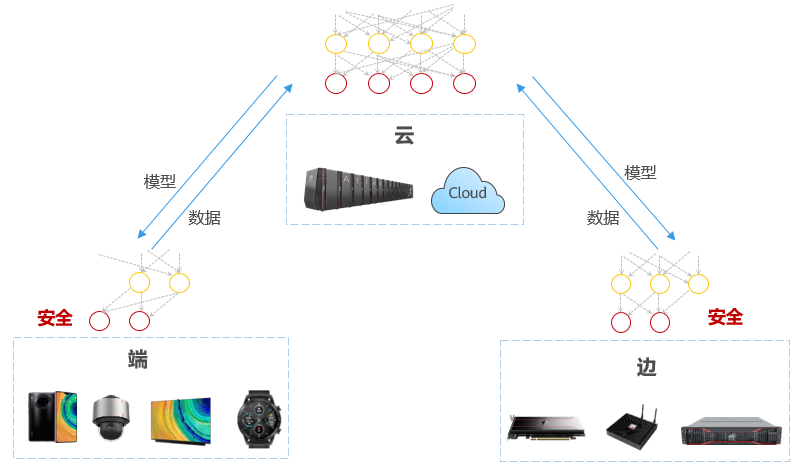
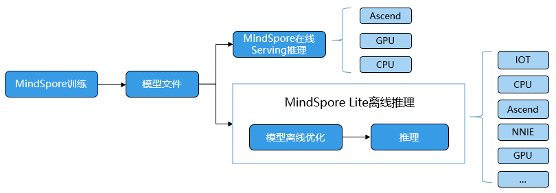

# 全场景统一架构

`Ascend` `GPU` `CPU` `设计`

MindSpore旨在提供端边云全场景的AI框架。MindSpore可部署于端、边、云不同的硬件环境，满足不同环境的差异化需求，如支持端侧的轻量化部署，支持云侧丰富的训练功能如自动微分、混合精度、模型易用编程等。

MindSpore全场景的几个重要特性：

1. 端边云统一的C++ 推理接口，支持算法代码可快速迁移到不同硬件环境执行。
2. 模型统一，端云使用相同的模型格式和定义，软件架构一致。MindSpore支持Ascend、GPU、CPU（x86、arm、…）等多种硬件的执行，一次训练多处部署使用。
3. 多样化算力支持。提供统一的南向接口，支持新硬件的快捷添加使用。
4. 模型小型化技术，适配不同硬件环境和业务场景的要求，如量化等。以及端边云协同技术的快速应用，如联邦学习等技术。

如上图所示，在MindSpore上训练出来的模型文件，可通过Serving部署在云服务中执行，也可用过Lite执行在服务器、端侧等设备上。同时Lite支持通过独立工具convert进行模型的离线优化，实现推理时框架的轻量化以及模型执行高性能的目标。

MindSpore抽象各个硬件下的统一算子接口，因此，在不同硬件环境下，网络模型的编程代码可以保持一致。同时加载相同的模型文件，在MindSpore支持的各个不同硬件上均能有效执行推理。
推理考虑到大量用户使用C++/C编程方式，因此提供了C++的推理编程接口，相关编程接口在形态上与Python接口的风格较接近。

同时，通过提供第三方硬件的自定义离线优化注册，第三方硬件的自定义算子注册机制，实现快速对接新的硬件，同时对外的模型编程接口以及模型文件保持不变。
