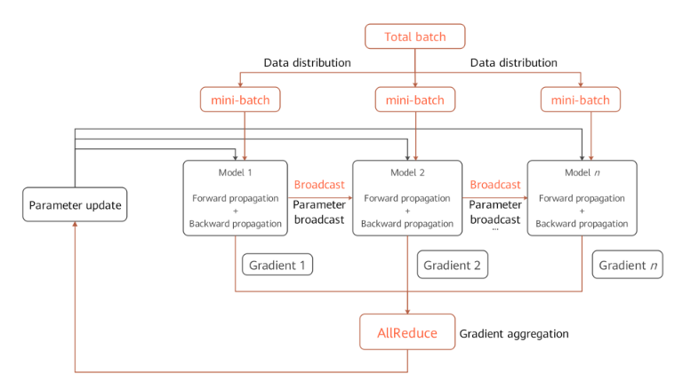

# 分布式训练

`Ascend` `GPU` `设计` `分布式并行`

<!-- TOC -->

- [分布式训练](#分布式训练)
    - [背景](#背景)
    - [概念](#概念)
        - [集合通信](#集合通信)
        - [同步模式](#同步模式)
    - [数据并行](#数据并行)
        - [数据并行原理](#数据并行原理)
        - [数据并行代码](#数据并行代码)
    - [自动并行](#自动并行)
        - [自动并行原理](#自动并行原理)
        - [自动并行代码](#自动并行代码)

<!-- /TOC -->

## 背景

随着深度学习的快步发展，为了提升神经网络的精度和泛化能力，数据集和参数量都在呈指数级向上攀升。分布式并行训练成为一种解决超大规模网络性能瓶颈的发展趋势。MindSpore支持了当前主流的分布式训练范式并开发了一套自动混合并行解决方案。本篇设计文档将会集中介绍几种并行训练方式的设计原理，同时指导用户进行自定义开发。

## 概念

### 集合通信

集合通信指在一组进程间通信，组内所有进程满足一定规则的发送和接收数据。MindSpore通过集合通信的方式进行并行训练过程中的数据传输工作，在Ascend芯片上它依赖于华为集合通信库`HCCL`完成，在GPU上它依赖于英伟达集合通信库`NCCL`完成。

### 同步模式

在同步模式下，所有的设备同时开始训练，并且当反向传播算法完成之后同步更新参数的取值。MindSpore目前采用的是同步训练模式。

## 数据并行

这个小节介绍了在MindSpore中`ParallelMode.DATA_PARALLEL`数据并行模式是如何工作的。

### 数据并行原理

1. 环境依赖

    每次开始进行并行训练前，通过调用`mindspore.communication.init`接口初始化通信资源，并自动创建全局通信组`WORLD_COMM_GROUP`。

2. 数据分发（Data distribution）

    数据并行的核心在于将数据集在样本维度拆分并下发到不同的卡上。在`mindspore.dataset`模块提供的所有数据集加载接口中都有`num_shards`和`shard_id`两个参数，它们用于将数据集拆分为多份并循环采样的方式，采集`batch`大小的数据到各自的卡上，当出现数据量不足的情况时将会从头开始采样。

3. 网络构图

    数据并行网络的书写方式与单机网络没有差别，这是因为在正反向传播（Forward propagation & Backward Propagation）过程中各卡的模型间是独立执行的，只是保持了相同的网络结构。唯一需要特别注意的是为了保证各卡间训练同步，相应的网络参数初始化值应当是一致的，在`DATA_PRALLEL`和`HYBRID_PARALLEL`模式下建议通过使能`parameter_broadcast`达到权重广播的目的；在`AUTO_PRALLEL`和`SEMI_AUTO_PARALLEL`模式下，框架内部会自动分析参数的并行度，并设置相应的随机数种子，保证在数据并行维度的设备上参数初始化值一致。

4. 梯度聚合（Gradient aggregation）

    数据并行理论上应该实现和单机一致的训练效果，为了保证计算逻辑的一致性，在梯度计算完成后插入`AllReduce`算子实现各卡间的梯度聚合操作。这里我们设置了`mean`开关，用户可以选择是否要对求和后的梯度值进行求平均操作，也可以将其视为超参项，打开开关等价于学习率倍数缩小。

5. 参数更新（Parameter update）

    因为引入了梯度聚合操作，所以各卡的模型会以相同的梯度值一起进入参数更新步骤。因此MindSpore实现的是一种同步数据并行训练方式。理论上最终每卡训练出来的模型是相同的，如果网络中含有在样本维度的归约类型操作，网络的输出可能会有所差别，这是由数据并行的切分性质决定的。

### 数据并行代码

1. 集合通信

    - [management.py](https://gitee.com/mindspore/mindspore/blob/r1.5/mindspore/communication/management.py)：这个文件中涵盖了集合通信过程中常用的`helper`函数接口，例如获取集群数量和卡的序号等。当在Ascend芯片上执行时，框架会加载环境上的`libhccl.so`库文件，通过它来完成从Python层到底层的通信接口调用。
    - [comm_ops.py](https://gitee.com/mindspore/mindspore/blob/r1.5/mindspore/ops/operations/comm_ops.py)：MindSpore将支持的集合通信操作都封装为算子的形式放在这个文件下，包括`AllReduce`、`AllGather`、`ReduceScatter`和`Broadcast`等。`PrimitiveWithInfer`中除了定义算子所需属性外，还包括构图过程中输入到输出的`shape`和`dtype`推导。

2. 梯度聚合

    - [grad_reducer.py](https://gitee.com/mindspore/mindspore/blob/r1.5/mindspore/nn/wrap/grad_reducer.py)：这个文件实现了梯度聚合的过程。对入参`grads`用`HyperMap`展开后插入`AllReduce`算子，这里采用的是全局通信组，用户也可以根据自己网络的需求仿照这个模块进行自定义开发。MindSpore中单机和分布式执行共用一套网络封装接口，在`Cell`内部通过`ParallelMode`来区分是否要对梯度做聚合操作，网络封装接口建议参考`TrainOneStepCell`代码实现。

## 自动并行

自动并行作为MindSpore的关键特性，用于实现自动的数据并行加模型并行的混合并行训练方式，旨在帮助用户以单机的脚本表达并行算法逻辑，降低分布式训练难度，提高算法研发效率，同时又能保持训练的高性能。这个小节介绍了在MindSpore中`ParallelMode.AUTO_PARALLEL`自动并行模式及`ParallelMode.SEMI_AUTO_PARALLEL`半自动并行模式是如何工作的。

### 自动并行原理

1. 分布式算子和张量排布模型

    在上面的架构图中，自动并行流程会对单机的正向计算图（ANF Graph）进行遍历，以分布式算子（Distributed Operator）为单位对张量进行切分建模，表示一个算子的输入输出张量如何分布到集群各个卡上（Tensor Layout）。这种模型充分地表达了张量和设备间的映射关系，用户无需感知模型各切片放到哪个设备上运行，框架会自动调度分配。

    为了得到张量的排布模型，每个算子都具有切分策略（Shard Strategy），它表示算子的各个输入在相应维度的切分情况。通常情况下只要满足以2为基、均匀分配的原则，张量的任意维度均可切分。以下图为例，这是一个三维矩阵乘（BatchMatMul）操作，它的切分策略由两个元组构成，分别表示`input`和`weight`的切分形式。其中元组中的元素与张量维度一一对应，`2^N`为切分份数，`1`表示不切。当我们想表示一个数据并行切分策略时，即`input`的`batch`维度切分，其他维度不切，可以表达为`strategy=((2^N, 1, 1),(1, 1, 1))`；当表示一个模型并行切分策略时，即`weight`的非`batch`维度切分，这里以`channel`维度切分为例，其他维度不切，可以表达为`strategy=((1, 1, 1),(1, 1, 2^N))`；当表示一个混合并行切分策略时，其中一种切分策略为`strategy=((2^N, 1, 1),(1, 1, 2^N))`。

    

    依据切分策略，分布式算子中定义了推导算子输入张量和输出张量的排布模型的方法。这个排布模型由`device_matrix`，`tensor_shape`和`tensor map`组成，分别表示设备矩阵形状、张量形状、设备和张量维度间的映射关系。分布式算子会进一步根据张量排布模型判断是否要在图中中插入额外的计算、通信操作，以保证算子运算逻辑正确。

2. 张量排布变换

    当前一个算子的输出张量模型和后一个算子的输入张量模型不一致时，就需要引入计算、通信操作的方式实现张量排布间的变化。自动并行流程引入了张量重排布算法（Tensor Redistribution），可以推导得到任意排布的张量间通信转换方式。下面三个样例表示公式`Z=(X×W)×V`的并行计算过程， 即两个二维矩阵乘操作，体现了不同并行方式间如何转换。
    在样例一中，第一个数据并行矩阵乘的输出在行方向上存在切分，而第二个模型并行矩阵乘的输入需要全量张量，框架将会自动插入`AllGather`算子实现排布变换。

    

    在样例二中，第一个模型并行矩阵乘的输出在列方向上存在切分，而第二个数据并行矩阵乘的输入在行方向上存在切分，框架将会自动插入等价于集合通信中`AlltoAll`操作的通信算子实现排布变换。

    

    在样例三中，第一个混合并行矩阵乘的输出切分方式和第二个混合并行矩阵乘的输入切分方式一致，所以不需要引入重排布变换。但由于第二个矩阵乘操作中，两个输入的相关维度存在切分，所以需要插入`AllReduce`算子保证运算正确性。

    

    综上，1、2两点是自动并行实现的基础，总体来说这种分布式表达打破了数据并行和模型并行的边界，轻松实现混合并行。从脚本层面上，用户仅需构造单机网络，即可表达并行算法逻辑，框架将自动实现对整图切分。

3. 切分策略搜索算法

    当用户熟悉了算子的切分表达，并手动对算子配置切分策略，这就是`SEMI_AUTO_PARALLEL`半自动并行模式。这种方式对手动调优有帮助，但还是具有一定的调试难度，用户需要掌握并行原理，并根据网络结构、集群拓扑等计算分析得到高性能的并行方案。为了进一步帮助用户加速并行网络训练过程，在半自动并行模式的基础上，`AUTO_PARALLEL`自动并行模式引入了并行切分策略自动搜索的特性。自动并行围绕硬件平台构建相应的代价函数模型（Cost Model），计算出一定数据量、一定算子在不同切分策略下的计算开销（Computation Cost），内存开销（Memory Cost）及通信开销（Communication Cost）。然后通过动态规划算法（Dynamic Programming）或者递归规划算法（Recursive Programming），以单卡的内存上限为约束条件，高效地搜索出性能较优的切分策略。

    策略搜索这一步骤代替了用户手动指定模型切分，在短时间内可以得到较高性能的切分方案，极大降低了并行训练的使用门槛。

4. 分布式自动微分

    传统的手动模型切分除了需要关注正向网络通信还需要考虑网络反向的并行运算，MindSpore通过将通信操作包装为算子，并利用框架原有的自动微分操作自动生成通信算子反向，所以即便在进行分布式训练时，用户同样只需关注网络的前向传播，真正实现训练的全自动并行。

### 自动并行代码

1. 张量排布模型
    - [tensor_layout](https://gitee.com/mindspore/mindspore/tree/r1.5/mindspore/ccsrc/frontend/parallel/tensor_layout)：这个目录下包含了张量排布模型相关功能的定义及实现。其中`tensor_layout.h`中声明了一个张量排布模型需要具备的成员变量`tensor_map_origin_`，`tensor_shape_`和`device_arrangement_`等。在`tensor_redistribution.h`中声明了实现张量排布间`from_origin_`和`to_origin_`变换的相关方法，将推导得到的重排布操作保存在`operator_list_`中返回，并计算得到重排布所需的通信开销`comm_cost_`, 内存开销`memory_cost_`及计算开销`computation_cost_`。

2. 分布式算子
    - [ops_info](https://gitee.com/mindspore/mindspore/tree/r1.5/mindspore/ccsrc/frontend/parallel/ops_info)：这个目录下包含了分布式算子的具体实现。在`operator_info.h`中定义了分布式算子实现的基类`OperatorInfo`，开发一个分布式算子需要继承于这个基类并显式实现相关的虚函数。其中`InferTensorInfo`，`InferTensorMap`和`InferDevMatrixShape`函数定义了推导该算子输入、输出张量排布模型的算法。`InferForwardCommunication`，`InferMirrorOps`等函数定义了切分该算子需要插入的额外计算、通信操作。`CheckStrategy`和`GenerateStrategies`函数定义了算子切分策略校验和生成。根据切分策略`SetCostUnderStrategy`将会产生该策略下分布式算子的并行开销值`operator_cost_`。

3. 策略搜索算法
    - [auto_parallel](https://gitee.com/mindspore/mindspore/tree/r1.5/mindspore/ccsrc/frontend/parallel/auto_parallel)：这个目录下实现了切分策略搜索的算法。`graph_costmodel.h`定义了构图信息，其中每个点表示一个算子`OperatorInfo`，有向边`edge_costmodel.h`表示算子的输入输出关系及重排布的代价。`operator_costmodel.h`中定义了每个算子的代价模型，包括计算代价、通信代价和内存代价。`dp_algorithm_costmodel.h`主要描述了动态规划算法的主要流程，由一系列图操作组成。在`costmodel.h`中定义了cost和图操作的数据结构。

4. 设备管理
    - [device_manager.h](https://gitee.com/mindspore/mindspore/blob/r1.5/mindspore/ccsrc/frontend/parallel/device_manager.h)：这个文件实现了集群设备通信组的创建及管理。其中设备矩阵模型由`device_matrix.h`定义，通信域由`group_manager.h`管理。

5. 整图切分
    - [step_auto_parallel.h](https://gitee.com/mindspore/mindspore/blob/r1.5/mindspore/ccsrc/frontend/parallel/step_auto_parallel.h), [step_parallel.h](https://gitee.com/mindspore/mindspore/blob/r1.5/mindspore/ccsrc/frontend/parallel/step_parallel.h)：这两个文件包含了自动并行流程的核心实现。首先由`step_auto_parallel.h`调用策略搜索流程并产生分布式算子的`OperatorInfo`，然后在`step_parallel.h`中处理算子切分和张量重排布等流程，对单机计算图进行分布式改造。

6. 通信算子反向
    - [grad_comm_ops.py](https://gitee.com/mindspore/mindspore/blob/r1.5/mindspore/ops/_grad/grad_comm_ops.py)：这个文件定义了`AllReduce`和`AllGather`等通信算子的反向操作。
