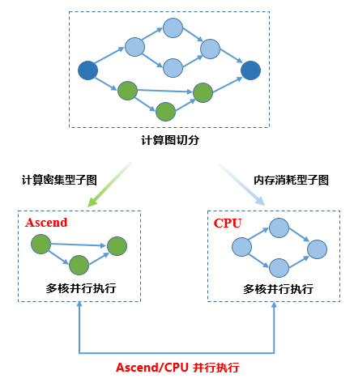
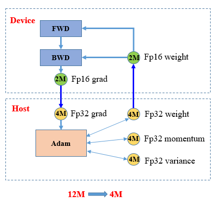
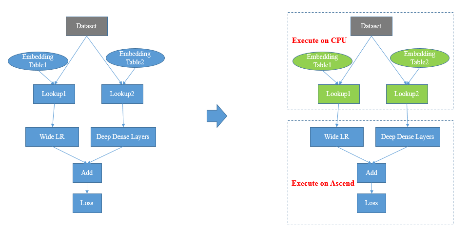
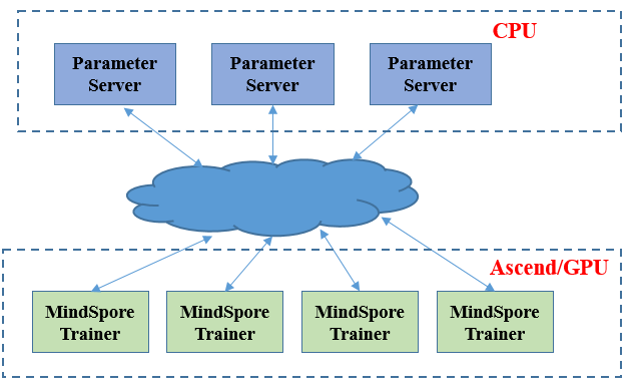

# 异构并行训练

`Ascend` `GPU` `设计` `模型运行`

<!-- TOC -->

- [异构并行训练](#异构并行训练)
    - [概述](#概述)
    - [计算流程](#计算流程)
    - [优化器异构](#优化器异构)
    - [Embedding异构](#embedding异构)
    - [PS异构](#ps异构)
    - [约束](#约束)

<!-- /TOC -->

<a href="https://gitee.com/mindspore/docs/blob/r1.5/docs/mindspore/programming_guide/source_zh_cn/design/heterogeneous_training.md" target="_blank"></a>

## 概述

异构并行训练方法是通过分析图上算子内存占用和计算密集度，将内存消耗巨大或适合CPU逻辑处理的算子切分到CPU子图，将内存消耗较小计算密集型算子切分到硬件加速器子图，框架协同不同子图进行网络训练，使得处于不同硬件且无依赖关系的子图能够并行进行执行的过程。

## 计算流程

MindSpore异构并行训练典型的计算流程如下图所示：



1. 用户设置网络执行的后端

   ```python
   from mindspore import context
   context.set_context(device_target="Ascend");
   ```

2. 用户设置特定算子执行后端

   ```python
   prim.add_prim_attr("primitive_target", "CPU");
   ```

3. 框架根据计算图算子标志进行切图
4. 框架调度不同后端执行子图

当前典型使用异构并行计算的场景有：优化器异构、Embedding异构、PS异构。

## 优化器异构

在盘古或GPT3大模型训练过程中，优化器状态占用了大量内存，进而限制了可训练的模型规模。使用优化器异构，将优化器指定到CPU上执行，可以极大扩展可训练模型规模：



如图所示，将Adam算子配置到CPU执行同时指定加速器进行FP16计算，可以将参数内存占用降低到原始的1/3。

1. 配置优化器算子到CPU执行
2. 初始化FP16的权重参数以及FP32的优化器状态变量
3. 将输入优化器的梯度转为FP16（如果本来就是FP16梯度，可忽略这步）
4. 权重和梯度转为FP32参与优化器运算
5. 更新后的FP32权重赋值给FP16的权重

优化器异构代码样例如下：

```python
import numpy as np
from mindspore import dtype as mstype
import mindspore.ops as ops
from mindspore.common.initializer import initializer
from mindspore import Tensor
from mindspore import ParameterTuple
from mindspore.nn import Optimizer
_adam_opt = ops.MultitypeFuncGraph("adam_opt")
host_assign = ops.Assign()
host_assign.add_prim_attr("primitive_target", "CPU")
host_cast = ops.Cast()
host_cast.add_prim_attr("primitive_target", "CPU")
device_cast = ops.Cast()

@_adam_opt.register("Function", "Tensor", "Tensor", "Tensor", "Tensor", "Number", "Tensor", "Tensor", "Tensor",
                    "Tensor", "Bool", "Bool")
def _update_run_kernel(opt, beta1, beta2, eps, lr, weight_decay, param, m, v, gradient, decay_flags, optim_filter):
  """
  Update parameters by AdamWeightDecay op.
  """
  success = True
  if optim_filter:
    param32 = host_cast(param, mstype.float32)
    gradient = device_cast(gradient, mstype.float32)
    if decay_flags:
      next_param = opt(param32, m, v, lr, beta1, beta2, eps, weight_decay, gradient)
    else:
      next_param = opt(param32, m, v, lr, beta1, beta2, eps, 0.0, gradient)
    ret = host_assign(param, host_cast(ops.depend(param32, next_param), ops.dtype(param)))
    return ops.depend(success, ret)
  return success

class AdamWeightDecayOp(Optimizer):
  def __init__(self, params, learning_rate=1e-3, beta1=0.9, beta2=0.999, eps=1e-6, weight_decay=0.0):
    super(AdamWeightDecayOp, self).__init__(learning_rate, params, weight_decay)
    self.beta1 = Tensor(np.array([beta1]).astype(np.float32))
    self.beta2 = Tensor(np.array([beta2]).astype(np.float32))
    self.eps = Tensor(np.array([eps]).astype(np.float32))
    self.moments1 = self.clone_param32(prefix="adam_m", init='zeros')
    self.moments2 = self.clone_param32(prefix="adam_v", init='zeros')
    self.opt = ops.AdamWeightDecay()
    self.hyper_map = ops.HyperMap()
    self.opt.add_prim_attr("primitive_target", "CPU")

  def construct(self, gradients):
    """AdamWeightDecayOp"""
    lr = self.get_lr()
    if self.is_group:
      if self.is_group_lr:
        optim_result = self.map_reverse(ops.partial(_adam_opt, self.opt, self.beta1, self.beta2, self.eps),
                                        lr, self.weight_decay, self.parameters, self.moments1, self.moments2,
                                        gradients, self.decay_flags, self.optim_filter)
      else:
        optim_result = self.map_reverse(ops.partial(_adam_opt, self.opt, self.beta1, self.beta2, self.eps, lr),
                                        self.weight_decay, self.parameters, self.moments1, self.moments2,
                                        gradients, self.decay_flags, self.optim_filter)
    else:
      optim_result = self.map_reverse(ops.partial(_adam_opt, self.opt, self.beta1, self.beta2, self.eps, lr,
                                                self.weight_decay), self.parameters, self.moments1, self.moments2,
                                      gradients, self.decay_flags, self.optim_filter)
    return optim_result

  def clone_param32(self, prefix, init=None):
    new = []
    for old_param in self.parameters:
      param_init = init
      if init is None:
        param_init = old_param.init
      new_state = old_param.clone()
      new_state.set_dtype(mstype.float32)
      new_state.set_data(initializer(param_init, shape=old_param.shape, dtype=mstype.float32))
      new_state.name = prefix + '.' + new_state.name
      new.append(new_state)
    return ParameterTuple(new)
```

步骤4、5也可以直接融合到优化器算子中做进一步优化，完整的优化器异构训练流程可以参考： <https://gitee.com/mindspore/models/tree/r1.5/official/nlp/pangu_alpha>

## Embedding异构

在一些需要查Embedding大表的网络中，Embedding表往往有上百G的规模，受加速器内存大小限制，无法直接将整表加载到加速器上执行。通过将与权重表相连的算子放到CPU上执行，避免加速器由于内存限制而无法训练网络的问题。



1. 配置EmbeddingLookup算子到CPU执行

   ```python
   ops.EmbeddingLookup().add_prim_attr('primitive_target', 'CPU');
   ```

2. 配置EmbeddingLookup相关优化器到CPU执行

   ```python
   ops.FusedSparseLazyAdam(use_locking, use_nesterov).add_prim_attr("primitive_target", "CPU");
   ```

EmbeddingLookup算子设置代码样例如下：

```python
import mindspore.nn as nn
import mindspore.ops as ops
from mindspore import Parameter
from mindspore.common.initializer import initializer

class EmbeddingLookup(nn.Cell):

  def __init__(self, vocab_size, embedding_size, param_init='normal',
               target='CPU', sparse=True):
    """Initialize EmbeddingLookup."""
    super(EmbeddingLookup, self).__init__()
    validator.check_value_type('sparse', sparse, [bool], self.cls_name)
    self.vocab_size = validator.check_positive_int(vocab_size, 'vocab_size')
    self.target = target
    self.sparse = sparse
    if target not in ('CPU', 'DEVICE'):
      raise ValueError('Attr \'target\' of \'EmbeddingLookup\' Op passed '
                       + str(target) + ', should be one of values in \'CPU\', \'DEVICE\'.')
    if not sparse and target == 'CPU':
      raise ValueError('When target is CPU, embedding_lookup must be sparse.')
    if sparse:
      self.gatherv2 = ops.SparseGatherV2()
    else:
      self.gatherv2 = ops.Gather()
    self.embeddinglookup = ops.EmbeddingLookup().add_prim_attr('primitive_target', 'CPU')
    self.embedding_size = validator.check_positive_int(embedding_size, 'embedding_size')
    self.embedding_table = Parameter(initializer(param_init, [self.vocab_size, self.embedding_size]),
                                     name='embedding_table')

  def construct(self, indices):
    if self.target == "CPU":
      out = self.embeddinglookup(self.embedding_table, indices, 0)
    else:
      out = self.gatherv2(self.embedding_table, indices, 0)
    return out
```

当前nn目录下的EmbeddingLookup、FTRL、LazyAdam等算子已经封装好异构接口，用户只需设置target属性为CPU或DEVICE即可切换执行后端。

整体调用流程可以参考：<https://gitee.com/mindspore/models/tree/r1.5/official/recommend/wide_and_deep>

## PS异构

在EmbeddingTable达到T级别，单机内存无法放下时，使用Parameter Server，通过异构的Pull/Push算子进行权重的拉取和更新。



Parameter Server封装异构流程，用户只需配置参数使用PS即可，具体配置流程请参考[Parameter Server训练流程](https://www.mindspore.cn/docs/programming_guide/zh-CN/master/apply_parameter_server_training.html)。

此外，wide&deep网络中也有使用PS的流程，可参考：<https://gitee.com/mindspore/models/tree/r1.5/official/recommend/wide_and_deep>

## 约束

当前需要用户指定算子执行的后端，不支持根据网络进行自动化配置。
