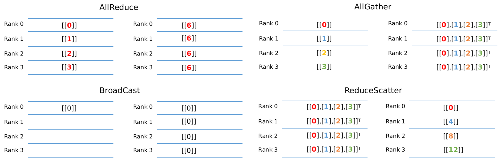

# 分布式集合通信原语

`Ascend` `分布式并行`

<!-- TOC -->

- [分布式集合通信原语](#分布式集合通信原语)
    - [AllReduce](#allreduce)
    - [AllGather](#allgather)
    - [ReduceScatter](#reducescatter)
    - [Broadcast](#broadcast)

<!-- /TOC -->

<a href="https://gitee.com/mindspore/docs/blob/r1.5/docs/mindspore/programming_guide/source_zh_cn/distributed_training_ops.md" target="_blank"></a>

在分布式训练中涉及通信操作例如`AllReduce`、`ReduceScatter`、`AllGather`和`Broadcast`等操作，如下图所示：



下述的每个章节代码给出了在4张GPU进行通信的示例，对应的输出结果来自于`rank0`。用户需要将代码另存为communication.py，通过mpirun命令去启动脚本，如下所示：

```bash
mpirun -output-filename log -merge-stderr-to-stdout -np 4 python communication.py
```

上述代码中的`-np`表示将启动4个进程任务，并且将输出日志保存在`log/1/rank.0`目录下面。`python communication.py`表示启动脚本。其中`mpirun`命令需要安装OpenMPI，对应的安装请参考<https://www.mindspore.cn/docs/programming_guide/zh-CN/r1.5/distributed_training_gpu.html>。

## AllReduce

`AllReduce`操作会将每卡对应输入`tensor`进行求和操作，最终每张卡输出是相同的`tensor`，例如上图左上部分所示，每张卡各自的输入为`0, 1, 2, 3`，经过`AllReduce`之后，每张卡输出的结果为每张卡输入之和为6(0+1+2+3)。

```python
import numpy as np
from mindspore.communication import init, get_rank
from mindspore import Tensor
import mindspore.nn as nn
import mindspore.ops as ops

init()
class Net(nn.Cell):
    def __init__(self):
        super(Net, self).__init__()
        self.allreduce_sum = ops.AllReduce(ops.ReduceOp.SUM, group="nccl_world_group")

    def construct(self, x):
        return self.allreduce_sum(x)

value = get_rank()
input_x = Tensor(np.array([[value]]).astype(np.float32))
net = Net()
output = net(input_x)
print(output)
[[6.]]
```

## AllGather

`AllGather`操作会将每张卡的输入在第0维度上进行拼接，最终每张卡输出是相同的`tensor`。例如上图右上部分所示，每卡的输入是大小为1x1的`tensor`，经过`AllGather`操作之后，每卡的输入都构成了输出的一部分，对应的输出shape为[4,1]。其中索引为[0,0]元素值来自于`rank0`的输入，索引为[1,0]的元素值来自于`rank1`的输入。

```python
# This example should be run with four devices. Refer to the tutorial > Distributed Training on mindspore.cn
import numpy as np
import mindspore.ops as ops
import mindspore.nn as nn
from mindspore.communication import init, get_rank
from mindspore import Tensor, context

context.set_context(mode=context.GRAPH_MODE)
init()
class Net(nn.Cell):
    def __init__(self):
        super(Net, self).__init__()
        self.allgather = ops.AllGather()

    def construct(self, x):
        return self.allgather(x)

value = get_rank()
input_x = Tensor(np.array([[value]]).astype(np.float32))
net = Net()
output = net(input_x)
print(output)
[[0.],
 [1.],
 [2.],
 [3.]]
```

## ReduceScatter

`ReduceScatter`操作会将每张卡的输入先进行求和(`Reduce`)，然后在第0为维度按卡数切分，分发到对应的卡上。例如上图右下角所示，每卡的输入均为4x1的`tensor`，先进行求和得到[0,4, 8, 12]的`tensor`，然后进行分发，每卡获得1x1大小的`tensor`。

```python
# This example should be run with four devices. Refer to the tutorial > Distributed Training on mindspore.cn
from mindspore import Tensor, context
from mindspore.communication import init, get_rank
import mindspore.nn as nn
import mindspore.ops as ops
import numpy as np

context.set_context(mode=context.GRAPH_MODE)
init()
class Net(nn.Cell):
    def __init__(self):
        super(Net, self).__init__()
        self.reducescatter = ops.ReduceScatter(ops.ReduceOp.SUM)

    def construct(self, x):
        return self.reducescatter(x)

input_x = Tensor(np.array([[0], [1], [2], [3]]).astype(np.float32))
net = Net()
output = net(input_x)
print(output)
[[0.]]
```

## Broadcast

`Broadcast`操作是将某张卡的输入广播到其他卡上，常见于参数的初始化。例如将0卡大小为1x1的`tensor`进行广播，最终每张卡的结果均为相同的[[0]]。

```python
# This example should be run with multiple processes.
# Please refer to the tutorial > Distributed Training on mindspore.cn.
from mindspore import Tensor
from mindspore import context
from mindspore.communication import init
import mindspore.nn as nn
import mindspore.ops as ops
import numpy as np

context.set_context(mode=context.GRAPH_MODE)
init()
class Net(nn.Cell):
    def __init__(self):
        super(Net, self).__init__()
        self.broadcast = ops.Broadcast(1)

    def construct(self, x):
        return self.broadcast((x,))

input_x = Tensor(np.array([[0]]).astype(np.int32))
net = Net()
output = net(input_x)
print(output)
[[0]]
```
