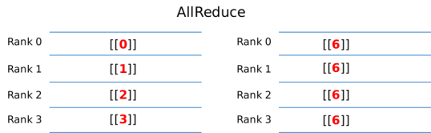
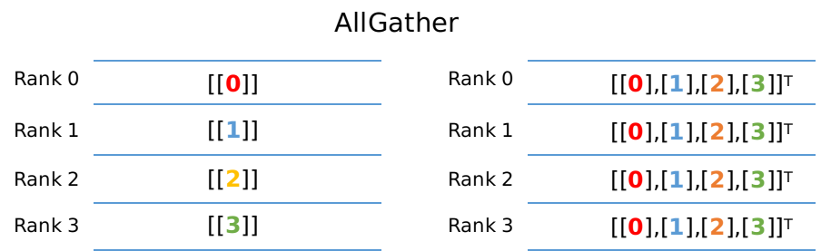
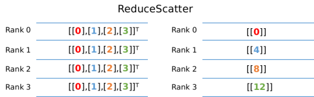

# 分布式集合通信原语

`Ascend` `GPU` `分布式并行`

<!-- TOC -->

- [分布式集合通信原语](#分布式集合通信原语)
    - [AllReduce](#allreduce)
    - [AllGather](#allgather)
    - [ReduceScatter](#reducescatter)
    - [Broadcast](#broadcast)

<!-- /TOC -->

<a href="https://gitee.com/mindspore/docs/blob/master/docs/mindspore/programming_guide/source_zh_cn/distributed_training_ops.md" target="_blank"></a>

在分布式训练中涉及例如`AllReduce`、`ReduceScatter`、`AllGather`和`Broadcast`等通信操作进行数据传输，我们将在下述的章节分别阐述其含义和示例代码。

下述每个章节中给出了使用4张GPU进行不同通信操作的示例。示例中的输出来自于0号卡`rank0`程序的结果。用户需要将下述每个章节代码另存为communication.py。因为涉及到多卡程序，用户需要通过`mpirun`命令去启动communication.py。其中`mpirun`命令需要安装OpenMPI以及NCCL，对应的安装请参考[此处](https://www.mindspore.cn/docs/programming_guide/zh-CN/master/distributed_training_gpu.html)。准备好communication.py后，在命令行中输入如下启动命令，即可启动多卡程序：

```bash
mpirun -output-filename log -merge-stderr-to-stdout -np 4 python communication.py
```

上述代码中的`-np`表示将启动4个进程任务，分别占用0，1，2，3号卡，并且将输出日志保存在`log/1/rank.0`目录下面。用户可以在此查看程序的输出结果。`python communication.py`表示启动脚本。

## AllReduce



`AllReduce`操作会将每卡中`AllReduce`算子的输入tensor进行求和操作，最终每卡的`AllReduce`算子输出是相同的数值。例如上图所示，每张卡AllReduce算子输入分别为`0, 1, 2, 3`。经过`AllReduce`之后，每张卡输出的结果为所有卡输入之和为6(0+1+2+3)。

示例代码如下：我们根据rank号(每张卡所属通信编号)初始化每个进程中`AllReduce`算子输入的数值，例如卡0，我们申请了一个1x1大小，数值为0的输入。然后调用`AllReduce`算子，在通信域为`0-1-2-3`的卡(所有卡的通信范围即nccl_world_group)中进行通信，并且打印输出结果。

```python
import numpy as np
from mindspore.communication import init, get_rank
from mindspore import Tensor
import mindspore.nn as nn
import mindspore.ops as ops

init()
class Net(nn.Cell):
    def __init__(self):
        super(Net, self).__init__()
        self.allreduce_sum = ops.AllReduce(ops.ReduceOp.SUM, group="nccl_world_group")

    def construct(self, x):
        return self.allreduce_sum(x)

value = get_rank()
input_x = Tensor(np.array([[value]]).astype(np.float32))
net = Net()
output = net(input_x)
print(output)
```

其中0卡的运行结果如下，输出日志路径为`log/1/rank.0`：

```text
[[6.]]
```

## AllGather



`AllGather`操作会将每张卡的输入tensor的第0维度上进行拼接，最终每张卡输出是相同的数值。例如上图所示，每卡的输入是大小为1x1的tensor，经过`AllGather`操作之后，每卡`AllGather`算子的输出shape为[4,1]。其中索引为[0,0]的元素值来自于0号卡`AllGather`的输入[[0.0]]，索引为[1,0]的元素值来自于1号卡`AllGather`的输入[[1.0]]。

示例代码如下：我们根据rank号(每张卡所属通信编号)初始化每个进程中`AllGather`算子输入的数值，例如卡0，我们申请了一个1x1大小，数值为0的输入。然后调用`AllGather`算子，在通信域为`0-1-2-3`的卡(所有卡的通信范围即nccl_world_group)中进行通信，并且打印输出结果。

```python
import numpy as np
import mindspore.ops as ops
import mindspore.nn as nn
from mindspore.communication import init, get_rank
from mindspore import Tensor, context

context.set_context(mode=context.GRAPH_MODE)
init()
class Net(nn.Cell):
    def __init__(self):
        super(Net, self).__init__()
        self.allgather = ops.AllGather()

    def construct(self, x):
        return self.allgather(x)

value = get_rank()
input_x = Tensor(np.array([[value]]).astype(np.float32))
net = Net()
output = net(input_x)
print(output)
```

运行结果如下，输出日志路径为`log/1/rank.0`：

```text
[[0.],
 [1.],
 [2.],
 [3.]]
```

## ReduceScatter



`ReduceScatter`操作会将每张卡的输入先进行求和，然后在第0维度按卡数切分，将数据分发到对应的卡上。例如上图所示，每卡的输入均为4x1的tensor。`ReduceScatter`先对输入求和得到[0, 4, 8, 12]的tensor，然后进行分发，每卡获得1x1大小的tensor。例如卡0对应的输出结果为[[0.0]]，卡1对应的输出结果为[[4.0]]。

示例代码如下：我们根据rank号(每张卡所属通信编号)初始化每个进程中`ReduceScatter`算子输入的数值，例如卡0，我们申请了一个4x1大小，数值为0的输入。然后调用`ReduceScatter`算子，在通信域为`0-1-2-3`的卡(所有卡的通信范围即nccl_world_group)中进行通信，并且打印输出结果。

```python
from mindspore import Tensor, context
from mindspore.communication import init, get_rank
import mindspore.nn as nn
import mindspore.ops as ops
import numpy as np

context.set_context(mode=context.GRAPH_MODE)
init()
class Net(nn.Cell):
    def __init__(self):
        super(Net, self).__init__()
        self.reducescatter = ops.ReduceScatter(ops.ReduceOp.SUM)

    def construct(self, x):
        return self.reducescatter(x)

input_x = Tensor(np.array([[0], [1], [2], [3]]).astype(np.float32))
net = Net()
output = net(input_x)
print(output)
```

运行结果如下，输出日志路径为`log/1/rank.0`：

```text
[[0.]]
```

## Broadcast


`Broadcast`操作是将某张卡的输入广播到其他卡上，常见于参数的初始化。例如上图中，将0卡大小为1x1的tensor进行广播，最终每张卡输出均为[[0]]。

示例代码如下：我们将`Broadcast`算子的根节点设置为0号卡，表示将从0号卡广播数据到其他卡上。同时申请了一个1x1大小，数值为0的输入。然后调用`Broadcast`算子，在通信域为`0-1-2-3`的卡(所有卡的通信范围即nccl_world_group)中进行通信，最终每张卡都会输出来自卡0的并且打印输出结果。

```python
from mindspore import Tensor
from mindspore import context
from mindspore.communication import init
import mindspore.nn as nn
import mindspore.ops as ops
import numpy as np

context.set_context(mode=context.GRAPH_MODE)
init()
class Net(nn.Cell):
    def __init__(self):
        super(Net, self).__init__()
        self.broadcast = ops.Broadcast(0)

    def construct(self, x):
        return self.broadcast((x,))

input_x = Tensor(np.array([[0]]).astype(np.int32))
net = Net()
output = net(input_x)
print(output)
```

运行结果如下，输出日志路径为`log/1/rank.0`：

```text
[[0]]
```
