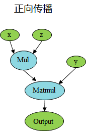
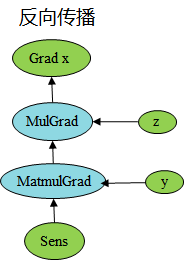
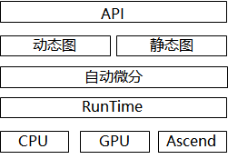

# 动态图和静态图

`动态图` `静态图` `PyNative` `动静统一`

<!-- TOC -->

- [动态图和静态图](#动态图和静态图)
    - [动态图和静态图的概念](#动态图和静态图的概念)
    - [MindSpore静态图](#MindSpore静态图)
    - [MindSpore动态图](#MindSpore动态图)
        - [PyNative执行原理](#PyNative执行原理)
        - [PyNative自动微分原理](#PyNative自动微分原理)
        - [PyNative应用实例](#PyNative应用实例)
    - [动静统一](#动静统一)
        - [概述](#概述)
        - [动态图和静态图互相转换](#动态图和静态图互相转换)
        - [动静结合](#动静结合)

<!-- /TOC -->

<a href="https://gitee.com/mindspore/docs/blob/master/docs/mindspore/programming_guide/source_zh_cn/dynamic_graph_and_static_graph.md" target="_blank"></a>

## 动态图和静态图的概念

目前主流的深度学习框架的执行模式有两种，分别为静态图模式和动态图模式。

静态图模式下，程序在编译执行时将先生成神经网络的图结构，然后再执行图中涉及的计算操作。因此在静态图模式下允许编译器对执行图进行更大程度的优化，从而获得更好的执行性能，而恰恰由于存在着这样的深度优化，使得编译器实际执行和原始代码之间有着更大的差距，导致代码中的错误将更将难以发现以及调试。

动态图模式下，程序按照我们编写的代码顺序进行执行，在执行正向过程中根据反向传播的原理，动态的生成反向执行图，在这种模式下，执行的过程完全按照我们实际编写的代码来执行，因此该模式下更容易进行代码或者网络的调试，并且意味着更加容易将我们大脑中的想法转换成实际的代码。

## MindSpore静态图

在MindSpore中静态图模式又被称为Graph模式，可以通过context.set_context(mode=context.GRAPH_MODE)来设置成静态图模式。MindSpore通过源码转换的方式，将Python的源码转换成IR，再在此基础上进行相关的图优化，最终在硬件设备上执行优化后的图。由于静态图模式下，可以针对图进行全局的优化，因此在静态图下能获得较好的性能，但是执行图是从源码转换而来，因此在静态图下不是所有的Python语法都能支持。

## MindSpore动态图

在MindSpore中动态图模式又被称为PyNative模式，可以通过context.set_context(mode=context.PYNATIVE_MODE)来设置成动态图模式。

### PyNative执行原理

在PyNative模式下，用户可以使用完整的Python API，此外针对使用MindSpore提供的API时，框架会根据用户选择的硬件平台（Ascend，GPU，CPU），将算子API的操作在对应的硬件平台上执行，并返回相应的结果。框架整体的执行过程如下：


通过前端的Python API，调用到框架层，最终到相应的硬件设备上进行计算。例如：完成一个加法

```python
import numpy as np
import mindspore.context as context
import mindspore.nn as nn
from mindspore import Tensor
from mindspore.ops as ops

context.set_context(mode=context.PYNATIVE_MODE, device_target="Ascend")
x =Tensor(np.ones([1, 3, 3, 4]).astype(np.float32))
y = Tensor(np.ones([1, 3, 3, 4]).astype(np.float32))
output = ops.add(x, y)
print(output.asnumpy())
```

此例中，当调用到Python接口ops.add(x, y)时，会将Python的接口调用通过Pybind11调用到框架的C++层，转换成C++的调用，接着框架会根据用户设置的device_target选择对应的硬件设备，在该硬件设备上执行add这个操作。

从上述原理可以看到，在PyNative模式下，Python脚本代码会根据Python的语法进行执行，而执行过程中涉及到MindSpore的API，会根据用户设置在不同的硬件上进行执行，从而进行加速。因此，在PyNative模式下，用户可以随意使用Python的语法以及调试方法。例如可以使用常见的PyCharm、VS Code等IDE进行代码的调试。

### PyNative自动微分原理

在前面的介绍中，我们可以看出，在PyNative下执行正向过程完全是按照Python的语法进行执行。在PyNative下是基于Tensor进行实现反向传播的，我们在执行正向过程中，将所有应用于Tensor的操作记录下来，并针对每个操作求取其反向，并将所有反向过程串联起来形成整体反向传播图（简称反向图）。最终，将反向图在设备上进行执行计算出梯度。

反向构图过程示例，如下代码，对矩阵x乘上固定参数z，然后与y进行矩阵乘法，最终对x进行求导。

```python
import numpy as np
import mindspore.nn as nn
import mindspore.ops as ops
from mindspore import Tensor, context
from mindspore import ParameterTuple, Parameter
from mindspore import dtype as mstype

context.set_context(mode=context.PYNATIVE_MODE, device_target="GPU")

class Net(nn.Cell):
    def __init__(self):
        super(Net, self).__init__()
        self.matmul = ops.MatMul()
        self.z = Parameter(Tensor(np.array([2.0], np.float32)), name='z')

    def construct(self, x, y):
        x = x * self.z
        out = self.matmul(x, y)
        return out

class GradNetWrtX(nn.Cell):
    def __init__(self, net):
        super(GradNetWrtX, self).__init__()
        self.net = net
        self.grad_op = ops.GradOperation()

    def construct(self, x, y):
        gradient_function = self.grad_op(self.net)
        return gradient_function(x, y)

x = Tensor([[0.8, 0.6, 0.2], [1.8, 1.3, 1.1]], dtype=mstype.float32)
y = Tensor([[0.11, 3.3, 1.1], [1.1, 0.2, 1.4], [1.1, 2.2, 0.3]], dtype=mstype.float32)
output = GradNetWrtX(Net())(x, y)
print(output)
```

 

根据上述PyNative下构图原理，我们可以看到，在正向传播过程中，我们记录了Mul的计算过程，根据Mul对应的反向bprop的定义，得到了反向的MulGrad算子，根据Mul算子的bprop定义，如下：

```python
@bprop_getters.register(P.Mul)
def get_bprop_mul(self):
    """Grad definition for `Mul` operation."""
    mul_func = P.Mul()

    def bprop(x, y, out, dout):
        bc_dx = mul_func(y, dout)
        bc_dy = mul_func(x, dout)
        return binop_grad_common(x, y, bc_dx, bc_dy)

    return bprop
```

可以看到对Mul的输入求反向，需要两个输入和输出的反向传播梯度值，此时根据实际的输入值，可以将z连接到MulGrad。以此类推，对下一个算子Matmul，相应的得到MatmulGrad信息，再根据bprop的输入输出，将上下文梯度传播连接起来。

最终，对于初始传播，在MindSpore中使用[sens](https://mindspore.cn/docs/api/zh-CN/master/api_python/ops/mindspore.ops.GradOperation.html?highlight=gradoperation#mindspore.ops.GradOperation)进行缩放，默认值为1。同理对于输入y求导，可以使用同样的过程进行推导。

### PyNative应用实例

设置模式

```python
context.set_context(mode=context.PYNATIVE_MODE)
```

执行单算子

```python
import numpy as np
import mindspore.ops as ops
from mindspore import context, Tensor

context.set_context(mode=context.PYNATIVE_MODE, device_target="CPU")

x = Tensor(np.ones([1, 3, 5, 5]).astype(np.float32))
y = Tensor(np.ones([1, 3, 5, 5]).astype(np.float32))
z = ops.add(x, y)
print(z.asnumpy())
```

执行函数

```python
import numpy as np
from mindspore import context, Tensor
import mindspore.ops as ops

context.set_context(mode=context.PYNATIVE_MODE, device_target="CPU")

def add_func(x, y):
    z = ops.add(x, y)
    z = ops.add(z, x)
    return z

x = Tensor(np.ones([3, 3], dtype=np.float32))
y = Tensor(np.ones([3, 3], dtype=np.float32))
output = add_func(x, y)
print(output.asnumpy())
```

执行网络，在construct中定义网络结构，在具体运行时，下例中，执行net(x, y)时，会从construct函数中开始执行。

```python
import numpy as np
import mindspore.nn as nn
import mindspore.ops as ops
from mindspore import context, Tensor

context.set_context(mode=context.PYNATIVE_MODE, device_target="CPU")

class Net(nn.Cell):
    def __init__(self):
        super(Net, self).__init__()
        self.mul = ops.Mul()

    def construct(self, x, y):
        return self.mul(x, y)

x = Tensor(np.array([1.0, 2.0, 3.0]).astype(np.float32))
y = Tensor(np.array([4.0, 5.0, 6.0]).astype(np.float32))

net = Net()
print(net(x, y))
```

PyNative下构建网络，可以在网络初始化时，明确定义网络所需要的各个部分，在construct中定义网络结构。

```python
import mindspore.nn as nn
from mindspore.common.initializer import Normal

class LeNet5(nn.Cell):
    def __init__(self, num_class=10, num_channel=1, include_top=True):
        super(LeNet5, self).__init__()
        self.conv1 = nn.Conv2d(num_channel, 6, 5, pad_mode='valid')
        self.conv2 = nn.Conv2d(6, 16, 5, pad_mode='valid')
        self.relu = nn.ReLU()
        self.max_pool2d = nn.MaxPool2d(kernel_size=2, stride=2)
        self.include_top = include_top
        if self.include_top:
            self.flatten = nn.Flatten()
            self.fc1 = nn.Dense(16 * 5 * 5, 120, weight_init=Normal(0.02))
            self.fc2 = nn.Dense(120, 84, weight_init=Normal(0.02))
            self.fc3 = nn.Dense(84, num_class, weight_init=Normal(0.02))


    def construct(self, x):
        x = self.conv1(x)
        x = self.relu(x)
        x = self.max_pool2d(x)
        x = self.conv2(x)
        x = self.relu(x)
        x = self.max_pool2d(x)
        if not self.include_top:
            return x
        x = self.flatten(x)
        x = self.relu(self.fc1(x))
        x = self.relu(self.fc2(x))
        x = self.fc3(x)
        return x

```

Loss函数及优化器，在PyNative模式下，通过针对每个参数对应的梯度进行参数更新。

```python
net_loss = nn.SoftmaxCrossEntropyWithLogits(sparse=True, reduction="mean")
net_opt = nn.Momentum(network.trainable_params(), config.lr, config.momentum)
```

模型参数保存，保存模型可以通过定义CheckpointConfig来指定模型保存的参数。

save_checkpoint_steps：每多少个step保存一下参数；keep_checkpoint_max：最多保存多少份模型参数。详细使用方式请参考[保存模型](./save_model.md)。

```python
config_ck = CheckpointConfig(save_checkpoint_steps=config.save_checkpoint_steps,
                                 keep_checkpoint_max=config.keep_checkpoint_max)
ckpoint_cb = ModelCheckpoint(prefix="checkpoint_lenet", directory=config.ckpt_path, config=config_ck)
```

使用PyNative训练网络

```python
context.set_context(mode=context.PYNATIVE_MODE, device_target=config.device_target)
ds_train = create_dataset(os.path.join(config.data_path, "train"), config.batch_size)
network = LeNet5(config.num_classes)
net_loss = nn.SoftmaxCrossEntropyWithLogits(sparse=True, reduction="mean")
net_opt = nn.Momentum(network.trainable_params(), config.lr, config.momentum)
time_cb = TimeMonitor(data_size=ds_train.get_dataset_size())
config_ck = CheckpointConfig(save_checkpoint_steps=config.save_checkpoint_steps,
                                keep_checkpoint_max=config.keep_checkpoint_max)
ckpoint_cb = ModelCheckpoint(prefix="checkpoint_lenet", directory=config.ckpt_path, config=config_ck)

model = Model(network, net_loss, net_opt, metrics={"Accuracy": Accuracy()}, amp_level="O2")
```

完整的运行代码可以到model zoo下[lenet](https://gitee.com/mindspore/mindspore/tree/master/model_zoo/official/cv/lenet)，并设置context.set_context(mode=context.PYNATIVE_MODE, device_target=config.device_target)。

## 动静统一

### 概述

当前在业界支持动态图和静态图两种模式，动态图通过解释执行，具有动态语法亲和性，表达灵活；静态图使用jit编译优化执行，偏静态语法，在语法上有较多限制。动态图和静态图的编译流程不一致，语法约束不一致。MindSpore针对动态图和静态图模式，首先统一API表达，在两种模式下使用相同的API；其次统一动态图和静态图的底层微分机制。



### 动态图和静态图互相转换

在MindSpore中，我们可以通过控制模式输入参数来切换执行使用动态图还是静态图。例如：

```python
context.set_context(mode=context.PYNATIVE_MODE)
```

由于在静态图下，对于Python语法有所限制，因此从动态图切换成静态图时，需要符合静态图的语法限制，才能正确使用静态图来进行执行。更多静态图的语法限制可以参考[静态图语法限制](https://www.mindspore.cn/docs/note/zh-CN/master/static_graph_syntax_support.html)。

### 动静结合

MindSpore支持在动态图下使用静态编译的方式来进行混合执行，通过使用ms_function修饰需要用静态图来执行的函数对象，即可实现动态图和静态图的混合执行，更多ms_function的使用可参考[ms_function文档](https://www.mindspore.cn/docs/programming_guide/zh-CN/master/ms_function.html)。

例如：

```python
import numpy as np
import mindspore as ms
import mindspore.nn as nn
from mindspore import Tensor
from mindspore import ms_function
from mindspore import Parameter
import mindspore.context as context

class AddMulMul(nn.Cell):
    def __init__(self):
        super(AddMulMul, self).__init__()
        self.param = Parameter(Tensor(0.5, ms.float32))

    @ms_function
    def construct(self, x):
        x = x + x
        x = x * self.param
        x = x * x
        return x

class CellCallSingleCell(nn.Cell):
    def __init__(self):
        super(CellCallSingleCell, self).__init__()
        self.conv = nn.Conv2d(1, 2, kernel_size=2, stride=1, padding=0, weight_init="ones", pad_mode="valid")
        self.bn = nn.BatchNorm2d(2, momentum=0.99, eps=0.00001, gamma_init="ones")
        self.relu = nn.ReLU()
        self.add_mul_mul = AddMulMul()

    def construct(self, x):
        x = self.conv(x)
        x = self.bn(x)
        x = self.add_mul_mul(x)
        x = self.relu(x)
        return x

context.set_context(mode=context.PYNATIVE_MODE, device_target="GPU")
inputs = Tensor(np.ones([1, 1, 2, 2]).astype(np.float32))
net = CellCallSingleCell()
out = net(inputs)
print(out)
```

输出：

```text
[[[[15.999838]]
[[15.999838]]]]
```
