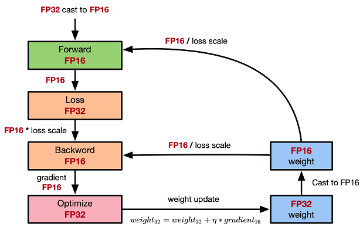

# 混合精度

`Ascend` `GPU` `模型调优`

感谢：[ZOMI酱](https://www.zhihu.com/people/ZOMI)

<!-- TOC -->

- [混合精度](#混合精度)
    - [概述](#概述)
    - [浮点数据类型](#浮点数据类型)
    - [使用FP16训练问题](#使用FP16训练问题)
    - [混合精度计算流程](#混合精度计算流程)
    - [MindSpore混合精度](#MindSpore混合精度)
        - [自动混合精度](#自动混合精度)
        - [手动混合精度](#手动混合精度)

<!-- /TOC -->

<a href="https://authoring-modelarts-cnnorth4.huaweicloud.com/console/lab?share-url-b64=aHR0cHM6Ly9vYnMuZHVhbHN0YWNrLmNuLW5vcnRoLTQubXlodWF3ZWljbG91ZC5jb20vbWluZHNwb3JlLXdlYnNpdGUvbm90ZWJvb2svbW9kZWxhcnRzL21pbmRzcG9yZV9taXhlZF9wcmVjaXNpb24uaXB5bmI=&imageid=65f636a0-56cf-49df-b941-7d2a07ba8c8c" target="_blank"></a>&nbsp;&nbsp;
<a href="https://obs.dualstack.cn-north-4.myhuaweicloud.com/mindspore-website/notebook/master/notebook/mindspore_mixed_precision.ipynb"></a>&nbsp;&nbsp;
<a href="https://obs.dualstack.cn-north-4.myhuaweicloud.com/mindspore-website/notebook/master/notebook/mindspore_mixed_precision.py"></a>&nbsp;&nbsp;
<a href="https://gitee.com/mindspore/docs/blob/master/docs/mindspore/programming_guide/source_zh_cn/enable_mixed_precision.md" target="_blank"></a>

## 概述

通常我们训练神经网络模型的时候，默认使用的数据类型为单精度FP32。近年来，为了加快训练时间、减少网络训练时候所占用的内存，并且保存训练出来的模型精度持平的条件下，业界提出越来越多的混合精度训练的方法。这里的混合精度训练是指在训练的过程中，同时使用单精度（FP32）和半精度（FP16）。

## 浮点数据类型

浮点数据类型主要分为双精度（FP64）、单精度（FP32）、半精度（FP16）。在神经网络模型的训练过程中，一般默认采用单精度（FP32）浮点数据类型，来表示网络模型权重和其他参数。在了解混合精度训练之前，这里简单了解浮点数据类型。

根据IEEE二进制浮点数算术标准（IEEE 754）的定义，浮点数据类型分为双精度（FP64）、单精度（FP32）、半精度（FP16）三种，其中每一种都有三个不同的位来表示。FP64表示采用8个字节共64位，来进行的编码存储的一种数据类型；同理，FP32表示采用4个字节共32位来表示；FP16则是采用2字节共16位来表示。如图所示：


从图中可以看出，与FP32相比，FP16的存储空间是FP32的一半，FP32则是FP64的一半。主要分为三个部分：

- 最高位表示符号位sign bit。
- 中间表示指数位exponent bit。
- 低位表示分数位fraction bit。

以FP16为例子，第一位符号位sign表示正负符号，接着5位表示指数exponent，最后10位表示分数fraction。公式为：

$$x=(-1)^{S}\times2^{E-15}\times(1+\frac{fraction}{1024})$$

同理，一个规则化的FP32的真值为：

$$x=(-1)^{S}\times2^{E-127}\times(1.M)$$

一个规格化的FP64的真值为：

$$x=(-1)^{S}\times2^{E-1023}\times(1.M)$$

FP16可以表示的最大值为 0 11110 1111111111，计算方法为：

$$(-1)^0\times2^{30-15}\times1.1111111111 = 1.1111111111(b)\times2^15 = 1.9990234375(d)\times2^15 = 65504$$

FP16可以表示的最小值为 0 00001 0000000000，计算方法为：

$$ (-1)^{1}\times2^{1-15}=2^{-14}=6.104×10^{-5}=-65504$$

因此FP16的最大取值范围是[-65504, 66504]，能表示的精度范围是 $2^{-24}$，超过这个数值的数字会被直接置0。

## 使用FP16训练问题

首先来看看为什么需要混合精度。使用FP16训练神经网络，相对比使用FP32带来的优点有：

- 减少内存占用：FP16的位宽是FP32的一半，因此权重等参数所占用的内存也是原来的一半，节省下来的内存可以放更大的网络模型或者使用更多的数据进行训练。
- 加快通讯效率：针对分布式训练，特别是在大模型训练的过程中，通讯的开销制约了网络模型训练的整体性能，通讯的位宽少了意味着可以提升通讯性能，减少等待时间，加快数据的流通。
- 计算效率更高：在特殊的AI加速芯片如华为昇腾系列的Ascend 910和310系列，或者NVIDIA VOLTA架构的GPU上，使用FP16的执行运算性能比FP32更加快。

但是使用FP16同样会带来一些问题，其中最重要的是精度溢出和舍入误差。

- 数据溢出：数据溢出比较好理解，FP16的有效数据表示范围为 $[6.10\times10^{-5}, 65504]$，FP32的有效数据表示范围为 $[1.4\times10^{-45}, 1.7\times10^{38}]$。可见FP16相比FP32的有效范围要窄很多，使用FP16替换FP32会出现上溢（Overflow）和下溢（Underflow）的情况。而在深度学习中，需要计算网络模型中权重的梯度（一阶导数），因此梯度会比权重值更加小，往往容易出现下溢情况。
- 舍入误差：Rounding Error指示是当网络模型的反向梯度很小，一般FP32能够表示，但是转换到FP16会小于当前区间内的最小间隔，会导致数据溢出。如0.00006666666在FP32中能正常表示，转换到FP16后会表示成为0.000067，不满足FP16最小间隔的数会强制舍入。

## 混合精度计算流程

MindSpore混合精度典型的计算流程如下图所示：



1. 参数以FP32存储；
2. 正向计算过程中，遇到FP16算子，需要把算子输入和参数从FP32 cast成FP16进行计算；
3. 将Loss层设置为FP32进行计算；
4. 反向计算过程中，首先乘以Loss Scale值，避免反向梯度过小而产生下溢；
5. FP16参数参与梯度计算，其结果将被cast回FP32；
6. 除以Loss scale值，还原被放大的梯度；
7. 判断梯度是否存在溢出，如果溢出则跳过更新，否则优化器以FP32对原始参数进行更新。

本文通过自动混合精度和手动混合精度的样例来讲解计算流程。

## MindSpore混合精度

### 自动混合精度

使用自动混合精度，需要调用`Model`接口，将待训练网络和优化器作为输入传进去，该接口会把网络模型的的算子转换成FP16算子。

> 除`BatchNorm`算子和Loss涉及到的算子外因为精度问题，仍然使用FP32执行运算。

使用`Model`接口具体的实现步骤为：

1. 引入MindSpore的模型训练接口`Model`；

2. 定义网络：该步骤和正常的网络定义相同(无需新增任何配置)；

3. 创建数据集：该步骤可参考[数据加载和处理]( https://www.mindspore.cn/docs/programming_guide/zh-CN/master/dataset_sample.html)；

4. 使用`Model`接口封装网络模型、优化器和损失函数，设置`amp_level`参数，详情参考[MindSpore API](https://www.mindspore.cn/docs/api/zh-CN/master/api_python/mindspore.html#mindspore.Model)。该步骤MindSpore会自动选择合适的算子自动进行FP32到FP16的类型转换。

下面是基础的代码样例，首先导入必须的库和声明，并定义LeNet5网络模型。

```python
import numpy as np
import mindspore.nn as nn
from mindspore.nn import Accuracy
from mindspore import context, Model
from mindspore.common.initializer import Normal
from mindspore import dataset as ds

context.set_context(mode=context.GRAPH_MODE)
context.set_context(device_target="CPU")

class LeNet5(nn.Cell):
    """
    Lenet network

    Args:
        num_class (int): Number of classes. Default: 10.
        num_channel (int): Number of channels. Default: 1.

    Returns:
        Tensor, output tensor
    """

    def __init__(self, num_class=10, num_channel=1):
        super(LeNet5, self).__init__()
        self.conv1 = nn.Conv2d(num_channel, 6, 5, pad_mode='valid')
        self.conv2 = nn.Conv2d(6, 16, 5, pad_mode='valid')
        self.fc1 = nn.Dense(16 * 5 * 5, 120, weight_init=Normal(0.02))
        self.fc2 = nn.Dense(120, 84, weight_init=Normal(0.02))
        self.fc3 = nn.Dense(84, num_class, weight_init=Normal(0.02))
        self.relu = nn.ReLU()
        self.max_pool2d = nn.MaxPool2d(kernel_size=2, stride=2)
        self.flatten = nn.Flatten()

    def construct(self, x):
        x = self.max_pool2d(self.relu(self.conv1(x)))
        x = self.max_pool2d(self.relu(self.conv2(x)))
        x = self.flatten(x)
        x = self.relu(self.fc1(x))
        x = self.relu(self.fc2(x))
        x = self.fc3(x)
        return x
```

接着创建一个虚拟的随机数据集，用于样例模型的数据输入。

```Python
# create dataset
def get_data(num, img_size=(1, 32, 32), num_classes=10, is_onehot=True):
    for _ in range(num):
        img = np.random.randn(*img_size)
        target = np.random.randint(0, num_classes)
        target_ret = np.array([target]).astype(np.float32)
        if is_onehot:
            target_onehot = np.zeros(shape=(num_classes,))
            target_onehot[target] = 1
            target_ret = target_onehot.astype(np.float32)
        yield img.astype(np.float32), target_ret

def create_dataset(num_data=1024, batch_size=32, repeat_size=1):
    input_data = ds.GeneratorDataset(list(get_data(num_data)), column_names=['data','label'])
    input_data = input_data.batch(batch_size, drop_remainder=True)
    input_data = input_data.repeat(repeat_size)
    return input_data
```

设置`amp_level`参数，使用`Model`接口封装网络模型、优化器和损失函数。

```Python
ds_train = create_dataset()

# Initialize network
network = LeNet5(10)

# Define Loss and Optimizer
net_loss = nn.SoftmaxCrossEntropyWithLogits(reduction="mean")
net_opt = nn.Momentum(network.trainable_params(),learning_rate=0.01, momentum=0.9)
# Set amp level
model = Model(network, net_loss, net_opt, metrics={"Accuracy": Accuracy()}, amp_level="O2")

# Run training
model.train(epoch=10, train_dataset=ds_train)
```

### 手动混合精度

MindSpore目前还支持手动混合精度（当然，除非想自己定制特殊的网络和特性开发，否则不建议使用手动混合精度哦）。

假定在网络中只有一个Dense Layer使用FP16计算，其他Layer都用FP32计算。

> 混合精度配置以Cell为单位，Cell默认是FP32类型。

以下是一个手动混合精度的实现步骤：

1. 定义网络：该步骤与自动混合精度中的步骤2类似；

2. 配置混合精度：通过`to_float(mstype.float16)`把Cell中涉及的算子配置成FP16；

3. 使用`TrainOneStepCell`封装网络模型和优化器。

下面是基础的代码样例，首先导入必须的库和声明。

```python
import numpy as np

import mindspore.nn as nn
from mindspore import dtype as mstype
from mindspore import Tensor, context
import mindspore.ops as ops
from mindspore.nn import WithLossCell, TrainOneStepCell
from mindspore.nn import Momentum

context.set_context(mode=context.GRAPH_MODE)
context.set_context(device_target="Ascend")

```

网络定义无论是使用FP32还是FP16都是使用相同的方式，区别在于定义网络后，在初始化网络模型的时候声明dense层使用FP16进行计算，即`net.dense.to_float(mstype.float16)`。

```python
# Define network
class Net(nn.Cell):
    def __init__(self, input_channel, out_channel):
        super(Net, self).__init__()
        self.dense = nn.Dense(input_channel, out_channel)
        self.relu = ops.ReLU()

    def construct(self, x):
        x = self.dense(x)
        x = self.relu(x)
        return x

# Initialize network
net = Net(512, 128)
# Set mixing precision
net.dense.to_float(mstype.float16)

# Define training data, label
predict = Tensor(np.ones([64, 512]).astype(np.float32) * 0.01)
label = Tensor(np.zeros([64, 128]).astype(np.float32))

# Define Loss and Optimizer
loss = nn.SoftmaxCrossEntropyWithLogits()
optimizer = Momentum(params=net.trainable_params(), learning_rate=0.1, momentum=0.9)
net_with_loss = WithLossCell(net, loss)
train_network = TrainOneStepCell(net_with_loss, optimizer)
train_network.set_train()

# Run training
output = train_network(predict, label)
```

> 约束：使用混合精度时，只能由自动微分功能生成反向网络，不能由用户自定义生成反向网络，否则可能会导致MindSpore产生数据格式不匹配的异常信息。
