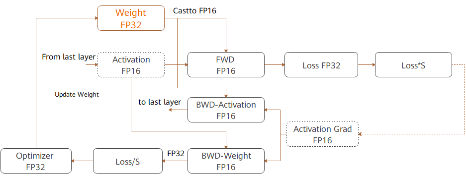

# 使能混合精度

`Ascend` `GPU` `模型调优`

<!-- TOC -->

- [使能混合精度](#使能混合精度)
    - [概述](#概述)
    - [计算流程](#计算流程)
    - [自动混合精度](#自动混合精度)
    - [手动混合精度](#手动混合精度)
    - [约束](#约束)

<!-- /TOC -->

<a href="https://authoring-modelarts-cnnorth4.huaweicloud.com/console/lab?share-url-b64=aHR0cHM6Ly9vYnMuZHVhbHN0YWNrLmNuLW5vcnRoLTQubXlodWF3ZWljbG91ZC5jb20vbWluZHNwb3JlLXdlYnNpdGUvbm90ZWJvb2svbW9kZWxhcnRzL21pbmRzcG9yZV9taXhlZF9wcmVjaXNpb24uaXB5bmI=&imageid=65f636a0-56cf-49df-b941-7d2a07ba8c8c" target="_blank"></a>&nbsp;&nbsp;
<a href="https://obs.dualstack.cn-north-4.myhuaweicloud.com/mindspore-website/notebook/r1.5/notebook/mindspore_mixed_precision.ipynb"></a>&nbsp;&nbsp;
<a href="https://obs.dualstack.cn-north-4.myhuaweicloud.com/mindspore-website/notebook/r1.5/notebook/mindspore_mixed_precision.py"></a>&nbsp;&nbsp;
<a href="https://gitee.com/mindspore/docs/blob/r1.5/docs/mindspore/programming_guide/source_zh_cn/enable_mixed_precision.md" target="_blank"></a>

## 概述

混合精度训练方法是通过混合使用单精度和半精度数据格式来加速深度神经网络训练的过程，同时保持了单精度训练所能达到的网络精度。混合精度训练能够加速计算过程，同时减少内存使用和存取，并使得在特定的硬件上可以训练更大的模型或`batch size`。

对于FP16的算子，若给定的数据类型是FP32，MindSpore框架的后端会进行降精度处理。用户可以开启INFO日志，并通过搜索关键字“Reduce precision”查看降精度处理的算子。

## 计算流程

MindSpore混合精度典型的计算流程如下图所示：



1. 参数以FP32存储；
2. 正向计算过程中，遇到FP16算子，需要把算子输入和参数从FP32 cast成FP16进行计算；
3. 将Loss层设置为FP32进行计算；
4. 反向计算过程中，首先乘以Loss Scale值，避免反向梯度过小而产生下溢；
5. FP16参数参与梯度计算，其结果将被cast回FP32；
6. 除以Loss scale值，还原被放大的梯度；
7. 判断梯度是否存在溢出，如果溢出则跳过更新，否则优化器以FP32对原始参数进行更新。

本文通过自动混合精度和手动混合精度的样例来讲解计算流程。

## 自动混合精度

使用自动混合精度，需要调用`Model`接口，将待训练网络和优化器作为输入传进去，该接口会将整张网络的算子转换成FP16算子(除`BatchNorm`算子和Loss涉及到的算子外)。

使用`Model`接口具体的实现步骤为：

1. 引入MindSpore的模型训练接口`Model`；

2. 定义网络：该步骤和普通的网络定义没有区别(无需手动配置某个算子的精度)；

3. 创建数据集。该步骤可参考 <https://www.mindspore.cn/docs/programming_guide/zh-CN/r1.5/dataset_sample.html>；

4. 使用`Model`接口封装网络模型、优化器和损失函数，设置`amp_level`参数，参考<https://www.mindspore.cn/docs/api/zh-CN/r1.5/api_python/mindspore.html#mindspore.Model>。在该步骤中，MindSpore会将有需要的算子自动进行类型转换。

代码样例如下：

```python
import numpy as np
import mindspore.nn as nn
from mindspore.nn import Accuracy
from mindspore import context, Model
from mindspore.common.initializer import Normal
from mindspore import dataset as ds

context.set_context(mode=context.GRAPH_MODE)
context.set_context(device_target="CPU")

class LeNet5(nn.Cell):
    """
    Lenet network

    Args:
        num_class (int): Number of classes. Default: 10.
        num_channel (int): Number of channels. Default: 1.

    Returns:
        Tensor, output tensor


    """
    def __init__(self, num_class=10, num_channel=1):
        super(LeNet5, self).__init__()
        self.conv1 = nn.Conv2d(num_channel, 6, 5, pad_mode='valid')
        self.conv2 = nn.Conv2d(6, 16, 5, pad_mode='valid')
        self.fc1 = nn.Dense(16 * 5 * 5, 120, weight_init=Normal(0.02))
        self.fc2 = nn.Dense(120, 84, weight_init=Normal(0.02))
        self.fc3 = nn.Dense(84, num_class, weight_init=Normal(0.02))
        self.relu = nn.ReLU()
        self.max_pool2d = nn.MaxPool2d(kernel_size=2, stride=2)
        self.flatten = nn.Flatten()

    def construct(self, x):
        x = self.max_pool2d(self.relu(self.conv1(x)))
        x = self.max_pool2d(self.relu(self.conv2(x)))
        x = self.flatten(x)
        x = self.relu(self.fc1(x))
        x = self.relu(self.fc2(x))
        x = self.fc3(x)
        return x

# create dataset
def get_data(num, img_size=(1, 32, 32), num_classes=10, is_onehot=True):
    for _ in range(num):
        img = np.random.randn(*img_size)
        target = np.random.randint(0, num_classes)
        target_ret = np.array([target]).astype(np.float32)
        if is_onehot:
            target_onehot = np.zeros(shape=(num_classes,))
            target_onehot[target] = 1
            target_ret = target_onehot.astype(np.float32)
        yield img.astype(np.float32), target_ret

def create_dataset(num_data=1024, batch_size=32, repeat_size=1):
    input_data = ds.GeneratorDataset(list(get_data(num_data)), column_names=['data','label'])
    input_data = input_data.batch(batch_size, drop_remainder=True)
    input_data = input_data.repeat(repeat_size)
    return input_data

ds_train = create_dataset()

# Initialize network
network = LeNet5(10)

# Define Loss and Optimizer
net_loss = nn.SoftmaxCrossEntropyWithLogits(reduction="mean")
net_opt = nn.Momentum(network.trainable_params(),learning_rate=0.01, momentum=0.9)
model = Model(network, net_loss, net_opt, metrics={"Accuracy": Accuracy()}, amp_level="O2", loss_scale_manager=None)

# Run training
model.train(epoch=10, train_dataset=ds_train)
```

## 手动混合精度

MindSpore还支持手动混合精度。假定在网络中只有一个Dense Layer要用FP32计算，其他Layer都用FP16计算。混合精度配置以Cell为粒度，Cell默认是FP32类型。

以下是一个手动混合精度的实现步骤：

1. 定义网络：该步骤与自动混合精度中的步骤2类似；

2. 配置混合精度：通过`net.to_float(mstype.float16)`，把该Cell及其子Cell中所有的算子都配置成FP16；然后，将模型中的dense算子手动配置成FP32；

3. 使用TrainOneStepCell封装网络模型和优化器。

代码样例如下：

```python
import numpy as np

import mindspore.nn as nn
from mindspore import dtype as mstype
from mindspore import Tensor, context
import mindspore.ops as ops
from mindspore.nn import WithLossCell, TrainOneStepCell
from mindspore.nn import Momentum

context.set_context(mode=context.GRAPH_MODE)
context.set_context(device_target="Ascend")

# Define network
class Net(nn.Cell):
    def __init__(self, input_channel, out_channel):
        super(Net, self).__init__()
        self.dense = nn.Dense(input_channel, out_channel)
        self.relu = ops.ReLU()

    def construct(self, x):
        x = self.dense(x)
        x = self.relu(x)
        return x

# Initialize network
net = Net(512, 128)
# Set mixing precision
net.to_float(mstype.float16)
net.dense.to_float(mstype.float32)

# Define training data, label
predict = Tensor(np.ones([64, 512]).astype(np.float32) * 0.01)
label = Tensor(np.zeros([64, 128]).astype(np.float32))

# Define Loss and Optimizer
loss = nn.SoftmaxCrossEntropyWithLogits()
optimizer = Momentum(params=net.trainable_params(), learning_rate=0.1, momentum=0.9)
net_with_loss = WithLossCell(net, loss)
train_network = TrainOneStepCell(net_with_loss, optimizer)
train_network.set_train()

# Run training
output = train_network(predict, label)
```

## 约束

使用混合精度时，只能由自动微分功能生成反向网络，不能由用户自定义生成反向网络，否则可能会导致MindSpore产生数据格式不匹配的异常信息。
