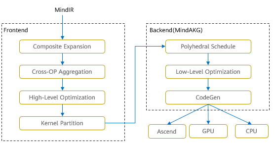
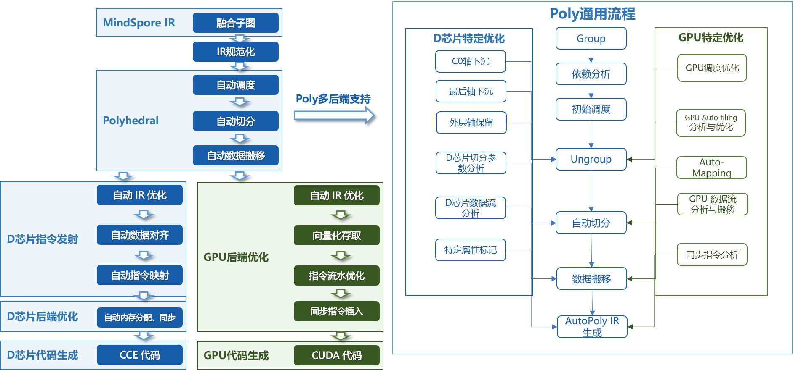
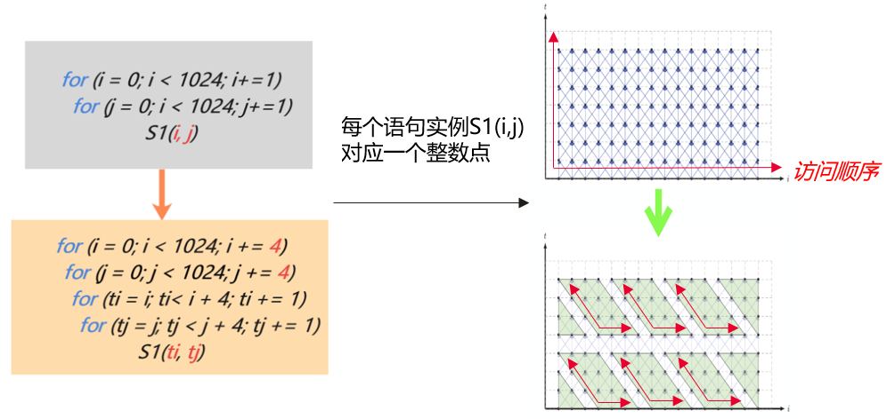
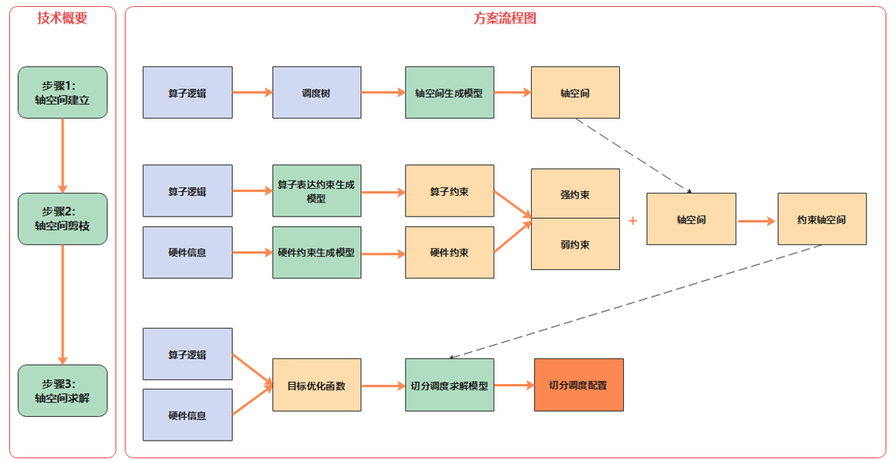
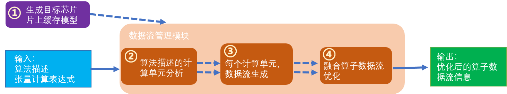
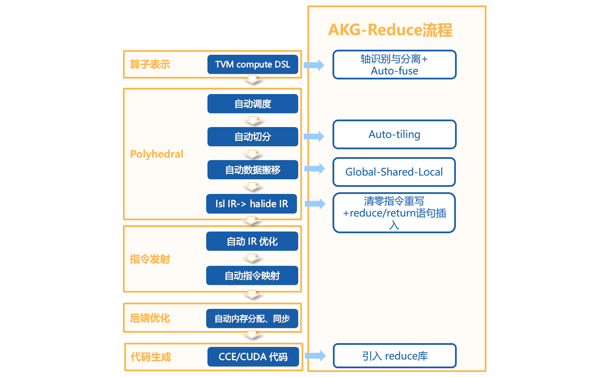
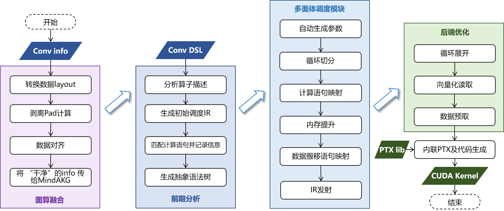

# 图算融合加速引擎介绍

`Ascend` `GPU` `CPU` `扩展功能`

## 背景

MindSpore等主流AI计算框架对用户提供的算子通常是从用户可理解、易使用角度进行定义。每个算子承载的计算量不等，计算复杂度也各不相同。但从硬件执行角度看，这种天然的、基于用户角度的算子计算量划分，并不高效，也无法充分发挥硬件资源计算能力。主要体现在：

1. 计算量过大、过复杂的算子，通常很难生成切分较好的高性能算子。从而降低设备利用率；
2. 计算量过小的算子，由于计算无法有效隐藏数据搬移开销，也可能会造成计算的空等时延，从而降低设备利用率；
3. 硬件Device通常为多核、众核结构，当算子shape较小或其它原因引起计算并行度不够时，可能会造成部分核的空闲，从而降低设备利用率。特别是基于专用处理器架构（Domain Specific Architecture，后文简称DSA）的芯片对这些因素更为敏感。如何最大化发挥硬件算力性能的同时使算子也能具备较好的易用性，一直以来是一个很大的挑战。

在AI框架设计方面，目前业界主流采用图层和算子层分层的实现方法。图层负责对计算图进行融合或重组，算子层负责将融合或重组后的算子编译为高性能的可执行算子。图层通常采用基于Tensor的High-Level IR的处理和优化，算子层则采用基于计算指令的Low-Level IR进行分析和优化。 这种人为分层处理显著增加了图、算两层进行协同优化的难度。
MindSpore在过去几年的技术实践中，采用了图算融合的技术来较好的解决了这个问题。NLP、推荐等不同类别的典型网络在使能图算融合后训练速度都有明显收益。主要原因之一就是这些网络中存在大量小算子组合，具有较多的融合优化机会。

## 图算融合架构及整体流程

图算融合整体架构如下图所示。在图层主要思路是把复合算子打开，然后进行跨边界聚合和优化，最后进行Kernel算子拆分。主要步骤包括：

1. Composite Expansion：将复合算子展开为基本算子，并构成Composite子图，方便进行后续的跨边界优化和算子拆分；
2. Cross-OP Aggregation：将相邻的基本算子或Composite子图进行聚合，从而构成更大的聚合子图，方便进行后续的跨边界优化和算子拆分；
3. High-Level Optimization：在上面两步得到的聚合子图的基础上，我们可以进行大量的跨边界优化，如代数化简、公共子表达式提取（CSE）等；
4. Kernel Partition：基于计算特征以及融合算子性能，对聚合计算子图进行算子拆分。

优化后的计算图会以一个个子图的方式传给MindSpore AKG继续进行后端优化、生成目标代码。

通过以上步骤，我们可以获得两方面性能收益：

1. 不同算子之间的跨边界性能优化收益；
2. 通过对整个计算图进行重组拆分，得到最优粒度的融合算子。

## 融合算子加速优化（MindSpore AKG）

前文提到，在HPC、深度神经网络训练等场景中，图算融合优化可带来成倍的性能提升。但随着图算融合能力的不断增强，融合算子的开发成为了继续提升图算融合能力的瓶颈点。融合算子的自动生成技术可以解决基于DSA开发融合算子编程门槛较高的问题，让程序员在算子开发过程中能够聚焦于算子的实现逻辑，无需关注后端优化，极大提高其开发效率。尤其对于后端硬件架构复杂以及存在复杂算子和融合算子的场景，算子自动生成技术更加关键。

因此，我们基于**多面体编译技术**（Polyhedral Model），开发了**MindSpore AKG进行融合算子的加速优化与自动生成**，能够帮助MindSpore的图算融合模块优化后的融合算子在**异构硬件平台**（GPU/Ascend）上自动生成高性能的kernel，提升MindSpore的训练性能。

### 架构及整体流程

MindSpore AKG的整体框架如上图所示：

- IR规范化
    - MindSpore AKG的输入为MindSpore图算融合模块优化后的融合子图，通过TVM的Compute / IR Builder / Hybrid 等多种描述方式对子图中的算子进行表达。然后DSL会被转换为 Halide IR（[Halide](https://halide-lang.org/)，是常见的用于开发高性能图像处理和Array计算的语言，可作为中间表达解耦算法和优化） 并进行 IR 规范化；
    - 完成初步简化和优化后，Halide IR会被转化为Poly模块所需的调度树；
- Poly模块调度优化
    - 利用Polyhedral技术中的Pluto调度算法，实现循环的自动融合、自动重排等变换，为融合算子自动生成满足并行性、数据局部性的初始调度；
    - 为快速适配不同硬件后端，Poly模块内的优化pass会分为硬件无关的通用优化与硬件相关的特定优化，编译时按照硬件特征拼接组合，实现异构硬件后端的快速适配。自动切分、自动映射以及自动内存提升等pass会根据不同硬件的架构性质给出不同的优化方式；
- 后端优化
    - 为了进一步提升算子的性能，我们针对不同硬件后端开发了相应的优化pass，如Ascend后端中实现数据对齐、指令映射，GPU后端中实现向量化存取，插入同步指令等，最终生成相应平台代码。

### 主要特性

#### 多面体调度生成

多面体模型是计算机编译优化领域常见的一种循环嵌套优化方法，其理论基础为Presburger算术。通过多面体模型，我们可以分析程序中语句的读写依赖关系，继而为后续的循环变换提供理论支撑。多面体模型循环优化的核心即其调度算法，该调度算法可根据硬件体系结构特征（如并行性和数据局部性等）定义优化目标，将循环优化问题转为整数规划问题进行求解。在MindSpore AKG中，主要利用基于整数线性规划的**ISL调度器**来对输入程序进行新的调度变换。ISL调度器以**Pluto算法**为主，并辅以**Feautrier算法**，在程序的并行性和局部性之间寻求最优。

#### 自动切分（Auto-Tiling）

- **什么是切分**

  切分是一种广泛运用的循环变换的方法，可以改变语句实例访问顺序。如下图代码所示，这个1024 x 1024的循环，每一次循环可以看作是这个二维空间上的一个点的访问，对这个循环进行4 x 4的切分能够改变循环点的访问顺序，使得从原先的遍历大矩阵变成多次遍历4 x 4的小矩阵。

  

- **切分的价值和挑战**

  将数据进行分块和内存映射，可以使用更小更快的缓存来访问数据。当计算数据量大于缓存空间的时候，就需要将原来的数据进行分块后存储到缓存上，以此来适应目标架构的硬件特征。要寻找一个好的切分，开发者需要对硬件的内存层级和代码逻辑有所了解，能够分析出有哪些数据逻辑上被复用，需要被放进缓存，甚至还需要对硬件的缓存机制有所了解（例如CPU），对硬件的并行机制有所了解（例如GPU），这样的切分才能够提升硬件资源利用率，提高代码的性能。

- **MindSpore AKG的自动切分方案**

  MindSpore AKG中提供了Auto-Tiling模块，其主要流程包括：

  1. 对输入分析建模。Auto-Tiling借助Poly模块，将输入算子的逻辑转化为调度树，轴空间提取模型对调度树做分析，提取出可切分调度的总体轴空间；
  2. 对轴空间进行剪枝。Auto-Tiling使用两个约束生成模型对算子逻辑和硬件信息分别进行分析，生成对应的算子约束和硬件约束，其中这些约束根据影响算子的范围又会被分为强弱约束，它们作用在轴空间上，将轴空间缩小，即可获得一个约束轴空间；
  3. 轴空间求解。Auto-Tiling会根据算子和硬件信息生成不同的目标优化函数，求解模型基于目标优化函数，在约束轴空间上能够找到唯一一个解，生成最终的切分调度配置。

  

#### 自动映射（Auto-Mapping）

自动映射是指在多线程架构的硬件后端上，自动将数据和实例执行顺序映射到多线程处理单元上，例如GPU的线程块(Block)和线程(Thread)。 通过Auto-Mapping，我们可以：

- 减少代码复杂度

  如下图所示，shape为8 * 12的算子，Auto-Tiling会尽量采取(a)中的分块方式，来减少(b)中蓝字所示的循环边界判断；

  

  接着，Auto-Mapping也尽量会对分块后的数据分配能够整除的Thread size，来提升Thread的利用率，如下例中Thread为4的方案。

  

- 优化Block/Thread/Tile比例

  Auto-Mapping在分配Block size、Thread size和Tile size的时候，会考虑GPU的硬件特征，通过调整三者的比例，提升利用率、内存吞吐率、存取速度这三个方面，进行性能优化。

#### 数据搬移

对于各式各样的硬件后端，其架构设计通常包含多层级缓冲区，且各缓冲区的内存空间、可支持的计算速度差异很大，适合的计算类型也不同。因此，程序员将程序放到不同硬件后端执行时，除计算指令外，也需要考虑算子在不同片上内存的划分，以及数据在不同片上Buffer的流动，以配合不同的存储结构，提升程序的并行性。

MindSpore AKG基于**Polyhedral技术**来实现**基于多层Buffer结构的DMA数据流识别与生成**。自动数据搬移能够通过分析数据流，给出数据应该放置到什么缓冲区，以及数据在缓冲区之间搬移的顺序，进一步优化算子性能。

以片上内存层级较为复杂的Davinci架构为例，MindSpore AKG自动数据搬移生成的步骤如下:

1. 依次遍历算子输入的Halide IR，识别每个compute节点的类型，并根据不同类型分析每条语句需使用到的计算模块；
2. 根据目标芯片的片上缓存模型和具体芯片参数，对片上的高速存储Buffer进行分类；
3. 基于每条语句使用的计算单元，以及变量间的数据依赖关系（每个计算单元，会从不同的片上Buffer读入数据，并将计算结果写回不同的片上缓存，其依赖关系可以分为读后写WAR，写后读RAW，写后写WAW三种），生成算子数据流信息；
4. 对于可融合的场景，将算子的数据流进行优化，得到完整的算子数据流信息；
5. 输出包含算子完整数据流信息的Halide IR。

### 算子优化方案

下面以两类计算举例，描述MindSpore AKG如何利用以上特性进行复杂算子的自动生成和优化。

- **规约计算 Reduction**

  规约计算，即对Tensor的选定维度或所有维度做累积操作，常见的算子有Sum、ReduceMax/Min、ReduceAnd/Or等。
  大shape的Reduction场景通常分为两步：

  1. 将数据分成小块，分别对各小块进行规约；
  2. 对每个小块的规约结果再次进行规约得到最终结果。

  MindSpore AKG通过**自动轴融合+多面体调度优化+AKG-Reduce模板库**的方式对reduction操作进行优化，并通过原子加的方式，将两步reduce实现成一个kernel。  

  

  流程如上图所示：

  1. 算子表示：首先解析算子表达，在IR规范化的阶段，进行规约轴和非规约轴的识别与分离，并通过自动轴融合，将两类轴分别融合成两根轴，同时记录相关信息如Tensor shape、规约方向等；
  2. Poly模块：利用Pluto算法进行调度变换，通过分析之前记录的信息，计算得到最佳切分参数，并进行到共享内存、寄存器的数据搬移；
  3. 指令发射与代码生成：从调度树到Halide IR的发射阶段，插入接口调用语句并在代码生成阶段调用。调用AkgReduce模板库，实现高性能的线程块内累加；调用AkgAtomicReturn原子加接口，将各线程块的中间结果累加得到最终结果，保证计算正确性。

- **矩阵乘 GEMM**和**卷积 Convolution**

  MindSpore AKG利用GPU的**Tensor Core**硬件计算单元并结合**多面体编译调度优化和高性能内联PTX库**，对混合精度场景下的矩阵乘计算进行加速。

  在此基础上，MindSpore AKG使用**Implicit GEMM**方法来处理混合精度的卷积计算。卷积的两个四维的输入矩阵，会在从全局内存搬移到共享内存的过程中，被转换成二维矩阵，进而转化为矩阵乘计算进行优化。这种方法可以解决Image to Column带来的数据冗余（Image to Column是常见的卷积优化方法，简称为Im2col，即将每个feature map转换为一个连续的column，转换后的矩阵会占据更多的全局内存）。

  以卷积计算的优化为例，流程如下：

  

  1. 分析算子DSL和Halide IR，解析GEMM表达式并记录矩阵的数据类型、shape、排布方式等信息；卷积算子的shape更复杂（通常是NHWC四个维度），在这一步MindSpore AKG会将它的四个维度抽象出来，关联到与矩阵乘对应的两个虚拟轴上；
  2. 在Poly模块中进行针对性调度优化，包含多次切分、Warp层级映射，多层级内存提升（共享内存上进行数据复用，寄存器上使用TensorCore进行高速的乘加运算）等；对于卷积算子，进行多次切分以及计算切分参数时，也需要考虑多出来的两个维度H、W；
  3. 基于Halide IR执行后端优化pass，包括数据预取——节省搬运与计算间的等待时间、数据补齐与重排——消除bank conflicts、向量化指令——提升数据加载和写入的效率等；
  4. 调用akg::wmma高性能接口（包含PTX层级的更细粒度的优化），生成最终的CUDA Kernel。

MindSpore AKG支持规约、矩阵乘和卷积等算子的前向、后向融合场景的生成，保证融合算子性能的同时节省算子间的I/O和内存消耗。
