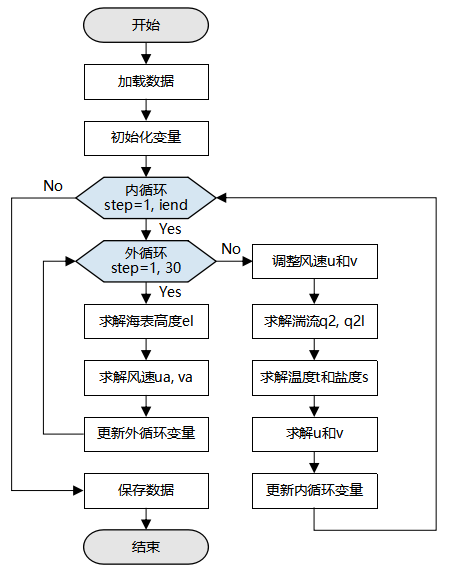

# 实现区域海洋模型GOMO

`GPU` `高性能计算` `全流程`

<!-- TOC -->

- [实现区域海洋模型GOMO](#实现区域海洋模型gomo)
    - [概述](#概述)
    - [准备环节](#准备环节)
        - [安装软件依赖](#安装软件依赖)
        - [准备数据](#准备数据)
    - [加载数据](#加载数据)
    - [定义GOMO网络](#定义gomo网络)
        - [初始化变量](#初始化变量)
        - [定义GOMO模型](#定义gomo模型)
    - [训练网络](#训练网络)
        - [运行脚本](#运行脚本)
    - [引用](#引用)

<!-- /TOC -->
<a href="https://gitee.com/mindspore/docs/blob/master/docs/mindspore/programming_guide/source_zh_cn/hpc_gomo.md" target="_blank"></a>&nbsp;&nbsp;

## 概述

GOMO（Generalized Operator Modelling of the Ocean）是基于 OpenArray 的三维区域海洋模型，由清华大学黄小猛老师开发的用于海洋建模和并行计算的通用模型（[Xiaomeng Huang et al, 2019](https://gmd.copernicus.org/articles/12/4729/2019/gmd-12-4729-2019.pdf)）。GOMO模型中的基本方程和实现算法来自于POM2k模型（[Blumberg and Mellor, 1987](http://www.sciepub.com/portal/downloads?doi=10.12691/ajmo-2-2-2&filename=ajmo-2-2-2.pdf)）。三维海洋模型在地球系统模式中有重要的作用，以质量能量守恒定律为约束，通过模拟海洋洋流、漩涡等现象，不仅能够很好的表示海面温度和海表面高度的分布，还能够实时的预测台风、海啸等现象。传统的海洋模型代码实现复杂，且都是基于CPU运行，我们使用MindSpore对GOMO模型进行框架加速，结合GPU，能获得较大的性能提升。

本篇教程将主要介绍如何在GPU上，使用MindSpore构建并运行三维海洋模型GOMO。
> 你可以在这里下载完整的示例代码：
<https://gitee.com/mindspore/models/tree/master/research/hpc/ocean_model> 。

示例代码目录结构如下：

```text
└── ocean_model
    ├── README.md                                  # descriptions about ocean model GOMO
    ├── scripts
    │    ├── run_distribute_train.sh               # launch distributed training for GPU
    ├──src
    │    ├── GOMO.py                               # GOMO model
    │    ├── Grid.py                               # grid initial
    │    ├── stencil.py                            # averaging and differential stencil oprator
    │    ├── op_operator.py                        # averaging and differential kernel operator
    │    ├── read_var.py                           # read variables from nc file
    ├── train.py                                   # train script
```

整体执行流程如下：

1. 准备海洋模拟数据集Seamount文件，加载处理数据；
2. 定义GOMO变量初始化；
3. 定义GOMO模型；
4. 加载数据集并进行训练，训练完成后，查看结果及保存文件。

## 准备环节

### 安装软件依赖

1. 安装MindSpore

    实践前，确保已经正确安装MindSpore。如果没有，可以通过[MindSpore安装页面](https://www.mindspore.cn/install)安装。

2. 安装netCDF4

    ```bash
    pip install netCDF4
    ```

### 准备数据

本教程使用的是netCDF格式的[Seamount文件](https://github.com/hxmhuang/GOMO/tree/master/bin/data)，贝克曼和海德沃格尔提出的Seamount问题是区域海洋模型广泛使用的理想试验案例（[Beckmann and Haidvogel, 1993](https://journals.ametsoc.org/view/journals/phoc/23/8/1520-0485_1993_023_1736_nsofaa_2_0_co_2.xml?tab_body=fulltext-display)）。

## 加载数据

加载Seamount数据文件，从文件脚本中读取变量的初始化值，Seamount文件中的数据类型是双精度Float64，需要将其转成Float32进入MindSpore计算。加载处理数据的脚本在源码的`src/read_var.py`脚本中。

```python
import numpy as np
import netCDF4 as nc

# variable name list
params_name = ['z', 'zz', 'dz', 'dzz', 'dx', 'dy', 'cor', 'h', 'fsm', 'dum', 'dvm', 'art', 'aru', 'arv', 'rfe', 'rfw',
               'rfn', 'rfs', 'east_e', 'north_e', 'east_c', 'north_c', 'east_u', 'north_u', 'east_v', 'north_v', 'tb',
               'sb', 'tclim', 'sclim', 'rot', 'vfluxf', 'wusurf', 'wvsurf', 'e_atmos', 'ub', 'vb', 'uab', 'vab', 'elb',
               'etb', 'dt', 'uabw', 'uabe', 'vabs', 'vabn', 'els', 'eln', 'ele', 'elw', 'ssurf', 'tsurf', 'tbe', 'sbe',
               'sbw', 'tbw', 'tbn', 'tbs', 'sbn', 'sbs', 'wtsurf', 'swrad']

def load_var(file_obj, name):
    """load variable from nc data file"""
    data = file_obj.variables[name]
    data = data[:]
    data = np.float32(np.transpose(data, (2, 1, 0)))
    return data

def read_nc(file_path):
    """ put the load variable into the dict """
    variable = {}
    file_obj = nc.Dataset(file_path)
    for name in params_name:
        variable[name] = load_var(file_obj, name)
    return variable
```

## 定义GOMO网络

GOMO模型基于动量、能量和质量守恒定律，推导微分方程组和边界条件，确定需要求解的7个方程组，详细的公式推导参考[论文](https://gmd.copernicus.org/articles/12/4729/2019/gmd-12-4729-2019.pdf)。图1是GOMO的整体执行流程图。

首先，从Seamount数据中加载数据，用于模型中变量的初始化。加载初始值和模型参数后，计算分为内模态循环和外模态循环两个部分。在外模态循环中，主要计算二维海表面高度el和二维平均风速ua、va。在内模态循环中，循环次数iend是训练的总时间步数（由用户输入设定），内模态循环的计算三维数组占主导地位，依次计算湍流动能q2和产生湍流动能的湍流长度q2l、温度t和盐度s、x和y方向的风速u和v。计算完成之后，保存所需的变量结果，结束训练。



*图1：GOMO模型流程图*

### 初始化变量

```python
...
from src.GOMO import GOMO_init
...
if __name__ == "__main__":
    ...
    # define grid and init variable update
    net_init = GOMO_init(im, jm, kb, stencil_width)
    ...
```

### 定义GOMO模型

```python
def construct(self, etf, ua, uab, va, vab, el, elb, d, u, v, w, kq, km, kh, q2, q2l, tb, t, sb, s,
              rho, wubot, wvbot, ub, vb, egb, etb, dt, dhb, utb, vtb, vfluxb, et):
    """construct"""
    x_d, y_d, z_d = self.x_d, self.y_d, self.z_d
    q2b, q2lb = self.q2b, self.q2lb
    dx, dy = self.dx, self.dy
    # surface forcing
    w = w * (1 - self.z_h) + self.z_h * self.vfluxf
    # lateral_viscosity
    advx, advy, drhox, drhoy, aam = self.lateral_viscosity(dx, dy, u, v, dt, self.aam, ub, vb, x_d, y_d, z_d, rho, self.rmean)
    # mode_interaction
    adx2d, ady2d, drx2d, dry2d, aam2d, advua, advva, egf, utf, vtf = self.mode_interaction(advx, advy, drhox, drhoy, aam, x_d, y_d, d, uab, vab, ua, va, el)
    # ===========external model===========
    vamax = 0
    elf = 0
    for iext in range(1, 31):
        # external_el
        elf = self.external_el(x_d, y_d, d, ua, va, elb)
        # external_ua
        advua, uaf = self.external_ua(iext, x_d, y_d, elf, d, ua, va, uab, vab, el, elb, advua, aam2d, adx2d, drx2d, wubot)
        # external_va
        advva, vaf = self.external_va(iext, x_d, y_d, elf, d, ua, va, uab, vab, el, elb, advva, aam2d, ady2d, dry2d, wvbot)
        # external_update
        etf, uab, ua, vab, va, elb, el, d, egf, utf, vtf, vamax = self.external_update(iext, etf, ua, uab, va, vab, el, elb, elf, uaf, vaf, egf, utf, vtf, d)
    # ===========internal model===========
    if self.global_step != 0:
        # adjust_uv
        u, v = self.adjust_uv(u, v, utb, vtb, utf, vtf, dt)
        # internal_w
        w = self.internal_w(x_d, y_d, dt, u, v, etf, etb, vfluxb)
        # internal_q
        dhf, a, c, gg, ee, kq, km, kh, q2b_, q2, q2lb_, q2l = self.internal_q(x_d, y_d, z_d, etf, aam, q2b, q2lb, q2, q2l, kq, km, kh, u, v, w, dt, dhb, rho, wubot, wvbot, t, s)
        q2b = ops.Assign()(self.q2b, q2b_)
        q2lb = ops.Assign()(self.q2lb, q2lb_)
        # internal_t_t
        a, c, ee, gg, tb, t = self.internal_t_(t, tb, self.wtsurf, self.tsurf, self.swrad, self.tclim, self.tbe, self.tbw, self.tbn, self.tbs, x_d, y_d, z_d, dt, u, aam, self.h,  self.dum, v, self.dvm, w, dhf, etf, a, kh, self.dzz, c, self.dzz1, ee, gg, dx, self.dz, dy, self.fsm, dhb)
        # internal_t_s
        a, c, ee, gg, sb, s = self.internal_t_(s, sb, self.wssurf, self.ssurf, self.swrad0, self.sclim, self.sbe, self.sbw, self.sbn, self.sbs, x_d, y_d, z_d, dt, u, aam, self.h, self.dum, v, self.dvm, w, dhf, etf, a, kh, self.dzz, c, self.dzz1, ee, gg, dx, self.dz, dy, self.fsm, dhb)
        # dense
        rho = self.dens(s, t, self.zz, self.h, self.fsm)
        # internal_u
        uf, a, c, gg, ee, wubot = self.internal_u(x_d, z_d, dhf, u, v, w, ub, vb, egf, egb, ee, gg, self.cbc, km, advx, drhox, dt, dhb)
        # internal_v
        vf, a, c, gg, ee, wvbot = self.internal_v(y_d, z_d, dhf, u, v, w, ub, vb, egf, egb, ee, gg, self.cbc, km, advy, drhoy, dt, dhb)
        # adjust_ufvf
        u, v, ub, vb = self.adjust_ufvf(u, v, uf, vf, ub, vb)
    # internal_update
    egb, etb, dt, dhb, utb, vtb, vfluxb, et = self.internal_update(egf, etb, utf, vtf, etf, et)
    steps = ops.AssignAdd()(self.global_step, 1)

    return elf, etf, ua, uab, va, vab, el, elb, d, u, v, w, kq, km, kh, q2, q2l, tb, t, sb, s, rho, wubot, wvbot, \
           ub, vb, egb, etb, dt, dhb, utb, vtb, vfluxb, et, steps, vamax, q2b, q2lb
```

在`__main__`函数中调用定义好的GOMO模型：

```python
...
from src.GOMO import GOMO
...
if __name__ == "__main__":
    ...
   # define GOMO model
    Model = GOMO(im=im, jm=jm, kb=kb, stencil_width=stencil_width, variable=variable, x_d=x_d, y_d=y_d, z_d=z_d,
                 q2b=q2b, q2lb=q2lb, aam=aam, cbc=cbc, rmean=rmean)
    ...
```

## 训练网络

### 运行脚本

训练脚本定义完成之后，调用`scripts`目录下的shell脚本，启动训练进程。
使用以下命令运行脚本：

```text
sh run_distribute_train.sh <im> <jm> <kb> <step> <DATASET_PATH>
```

脚本需要传入变量`im`、`jm`、`kb`、`step`、`DATASET_PATH`，其中：

- `im`,`jm`,`kb`：模拟的海洋区域分辨率，与使用的数据相关；
- `step`：训练的时间步数（与图1中的`iend`对应）；
- `DATASET_PATH`：训练数据路径。

训练完后，训练过程中变量的变化值保存在`train/outputs`目录下，每隔5个时间步保存一次数据，主要保存了4个变量值，分别是东向的风速、北向的风速（单位是m/s），位温度（单位是K），海表面高度（单位是m）。

```text
└─outputs
    ├─u_5.npy
    ├─v_5.npy
    ├─t_5.npy
    ├─et_5.npy
    ├─u_10.npy
    ├─v_10.npy
    ├─t_10.npy
    ├─et_10.npy

```

其中，
`*.npy`：指保存的变量。文件名称具体含义：*变量名称*_*step数*.npy。

## 引用

1. Huang X, Huang X, Wang D, et al. OpenArray v1. 0: a simple operator library for the decoupling of ocean modeling and parallel computing[J]. Geoscientific Model Development, 2019, 12(11).
2. Blumberg A F, Mellor G L. A description of a three‐dimensional coastal ocean circulation model[J]. Three‐dimensional coastal ocean models, 1987, 4: 1-16.
3. Beckmann A, Haidvogel D B. Numerical simulation of flow around a tall isolated seamount. Part I: Problem formulation and model accuracy[J]. Journal of Physical Oceanography, 1993, 23(8): 1736-1753.
