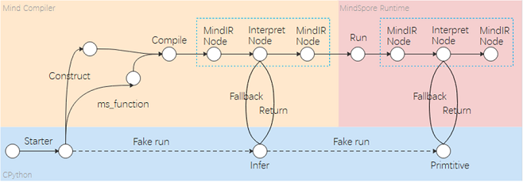

# JIT Fallback

`Ascend` `GPU` `CPU` `模型运行`

<!-- TOC -->

- [JIT_Fallback](#JIT_Fallback)
    - [概述](#概述)
    - [支持范围](#支持范围)
    - [实现原理](#实现原理)
    - [使用须知](#使用须知)

<!-- /TOC -->

## 概述

MindSpore框架支持静态图模式和动态图模式两种方式。在静态图模式下，先将Python代码编译成静态计算图，然后执行静态计算图。由于语法解析的限制，用户编写程序时需要遵循MindSpore[静态图语法支持](https://www.mindspore.cn/docs/note/zh-CN/master/static_graph_syntax_support.html)，语法使用存在约束限制。在动态图模式下，Python代码会通过Python解释器执行，用户可以使用任意Python语法。可以看到，静态图和动态图的编译流程不一致，语法约束限制也不同。关于静态图和动态图的更多介绍，请参考[静态图和动态图](https://www.mindspore.cn/docs/programming_guide/zh-CN/master/design/dynamic_graph_and_static_graph.html)。

JIT Fallback是从静态图的角度出发考虑静态图和动态图的统一。通过JIT Fallback特性，静态图可以支持尽量多的动态图语法，使得静态图提供接近动态图的语法使用体验，从而实现动静统一。为了便于用户选择是否使用JIT Fallback特性的能力，提供了开关`MS_DEV_ENABLE_FALLBACK`，当前默认已经打开。如果需要关闭，可以使用命令：`export MS_DEV_ENABLE_FALLBACK=0`。

本文档主要介绍JIT Fallback的使用方法和工作原理，以便您可以更有效地使用JIT Fallback功能。

## 支持范围

当前JIT Fallback支持静态图模式的部分常量场景，包括在construct/ms_function中调用第三方库、创建及使用Tensor、调用Python的print打印等。下面对各场景进行简单举例说明。

### 支持在construct/ms_function中调用第三方库

JIT Fallback支持在construct/ms_function中调用NumPy等第三方库中的对象和方法。

代码用例如下。因为静态图模式不支持在construct/ms_function中调用numpy第三方库，用例中的`a = np.array([1, 2, 3])`和`b = np.array([4, 5, 6])`将会通过JIT Fallback使用Python解释器进行解释执行。

```python
import numpy as np
from mindspore import Tensor, ms_function

@ms_function
def np_binop():
    a = np.array([1, 2, 3])
    b = np.array([4, 5, 6])
    c = a + b
    return Tensor(c)

res = np_binop()
print(res)
```

输出结果如下:

```text
[5 7 9]
```

需要使用JIT Fallback特性来支持的语句，会打印相关提示信息，如下：

```text
Found unsupported syntax in Graph mode, those codes would be fallen back to Python interpreter:
a = np.array([1, 2, 3])
b = np.array([4, 5, 6])
c = a + b
return Tensor(c)
```

为了对比，我们可以通过关闭JIT Fallback特性的开关，来观察没有JIT Fallback特性时该用例的执行结果，即设置`export MS_DEV_ENABLE_FALLBACK=0`，用例执行结果如下：

```text
Meet a exception from Python when get the type of '<built-in function array>'
TypeError: Not support for this object with type '<class 'builtin_function_or_method'>' and value '<built-in function array>'
```

### 支持在construct/ms_function中创建和使用Tensor

JIT Fallback支持在construct/ms_function中创建和使用[Tensor](https://www.mindspore.cn/docs/api/zh-CN/master/api_python/mindspore/mindspore.Tensor.html)，暂不支持Tensor.asnumpy()。

代码用例如下。因为静态图模式不支持在construct/ms_function中创建Tensor对象，用例中的`tensor_num = Tensor(np.array(9))`将会通过JIT Fallback使用Python解释器进行解释执行。

```python
import numpy as np
import mindspore.nn as nn
from mindspore import context, Tensor

class BinOpNet(nn.Cell):
    def __init__(self):
        super(BinOpNet, self).__init__()

    def construct(self):
        tensor_num = Tensor(np.array(9))
        res = tensor_num + tensor_num
        return res

context.set_context(mode=context.GRAPH_MODE)
net = BinOpNet()
print(net())
```

输出结果如下:

```text
18
```

需要使用JIT Fallback特性来支持的语句，会打印相关提示信息，如下：

```text
Found unsupported syntax in Graph mode, those codes would be fallen back to Python interpreter:
tensor_num = Tensor(np.array(9))
```

为了对比，我们可以通过关闭JIT Fallback特性的开关，来观察没有JIT Fallback特性时该用例的执行结果，即设置`export MS_DEV_ENABLE_FALLBACK=0`，用例执行结果如下：

```text
Meet a exception from Python when get the type of '<built-in function array>'
TypeError: Not support for this object with type '<class 'builtin_function_or_method'>' and value '<built-in function array>'
```

### 支持在construct/ms_function使用print打印

在常量场景中，通过JIT Fallback特性使用Python原生的print来打印常量，与图模式中使用[print算子](https://www.mindspore.cn/docs/api/zh-CN/master/api_python/ops/mindspore.ops.Print.html)来打印信息的时机有所不同。Python原生print是在编译过程中触发打印，而图模式调用算子打印是需要图中所有节点构图结束后下发到设备端运行才打印。

为了便于理解，举例如下。tensor_sum是由两个Tensor变量相加得到结果，需要在运行阶段才可以得到结果，即需要使用图模式中的print算子打印信息；而np_sum是由两个NumPy常量对象相加得到结果，即在编译阶段使用Python原生print能力来打印信息。导致最终显示np_sum会在tensor_sum之前，这是编译时运行方式和运行时运行方式的区别。

```python
import numpy as np
from mindspore import Tensor, ms_function

@ms_function
def test_print():
    x = Tensor(np.array([1, 2, 3, 4, 5]))
    y = Tensor(np.array([1, 2, 3, 4, 5]))
    tensor_sum = x + y
    print("tensor_sum: ", tensor_sum)
    x = np.array([1, 2, 3, 4, 5])
    y = np.array([1, 2, 3, 4, 5])
    np_sum = x + y
    print("np_sum: ", np_sum)
    return tensor_sum, Tensor(np_sum)

tensor_sum, np_sum = test_print()
```

输出结果如下:

```text
np_sum: [2 4 6 8 10]
tensor_sum: (2, 4, 6, 8, 10)
```

## 实现原理

JIT Fallback借鉴了传统JIT编译的Fallback的思路。传统的JIT编译经常会通过profiling信息，对函数进行多态选择、value推导、分支调度等优化，同时设置guard条件，一旦guard条件发现情况有变，可以去JIT优化，回到原来未优化的函数进行解释执行。在JIT Fallback中，编译静态图时，如果遇到不支持的语法，将会记录相关语句并生成解释节点，在后续处理中将相关语句Fallback到Python解释器进行解释执行。

下图是JIT Fallback的整体处理流程。



首先，用户编写程序代码后，`Cell.construct()`或者`@ms_function`函数作为编译输入。然后，MindCompiler在编译阶段检测不支持的语法，并且根据不支持的语法表达式生成解释节点。最后，在编译时（Compiler Time）阶段或运行时（Runtime）阶段，推导和执行解释节点。对于常量场景，可以在类型推导阶段完成常量的推导，并通过Python解释器进行执行。

## 使用须知

在使用JIT Fallback时，请注意以下几点：

1. 当前JIT Fallback仅支持常量场景，即值明确且保持不变，不以参数传入的场景。

2. JIT Fallback对标动态图的支持能力，须在动态图语法范围内，包括但不限于数据类型等。

3. JIT Fallback引入的解释节点，仅用于Python解释器执行，不能传递到后端执行。为了便于理解，举例如下。由于`np.add(x, y)`是图模式下不支持的语法，即会在编译阶段解析成为解释节点。如果解释节点作为函数的返回值，则将传递到后端执行，当前后端不支持解释节点。所以该类场景当前不支持。

    ```python
    import numpy as np
    from mindspore import Tensor, ms_function

    @ms_function
    def test_np_add():
        x = np.array([1, 2, 3, 4, 5])
        y = np.array([1, 2, 3, 4, 5])
        return np.add(x, y)

    np_add_res = test_np_add()
    ```

    输出结果如下:

    ```text
    Should not use Python object in runtime, node: ValueNode<InterpretedObject> InterpretedObject: '[2 4 6 8 10]'
    ```

4. 当前有限支持控制流场景，将逐步在后续版本中支持。

5. 当前暂不支持自定义Class的attr/method，将逐步在后续版本中支持。

6. MindSpore提供的NumPy中的方法是由框架的算子能力实现，并不是通过JIT Fallback来支持的，在使用时需要注意该场景。使用Python解释器推导不出MindSpore提供的NumPy中的average方法结果，得到的值为None。例如下面的用例将报错。

    ```python
    import mindspore.numpy as mnp
    from mindspore import Tensor, ms_function

    @ms_function
    def test_mnp_average():
        x = mnp.array(([1., 2.], [3., 4.]))
        x_average = mnp.average(x)
        return Tensor(x_average)

    out = test_mnp_average()
    print(out)
    ```

   输出结果如下:

   ```text
   input_data and init can not be None at the same time.
   ```

7. 在图模式下，对于NumPy具有返回值的方法，需要使用变量来保存其结果。如果没有变量保存，当前不支持该语法，会在后续版本中支持。

    ```python
    import numpy as np
    from mindspore import Tensor, ms_function

    @ms_function
    def test_np_vdot():
        x = np.array([1, 2], [3, 4])
        y = x.T
        np.vdot(x, y)
        return Tensor(y)

    res = test_np_vdot()
    ```

    输出结果如下:

    ```text
    TypeError: module, class, method, function, traceback, frame, or code object was expected, got builtin_function_or_method.
    ```

8. 暂不支持在解释执行的语句中调用`self`的属性和方法，将逐步在后续版本中支持。

    ```python
    import numpy as np
    import mindspore.nn as nn
    from mindspore import Tensor

    class Network(nn.Cell):
        def __init__(self):
            super(Network, self).__init__()
            self.value = 1

        def construct(self):
            x = np.array([1, 2, 3])
            y = np.array([3, 4, 5])
            z = self.fn(x, y)
            out = Tensor(z)
            return out

        def fn(self, x, y):
            return x + y

    net = Network()
    out = net()
    ```

    输出结果如下：

    ```
    RuntimeError: The 'add' operation does not support the type [kMetaTypeExternal, kMetaTypeExternal]
    ```
