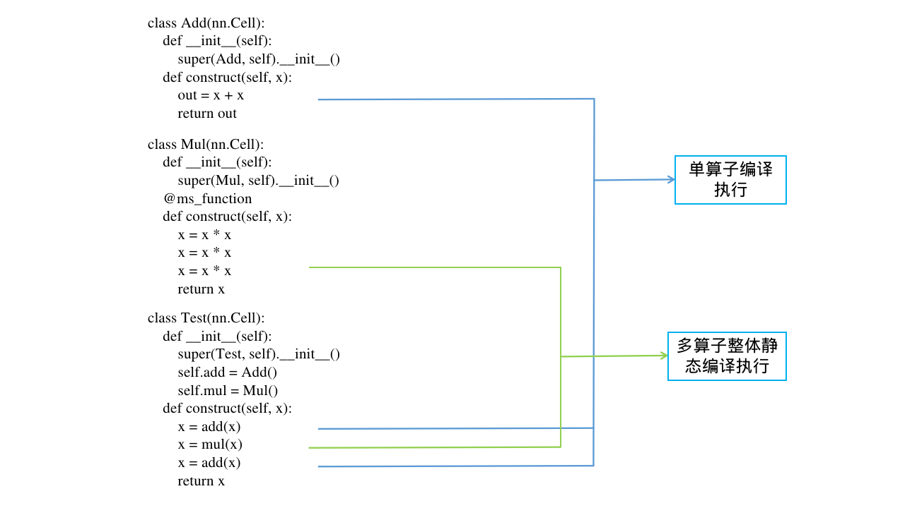

# ms_function动静结合

`Ascend` `GPU` `CPU` `模型运行`

<!-- TOC -->

- [ms_function动静结合](#ms_function动静结合)
    - [概述](#概述)
    - [修饰独立函数](#修饰独立函数)
    - [修饰Cell的成员函数](#修饰cell的成员函数)
    - [实现原理](#实现原理)
    - [使用须知](#使用须知)

<!-- /TOC -->

<a href="https://gitee.com/mindspore/docs/blob/master/docs/mindspore/programming_guide/source_zh_cn/ms_function.md" target="_blank"></a>&nbsp;&nbsp;

## 概述

ms_function的作用是在PyNative模式下提升执行性能。在MindSpore框架中，PyNative模式（即动态图模式）下，用户可以使用完整的Python语法，更加简单方便地使用MindSpore进行网络调优。与此同时，PyNative模式也会导致一部分性能的损失。

ms_function支持在PyNative模式下，让被ms_function修饰的程序以静态图的方式来运行。ms_function会将修饰的程序通过静态编译的方式来生成可执行图，整体下发执行，从而提升该修饰部分的执行性能。

本文档主要介绍ms_function的使用方法和工作原理，以便您可以更有效地使用ms_function功能。

## 修饰独立函数

使用ms_function装饰器时，可以对独立定义的函数进行修饰。

```python
import numpy as np
import mindspore.ops as ops
from mindspore import context, Tensor, dtype, ms_function

@ms_function
def add_func(x, y):
    return ops.add(x, y)


context.set_context(mode=context.PYNATIVE_MODE)
x = Tensor(np.ones([3, 3], dtype=np.float32))
y = Tensor(np.ones([3, 3], dtype=np.float32))
out = add_func(x, y)
print(out)
```

输出结果如下:

```text
[[2. 2. 2.]
 [2. 2. 2.]
 [2. 2. 2.]]
```

## 修饰Cell的成员函数

使用ms_function装饰器时，可以对Cell的成员函数进行修饰。

```python
import numpy as np
import mindspore.nn as nn
import mindspore.ops as ops
from mindspore import context, Tensor, dtype, ms_function

class Add(nn.Cell):
    def __init__(self):
        super(Add, self).__init__()

    @ms_function
    def construct(self, x, y):
        out = x * y
        return out


context.set_context(mode=context.PYNATIVE_MODE)
x = Tensor(np.ones([3, 3], dtype=np.float32))
y = Tensor(np.ones([3, 3], dtype=np.float32))
grad_ops = ops.GradOperation(get_all=True)
net = Add()
grad_out = grad_ops(net)(x, y)
print(grad_out)
```

输出结果如下:

```text
(Tensor(shape=[3, 3], dtype=Float32, value=
[[1.00000000e+00, 1.00000000e+00, 1.00000000e+00],
 [1.00000000e+00, 1.00000000e+00, 1.00000000e+00],
 [1.00000000e+00, 1.00000000e+00, 1.00000000e+00]]), Tensor(shape=[3, 3], dtype=Float32, value=
[[1.00000000e+00, 1.00000000e+00, 1.00000000e+00],
 [1.00000000e+00, 1.00000000e+00, 1.00000000e+00],
 [1.00000000e+00, 1.00000000e+00, 1.00000000e+00]]))
```

## 实现原理

本小节将介绍ms_function的实现原理，当你深入了解了ms_function的工作原理时，你将会更高效地使用ms_function。

以一个简单的动静结合的用例来说明，如下：

```python
import numpy as np
import mindspore.nn as nn
from mindspore import context, Tensor, dtype, ms_function

class Add(nn.Cell):
    def __init__(self):
        super(Add, self).__init__()

    def construct(self, x):
        x = x + x
        x = x + x
        return x


class Mul(nn.Cell):
    def __init__(self):
        super(Mul, self).__init__()

    @ms_function
    def construct(self, x):
        x = x * x
        x = x * x
        return x


class Test(nn.Cell):
    def __init__(self):
        super(Test, self).__init__()
        self.add = Add()
        self.mul = Mul()

    def construct(self, x):
        x = self.add(x)
        x = self.mul(x)
        x = self.add(x)
        return x


context.set_context(mode=context.PYNATIVE_MODE)
x = Tensor(np.ones([3, 3], dtype=np.float32))
net = Test()
out = net(x)
print(out)
```

输出结果如下:

```text
[[1024. 1024. 1024.]
 [1024. 1024. 1024.]
 [1024. 1024. 1024.]]
```

该用例按照执行序，编译的方式如下图所示：


被ms_function修饰的函数将会按照静态图的方式进行编译和执行。如果网络涉及到反向求导，被ms_function修饰的部分也将以整图的形式来生成反向图，并与前后单个算子的反向图连成整体的反向图，下发执行。
其中，缓存的策略与静态图的缓存策略一致，相同的函数对象在输入Shape和Type信息一致时，编译的图结构将会被缓存。

## 使用须知

在使用ms_function来修饰函数，加速执行效率时，请注意以下几点：

1. ms_function修饰的函数须在静态图编译支持的语法范围内，包括但不限于数据类型等。

2. ms_function修饰的函数所支持的控制流语法，与静态图保持一致。其中，仅对固定循环次数或者分支条件的控制流结构具有加速效果。

3. 在PyNative模式下使用ms_function功能时，非ms_function修饰的部分支持断点调试；被ms_function修饰的部分由于是以静态图的方式编译，不支持断点调试。

4. 由于ms_function修饰的函数将按照静态图的方式编译执行，因此ms_function不支持修饰的函数中含有Hook算子，以及不支持修饰自定义Bprop函数等。

5. ms_function修饰的函数会受到静态图函数副作用的影响。

函数副作用指：当调用函数时，除了函数返回值之外，还对主调用函数产生的附加影响。例如修改全局变量（函数外的变量），修改函数的参数等。

场景1：

```python
import numpy as np
from mindspore import context, Tensor, dtype, ms_function

value = 5

@ms_function
def func(x, y):
    out = x + y
    value = 1
    return out

context.set_context(mode=context.PYNATIVE_MODE)
x = Tensor(np.ones([3, 3], dtype=np.float32))
y = Tensor(np.ones([3, 3], dtype=np.float32))
func(x, y)
print(value)
```

输出结果如下:

```text
5
```

该场景下，`value`是全局变量且在`func`函数中被修改。此时，如果用ms_function修饰`func`函数，全局变量`value`的值将不会被修改。原因是静态图编译时，会优化掉与返回值无关的语句。

场景2：

```python
import numpy as np
import mindspore.nn as nn
from mindspore import context, Tensor, dtype, ms_function

class Func(nn.Cell):
    def __init__(self):
        super(Func, self).__init__()
        self.value = 5

    @ms_function
    def construct(self, x):
        out = self.value + x
        return out

context.set_context(mode=context.PYNATIVE_MODE)
x = Tensor(np.ones([3, 3], dtype=np.float32))
func = Func()
out = func(x)
func.value = 1
out = func(x)
print(out)
```

输出结果如下:

```text
[[6. 6. 6.]
 [6. 6. 6.]
 [6. 6. 6.]]
```

该场景下，`value`是`Func`对象的参数，此时如果用ms_function修饰`Func`对象的`construct`成员函数。执行`Func`时将会以静态图的方式编译执行。由于静态图会缓存编译结果，第二次调用`Func`时，对`value`的修改将不会生效。
