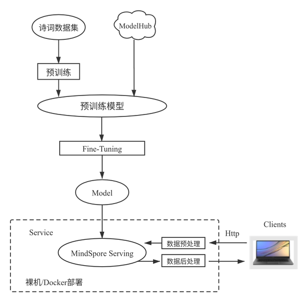

# 使用BERT网络实现智能写诗

`Linux` `Ascend` `模型训练` `推理应用` `高级`

<!-- TOC -->

- [使用BERT实现智能写诗](#使用bert实现智能写诗)
    - [案例简介](#案例简介)
    - [模型介绍](#模型介绍)
    - [模型训练](#模型训练)
        - [Pre-training](#pre-training)
        - [Fine-tuning](#fine-tuning)
        - [模型修改](#模型修改)
    - [样例代码](#样例代码)
    - [实现步骤](#实现步骤)
        - [基础信息](#基础信息)
        - [数据准备](#数据准备)
        - [训练](#训练)
        - [推理验证](#推理验证)
        - [服务部署](#服务部署)
    - [参考文献](#参考文献)

<!-- /TOC -->
<a href="https://gitee.com/mindspore/docs/blob/master/docs/mindspore/programming_guide/source_zh_cn/nlp_bert_poetry.md" target="_blank"></a>

五千年历史孕育了深厚的中华文化，而诗词是中华文化不可或缺的一部分，欣赏过诗词就可以感受到当中纯净、辽阔的意境，极致的感性，恰恰弥补了节奏紧迫的现代生活带给我们的拥挤感、浮躁感，古语曰：熟读唐诗三百首，不会作诗也会吟，今天理科生MindSpore也来秀一秀文艺范儿！

## 案例简介

通过MindSpore训练出智能写诗模型及部署预测服务，具体流程如下图所示：



图1：案例流程图

由于Bert预训练比较费时费力，在本案例中省略了预训练阶段，直接提供MindSpore预训练好的Bert-Base模型，经过Fine-tuning后训练获得最终的模型的训练全流程。

除此之外，将展示如何通过MindSpore Serving将该模型部署成一个预测服务，Clients代码可以发送请求给该预测服务并获得预测结果。

## 模型介绍

和诗词打交道需要用NLP相关的网络，BERT作为NLP领域中里程碑式的模型，极大地推动了NLP社区的发展，BERT模型由Google提出，采用Transformer中的Encoder结构，通过若干层Encoder的堆叠并借由注意力机制，在多项GLUE（General Language Understanding Evaluation）任务中取得了SOTA（State Of The Art）的效果。

正是由于这种注意力的机制，不同于以往的循环神经网络的结构，可以做高度的并行计算，这样便可以充分发挥出Ascend 910AI处理器的强大算力，获得极佳的性能表现。

## 模型训练

分为两个步骤，即Pre-training和Fine-tuning。首先在海量无标签的数据上进行Pre-training，希望通过此过程让模型掌握一般的人类语言语义机制，然后在Fine-tuning阶段会针对特定细分领域的有标签数据进行训练以完成特定任务。

### Pre-training

Pre-training是在无标签数据上进行的自编码训练，因此训练任务的设计尤为重要，BERT中的Pre-training包含两项任务MLM(Masked Language Model)和NSP(Next Sentence Prediction)。

- **MLM任务**是在输入时，随机将部分token置换为[MASK]标记，然后通过注意力机制，由其上下文预测出被遮挡位置的原始token。

- BERT模型的输入是两“句”话：A与B，构造数据的时候会以50%的概率随机调换A、B的位置，**NSP任务**是预测A与B是否是相连的两“句”话。

在MLM基础上再增加一个NSP任务，是考虑到实际任务中并没有MLM这种任务，增加一个更符合实际任务类型的预训练任务。

从上述描述中可以看出，Pre-training并不需要任务数据标签，这种MLM的训练任务本质上是去噪自编码模型，因此BERT可以利用海量的无标签数据来进行预训练。通过预训练阶段的任务设置，BERT可以从无标签数据中学到基础语义逻辑，然后配合Finetune过程完成特定任务训练。

BERT模型的结构如下图所示，输入两“句”话，如果是中文模型，那么每一个token对应一个汉字，[CLS]和[SEP]是插入的特殊标识位。


图2：Bert模型结构[1]

### Fine-tuning

Fine-tuning是在BERT的预训练模型基础上，在最后增加一层适配实际任务，然后在有标签数据上进行少量的训练。

Fine-tuning的模式可以分为两大类，end-to-end Fine-tuning和feature-based approach，两者的区别在于Finetune阶段中是否修改BERT预训练模型中的参数，正常情况下都是使用end-to-end Fine-tuning。

### 模型修改

BERT采用了Encoder结构，`attention_mask`为全1的向量，即每个token都可以看到其前后的token，此举帮助每一个token都可以了解到整句话信息从而加强语义理解能力，所以BERT天生就不是生成式模型。

语句生成任务中，在生成下一个token时，应当只能看到之前token的信息，而不应该看到全局信息，因此需要在修改`attention_mask`为下三角矩阵，这样当前token只能看到自己及之前的token信息。

用于Fine-tuning的数据是40000多首诗词，并无标签，因此构造Fine-tuning任务如下图所示，每一个token的输出要接近下一个标签token，使用交叉熵作为损失函数。


图3：训练流程示意图

## 样例代码

可以在这里下载完整的样例代码：<https://gitee.com/mindspore/docs/tree/master/docs/sample_code/bert_poetry>，直接运行体验实现写诗效果，代码结构如下:

```text
└─bert_poetry
  ├── src
    ├── bert_for_pre_training.py           # 封装BERT-Base正反向网络类
    ├── bert_model.py                      # 定义BERT正向网络结构
    ├── finetune_config.py                 # Fine-tuning配置文件
    ├── fused_layer_norm.py                # 定义fused_layer_norm
    ├── __init__.py                        # __init__
    ├── utils.py                           # 定义Fine-tuning正向网络结构
    ├── poetry_utils.py                    # 分词器 Tokenizer
    └── poetry_dataset.py                  # 解析poetry.txt，生成所需dataset
  ├── vocab.txt                            # 词汇表
  ├── generator.py                         # 推理生成诗句使用函数
  ├── poetry.py                            # 训练、推理、导出函数
  ├── serving
    ├── ms_serving                         # 启动服务器侧serving
    ├── bert_flask.py                      # 服务器侧接收requests请求
    ├── poetry_client.py                   # 客户端代码
    ├── ms_service_pb2_grpc.py             # 定义了grpc相关函数供bert_flask.py使用
    └── ms_service_pb2.py                  # 定义了protocol buffer相关函数供bert_flask.py使用

```

## 实现步骤

### 基础信息

本例可在Ascend 910 AI处理器平台上进行训练及推理。

### 数据准备

数据集为[43030首诗词](https://github.com/AaronJny/DeepLearningExamples/tree/master/keras-bert-poetry-generator)其中的`poetry.txt`。

BERT-Base模型的预训练ckpt：可在[MindSpore官网](https://www.mindspore.cn/resources/hub/details?MindSpore/ascend/1.0/bert_base_v1.0_cn-wiki)下载。

### 训练

在`src/finetune_config.py`中修改`pre_training_ckpt`路径，加载预训练的ckpt，修改`batch_size`为bs，修改`dataset_path`为存放诗词的路径，默认的`BertConfig`为Base模型。

```python
'dataset_path': '/your/path/to/poetry.txt',
'batch_size': bs,
'pre_training_ckpt': '/your/path/to/pre_training_ckpt',
```

执行训练指令

```bash
python poetry.py
```

### 推理验证

修改`poetry.py`中`test_eval`函数来控制随机生成、续写诗句或是藏头诗。

`generate_random_poetry`函数实现随机生成和续写诗句的功能，如果入参`s`为空则代表随机生成，`s`不为空则为续写诗句。

```python
    output = generate_random_poetry(poetrymodel, s='')         #随机生成
    output = generate_random_poetry(poetrymodel, s='天下为公')  #续写诗句
```

`generate_hidden`函数实现生成藏头诗的功能，入参`head`为隐藏的头部语句。

```python
    output = generate_hidden(poetrymodel, head="人工智能")  #藏头诗
```

执行推理指令

```bash
python poetry.py --train=False  --ckpt_path=/your/ckpt/path
```

会打印出最终生成的诗句，脚本中默认生成一首随机生成、一首续写诗词、一首藏头诗，结果如下所示：

随机生成：

```text
大堤柳暗，
春深树根。
东望一望，
断回还家。
山色渐风雨，
东风多雨禾。
无情与去，
万里所思。
```

续写 【天下为公】:

```text
天下为公少，
唯君北向西。
远山无路见，
长水见人偏。
一路巴猿啸，
千峰楚客啼。
幽深有诗策，
无以话年华。
```

藏头诗 【人工智能】:

```text
人君离别难堪望，
工部张机自少年。
智士不知身没处，
能令圣德属何年。
```

### 服务部署

通过MindSpore Serving将训练好的模型部署成推理服务。服务端部署包含以下3个步骤：模型导出、Serving服务启动、预处理及后处理的服务启动；客户端发送推理请求给服务端进行模型推理，推理生成的诗句返回给客户端展示。

- 模型导出

    在使用Serving部署服务前，需要导出模型文件，在`poetry.py`中提供了`export_net`函数负责导出MindIR模型，执行命令:

    ```bash
    python poetry.py --export=True --ckpt_path=/your/ckpt/path
    ```

    会在当前路径下生成`poetry.pb`文件。

- Serving服务

    在服务器侧启动Serving服务，并加载导出的MindIR文件`poetry.pb`。

    ```bash
    cd serving
    ./ms_serving --model_path=/path/to/your/MINDIR_file --model_name=your_mindir.pb
    ```

- 预处理及后处理的服务

    预处理及后处理通过Flask框架来快速实现，在服务器侧运行`bert_flask.py`文件，启动Flask服务。

    ```bash
    python bert_flask.py
    ```

    通过以上步骤，服务端部署就已经完成。

- 客户端

    可用电脑作为客户端，修改`poetry_client.py`中的url请求地址为推理服务启动的服务器IP，并确保端口与服务端`bert_flask.py`中的端口一致，例如：

    ```python
    url = 'http://10.155.170.71:8080/'
    ```

    运行`poetry_client.py`文件

    ```bash
    python poetry_client.py
    ```

    此时在客户端输入指令，即可在远端服务器进行推理，返回生成的诗句。

    ```text
    选择模式：0-随机生成，1：续写，2：藏头诗
    0
    ```

    ```text
    一朵黄花叶，
    千竿绿树枝。
    含香待夏晚，
    澹浩长风时。
    ```

    ```text
    选择模式：0-随机生成，1：续写，2：藏头诗
    1
    输入首句诗
    明月
    ```

    ```text
    明月照三峡，
    长空一片云。
    秋风与雨过，
    唯有客舟分。
    寒影出何处，
    远林含不闻。
    不知前后事，
    何道逐风君。
    ```

    ```text
    选择模式：0-随机生成，1：续写，2：藏头诗
    2
    输入藏头诗
    人工智能
    ```

    ```text
    人生事太远，
    工部与神期。
    智者岂无识，
    能文争有疑。
    ```

    细读鉴赏一下，平仄、押韵、意味均有体现，AI诗人已然成形。

> 友情提醒，修改其他类型数据集，也可以完成其他简单的生成类任务，如对春联，简单聊天机器人等，用户可尝试体验实现。

## 参考文献

[1] [BERT:Pre-training of Deep Bidirectional Transformers for Language Understanding](https://arxiv.org/abs/1810.04805)

[2] [https://github.com/AaronJny/DeepLearningExamples/](https://github.com/AaronJny/DeepLearningExamples/)

[3] [https://github.com/bojone/bert4keras](https://github.com/bojone/bert4keras)
