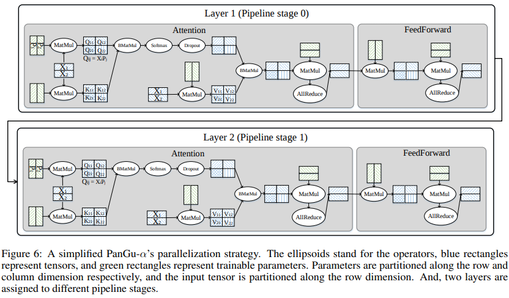

# 盘古α网络多维度混合并行解析

<!-- TOC -->

- [盘古α网络多维度混合并行解析析](#盘古α网络多维度混合并行解析)
    - [概述](#概述)
    - [Embedding层](#Embedding层)
    - [Decoder层](#Decoder层)
        - [Self-attention](#Self-attention)
        - [Feedforward](#Feedforward)
    - [Residual层](#Residual层)
    - [Linear层](#Linear层)
    - [参考文献](#参考文献)

<!-- /TOC -->

<a href="https://gitee.com/mindspore/docs/blob/r1.5/docs/mindspore/programming_guide/source_zh_cn/pangu_alpha.md" target="_blank"></a>

## 概述

在MindSpore发布的盘古α模型[1]中，我们看到借助多维度自动混合并行可以实现超大规模Transformer网络的分布式训练。这篇文章将从网络脚本出发，详解模型各个组成部分的切分方式。

> 完整代码可以参考：https://gitee.com/mindspore/models/tree/master/official/nlp/pangu_alpha

在训练入口脚本train.py中，通过`context.set_auto_parallel_context`接口使能半自动并行模式`SEMI_AUTO_PARALLEL`，表明用户可以通过对算子配置切分策略的方式，借助框架自动完成切分。根据不同网络层运算量和计算方式的特点，选择合适的切分策略是本文关注的重点。此外，通过`enable_parallel_optimizer`和`pipeline_stages`参数可以配置优化器并行和流水线并行方式。

## Embedding层

在语言类模型训练中，输入的数据是由单词组成的句子，我们通常使用embedding算法实现词的向量化，将单词及其位置信息映射为`config.embedding_size`大小维度的词向量。在MindSpore中`Gather`算子接收两个输入，根据索引`input_ids`或`input_position`在查找表`embedding_table`中查找对应向量。查找表是在训练中需要学习的参数，静态占用卡上内存资源，我们可以根据查找表的大小决定对`Gather`算子采用数据并行策略`gather.shard(((1, 1), (config.dp, 1)))`切分索引batch维度，或者模型并行策略`gather.shard(((config.mp, 1), (1, 1)))`对查找表进行行切。当词表范围`config.vocab_size`较大时，建议对`word_embedding`选择模型并行策略，框架会自动引入计算和通信算子处理越界查找情况。

> 脚本和文章中使用config.dp和config.mp指代数据并行切分维度大小和模型并行切分维度大小。

```python
class Embedding(nn.Cell):
    """
    Embedding
    """
    def __init__(self, config):
        super(Embedding, self).__init__()
        self.word_embedding = EmbeddingLookup().set_comm_fusion(1)
        if config.word_emb_dp:
            self.word_embedding.gather.shard(((1, 1), (config.dp, 1)))
        else:
            self.word_embedding.gather.shard(((config.mp, 1), (1, 1)))
        if config.stage_num > 1:
            self.position_embedding = nn.Embedding(config.seq_length,
                                                   config.embedding_size,
                                                   embedding_table=Normal(0.02)).set_comm_fusion(1)
        else:
            # Position embedding
            if config.load_ckpt_path:
                # Loading the embedding table from the ckpt path:
                embedding_path = os.path.join(config.load_ckpt_path, 'position_embedding.npy')
                if os.path.exists(embedding_path):
                    p_table = np.load(embedding_path)
                    position_table_param = Tensor(p_table, mstype.float32)
                else:
                    raise ValueError(f"{embedding_path} file not exits, "
                                     f"please check whether position_embedding file exit.")
            else:
                position_table_param = TruncatedNormal(0.02)
            # Position embedding
            self.position_embedding = nn.Embedding(
                config.seq_length,
                config.embedding_size,
                embedding_table=position_table_param).set_comm_fusion(1)
        self.position_embedding.embedding_table.parallel_optimizer = False
        self.position_embedding.gather.shard(((1, 1), (config.dp,)))
        self.position_embedding.expand.shard(((config.dp, 1),))
        self.add = P.TensorAdd().shard(((config.dp, 1, 1), (config.dp, 1, 1)))
        self.dropout = Dropout(1 - config.dropout_rate)
        self.dropout.shard(((config.dp, 1, 1),))
        self.use_past = config.use_past
        self.is_first_iteration = True

    def construct(self, input_ids, table, input_position, valid_index=None):
        input_embedding = self.word_embedding(input_ids, table)
        if self.use_past and not self.is_first_iteration:
            _, seq_length = F.shape(input_ids)
            input_position = valid_index.view(1, seq_length)
        position_embedding = self.position_embedding(input_position)
        hidden_states = self.add(input_embedding, position_embedding)
        hidden_states = self.dropout(hidden_states)
        hidden_states = P.Cast()(hidden_states, mstype.float16)
        return hidden_states

```

## Decoder层

训练大规模Transformer网络的关键困难在于如何解决随着层数增加造成的计算和内存瓶颈，选择合理的切分方式尤为重要。盘古α的主体网络由多个结构相同但不共享权重的Decoder组成，Decoder又由Self-attention和Feedforward两部分构成，它们的切分方式可以参照下图[1]：



### Self-attention

在计算attention的过程中需要将输入词向量与Query、Key、Value权重矩阵相乘产生加权向量，这里对矩阵乘输入的batch维度及权重的output_channel维度进行混合并行切分`matmul.shard(((config.dp, 1), (config.mp, 1)))`。输出矩阵行、列均切，再加上切分的偏置项`bias_add.shard(((config.dp, config.mp), (config.mp,)))`。

```python
class Attention(nn.Cell):
    """
    Self-Attention module for each layer

    Args:
        config(PanguAlphaConfig): the config of network
        scale: scale factor for initialization
        layer_idx: current layer index
    """

    def __init__(self, config, scale=1.0, layer_idx=None):
        super(Attention, self).__init__()
        ...
        # Query
        self.dense1 = nn.Dense(config.embedding_size,
                               config.embedding_size,
                               weight_init=initializer(init='normal', shape=dense_shape,
                                                       dtype=config.param_init_type),
                               bias_init=initializer(init='zeros', shape=bias_shape,
                                                     dtype=config.param_init_type)).to_float(config.compute_dtype)
        self.dense1.matmul.shard(((config.dp, 1), (config.mp, 1)))
        self.dense1.bias_add.shard(((config.dp, config.mp), (config.mp,)))
        # Key
        self.dense2 = nn.Dense(config.embedding_size,
                               config.embedding_size,
                               weight_init=initializer(init='normal',
                                                       shape=dense_shape,
                                                       dtype=config.param_init_type),
                               bias_init=initializer(init='zeros',
                                                     shape=bias_shape,
                                                     dtype=config.param_init_type)).to_float(config.compute_dtype)
        self.dense2.matmul.shard(((config.dp, 1), (config.mp, 1)))
        self.dense2.bias_add.shard(((config.dp, config.mp), (config.mp,)))
        # Value
        self.dense3 = nn.Dense(config.embedding_size,
                               config.embedding_size,
                               weight_init=initializer(init='normal',
                                                       shape=dense_shape,
                                                       dtype=config.param_init_type),
                               bias_init=initializer(init='zeros',
                                                     shape=bias_shape,
                                                     dtype=config.param_init_type)).to_float(config.compute_dtype)
        self.dense3.matmul.shard(((config.dp, 1), (config.mp, 1)))
        self.dense3.bias_add.shard(((config.dp, config.mp), (config.mp,)))
        ...
```

### Feedforward

Feedforward网络层由两个矩阵乘组成，第一个矩阵乘切分方式和attention一致，输出矩阵行、列均切。为了避免引入算子间的重排布通信，第二个矩阵乘对权重的input_channel维度切分，即`matmul.shard(((config.dp, config.mp), (config.mp, 1)))`，相关维切分时框架会自动插入`AllReduce`算子在模型并行维度设备间累加切片。输出矩阵仅在batch维度切分，再加上偏置项`add.shard(((config.dp, 1), (1,)))`。

```python
class FeedForwardLayer(nn.Cell):
    """
    The output mapping module for each layer
    Args:
        config(PanguAlphaConfig): the config of network
        scale: scale factor for initialization
    Inputs:
        x: output of the self-attention module
    Returns:
        output: Tensor, the output of this layer after mapping
    """

    def __init__(self, config, scale=1.0):
        super(FeedForwardLayer, self).__init__()
        input_size = config.embedding_size
        output_size = config.embedding_size * config.expand_ratio
        # Project to expand_ratio*embedding_size
        self.mapping = MappingOutput(config, input_size, output_size)
        # Project back to embedding_size
        self.projection = Mapping(config, output_size, input_size, scale)
        self.projection.matmul.shard(((config.dp, config.mp), (config.mp, 1)))
self.projection.add.shard(((config.dp, 1), (1,)))
        self.activation = nn.GELU()
        self.activation.gelu.shard(((config.dp, 1, config.mp),))
        self.dropout = Dropout(1 - config.dropout_rate)
        self.dropout.shard(((config.dp, 1, 1),))

    def construct(self, x):
        # [bs, seq_length, expand_ratio*embedding_size]
        hidden = self.activation(self.mapping(x))
        output = self.projection(hidden)
        # [bs, seq_length, expand_ratio]
        output = self.dropout(output)
        return output
```

## Residual层

Transformer结构中值得注意的一个细节是，每个子层都有残差连接，并且跟着layernorm操作。虽然layernorm中也包含权重，但是仅为`config.embedding_size`大小的一维向量，占网络权重比例很小，所以这里直接采用数据并行切分方式。

```python
class LayerNorm(nn.Cell):
    r"""
        A self-defined layer norm operation using reduce sum and reduce mean
    """

    def __init__(self, normalized_shape, dp=4, eps=1e-5, parallel_optimizer=False):
        super(LayerNorm, self).__init__()
        self.gamma = Parameter(initializer('ones', normalized_shape), name="gamma",
                               parallel_optimizer=parallel_optimizer)
        self.beta = Parameter(initializer('zeros', normalized_shape), name="beta",
                              parallel_optimizer=parallel_optimizer)
        self.mean = P.ReduceMean(keep_dims=True).shard(((dp, 1, 1),))
        self.square = P.Square().shard(((dp, 1, 1),))
        self.sqrt = P.Sqrt().shard(((dp, 1, 1),))
        self.sub1 = P.Sub().shard(((dp, 1, 1), (dp, 1, 1)))
        self.add = P.TensorAdd().shard(((dp, 1, 1), ()))
        self.mul = P.Mul().shard(((dp, 1, 1), (1,)))
        self.add2 = P.TensorAdd().shard(((dp, 1, 1), (1,)))
        self.real_div = P.RealDiv().shard(((dp, 1, 1), (dp, 1, 1)))
        self.eps = eps

    def construct(self, x):
        mean = self.mean(x, -1)
        diff = self.sub1(x, mean)
        variance = self.mean(self.square(diff), -1)
        variance_eps = self.sqrt(self.add(variance, self.eps))
        output = self.real_div(diff, variance_eps)
        output = self.add2(self.mul(output, self.gamma), self.beta)
        return output
```

## Linear层

计算loss前需要经过一个全连接层将输出特征从`config.embedding_size`映射回`config.vocab_size`维度得到logits。这里全连接层和`word_embedding`操作共享权重，所以要求全连接层权重的切分方式与embedding层保持一致。

```python
class PanguAlpha_Head(nn.Cell):
    """
    Head for PanguAlpha to get the logits of each token in the vocab
    Args:
        config(PanguAlphaConfig): the config of network
    Inputs:
        state: the output of the backbone
        embedding_table: the embedding table of the vocabulary
    Returns:
        logits: Tensor, the logits of the corresponding inputs
    """

    def __init__(self, config):
        super(PanguAlpha_Head, self).__init__()
        if config.word_emb_dp:
            self.matmul = P.MatMul(transpose_b=True).shard(((config.dp, 1), (1, 1)))
        else:
            self.matmul = P.MatMul(transpose_b=True).shard(((config.dp, 1), (config.mp, 1)))
        self.embedding_size = config.embedding_size
        self.log_softmax = P.LogSoftmax(axis=-1)
        self.dtype = config.compute_dtype
        self.cast = P.Cast()

    def construct(self, state, embedding_table):
        state = P.Reshape()(state, (-1, self.embedding_size))
        # output logits over vocabulary [bs*seq_length, vocab_size]
        logits = self.matmul(state, self.cast(embedding_table, self.dtype))
        return logits
```

在这篇文章中，我们了解到如何通过配置算子切分策略的方式在单机脚本基础上快速实现Transformer类网络的分布式训练。具体到网络结构，embedding层、decorder层、residual层、linear层都有各自的切分特点，用户可以通过掌握算子策略配置方法，提升分布式训练、调优效率。

## 参考文献

[1] Zeng W ,  Ren X ,  Su T , et al. PanGu-$\\alpha$: Large-scale Autoregressive Pretrained Chinese Language Models with Auto-parallel Computation.  2021.
