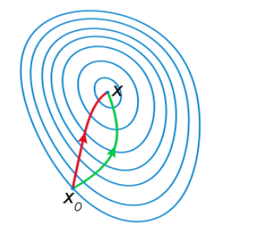
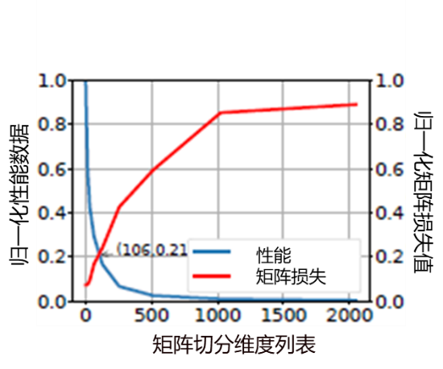
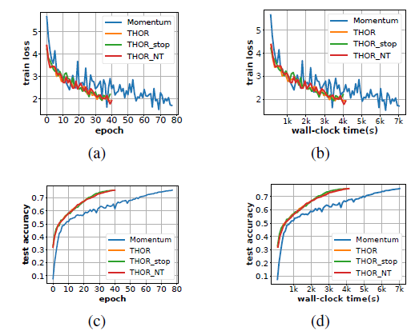
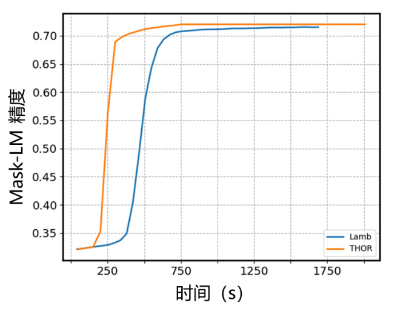

# 二阶优化器THOR介绍

`Ascend` `扩展功能`

深度学习训练过程可以看成损失函数损失值下降过程，合适的优化器可以让深度学习训练时间大大减少。优化器可以分为一阶优化器和二阶优化器，目前业界主流使用的仍然是一阶优化器，二阶优化器因为单步训练时间过久而没有被广泛应用，而近年来，将二阶优化应用到深度学习训练中有了理论突破，并取得了不错的结果。

本文会介绍下优化器的背景，以及MindSpore团队自研二阶优化器THOR。

## 优化器背景介绍

假设训练样本数据集：$D = {(x_1,y_1),...,(x_i,y_i),...,(x_N,y_N)},x_i \in X,y_i\in Y$，参数θ表述的深度神经网络模型为： $\hat{y} = f(x;\theta),x\in{X}$， 定义在模型输出和真实标签y之间的损失函数为：$L(y,\hat y),y \in Y$， 网络参数学习的过程是最小化损失函数的过程：$\min\limits_{\theta}L(y,\hat{y})$。给定数据集、模型、损失函数后，深度学习训练问题归结为优化问题，深度神经网络训练优化问题参数规模巨大，需要大量的计算，难以计算出解析解。因此该过程也常常被比喻成下山，如图1 所示，一个人站在山顶的时候如何在有限视距内寻找最快路径下山呢？

*图1 深度学习训练过程模拟*

而优化器就是在做这件事情，业界的优化算法可分为一阶优化算法和二阶优化算法。下面简单介绍下业界的优化器情况。

### 一阶优化器

梯度下降算法（Gradient Descent, GD）是机器学习中最经典的一阶优化算法，也是众多机器学习算法中最常用的优化算法。常用的一阶优化算法（比如SGD算法）中对参数的更新采用如下规则：$\theta = \theta -\eta \nabla L_\theta$，其中$\theta$是需要更新的参数，$\eta$是学习率，$\nabla L_\theta$是损失函数对于参数的梯度。

但是主流随机梯度下降方法有以下问题：太小的学习率会导致网络收敛过于缓慢；学习率太高可能会影响收敛，并导致损失函数在最小值上波动，甚至出现发散，对参数比较敏感；容易收敛到局部最优，难以跳出鞍点。

因此业界提出了很多随机梯度下降方法的改良算法，例如Momentum、Nesterov、AdaGrad、RMSprop、Adadelta和Adam等。这些改进后的优化算法可以利用随机梯度的历史信息来自适应地更新步长，使得它们更容易调参，而且方便使用。

### 二阶优化器

二阶优化算法利用目标函数的二阶导数进行曲率校正来加速一阶梯度下降。与一阶优化器相比，其收敛速度更快，能高度逼近最优值，几何上下降路径也更符合真实的最优下降路径。

例如，二阶优化算法中的牛顿法就是用一个二次曲面去拟合你当前所处位置的局部曲面，而梯度下降法是用一个平面去拟合当前的局部曲面，通常情况下，二次曲面的拟合会比平面更好，所以牛顿法选择的下降路径会更符合真实的最优下降路径。如图2 所示，左边下降路径表示牛顿法的下降曲线，右边表示一阶梯度的下降曲线，二阶算法与一阶算法先比，可以更快的走到目的地，从而加速收敛。

*图2 不同优化器下降路径*

从数学公式上来看，与一阶优化算法相比，二阶优化算法则是先将$\nabla L_{\theta}$与一个矩阵$G^{-1}$相乘，产生如下的更新规则：$\theta = \theta -\eta G^{-1}\nabla L_{\theta}$，其中G即为二阶信息矩阵，不同的二阶优化算法中的G定义是不同的，常见的二阶优化算法有牛顿法，自然梯度法等，分别对应的二阶信息矩阵G为海森矩阵，费雪矩阵。

牛顿法有着很好的局部收敛性质，当函数L在最优值点$\theta^{*}$点满足$\nabla L_{\theta^{*}}=0,\nabla^{2} L_{\theta^{*}}$是正定矩阵, 且海森矩阵在极值点附近是李普希兹连续时，牛顿法二次收敛到最优值点。 海森矩阵是一个由多变量实值函数的所有二阶偏导数组成的方块矩阵。海森矩阵可以表示为：$H_{ij} = \frac{\partial^2L}{\partial \theta_i \partial \theta_j}$，其中L即为损失函数，$\theta$是需要更新的参数。

在SGD中，参数空间和函数空间的度量用的都是欧式距离，但欧式距离在一些情况下不能作为函数空间准确的距离度量。例如神经网络中，参数引起的目标函数变化是概率的变化，这并不适合在欧几里得空间度量，它不是概率属性变化的合理表征。KL散度是分布之间距离的合理度量。当使用KL散度作为概率分布之间距离的度量时。此时参数更新时，用到的梯度就是自然梯度。自然梯度法中的费雪矩阵可以表示为：$F=\mathrm{E}[\frac{\partial \mathrm {log} p(y|x,\theta)}{\partial \theta}{\frac{\partial \mathrm {log} p(y|x,\theta)}{\partial \theta}}^T]$，其中P(y|x,θ)是网络模型的预测分布，p(y|x,θ)是其概率密度，θ是需要网络模型的参数。

二阶优化算法虽然收敛速度快，但是计算二阶矩阵的逆的时间复杂度为$\mathrm O(n^3)$，当模型参数量为$n_\theta$时，对应的二阶信息矩阵的大小为$n_\theta \times n_\theta$。在深度学习模型中，$n_\theta$常常在数百万的量级，此时二阶信息矩阵的逆无法计算。因此如何降低二阶信息矩阵求逆的计算复杂度成为关键问题。接下来介绍下深度学习中的二阶优化器。

## THOR的介绍

当前业界已有的二阶优化算法计算量较大，与一阶相比优势不明显或者使用场景较为单一。MindSpore提出了自研算法[THOR(Trace-based Hardware-driven layer-ORiented Natural Gradient Descent Computation)](https://ojs.aaai.org/index.php/AAAI/article/view/16867)，
算法已被AAAI录用，THOR在多个场景中均有明显收益，如在BERT和ResNet50中，收敛速度均有明显优势。THOR主要做了以下两点创新：

### 降低二阶信息矩阵更新频率

通过实验观察费雪矩阵的F范数（Frobenius norm）在前期变化剧烈，后期逐渐变稳定，从而假设$\Big\{{F^k}\Big\}^{n}_{k=1}$是一个马尔可夫过程，可以收敛到一个稳态分布π，其中$F^k$代表第k个迭代时的费雪矩阵。因此，在训练过程中逐步增大费雪矩阵的更新间隔，可以在不影响收敛速度的情况下，减少训练时间。例如在ResNet50中，更新间隔步数随着训练的进行越来越大，到后期每个epoch只需更新一次二阶信息矩阵。

THOR受KFAC启发，将费雪矩阵按层解耦来降低矩阵复杂度，分别针对每一层的费雪矩阵做实验，发现有些层的费雪矩阵趋于稳态的速度更快，因此在统一的更新间隔上，更加细粒度的去调整每一层的更新频率。THOR使用矩阵的迹作为判断条件，当迹的变化情况大于某一阈值时更新该层的二阶信息矩阵，否则沿用上一个迭代的二阶信息矩阵，并且引入了停止更新机制，当迹的变化量小于某个阈值时停止更新该层二阶信息矩阵，具体更新公式如下：

$$
\begin{cases}
update\ F^{k}_{i} , \qquad\qquad\qquad\qquad\qquad\qquad\qquad\qquad\qquad\quad\ \ if \ \Delta^{k} \in (\omega_{1},+\infty)\\
do\ not\ update\ F^{k}_{i}\ and\ set \  F^{k}_{i}=F^{k-1}_{i}, \ \quad\qquad\qquad\qquad\quad if \ \Delta^{k} \in [\omega_{2},\omega_{1}]\\
stop\ update\ F^{k}_{i}\ and\ set \  F^{k+t}_{t}\equiv F^{k-1}_{i}\ for\ all\ t=1,2,...\quad if \ \Delta^{k} \in [0,\omega_{2})
\end{cases}
$$

其中：

$$\Delta^k=\frac{||tr(F^k_i+\lambda I)|-|tr(F^{k-1}_i+\lambda I)||}{|tr(F^{k-1}_i+\lambda I)|}$$

### 硬件感知矩阵切分

THOR在将费雪矩阵按层解耦的基础上，进一步假设每个网络层中的输入和输出块之间也是独立的，例如将每层网络的输入输出切分为n个块，这n个块之间即是独立的，根据该假设对二阶信息矩阵做进一步的切分，从而提高了计算效率。THOR结合矩阵信息损失数据和矩阵性能数据确定了矩阵分块维度，从而大大提升费雪矩阵求逆时间。

那么如何确定矩阵分块维度的呢。具体方法为：

（1）根据费雪矩阵中维度最大的那一层，确定矩阵切分维度，拿ResNet50举例，网络层中的最大维度为2048，确定矩阵切分维度为[1,16,32,64,128,256,512,1024,2048]。

（2）根据确定的矩阵维度，根据谱范数计算每个维度下的矩阵损失，具体公式为：

$$L=1-\sqrt{\frac{\lambda_{max}\ \ (\hat{A}\hat{A}^T)}{\lambda_{max}\ \ (AA^T)}}$$

其中$\lambda_{max}(X)$表示矩阵$X$的最大特征值，$A$表示原始未分割矩阵， $\hat A$表示分割后的矩阵。然后统计在该维度下损失小于1%的矩阵数量，最后通过除以总的矩阵数量得到标准化后的矩阵损失信息。

（3）根据确定的矩阵维度，计算每个维度下的矩阵求逆时间，再通过公式$normalized_n = \frac{p_1}{p_n}$得到每个维度下标准化后性能数据，其中$p_1$表示维度最小的矩阵的性能数据，$p_n$表示第n个维度下的性能数据。

（4）根据标注化后的矩阵损失信息和标准化后的性能数据绘图，如以ResNet50为例，如图3所示，图中下降曲线为性能曲线，上升曲线表示矩阵损失曲线，图中交叉点为106，与128最接近，最后确定矩阵切分维度为128。

*图3 切分维度确定示意图*

### 实验结果

图4展示了THOR在ResNet50+ImageNet，batchsize为256时一二阶上的训练曲线图，其中train loss表示训练误差，test accuracy表示测试精度，epoch表示迭代数，wall-clock time表示时，其中下降较快的曲线和上升较快的曲线是本算法曲线，另外差距较明显的曲线是momentum的训练曲线。

*图4 THOR在ResNet50上的实验结果*

图4中的THOR，THOR_stop，THOR_NT分别表示($w_1$,$w_2$)=(0.01,0)，($w_1$,$w_2$)=(0.01,0.001)，($w_1$,$w_2$)=(0,0)，从图中可以看到THOR收敛所需迭代数大约是一阶的一半，且单step的时间与一阶相差也不大。相比一阶算法需要117min，二阶优化器端到端时间提速约40%。

THOR还测试了在不同batchsize下ResNet50+ImageNet的收敛结果，结果见下图5，其中Hardware表示硬件平台，Software是指使用的深度学习框架，Batch size是每次训练的图片数量，Optimizer表示使用的优化器，Time指总体训练时间，Accuracy是指最后收敛精度。当batchsize为8192，使用256块Ascend 910时，只需2.7分钟精度即可收敛到75.9%。

*图5 大batchsize下THOR在ResNet50上的实验结果*

在BERT+WIkipedia中，THOR也有不错的表现效果，以MLPerf为标准，精度达到71.2%，与一阶相比端到端提升30%，实验结果见图6，图中横坐标表示训练时间，纵坐标表示测试精度，上升较快的曲线是THOR的训练曲线，另一条为Lamb的训练曲线。

*图6 THOR在BERT上的实验结果*
