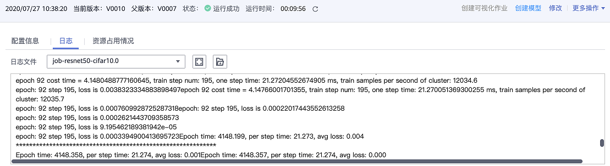
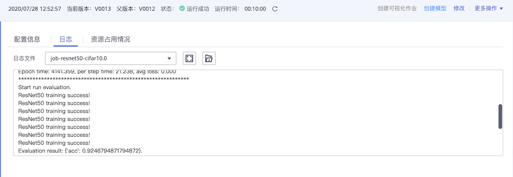

# 在云上使用MindSpore

`Ascend` `全流程`

<!-- TOC -->

- [在云上使用MindSpore](#在云上使用mindspore)
    - [概述](#概述)
    - [准备工作](#准备工作)
        - [ModelArts使用准备](#modelarts使用准备)
        - [拥有云上昇腾AI处理器资源](#拥有云上昇腾ai处理器资源)
        - [数据准备](#数据准备)
        - [执行脚本准备](#执行脚本准备)
    - [通过简单适配将MindSpore脚本运行在ModelArts](#通过简单适配将mindspore脚本运行在modelarts)
        - [适配脚本参数](#适配脚本参数)
        - [适配OBS数据](#适配obs数据)
        - [适配8卡训练任务](#适配8卡训练任务)
        - [示例代码](#示例代码)
    - [创建训练任务](#创建训练任务)
        - [进入ModelArts控制台](#进入modelarts控制台)
        - [使用常用框架创建训练作业](#使用常用框架创建训练作业)
        - [使用MindSpore作为常用框架创建训练作业](#使用mindspore作为常用框架创建训练作业)
    - [查看运行结果](#查看运行结果)

<!-- /TOC -->

<a href="https://gitee.com/mindspore/docs/blob/master/docs/mindspore/programming_guide/source_zh_cn/use_on_the_cloud.md" target="_blank"></a>

## 概述

ModelArts是华为云提供的面向开发者的一站式AI开发平台，集成了昇腾AI处理器资源池，用户可以在该平台下体验MindSpore。

本教程以ResNet-50为例，简要介绍如何在ModelArts使用MindSpore完成训练任务。

## 准备工作

### ModelArts使用准备

参考ModelArts教程“准备工作”一栏，完成账号注册、ModelArts配置和创建桶的准备工作。
> ModelArts教程链接：<https://support.huaweicloud.com/wtsnew-modelarts/index.html>。页面提供了较丰富的ModelArts教程，参考“准备工作”部分完成ModelArts准备工作。

### 拥有云上昇腾AI处理器资源

确保你的账号已拥有ModelArts华为云昇腾集群服务公测资格，可在[ModelArts华为云](https://console.huaweicloud.com/modelarts/?region=cn-north-4#/dashboard/applyModelArtsAscend910Beta)提交申请。

### 数据准备

ModelArts使用对象存储服务（Object Storage Service，简称OBS）进行数据存储，因此，在开始训练任务之前，需要将数据上传至OBS。本示例使用CIFAR-10二进制格式数据集。

1. 下载CIFAR-10数据集并解压。

    > CIFAR-10数据集下载页面：<http://www.cs.toronto.edu/~kriz/cifar.html>。页面提供3个数据集下载链接，本示例使用CIFAR-10 binary version。

2. 新建一个自己的OBS桶（例如：ms-dataset），在桶中创建数据目录（例如：cifar-10），将CIFAR-10数据按照如下结构上传至数据目录。

    ```text
    └─对象存储/ms-dataset/cifar-10
        ├─train
        │      data_batch_1.bin
        │      data_batch_2.bin
        │      data_batch_3.bin
        │      data_batch_4.bin
        │      data_batch_5.bin
        │
        └─eval
            test_batch.bin
    ```

### 执行脚本准备

新建一个自己的OBS桶（例如：`resnet50-train`），在桶中创建代码目录（例如：`resnet50_cifar10_train`），并将以下目录中的所有脚本上传至代码目录：
> <https://gitee.com/mindspore/docs/tree/master/docs/sample_code/sample_for_cloud/>脚本使用ResNet-50网络在CIFAR-10数据集上进行训练，并在训练结束后验证精度。脚本可以在ModelArts采用`1*Ascend`或`8*Ascend`两种不同规格进行训练任务。
>
> 注意运行脚本的版本需要与"创建训练任务"步骤选择的MindSpore版本一致。例如：使用MindSpore 1.1版本教程提供的脚本，则需要在创建训练任务时选择1.1版本的MindSpore引擎。

为了方便后续创建训练作业，先创建训练输出目录和日志输出目录，本示例创建的目录结构如下：

```text
└─对象存储/resnet50-train
    ├─resnet50_cifar10_train
    │      dataset.py
    │      resnet.py
    │      resnet50_train.py
    │
    ├─output
    └─log
```

## 通过简单适配将MindSpore脚本运行在ModelArts

“执行脚本准备”章节提供的脚本可以直接运行在ModelArts，想要快速体验ResNet-50训练CIFAR-10可以跳过本章节。如果需要将自定义MindSpore脚本或更多MindSpore示例代码在ModelArts运行起来，需要参考本章节对MindSpore代码进行简单适配。

### 适配脚本参数

1. 在ModelArts运行的脚本必须配置`data_url`和`train_url`，分别对应数据存储路径(OBS路径)和训练输出路径(OBS路径)。

    ``` python
    import argparse

    parser = argparse.ArgumentParser(description='ResNet-50 train.')
    parser.add_argument('--data_url', required=True, default=None, help='Location of data.')
    parser.add_argument('--train_url', required=True, default=None, help='Location of training outputs.')
    ```

2. ModelArts界面支持向脚本中其他参数传值，在下一章节“创建训练作业”中将会详细介绍。

    ``` python
    parser.add_argument('--epoch_size', type=int, default=90, help='Train epoch size.')
    ```

### 适配OBS数据

MindSpore暂时没有提供直接访问OBS数据的接口，需要通过MoXing提供的API与OBS交互。ModelArts训练脚本在容器中执行，通常选用`/cache`目录作为容器数据存储路径。
> 华为云MoXing提供了丰富的API供用户使用<https://github.com/huaweicloud/ModelArts-Lab/tree/master/docs/moxing_api_doc>，本示例中仅需要使用`copy_parallel`接口。

1. 将OBS中存储的数据下载至执行容器。

    ```python
    import moxing as mox
    mox.file.copy_parallel(src_url='s3://dataset_url/', dst_url='/cache/data_path')
    ```

2. 将训练输出从容器中上传至OBS。

    ```python
    import moxing as mox
    mox.file.copy_parallel(src_url='/cache/output_path', dst_url='s3://output_url/')
    ```

### 适配8卡训练任务

如果需要将脚本运行在`8*Ascend`规格的环境上，需要对创建数据集的代码和本地数据路径进行适配，并配置分布式策略。通过获取`DEVICE_ID`和`RANK_SIZE`两个环境变量，用户可以构建适用于`1*Ascend`和`8*Ascend`两种不同规格的训练脚本。

1. 本地路径适配。

    ```python
    import os

    device_num = int(os.getenv('RANK_SIZE'))
    device_id = int(os.getenv('DEVICE_ID'))
    # define local data path
    local_data_path = '/cache/data'

    if device_num > 1:
        # define distributed local data path
        local_data_path = os.path.join(local_data_path, str(device_id))
    ```

2. 数据集适配。

    ```python
    import os
    import mindspore.dataset as ds

    device_id = int(os.getenv('DEVICE_ID'))
    device_num = int(os.getenv('RANK_SIZE'))
    if device_num == 1:
        # create train data for 1 Ascend situation
        dataset = ds.Cifar10Dataset(dataset_path, num_parallel_workers=8, shuffle=True)
    else:
        # create train data for 1 Ascend situation, split train data for 8 Ascend situation
        dataset = ds.Cifar10Dataset(dataset_path, num_parallel_workers=8, shuffle=True,
                                    num_shards=device_num, shard_id=device_id)
    ```

3. 配置分布式策略。

    ```python
    import os
    from mindspore import context
    from mindspore.context import ParallelMode

    device_num = int(os.getenv('RANK_SIZE'))
    if device_num > 1:
        context.set_auto_parallel_context(device_num=device_num,
                                          parallel_mode=ParallelMode.DATA_PARALLEL,
                                          gradients_mean=True)
    ```

### 示例代码

结合以上三点对MindSpore脚本进行简单适配，以下述伪代码为例：

原始MindSpore脚本：

``` python
import os
import argparse
from mindspore import context
from mindspore.context import ParallelMode
import mindspore.dataset as ds

device_id = int(os.getenv('DEVICE_ID'))
device_num = int(os.getenv('RANK_SIZE'))

def create_dataset(dataset_path):
    if device_num == 1:
        dataset = ds.Cifar10Dataset(dataset_path, num_parallel_workers=8, shuffle=True)
    else:
        dataset = ds.Cifar10Dataset(dataset_path, num_parallel_workers=8, shuffle=True,
                                    num_shards=device_num, shard_id=device_id)
    return dataset

def resnet50_train(args):
    if device_num > 1:
        context.set_auto_parallel_context(device_num=device_num,
                                          parallel_mode=ParallelMode.DATA_PARALLEL,
                                          gradients_mean=True)
    train_dataset = create_dataset(local_data_path)

if __name__ == '__main__':
    parser = argparse.ArgumentParser(description='ResNet-50 train.')
    parser.add_argument('--local_data_path', required=True, default=None, help='Location of data.')
    parser.add_argument('--epoch_size', type=int, default=90, help='Train epoch size.')

    args_opt, unknown = parser.parse_known_args()

    resnet50_train(args_opt)
```

适配后的MindSpore脚本：

``` python
import os
import argparse
from mindspore import context
from mindspore.context import ParallelMode
import mindspore.dataset as ds

# adapt to cloud: used for downloading data
import moxing as mox

device_id = int(os.getenv('DEVICE_ID'))
device_num = int(os.getenv('RANK_SIZE'))

def create_dataset(dataset_path):
    if device_num == 1:
        dataset = ds.Cifar10Dataset(dataset_path, num_parallel_workers=8, shuffle=True)
    else:
        dataset = ds.Cifar10Dataset(dataset_path, num_parallel_workers=8, shuffle=True,
                                    num_shards=device_num, shard_id=device_id)
    return dataset

def resnet50_train(args):
    # adapt to cloud: define local data path
    local_data_path = '/cache/data'

    if device_num > 1:
        context.set_auto_parallel_context(device_num=device_num,
                                          parallel_mode=ParallelMode.DATA_PARALLEL,
                                          gradients_mean=True)
        # adapt to cloud: define distributed local data path
        local_data_path = os.path.join(local_data_path, str(device_id))

    # adapt to cloud: download data from obs to local location
    print('Download data.')
    mox.file.copy_parallel(src_url=args.data_url, dst_url=local_data_path)

    train_dataset = create_dataset(local_data_path)

if __name__ == '__main__':
    parser = argparse.ArgumentParser(description='ResNet-50 train.')
    # adapt to cloud: get obs data path
    parser.add_argument('--data_url', required=True, default=None, help='Location of data.')
    # adapt to cloud: get obs output path
    parser.add_argument('--train_url', required=True, default=None, help='Location of training outputs.')
    parser.add_argument('--epoch_size', type=int, default=90, help='Train epoch size.')
    args_opt, unknown = parser.parse_known_args()

    resnet50_train(args_opt)
```

## 创建训练任务

准备好数据和执行脚本以后，需要创建训练任务将MindSpore脚本真正运行起来。首次使用ModelArts的用户可以根据本章节了解ModelArts创建训练作业的流程。

### 进入ModelArts控制台

打开华为云ModelArts主页<https://www.huaweicloud.com/product/modelarts.html>，点击该页面的“进入控制台”。

### 使用常用框架创建训练作业

ModelArts教程<https://support.huaweicloud.com/engineers-modelarts/modelarts_23_0238.html>展示了如何使用常用框架创建训练作业。

### 使用MindSpore作为常用框架创建训练作业

以本教程使用的训练脚本和数据为例，详细列出在创建训练作业界面如何进行配置：

1. `算法来源`：选择`常用框架`，然后`AI引擎`选择`Ascend-Powered-Engine`和所需的MindSpore版本(本示例图片为`Mindspore-0.5-python3.7-aarch64`，请注意使用与所选版本对应的脚本)。

2. `代码目录`选择预先在OBS桶中创建代码目录，`启动文件`选择代码目录下的启动脚本。

3. `数据来源`选择`数据存储位置`，并填入OBS中CIFAR-10数据集的位置。

4. `运行参数`：`数据存储位置`和`训练输出位置`分别对应运行参数`data_url`和`train_url`，选择`增加运行参数`可以向脚本中其他参数传值，如`epoch_size`。

5. `资源池`选择`公共资源池 > Ascend`。

6. `资源池 > 规格`选择`Ascend: 1 * Ascend 910 CPU：24 核 96GiB`或`Ascend: 8 * Ascend 910 CPU：192 核 768GiB`，分别表示单机单卡和单机8卡规格。

使用MindSpore作为常用框架创建训练作业，如下图所示。


## 查看运行结果

1. 在训练作业界面可以查看运行日志

    采用`8*Ascend`规格执行ResNet-50训练任务，epoch总数为92，精度约为92%，每秒训练图片张数约12000，日志如下图所示。

    

    

    采用`1*Ascend`规格执行ResNet-50训练任务。epoch总数为92，精度约为95%，每秒训练图片张数约1800，日志如下图所示。

    

2. 如果创建训练作业时指定了日志路径，可以从OBS下载日志文件并查看。
