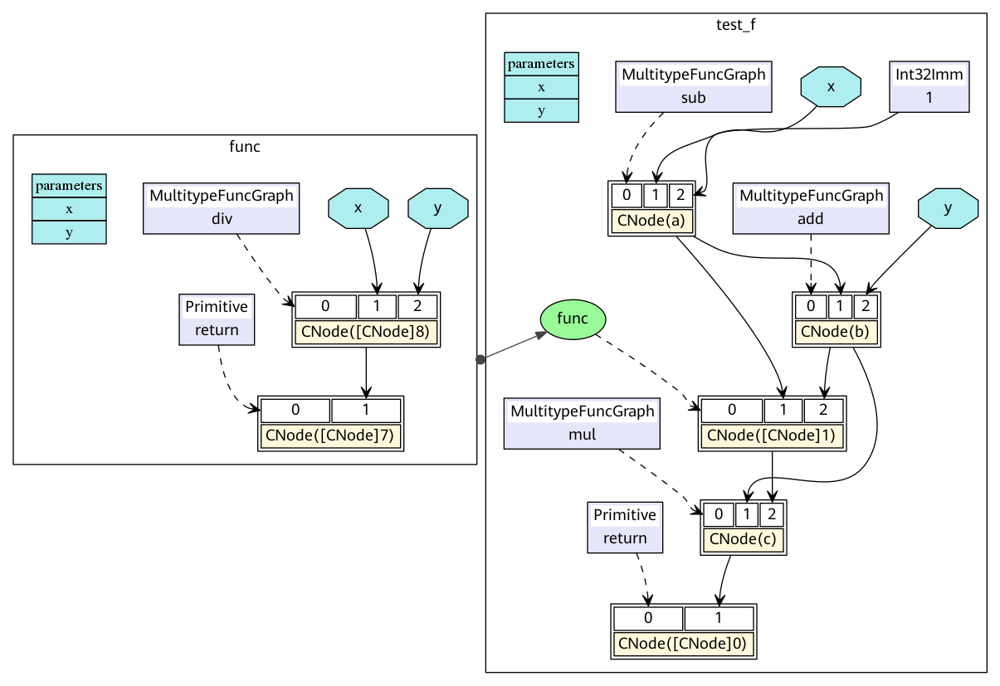
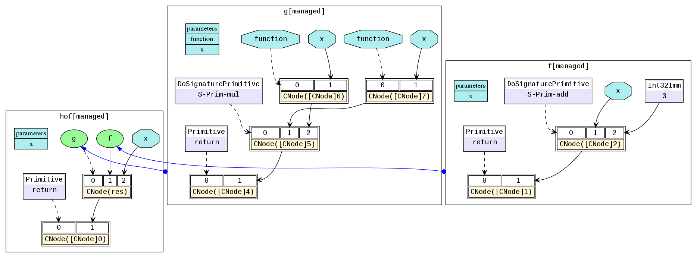

# Full-scenarios Unified Architecture

[](https://gitee.com/mindspore/docs/blob/br_base/docs/mindspore/source_en/design/all_scenarios.md)

MindSpore is designed to provide an device-edge-cloud full-scenarios AI framework that can be deployed in different hardware environments on the device-edge-cloud to meet the differentiated needs of different environments, such as supporting lightweight deployment on the device-side and rich training features such as automatic differentiation, hybrid precision and easy programming of models on the cloud side.

> The cloud side includes NVIDIA GPU, Huawei Ascend, Intel x86, etc., and the device side includes Arm, Qualcomm, Kirin, etc.


## Important Features of Full-scenarios

Several important features of MindSpore full scenarios:

1. The unified C++ inference interface of the device-edge-cloud supports algorithm code that can be quickly migrated to different hardware environments for execution, such as [device-side training based on C++ interface](https://mindspore.cn/lite/docs/en/br_base/quick_start/train_lenet.html).
2. Model unification. The device and cloud use the same model format and definition, and the software architecture is consistent. MindSpore supports the execution of Ascend, GPU, CPU (x86, Arm) and other hardware, and is used in multiple deployments for one training.
3. Diversified arithmetic support. Provide a unified southbound interface to support the quick addition of new hardware for use.
4. Model miniaturization techniques, adapted to the requirements of different hardware environments and business scenarios, such as quantization compression.
5. Rapid application of device-edge-cloud collaboration technologies such as [Federated Learning](https://mindspore.cn/federated/docs/en/master/index.html), [End-side Training](https://mindspore.cn/lite/docs/en/br_base/use/runtime_train.html) and other new technologies.

## Full-scenarios Support Mode

As shown above, the model files trained on MindSpore can be deployed in cloud services via Serving and executed on servers, device-side and other devices via Lite. Lite also supports offline optimization of the model via the standalone tool convert, achieving the goal of lightweighting the framework during inference and high performance of model execution.

MindSpore abstracts a uniform operator interface across hardware, so that the programming code for the network model can be consistent across different hardware environments. Simultaneously loading the same model file performs inference efficiently on each of the different hardware supported by MindSpore.

The inference aspect takes into account the fact that a large number of users use C++/C programming type, and provides a inference programming interface for C++, and the related programming interface is morphologically closer to the style of the Python interface.

At the same time, by providing custom offline optimized registration for third-party hardware and custom operator registration mechanism for third-party hardware, it implements fast interconnection to new hardware, while the external model programming interface and model files remain unchanged.

## MindSpore IR (MindIR)

### Overview

An intermediate representation (IR) is a representation of a program between the source and target languages, which facilitates program analysis and optimization for the compiler. Therefore, the IR design needs to consider the difficulty in converting the source language to the target language, as well as the ease-of-use and performance of program analysis and optimization.

MindSpore IR (MindIR) is a function-style IR based on graph representation. Its core purpose is to serve automatic differential transformation. Automatic differentiation uses the transformation method based on the function-style programming framework. Therefore, IR uses the semantics close to that of the ANF function. In addition, a manner of representation based on an explicit dependency graph is used by referring to excellent designs of Sea of Nodes[1] and Thorin[2]. For the specific introduction of ANF-IR, please refer to [MindSpore IR Syntax](https://www.mindspore.cn/docs/en/br_base/design/all_scenarios.html#syntax).

When a model compiled using MindSpore runs in the graph mode `set_context(mode=GRAPH_MODE)` and setting the environment variable `MS_DEV_SAVE_GRAPHS` to 1, some intermediate files will be generated during graph compliation. These intermediate files are called IR files. When more information about backend procedure should be analyzed, we can set the environment variable `MS_DEV_SAVE_GRAPHS` to 2. When more advanced information such as visualizing computing graphs or ir graphs of frontend with more details is required, we can set the environment variable `MS_DEV_SAVE_GRAPHS` to 3 to get more details. Currently, there are two IR files:

- .ir file: An IR file that describes the model structure in text format and can be directly viewed using any text editors.

- .dot file: An IR file that describes the topology relationships between different nodes. You can use this file by [graphviz](http://graphviz.org) as thes input to generate images for users to view the model structure.

### Syntax

ANF is a simple IR commonly used during functional programming. The ANF syntax is defined as follows:

```text
<aexp> ::= NUMBER | STRING | VAR | BOOLEAN | PRIMOP
          |  (lambda (VAR …) <exp>)
<cexp> ::= (<aexp> <aexp> …)
          |  (if <aexp> <exp> <exp>)
<exp> ::= (let ([VAR <cexp>]) <exp>) | <cexp> | <aexp>

```

Expressions in the ANF are classified into atomic expressions (aexp) and compound expressions (cexp). An atomic expression indicates a constant value, a variable, or an anonymous function. A compound expression consists of multiple atomic expressions, indicating that an anonymous function or primitive function call. The first input expression of a compound expression is the called function, and the other input expressions are the called parameters.

The syntax of MindIR is inherited from the ANF and is defined as follows:

```text
<ANode> ::= <ValueNode> | <ParameterNode>
<ParameterNode> ::= Parameter
<ValueNode> ::= Scalar | Named | Tensor | Type | Shape
               | Primitive | MetaFuncGraph | FuncGraph
<CNode> ::= (<AnfNode> …)
<AnfNode> ::= <CNode> | <ANode>
```

ANode in a MindIR corresponds to the atomic expression of ANF. ANode has two subclasses: ValueNode and ParameterNode. ValueNode refers to a constant node, which can carry a constant value (such as a scalar, symbol, tensor, type, and dimension), a primitive function (Primitive), a metafunction (MetaFuncGraph), or a common function (FuncGraph). In functional programming, the function definition itself is a value. ParameterNode refers to a parameter node, which indicates the formal parameter of a function.

CNode in a MindIR corresponds to the compound expression of ANF, indicating a function call.

During automatic differentiation of MindSpore, the gradient contribution of ParameterNode and CNode are calculated, and the final gradient of ParameterNode is returned. The gradient of ValueNode is not calculated.

### Example

The following uses a program code segment as an example to help you understand MindIR.

```python
def func(x, y):
    return x / y

@ms.jit
def test_f(x, y):
    a = x - 1
    b = a + y
    c = b * func(a, b)
    return c
```

The ANF corresponding to the Python code is as follows:

```text
lambda (x, y)
    let a = x - 1 in
    let b = a + y in
    let func = lambda (x, y)
        let ret = x / y in
        ret end in
    let %1 = func(a, b) in
    let c = b * %1 in
    c end
```

The corresponding MindIR is [ir.dot](https://gitee.com/mindspore/docs/blob/br_base/docs/mindspore/source_en/design/images/ir/ir.dot).



In a MindIR, a function graph (FuncGraph) indicates the definition of a common function. A directed acyclic graph (DAG) usually consists of ParameterNode, ValueNode, and CNode, which clearly shows the calculation process from parameters to return values. As shown in the preceding figure, the `test_f` and `func` functions in the Python code are converted into two function graphs. The `x` and `y` parameters are converted into ParameterNode in the function graphs, and each expression is converted into a CNode. The first input of CNode links to the called functions, for example, `add`, `func`, and `return` in the figure. It should be noted that these nodes are all `ValueNode` because they are considered as constant function values. Other input of CNode links to the called parameters. The parameter values can be obtained from the ParameterNode, ValueNode, and other CNode.

In the ANF, each expression is bound as a variable by using the let expression, and the dependency on the expression output is represented by referencing the variable. In the MindIR, each expression is bound as a node, and the dependency is represented by using the directed edges between nodes.

### Function-Style Semantics

Compared with traditional computational graphs, MindIR can not only express data dependency between operators, but also express rich function-style semantics.

#### Higher-Order Functions

In a MindIR, a function is defined by a subgraph. However, the function itself can be transferred as the input or output of other higher-order functions.
In the following simple example, the `f` function is transferred as a parameter into the `g` function. Therefore, the `g` function is a higher-order function that receives function input, and the actual call site of the `f` function is inside the `g` function.

```python
@ms.jit
def hof(x):
    def f(x):
        return x + 3
    def g(function, x):
        return function(x) * function(x)
    res = g(f, x)
    return res
```

The corresponding MindIR is [hof.dot](https://gitee.com/mindspore/docs/blob/br_base/docs/mindspore/source_en/design/images/ir/hof.dot).



In the actual network training scripts, the automatic derivation generic function `grad` and `Partial` and `HyperMap` that are commonly used in the optimizer are typical high-order functions. Higher-order semantics greatly improve the flexibility and simplicity of MindSpore representations.

#### Control Flows

In a MindIR, control flows are expressed in the form of high-order function selection and calling. This form transforms a control flow into a data flow of higher-order functions, making the automatic differential algorithm more powerful. It not only supports automatic differentiation of data flows, but also supports automatic differentiation of control flows such as conditional jumps, loops, and recursion.

The following uses a simple Fibonacci instance as an example.

```python
@ms.jit
def fibonacci(n):
    if n < 1:
        return 0
    if n == 1:
        return 1
    return fibonacci(n-1) + fibonacci(n-2)
```

The corresponding MindIR is [cf.dot](https://gitee.com/mindspore/docs/blob/br_base/docs/mindspore/source_en/design/images/ir/cf.dot).


`fibonacci` is a top-level function graph. Two function graphs at the top level are selected and called by `switch`. `✓fibonacci` is the True branch of the first `if`, and `✗fibonacci` is the False branch of the first `if`. `✓✗fibonacci` called in `✗fibonacci` is the True branch of `elif`, and `✗✗fibonacci` is the False branch of `elif`. The key is, in a MindIR, conditional jumps and recursion are represented in the form of higher-order control flows. For example, `✓✗fibonacci` and `✗fibonacci` are transferred in as parameters of the `switch` operator. `switch` selects a function as the return value based on the condition parameter. In this way, `switch` performs a binary selection operation on the input functions as common values and does not call the functions. The real function call is completed on CNode following `switch`.

#### Free Variables and Closures

Closure is a programming language feature that refers to the combination of code blocks and scope environment. A free variable refers to a variable in the scope environment referenced in a code block instead of a local variable. In a MindIR, a code block is represented as a function graph. The scope environment can be considered as the context where the function is called. The capture method of free variables is value copy instead of reference.

A typical closure instance is as follows:

```python
@ms.jit
def func_outer(a, b):
    def func_inner(c):
        return a + b + c
    return func_inner

@ms.jit
def ms_closure():
    closure = func_outer(1, 2)
    out1 = closure(1)
    out2 = closure(2)
    return out1, out2
```

The corresponding MindIR is [closure.dot](https://gitee.com/mindspore/docs/blob/br_base/docs/mindspore/source_en/design/images/ir/closure.dot).


In the example, `a` and `b` are free variables because the variables `a` and `b` in `func_inner` are parameters defined in the referenced parent graph `func_outer`. The variable `closure` is a closure, which is the combination of the function `func_inner` and its context `func_outer(1, 2)`. Therefore, the result of `out1` is 4, which is equivalent to `1+2+1`, and the result of `out2` is 5, which is equivalent to `1+2+2`.

### References

[1] C. Click and M. Paleczny. A simple graph-based intermediate representation.
SIGPLAN Not., 30:35-49, March 1995.

[2] Roland Leißa, Marcel Köster, and Sebastian Hack. A graph-based higher-order intermediate representation. In Proceedings of the 13th Annual IEEE/ACM International Symposium on Code Generation and Optimization, pages 202-212. IEEE Computer Society, 2015.
