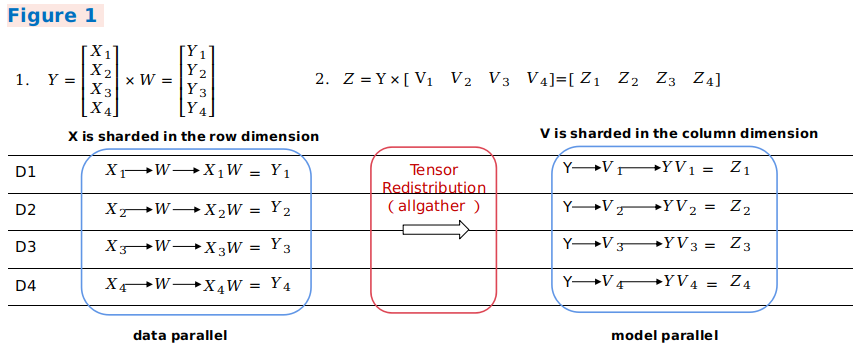
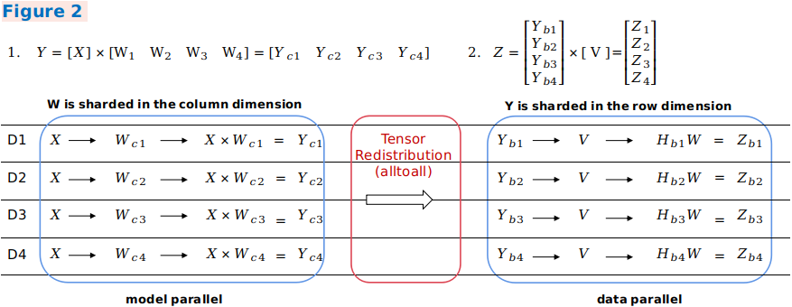

# Distributed Training Design

## Background

With the rapid development of deep learning, the number of datasets and parameters are growing exponentially to improve the accuracy and generalization capability of neural networks. Parallel distributed training has become a development trend to resolve the performance bottleneck of ultra-large scale networks. MindSpore supports the mainstream distributed training paradigm and develops an automatic hybrid parallel solution. The following describes the design principles of several parallel training modes and provides guidance for users to perform custom development.

## Concepts

### Collective Communication

Collective communication is defined as communication that involves a group of processes. All processes in the group send and receive data after meeting certain conditions. MindSpore implements data transmission during parallel training through collective communication. On Ascend chips, MindSpore depends on the Huawei Collective Communication Library (`HCCL`) to implement the task. On GPU, MindSpore depends on the NVIDIA Collective Communication Library (`NCCL`) to implement the task.

### Synchronization Mode

In synchronous mode, all devices strart training at the same time and update parameter values synchronously after the backward propagation algorithm is executed. Currently, MindSpore uses the synchronous training mode.

## Data Parallelism

This section describes how the data parallel mode `ParallelMode.DATA_PARALLEL` works in MindSpore.

### Principle of Data Parallelism

1. Environment dependencies

    Each time before parallel training starts, the `mindspore.communication.init` API is called to initialize communication resources and the global communication group `WORLD_COMM_GROUP` is automatically created.

2. Data distribution

    The key of data parallelism is to split datasets based on the sample dimension and deliver the split datasets to different devices. Each dataset loading API provided by the `mindspore.dataset` module has the `num_shards` and `shard_id` parameters. The parameters are used to split a dataset into multiple datasets, perform cyclic sampling, and collect data of the `batch` size to each device. When the data volume is insufficient, the sampling restarts from the beginning.

3. Network structure

    The scripting method of data parallel network is the same as that of standalone network. This is because, although models of each device are executed independently during the forward and backward propagation processes, the same network structure is maintained. To ensure the synchronous training between devices, the initial values of corresponding network parameters must be the same. You are advised to enable `parameter_broadcast` to broadcast the values of weights in `DATA_PARALLEL` and `HYBRID_PARALLEL` modes. And in `AUTO_PARALLEL` and `SEMI_AUTO_PARALLEL` modes, the sharded dimensions of weights will be processed automatically by setting random seeds to ensure the initialization of weights are consistent on the devices which belongs to the same data parallel dimension.

4. Gradient aggregation

    Theoretically, the training effect of data parallel network should be the same as that of the standalone network. To ensure the consistency of the calculation logic, the `AllReduce` operator is inserted after gradient calculation to implement the gradient aggregation operation between devices. You can enable `mean` to average the sum of gradient values, or regard `mean` as a hyperparameter. Enabling `mean` is equivalent to reducing the learning rate by multiple times.

5. Parameter update

    Because the gradient aggregation operation is introduced, the models of each device perform parameter update with the same gradient value. Therefore, MindSpore implements a synchronous data parallel training mode. Theoretically, models trained by each device are the same. If the reduce operation on samples is involved on the network, the network output may be different. This is determined by the sharding attribute of data parallelism.

### Data Parallel Code

1. Collective communication

    - [management.py](https://gitee.com/mindspore/mindspore/blob/r1.7/mindspore/python/mindspore/communication/management.py): This file covers the `helper` function APIs commonly used during the collective communication process, for example, the APIs for obtaining the number of clusters and device ID. When collective communication is executed on the Ascend chip, the framework loads the `libhccl.so` library file in the environment and uses it to call the communication APIs from the Python layer to the underlying layer.
    - [comm_ops.py](https://gitee.com/mindspore/mindspore/blob/r1.7/mindspore/python/mindspore/ops/operations/comm_ops.py): MindSpore encapsulates supported collective communication operations as operators and stores the operators in this file. The operators include `AllReduce`, `AllGather`, `ReduceScatter`, and `Broadcast`. `PrimitiveWithInfer` defines the attributes required by the operators, as well as the `shape` and `dtype` inference methods from the input to the output during graph composition.

2. Gradient aggregation

    - [grad_reducer.py](https://gitee.com/mindspore/mindspore/blob/r1.7/mindspore/python/mindspore/nn/wrap/grad_reducer.py): This file implements the gradient aggregation process. After the input parameter `grads` is expanded by using `HyperMap`, the `AllReduce` operator is inserted. The global communication group is used. You can also perform custom development by referring to this section based on your network requirements. In MindSpore, standalone and distributed execution shares a set of network encapsulation APIs. In the `Cell`, `ParallelMode` is used to determine whether to perform gradient aggregation. For details about the network encapsulation APIs, see the `TrainOneStepCell` code implementation.

## Automatic Parallelism

As a key feature of MindSpore, automatic parallelism is used to implement hybrid parallel training that combines automatic data parallelism and model parallelism. It aims to help users express the parallel algorithm logic using standalone scripts, reduce the difficulty of distributed training, improve the algorithm R&D efficiency, and maintain the high performance of training. This section describes how the automatic parallel mode `ParallelMode.AUTO_PARALLEL` and semi-automatic parallel mode `ParallelMode.SEMI_AUTO_PARALLEL` work in MindSpore.

### Principle of Automatic Parallelism

1. Distributed operator and tensor layout

    As shown in the preceding figure, the automatic parallel process traverses the standalone forward ANF graphs and performs shard modeling on tensors in the unit of distributed operator, indicating how the input and output tensors of an operator are distributed to each device of the cluster, that is, the tensor layout. Users do not need to know which device runs which slice of a model. The framework automatically schedules and allocates model slices.

    To obtain the tensor layout model, each operator has a shard strategy, which indicates the shard status of each input of the operator in the corresponding dimension. Generally, tensors can be sharded in any dimension as long as the value is a multiple of 2, and the even distribution principle is met. The following figure shows an example of the three-dimensional `BatchMatmul` operation. The parallel strategy consists of two tuples, indicating the sharding of `input` and `weight`, respectively. Elements in a tuple correspond to tensor dimensions one by one. `2^N` indicates the shard unit, and `1` indicates that the tuple is not sharded. If you want to express a parallel data shard strategy, that is, only data in the `batch` dimension of `input` is sharded, and data in other dimensions are not sharded, you can use `strategy=((2^N, 1, 1),(1, 1, 1))`. If you want to express a parallel model shard strategy, that is, only model in the non-`batch` dimension of `weight` is sharded, for example, only the `channel` dimension is sharded, you can use `strategy=((1, 1, 1),(1, 1, 2^N))`. If you want to express a hybrid parallel shard strategy, one of which is `strategy=((2^N, 1, 1),(1, 1, 2^N))`.

    

    Based on the shard strategy of an operator, the framework automatically derives the distribution model of input tensors and output tensors of the operator. This distribution model consists of `device_matrix`, `tensor_shape`, and `tensor map`, which indicate the device matrix shape, tensor shape, and mapping between devices and tensor dimensions, respectively. Based on the tensor layout model, distributed operator determines whether to insert extra computation and communication operations in the graph to ensure that the operator computing logic is correct.

2. Tensor Redistribution

    When the output tensor model of an operator is inconsistent with the input tensor model of the next operator, computation and communication operations need to be introduced to implement the change between tensor layouts. The automatic parallel process introduces the tensor redistribution algorithm, which can be used to derive the communication conversion operations between random tensor layouts. The following three examples represent a parallel computing process of the formula `Z=(X×W)×V`, that is, a `MatMul` operation of two two-dimensional matrices, and show how to perform conversion between different parallel modes.

    In example 1, the output of the first data parallel matrix multiplication is sharded in the row rection, and the input of the second model parallel matrix multiplication requires full tensors. The framework automatically inserts the `AllGather` operator to implement redistribution.

    

    In example 2, the output of parallel matrix multiplication of the first model is sharded in the column direction, and the input of parallel matrix multiplication of the second model is sharded in the row direction. The framework automatically inserts a communication operator equivalent to the `AlltoAll` operation in collective communication to implement redistribution.

    

    In example 3, an output shard mode of the first hybrid parallel matrix multiplication is the same as an input shard mode of the second hybrid parallel matrix multiplication. Therefore, redistribution does not need to be introduced. In the second matrix multiplication operation, the related dimensions of the two inputs are sharded. Therefore, the `AllReduce` operator needs to be inserted to ensure the operation correctness.

    

    In general, this distributed representation breaks the boundary between data parallelism and model parallelism, making it easy to implement hybrid parallelism. From the perspective of scripts, users only need to construct a standalone network to express the parallel algorithm logic. Framework automatically shards the entire graph.

3. Efficient parallel strategy search algorithm

    The `SEMI_AUTO_PARALLEL` semi-automatic parallel mode indicates that you manually configure the parallel strategy for operators when you are familiar with the operator sharding representation. This mode is helpful for manual optimization, with certain commissioning difficulty. You need to master the parallel principle and obtain a high-performance parallel solution based on the network structure and cluster topology. `SEMI_AUTO_PARALLEL` requires users to configure every operator with sharding strategy. To reduce the users' burden in configuring sharding strategies, the automatic parallel mode supports Sharding Propagation, which propagates sharding strategies from configured ops to non-configured ops. To completely liberate users from manual configuration, `AUTO_PARALLEL` introduces the automatic search feature of the parallel strategy, which builds cost models based on the hardware platform, and calculates the computation cost, memory cost, and communication cost of a certain amount of data and specific operators based on different parallel strategies. Using the dynamic programming algorithm or recursive programming algorithm and taking the memory capacity of a single device as a constraint condition, a parallel strategy with optimal performance is efficiently searched out.

    Strategy search replaces manual model sharding and provides a high-performance sharding solution within a short period of time, greatly reducing the threshold for parallel training.

4. Convenient distributed automatic differentiation

    In addition to forward network communication, the traditional manual model sharding needs to consider backward parallel computing. MindSpore encapsulates communication operations into operators and automatically generates backward propagation of communication operators based on the original automatic differentiation operations of the framework. Therefore, even during distributed training, users only need to pay attention to the forward propagation of the network to implement actual automatic parallel training.

### Automatic Parallel Code

1. Tensor layout model
    - [tensor_layout](https://gitee.com/mindspore/mindspore/tree/r1.7/mindspore/ccsrc/frontend/parallel/tensor_layout): This directory contains the definitions and implementation of functions related to the tensor distribution model. `tensor_layout.h` declares the member variables `tensor_map_origin_`, `tensor_shape_`, and `device_arrangement_` required by a tensor distribution model. In `tensor_redistribution.h`, the related methods for implementing the `from_origin_` and `to_origin_` transformation between tensor distributions are declared. The deduced redistribution operation is stored in `operator_list_` and returned, in addition, the communication cost `comm_cost_`,, memory cost `memory_cost_`, and calculation cost `computation_cost_` required for redistribution are calculated.

2. Distributed operators
    - [ops_info](https://gitee.com/mindspore/mindspore/tree/r1.7/mindspore/ccsrc/frontend/parallel/ops_info): This directory contains the implementation of distributed operators. In `operator_info.h`, the base class `OperatorInfo` of distributed operator implementation is defined. A distributed operator to be developed shall inherit the base class and explicitly implement related imaginary functions. The `InferTensorInfo`, `InferTensorMap`, and `InferDevMatrixShape` functions define the algorithms for deriving the input and output tensor distribution model of the operator. The `InferForwardCommunication` and `InferMirrorOps` functions define the extra calculation and communication operations to be inserted for operator sharding. The `CheckStrategy` and `GenerateStrategies` functions define the parallel strategy validation and generation for the operator. According to the parallel strategy `SetCostUnderStrategy`, the parallel cost `operator_cost_` of the distributed operator is generated.

3. Strategy search algorithm
    - [auto_parallel](https://gitee.com/mindspore/mindspore/tree/r1.7/mindspore/ccsrc/frontend/parallel/auto_parallel): The shard strategy search algorithm is implemented in this directory. `graph_costmodel.h` defines the graph composition information. Each point indicates an operator `OperatorInfo`. The directed edge `edge_costmodel.h` indicates the input and output relationship of operators and the redistribution cost. `operator_costmodel.h` defines the cost model of each operator, including the calculation cost, communication cost, and memory cost. `dp_algorithm_costmodel.h` describes the main process of the dynamic planning algorithm, which consists of a series of graph operations. `costmodel.h` defines the data structures of cost and graph operations.

4. Device management
    - [device_manager.h](https://gitee.com/mindspore/mindspore/blob/r1.7/mindspore/ccsrc/frontend/parallel/device_manager.h): This file is used to create and manage cluster device communication groups. The device matrix model is defined by `device_matrix.h`, and the communication domain is managed by `group_manager.h`.

5. Entire graph sharding
    - [step_auto_parallel.h](https://gitee.com/mindspore/mindspore/blob/r1.7/mindspore/ccsrc/frontend/parallel/step_auto_parallel.h), and [step_parallel.h](https://gitee.com/mindspore/mindspore/blob/r1.7/mindspore/ccsrc/frontend/parallel/step_parallel.h): The two files contain the core implementation of the automatic parallel process. `step_auto_parallel.h` calls the strategy search process and generates the `OperatorInfo` of the distributed operator. Then in `step_parallel.h`, processes such as operator sharding and tensor redistribution are processed to reconstruct the standalone computing graph in distributed mode.

6. Backward propagation of communication operators
    - [grad_comm_ops.py](https://gitee.com/mindspore/mindspore/blob/r1.7/mindspore/python/mindspore/ops/_grad/grad_comm_ops.py): This file defines the backward propagation of communication operators, such as `AllReduce` and `AllGather`.

## Advanced Features

- [pipeline_parallel](https://www.mindspore.cn/docs/en/r1.7/design/pipeline_parallel.html)
- [host_device_training](https://www.mindspore.cn/docs/en/r1.7/design/host_device_training.html)
- [recompute](https://www.mindspore.cn/docs/en/r1.7/design/recompute.html)
- [sharding_propagation](https://www.mindspore.cn/docs/en/r1.7/design/sharding_propagation.html)
- [parameter_server_training](https://www.mindspore.cn/docs/en/r1.7/design/parameter_server_training.html)