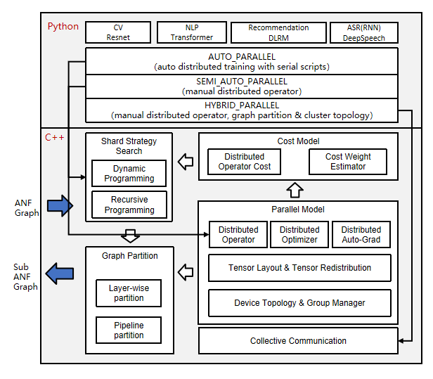

# Distributed Parallel Native

[](https://gitee.com/mindspore/docs/blob/master/docs/mindspore/source_en/design/distributed_training_design.md)

## Background

With the rapid development of deep learning, the number of datasets and parameters are growing exponentially to improve the accuracy and generalization capability of neural networks. Parallel distributed training has become a development trend to resolve the performance bottleneck of ultra-large scale networks.

To cope with the problem of oversized datasets, MindSpore introduces data parallelism mode, which utilizes the computing resources of multiple devices to process more training data simultaneously and speed up model training. Also when the data is too large or the model is too large to be loaded on a single compute node for training, model parallelism needs to be introduced, where each compute node only needs to load part of the model and data, which can reduce memory usage and improve training efficiency.

In the evolution of distributed parallelism programming paradigm, in traditional manual parallelism, users need to manually slice the model to parallelize multiple nodes based on communication primitives through coding, and need perceptual graph slicing, operator slicing, and cluster topology to achieve optimal performance. This programming paradigm has certain threshold requirements for engineers, so it evolved into semi-automatic parallelism: parallel logic and algorithmic logic decoupling. The users write algorithmic code in a single-card serial way, with parallel logic serving as the algorithmic configuration. Users only need to configure parallel strategies to achieve automatic parallel slicing without writing additional code and do not need to perceive the distribution of model slices and cluster topology. The fully automatic parallel training programming paradigm goes a step further, where the user only needs to write single-card serial algorithms that automatically generate a better shard strategy through a search algorithm.

MindSpore implements data communication and synchronization operations during parallel training by means of aggregate communication, which relies on Huawei collective communication library (HCCL) on Ascend chips and NVIDIA collective communication library (NCCL) on GPUs.

MindSpore currently uses a synchronous training mode, which ensures that the parameters are consistent across all devices and are synchronized on all devices before each training iteration begins.

This design document will focus on the design principles of several parallel training methods and guide users in custom development.

## Data Parallelism

This section describes how the data parallel mode `ParallelMode.DATA_PARALLEL` works in MindSpore.

### Principle of Data Parallelism


1. Environment dependencies

    Each time before parallel training starts, the `mindspore.communication.init` API is called to initialize communication resources and the global communication group `WORLD_COMM_GROUP` is automatically created.

2. Data distribution

    The key of data parallelism is to split datasets based on the sample dimension and deliver the split datasets to different devices. Each dataset loading API provided by the `mindspore.dataset` module has the `num_shards` and `shard_id` parameters. The parameters are used to split a dataset into multiple datasets, perform cyclic sampling, and collect data of the `batch` size to each device. When the data volume is insufficient, the sampling restarts from the beginning.

3. Network structure

    The scripting method of data parallel network is the same as that of standalone network. This is because, although models of each device are executed independently during the forward and backward propagation processes, the same network structure is maintained. To ensure the synchronous training between devices, the initial values of corresponding network parameters must be the same. You are advised to enable `parameter_broadcast` to broadcast the values of weights in `DATA_PARALLEL` and `HYBRID_PARALLEL` modes. And in `AUTO_PARALLEL` and `SEMI_AUTO_PARALLEL` modes, the sharded dimensions of weights will be processed automatically by setting random seeds to ensure the initialization of weights are consistent on the devices which belongs to the same data parallel dimension.

4. Gradient aggregation

    Theoretically, the training effect of data parallel network should be the same as that of the standalone network. To ensure the consistency of the calculation logic, the `AllReduce` operator is inserted after gradient calculation to implement the gradient aggregation operation between devices. You can enable `mean` to average the sum of gradient values, or regard `mean` as a hyperparameter. Enabling `mean` is equivalent to reducing the learning rate by multiple times.

5. Parameter update

    Because the gradient aggregation operation is introduced, the models of each device perform parameter update with the same gradient value. Therefore, MindSpore implements a synchronous data parallel training mode. Theoretically, models trained by each device are the same. If the reduce operation on samples is involved on the network, the network output may be different. This is determined by the sharding attribute of data parallelism.

### Data Parallel Code

1. Collective communication

    - [management.py](https://gitee.com/mindspore/mindspore/blob/master/mindspore/python/mindspore/communication/management.py): This file covers the `helper` function APIs commonly used during the collective communication process, for example, the APIs for obtaining the number of clusters and device ID. When collective communication is executed on the Ascend chip, the framework loads the `libhccl.so` library file in the environment and uses it to call the communication APIs from the Python layer to the underlying layer.
    - [comm_ops.py](https://gitee.com/mindspore/mindspore/blob/master/mindspore/python/mindspore/ops/operations/comm_ops.py): MindSpore encapsulates supported collective communication operations as operators and stores the operators in this file. The operators include `AllReduce`, `AllGather`, `ReduceScatter`, and `Broadcast`. `PrimitiveWithInfer` defines the attributes required by the operators, as well as the `shape` and `dtype` inference methods from the input to the output during graph composition.

2. Gradient aggregation

    - [grad_reducer.py](https://gitee.com/mindspore/mindspore/blob/master/mindspore/python/mindspore/nn/wrap/grad_reducer.py): This file implements the gradient aggregation process. After the input parameter `grads` is expanded by using `HyperMap`, the `AllReduce` operator is inserted. The global communication group is used. You can also perform custom development by referring to this section based on your network requirements. In MindSpore, standalone and distributed execution shares a set of network encapsulation APIs. In the `Cell`, `ParallelMode` is used to determine whether to perform gradient aggregation.

## Semi-automatic Parallelism

This subsection describes how the `ParallelMode.SEMI_AUTO_PARALLEL` semi-automatic parallel mode works in MindSpore.

### Principle of Semi-automatic Parallelism



1. Distributed operators and tensor distribution models

    In the above architecture diagram, the automatic parallel process traverses the forward computation graph (ANF Graph) of a single machine, modeling the tensor slice in terms of distributed operators, representing how the input and output tensor of an operator is distributed to each card of the cluster (Tensor Layout). This model adequately expresses the mapping relationship between tensor and device, and the user does not need to perceive the device where each slice of the model is running, and the framework will automatically schedule the assignment.

    In order to obtain the tensor distribution model, each operator has a shard strategy, which represents the slice of each input of the operator in the corresponding dimension. In general, any dimension of the tensor can be sliced as long as it satisfies the principle of base-2 and uniform distribution. The following figure is an example of a three-dimensional matrix multiplication (BatchMatMul) operation, whose shard strategy consists of two tuples representing the shard forms of `input` and `weight`, respectively. The elements in the tuple correspond to the tensor dimension one by one: `2^N` is the number of slicing copies, and `1` means no slicing. When the user wants to represent a data parallel shard strategy, i.e. `batch` dimension of `input` is sliced and the other dimensions are not sliced, which can be expressed as `strategy=((2^N, 1, 1),(1, 1, 1))`. When representing a model parallel shard strategy, i.e. non-`batch` dimensions slice of `weight`, here `channel` dimensions slicing is an example, other dimensions are not sliced, which can be expressed as `strategy=((1, 1, 1),(1, 1, 2^N))`. When representing a mixed parallelism shard strategy, one of the shard strategies is `strategy=((2^N, 1, 1),(1, 1, 2^N))`.

    

    Based on the shard strategy, deriving the distribution model method of the input and output tensor of the operator is defined in the distributed operator. This distribution model consists of `device_matrix`, `tensor_shape` and `tensor_map`, which represent the device matrix shape, tensor shape, and the mapping relationship between device and tensor dimensions, respectively. The distributed operator will further determine whether to insert additional computation and communication operations in the graph according to the tensor distribution model, to ensure that the operator operation logic is correct.

2. Tensor distribution Transformation

    When the output tensor model of the former operator and the input tensor model of the latter operator are not consistent, it is necessary to introduce computational and communication operations to realize the change between tensor arrangements. The automatic parallel process introduces the tensor redistribution algorithm, which can derive an arbitrary inter-tensor communication transition. The following three examples represent the parallel computation of the formula `Z=(X×W)×V`, i.e., two two-dimensional matrix multiplication operations, and show how to convert between different parallel approaches.
    In Sample 1, the output of the first data parallel matrix multiplication has a slice in the row direction, while the input of the second model parallel matrix multiplication requires the full-volume tensor. The framework will automatically insert the `AllGather` operator to implement the distribution transformation.

    

    In Sample 2, the output of the first model parallel matrix multiplication has a slice in the column direction, while the input of the second data parallel matrix multiplication has a slice in the row direction, and the framework will automatically insert the communication operator equivalent to the `AlltoAll` operation in set communication to implement the distribution transformation.

    

    In Sample 3, the output slice of the first hybrid parallel matrix multiplication is the same as the input slice of the second hybrid parallel matrix multiplication, so there is no need to introduce the redistribution transformation. However, since there is a slice in the relevant dimensions of the two inputs in the second matrix multiplication operation, the `AllReduce` operator needs to be inserted to guarantee the correctness of the operation.

    

    In summary, samples 1 and 2 are the basis for automatic parallelism implementation. Overall this distributed representation breaks the boundary between data parallelism and model parallelism and easily achieves hybrid parallelism. From the scripting level, the user only needs to construct a single-machine network to express the parallelism algorithm logic, and the framework will automatically achieve the slicing of the whole graph.

3. Distributed auto-differentiation

    The traditional manual model slicing needs to pay attention to the forward network communication and the parallel operation of network reverse. MindSpore automatically generates the reverse communication operator by encapsulating the communication operation as an operator and using the original auto-differentiation operation of the framework, so even in the distributed training, the user only needs to focus on the forward propagation of the network, which truly realizes the fully automatic parallelism of training.

4. Support multi-dimensional hybrid parallelism

    Semi-automatic parallelism supports the automatic mixing of multiple parallel modes, respectively:

    **Operator-level parallelism**: Operator parallelism takes the operators in a neural network and slices the input tensor to multiple devices for computation. In this way, data samples and model parameters can be distributed among different devices to train large-scale deep learning models and use cluster resources for parallel computing to improve the overall speed. The user can set the shard strategy for each operator, and the framework will model the slice of each operator and its input tensor according to the shard strategy of the operator to maintain mathematical equivalence. This approach can effectively reduce the load on individual devices and improve computational efficiency, and is suitable for training large-scale deep neural networks. For more details, please refer to [operator-level parallelism](https://www.mindspore.cn/tutorials/en/master/parallel/operator_parallel.html).

    **Pipeline parallism**: When the number of cluster devices is large, if only operator parallelism is used, communication is required over the communication domain of the entire cluster, which may make communication inefficient and thus reduce the overall performance. The pipeline parallelism can slice the neural network structure into multiple stages, and each stage is running in a part of the device, which limits the communication domain of the collective communication to this part of the device, while the inter-stage uses point-to-point communication. The advantages of pipeline parallelism are: improving communication efficiency, and easily handling neural network structures stacked by layers. The disadvantage is that some nodes may be idle at the same time. Foe detailed information, refer to [pipeline parallelism](https://www.mindspore.cn/tutorials/en/master/parallel/pipeline_parallel.html).

    **MoE parallism**: MoE is to distribute the experts to different workers and each worker takes on different batches of training data. For the non-MoE layer, expert parallelism is the same as data parallelism. In the MoE layer, the tokens in the sequence are sent to the workers corresponding to their matching experts via all-to-all communication. After completing the computation of the corresponding expert, it is then re-passed back to the original worker by all-to-all and organized into the original sequence for computation of the next layer. Since MoE models usually have a large number of experts, the expert parallelism increases more with the size of the model than the model parallelism.

    

    **Multi-Copy Parallelism**: The data of the input model is sliced according to the batchsize dimension, thus modifying the existing single-copy form into a multi-copy form, so that the underlying layer communicates while the other copy performs the computation operation without waiting. This ensures that the computation and communication times of multiple copies complement each other to improve model performance, while splitting the data into multiple copies also reduces the number of parameters of the operator inputs, thus reducing the computation time of individual operators, which helps a lot to improve model performance.

    

    **Optimizer Parallelism**: When training in data parallelism or operator parallelism, the same copy of the model parameters may exist on multiple devices, which allows the optimizer to have redundant computations across multiple devices when updating that weight. In this case, the computation of the optimizer can be spread over multiple devices by optimizer parallelism. Its advantages are: reducing static memory consumption, and the amount of computation within the optimizer. The disadvantages are: increasing communication overhead. For detailed information, refer to [Optimizer Parallelism](https://www.mindspore.cn/tutorials/en/master/parallel/optimizer_parallel.html).

### Semi-automatic Parallel Code

1. Tensor layout model
    - [tensor_layout](https://gitee.com/mindspore/mindspore/tree/master/mindspore/ccsrc/frontend/parallel/tensor_layout): This directory contains the definitions and implementation of functions related to the tensor distribution model. `tensor_layout.h` declares the member variables `tensor_map_origin_`, `tensor_shape_`, and `device_arrangement_` required by a tensor distribution model. In `tensor_redistribution.h`, the related methods for implementing the `from_origin_` and `to_origin_` transformation between tensor distributions are declared. The deduced redistribution operation is stored in `operator_list_` and returned, in addition, the communication cost `comm_cost_`,, memory cost `memory_cost_`, and calculation cost `computation_cost_` required for redistribution are calculated.

2. Distributed operators
    - [ops_info](https://gitee.com/mindspore/mindspore/tree/master/mindspore/ccsrc/frontend/parallel/ops_info): This directory contains the implementation of distributed operators. In `operator_info.h`, the base class `OperatorInfo` of distributed operator implementation is defined. A distributed operator to be developed shall inherit the base class and explicitly implement related imaginary functions. The `InferTensorInfo`, `InferTensorMap`, and `InferDevMatrixShape` functions define the algorithms for deriving the input and output tensor distribution model of the operator. The `InferForwardCommunication` and `InferMirrorOps` functions define the extra calculation and communication operations to be inserted for operator sharding. The `CheckStrategy` and `GenerateStrategies` functions define the sharding strategy validation and generation for the operator. According to the sharding strategy `SetCostUnderStrategy`, the parallel cost `operator_cost_` of the distributed operator is generated.

3. Device management
    - [device_manager.h](https://gitee.com/mindspore/mindspore/blob/master/mindspore/ccsrc/frontend/parallel/device_manager.h): This file is used to create and manage cluster device communication groups. The device matrix model is defined by `device_matrix.h`, and the communication domain is managed by `group_manager.h`.

4. Entire graph sharding
    - [step_auto_parallel.h](https://gitee.com/mindspore/mindspore/blob/master/mindspore/ccsrc/frontend/parallel/step_auto_parallel.h), and [step_parallel.h](https://gitee.com/mindspore/mindspore/blob/master/mindspore/ccsrc/frontend/parallel/step_parallel.h): The two files contain the core implementation of the automatic parallel process. `step_auto_parallel.h` calls the strategy search process and generates the `OperatorInfo` of the distributed operator. Then in `step_parallel.h`, processes such as operator sharding and tensor redistribution are processed to reconstruct the standalone computing graph in distributed mode.

5. Backward propagation of communication operators
    - [grad_comm_ops.py](https://gitee.com/mindspore/mindspore/blob/master/mindspore/python/mindspore/ops/_grad_experimental/grad_comm_ops.py): This file defines the backward propagation of communication operators, such as `AllReduce` and `AllGather`.

## Fully Automatic Parallelism

Semi-automatic parallelism frees users from the complexity of distributed code development and greatly reduces the difficulty of developing distributed AI macromodels. Although users no longer need to consider data storage and communication between devices, they still need to specify the appropriate shard strategy for each operator, because the training performance of different shard strategies varies greatly. Users still need to have appropriate parallel knowledge and computational analysis based on network structure, cluster topology, etc. in order to define appropriate parallel strategies in a huge search space. The reality is that the main users of AI frameworks are AI researchers and engineers, who may not have specialized parallelism knowledge. On the other hand, in the face of a huge search space, finding the right parallel strategy for a large model requires monthly manual tuning costs and still does not guarantee the optimal strategy. For example, DeepSpeed, Megatron, and other expert custom strategies for transformer-like networks still require user-defined configurations of dp, mp, pp, etc., not to mention that the network model has more than one transformer structure. For these two reasons, MindSpore provides a variety of automatic hybrid parallel strategy generation schemes to minimize the user's perception of parallel configurations and allow users to train large models quickly, efficiently, and easily.

This subsection describes how the `ParallelMode.AUTO_PARALLEL` fully automatic parallel mode works in MindSpore.

### Feature Design

Fully automatic parallelism is based on the MindSpore semi-automatic framework, replacing expert configuration of parallel strategies with automatic hybrid parallel strategy generation algorithms. The following figure shows the process of using MindSpore to train or inference about a neural network in a distributed manner. Users develop their own neural network models (or MindIR imports) using the Python language, which are parsed into computational graphs (ANF graphs) by MindSpore. The automatic hybrid parallel strategy generation module searches for a better strategy through the algorithm and passes it to the semi-automatic parallel module, which analyzes the tensor distribution, distributed operator analysis, device management, and performs whole graph slicing, and passes it to the back-end for computation.

In fact, the hybrid parallel strategy generation module is responsible for finding a suitable parallel shard strategy for a given neural network model and cluster configuration. The key technology used is a strategy search algorithm based on cost model, which constructs a cost model to describe the computation cost and communication cost in a distributed training scenario, and uses memory cost as a constraint to efficiently search for a better performance parallel strategy through the computational graph search algorithm.


### Three Search Algorithms

Fully automatic parallelism is very difficult to implement, and MindSpore divides the provided strategy generation algorithm into L1 level and L2 level according to the degree of user intervention required (here we assume that the manually configured full graph strategy SEMI_AUTO is L0 level, and the scheme that does not require user participation is L3 level).

The strategy generation algorithm at the L1 level is called Strategy Broadcast (Sharding Propagation). In this mode, the user only needs to manually define the strategies for a few key operators, and the strategies for the remaining operators in the computational graph are automatically generated by the algorithm. Because the strategy of the key operator has been defined, the cost model of the algorithm mainly describes the redistribution cost between the operators, and the optimization objective is to minimize the redistribution cost of the whole graph. Because the main operator strategy has been defined, which is equivalent to a compressed search space, the search time of this scheme is shorter and its strategy performance depends on the definition of the key operator strategy, so it still requires the user to have the ability to analyze the defined strategy. Refer to [Sharding Propagation](https://www.mindspore.cn/docs/en/master/features/parallel/auto_parallel.html) for detailed information.

There are two types of L2-level strategy generation algorithms, Dynamic Programming and Symbolic Automatic Parallel Planner (SAPP for short). Both methods have their advantages and disadvantages. The dynamic programming algorithm is able to search for the optimal strategy inscribed by the cost model, but it takes longer time to search for parallel strategies for huge networks. The SAPP algorithm is able to generate optimal strategies instantaneously for huge networks and large-scale cuts.
The core idea of the dynamic programming algorithm is to build a cost model of the full graph, including computation cost and communication cost, to describe the absolute time delay in the distributed training process, and to compress the search time using equivalent methods such as edge elimination and point elimination, but the search space actually grows exponentially with the number of devices and operators, so it is not efficient for large clusters with large models.
SAPP is modeled based on the parallelism principle by creating an abstract machine to describe the hardware cluster topology and optimizing the cost model by symbolic simplification. Its cost model compares not the predicted absolute latency, but the relative cost of different parallel strategies, so it can greatly compress the search space and guarantee minute search times for 100-card clusters.

Sharding Propagation and SAPP currently support manual definition of Pipeline + automatic operator parallelism, and can be used in conjunction with optimizations such as recomputation, optimizer parallelism, etc. Dynamic Programming algorithms only support automatic operator parallelism.

### Fully Automatic Parallelism Code

**Strategic Search Algorithm**: The [auto_parallel](https://gitee.com/mindspore/mindspore/tree/master/mindspore/ccsrc/frontend/parallel/auto_parallel) directory implements the algorithm for strategy search. `graph_costmodel.h` defines the composition information, where each point represents an operator `OperatorInfo` and the directed edge `edge_costmodel.h` represents the input-output relation of the operator and the cost of redistribution. The cost model for each operator is defined in `operator_costmodel.h`, including the computation cost, communication cost and memory cost. The data structures for the cost and graph operations are defined in `costmodel.h`.

- **dynamic_programming**: [dp_algo_costmodel.cc](https://gitee.com/mindspore/mindspore/blob/master/mindspore/ccsrc/frontend/parallel/auto_parallel/dp_algo_costmodel.cc) mainly describes the main flow of the dynamic programming algorithm and consists of a series of graph operations.
- **sharding_propagation**: [graph_costmodel.cc](https://gitee.com/mindspore/mindspore/blob/master/mindspore/ccsrc/frontend/parallel/auto_parallel/graph_costmodel.cc) implements the strategy broadcast (Sharding Propagation), which mainly uses the traversal method of BFS to propagate the strategy of several points, from points to interfaces, to the whole graph.
- **symbolic_automatic_parallel_planner**: The [rec_core](https://gitee.com/mindspore/mindspore/tree/master/mindspore/ccsrc/frontend/parallel/auto_parallel/rec_core) directory implements the symbolic automatic parallelplanner (SAPP).

## Heterogeneous Parallelism

The heterogeneous parallel training method is to analyze the memory occupation and computational intensity of the operators on the graph, and slice the operators with huge memory consumption or suitable for CPU logic processing to the CPU subgraph, and slice the computationally intensive operators with less memory consumption to the hardware accelerator subgraph. The framework cooperates with different subgraphs for network training, so that subgraphs in different hardware and without dependencies can perform the execution process in parallel.

### Computational Process

A typical computational process for MindSpore heterogeneous parallel training is shown in the following figure:


1. Users set backend for network execution

   ```python
   import mindspore as ms
   ms.set_device(device_target="GPU")
   ```

2. Users set execution backend of specific operators

   ```python
   from mindspore import ops

   prim = ops.Add()

   prim.set_device("CPU")
   ```

3. The framework is sliced according to the computational graph operator flag.
4. The framework schedules different back-end execution subgraphs.

Current scenario that typically uses heterogeneous parallel computing is optimizer heterogeneity.

### Optimizer Heterogeneity

During the training of a large model in PanGu or GPT3, the optimizer state takes up a large amount of memory, which in turn limits the size of the model that can be trained. Using optimizer heterogeneity, assigning optimizers to CPUs for execution can greatly scale the trainable models:


As shown in the figure, configuring the Adam operator to CPU execution while specifying an accelerator for FP16 computation reduces the parameter memory footprint to 1/3 of the original.

1. Configure the optimizer operators to CPU execution
2. Initialize weight parameters of FP16 and optimizer state variables of FP32
3. Convert the gradient of the input optimizer to FP16 (if the gradient is FP16, you can ignore this step)
4. The weights and gradients are converted to FP32 to participate in the optimizer operation
5. The updated FP32 weights are assigned to the FP16 weights

Sample code of the optimizer heterogeneity is as follows:

```python
import numpy as np
import mindspore as ms
import mindspore.ops as ops
from mindspore.common.initializer import initializer
from mindspore.nn import Optimizer
_adam_opt = ops.MultitypeFuncGraph("adam_opt")
host_assign = ops.Assign()
host_assign.set_device("CPU")
host_cast = ops.Cast()
host_cast.set_device("CPU")
device_cast = ops.Cast()

@_adam_opt.register("Function", "Tensor", "Tensor", "Tensor", "Tensor", "Number", "Tensor", "Tensor", "Tensor",
                    "Tensor", "Bool", "Bool")
def _update_run_kernel(opt, beta1, beta2, eps, lr, weight_decay, param, m, v, gradient, decay_flags, optim_filter):
    """
    Update parameters by AdamWeightDecay op.
    """
    success = True
    if optim_filter:
        param32 = host_cast(param, ms.float32)
        gradient = device_cast(gradient, ms.float32)
        if decay_flags:
            next_param = opt(param32, m, v, lr, beta1, beta2, eps, weight_decay, gradient)
        else:
            next_param = opt(param32, m, v, lr, beta1, beta2, eps, 0.0, gradient)
        ret = host_assign(param, host_cast(ops.depend(param32, next_param), ops.dtype(param)))
        return ops.depend(success, ret)
    return success

class AdamWeightDecayOp(Optimizer):
    def __init__(self, params, learning_rate=1e-3, beta1=0.9, beta2=0.999, eps=1e-6, weight_decay=0.0):
        super(AdamWeightDecayOp, self).__init__(learning_rate, params, weight_decay)
        self.beta1 = ms.Tensor(np.array([beta1]).astype(np.float32))
        self.beta2 = ms.Tensor(np.array([beta2]).astype(np.float32))
        self.eps = ms.Tensor(np.array([eps]).astype(np.float32))
        self.moments1 = self.clone_param32(prefix="adam_m", init='zeros')
        self.moments2 = self.clone_param32(prefix="adam_v", init='zeros')
        self.opt = ops.AdamWeightDecay()
        self.hyper_map = ops.HyperMap()
        self.opt.set_device("CPU")

    def construct(self, gradients):
        """AdamWeightDecayOp"""
        lr = self.get_lr()
        if self.is_group:
            if self.is_group_lr:
                optim_result = self.map_reverse(ops.partial(_adam_opt, self.opt, self.beta1, self.beta2, self.eps),
                                                lr, self.weight_decay, self.parameters, self.moments1, self.moments2,
                                                gradients, self.decay_flags, self.optim_filter)
            else:
                optim_result = self.map_reverse(ops.partial(_adam_opt, self.opt, self.beta1, self.beta2, self.eps, lr),
                                                self.weight_decay, self.parameters, self.moments1, self.moments2,
                                                gradients, self.decay_flags, self.optim_filter)
        else:
            optim_result = self.map_reverse(ops.partial(_adam_opt, self.opt, self.beta1, self.beta2, self.eps, lr,
                                                        self.weight_decay), self.parameters, self.moments1, self.moments2,
                                            gradients, self.decay_flags, self.optim_filter)
        return optim_result

    def clone_param32(self, prefix, init=None):
        new = []
        for old_param in self.parameters:
            param_init = init
            if init is None:
                param_init = old_param.init
            new_state = old_param.clone()
            new_state.set_dtype(ms.float32)
            new_state.set_data(initializer(param_init, shape=old_param.shape, dtype=ms.float32))
            new_state.name = prefix + '.' + new_state.name
            new.append(new_state)
        return ms.ParameterTuple(new)
```

Steps 4 and 5 can also be directly fused into the optimizer operator for further optimization. The complete optimizer heterogeneous training process can be found at: <https://gitee.com/mindspore/models/tree/master/official/nlp/Pangu_alpha>.

### Constraints

Currently the user needs to specify the back-end of the operator execution, and the back-end does not support automatic configuration based on the network.