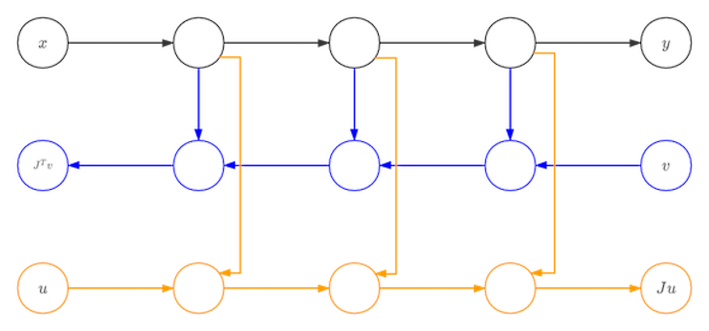

# MindSpore Automatic Differentiation

`Ascend` `GPU` `CPU` `Design` `Model Development`

<a href="https://gitee.com/mindspore/docs/blob/r1.7/docs/mindspore/source_en/design/gradient.md" target="_blank"></a>

## Automatic Differentiation Overview

Modern AI algorithm, such as deep learning, uses huge amount of data to train a model with parameters. This training process often uses loss back-propagation to update parameters. Automatic differentiation (AD) is one of the key techniques.

Automatic differentiation is a method between neumerical differentiation and symbolic differentiation. The key concept of AD is to divide the calculation of the computer program into a finite set with basic operations. The gradients of all the basic operations are known. After calculating the gradient of all the basic operations, AD uses chain rule to combine them and gets the final gradient.

The formula of chain rule is: $(f\circ g)^{'}(x)=f^{'}(g(x))g^{'}(x)$

Based on how to connect the gradient of basic components, AD can be divided into forward mode AD and reverse mode AD.

For example, if we define function $f$
$$y=f(x_{1},x_{2})=ln(x_{1})+x_{1}x_{2}-sin(x_{2})$$and  we want to use forward mode AD to calculate $\frac{\partial y}{\partial x_{1}}$ when $x_{1}=2,x_{2}=5$.


The calculation direction of the origin function is the same as the calculation direction of forward mode AD. The function output and the gradient can be calculated simultaneously.
When we use reverse mode AD:


The calculation direction of the origin function is opposite to the calculation direction of reverse mode AD. The calculation of the gradient relies on the output of the original function.
MindSpore first developed method GradOperation based on reverse mode AD and then used the GradOperation to develop forward mode AD method Jvp.

In order to explain the differences between forward mode AD and reverse mode AD in further. We define an origin function $F$ with N inputs and M outputs:
$$ (Y_{1},Y_{2},...,Y_{M})=F(X_{1},X_{2},...,X_{N})$$
The gradient of function $F$ is a Jacobian matrix.
$$
 \left[
 \begin{matrix}
   \frac{\partial Y_{1}}{\partial X_{1}}& ... & \frac{\partial Y_{1}}{\partial X_{N}} \\
   ... & ... & ... \\
   \frac{\partial Y_{M}}{\partial X_{1}} & ... & \frac{\partial Y_{M}}{\partial X_{N}}
  \end{matrix}
  \right]
$$

### Forward Mode AD

In forward mode AD, the calculation of gradient starts from inputs. So, for each calculation, we can get the gradient of outputs with respect to one input, which is one column of the Jacobian matrix.

$$
 \left[
 \begin{matrix}
   \frac{\partial Y_{1}}{\partial X_{1}}\\
   ...  \\
   \frac{\partial Y_{M}}{\partial X_{1}}
  \end{matrix}
  \right]
$$

In order to get this value, AD divies the program into a series of basic operations. The gradient rules of these basic operations is known. The basic operation can also be represented as a function $f$ with n inputs and m outputs:

$$ (y_{1},y_{2},...,y_{m})=f(x_{1},x_{2},...,x_{n})$$

Since we have defined the gradient rule of $f$, we know the jacobian matrix of $f$. So we can calculate the Jacobian-vector-product (Jvp) and use the chain rule to get the gradient outoput.

$$
 \left[
 \begin{matrix}
   \frac{\partial y_{1}}{\partial X_{i}}\\
   ...  \\
   \frac{\partial y_{m}}{\partial X_{i}}
  \end{matrix}
  \right]=\left[
 \begin{matrix}
   \frac{\partial y_{1}}{\partial x_{1}}& ... & \frac{\partial y_{1}}{\partial x_{n}} \\
   ... & ... & ... \\
   \frac{\partial y_{m}}{\partial x_{1}} & ... & \frac{\partial y_{M}}{\partial x_{n}}
  \end{matrix}
  \right]\left[
 \begin{matrix}
   \frac{\partial x_{1}}{\partial X_{i}}\\
   ...  \\
   \frac{\partial x_{n}}{\partial X_{i}}
  \end{matrix}
  \right]
$$

### Reverse Mode AD

In reverse mode AD, the calculation of gradient starts from outputs. So, for each calculation, we can get the gradient of one output with respect to inputs, which is one row of the Jacobian matrix.

$$
 \left[
 \begin{matrix}
   \frac{\partial Y_{1}}{\partial X_{1}}& ... & \frac{\partial Y_{1}}{\partial X_{N}} \\
  \end{matrix}
  \right]
$$

In order to get this value, AD divies the program into a series of basic operations. The gradient rules of these basic operations is known. The basic operation can also be represented as a function $f$ with n inputs and m outputs:

$$ (y_{1},y_{2},...,y_{m})=f(x_{1},x_{2},...,x_{n})$$

Since we have defined the gradient rule of $f$, we know the jacobian matrix of $f$. So we can calculate the Vector-Jacobian-product (Vjp) and use the chain rule to get the gradient outoput.

$$
 \left[
 \begin{matrix}
   \frac{\partial Y_{j}}{\partial x_{1}}& ... & \frac{\partial Y_{j}}{\partial x_{N}} \\
  \end{matrix}
  \right]=\left[
 \begin{matrix}
   \frac{\partial Y_{j}}{\partial y_{1}}& ... & \frac{\partial Y_{j}}{\partial y_{m}} \\
  \end{matrix}
  \right]\left[
 \begin{matrix}
   \frac{\partial y_{1}}{\partial x_{1}}& ... & \frac{\partial y_{1}}{\partial x_{n}} \\
   ... & ... & ... \\
   \frac{\partial y_{m}}{\partial x_{1}} & ... & \frac{\partial y_{m}}{\partial x_{n}}
  \end{matrix}
  \right]
$$

## GradOperation

GradOperation uses reverse mode AD, which calcultes gradients from network outputs.

### GradOperation Design

Define origin function $f(g(x, y, z))$ , then:

$$\frac{df}{dx}=\frac{df}{dg}\frac{dg}{dx}\frac{dx}{dx}+\frac{df}{dg}\frac{dg}{dy}\frac{dy}{dx}+\frac{df}{dg}\frac{dg}{dz}\frac{dz}{dx}$$

The formula of $\frac{df}{dy}$ and $\frac{df}{dz}$ is similar to $\frac{df}{dx}$.

Based on chain rule, we define gradient function `bprop: dout->(df, dinputs)` for every functions (including operators and graph). Here, `df` means gradients with respect to free variables and `dinputs` is gradients to function inputs. Then we use total derivative rule to accumulate `(df, dinputs)` to correspond variables.

MindSporeIR has developed the formulas for branching, loops and closures. So if we define the gradient rules correctly, we can get the correct gradient.
Define operator K, backward mode AD can be represented as:

```text
v = (func, inputs)
F(v): {
    (result, bprop) = K(func)(K(inputs))
    df, dinputs = bprop(dout)
    v.df += df
    v.dinputs += dinputs
}
```

### GradOperation Implementation

In GradOperation process, the function that needs to calculate gradient will be taken out and used as the input of automatic differentiation module. AD module will map input function to gradient `fprop`. The output gradient has form `fprop = (forward_result, bprop)`. `forward_result` is the output node of the origin function. `bprop` is the gradient function which relies on the closure object of `fprop`. `bprop` has only one input `dout`. `inputs` and `outputs` are the inputs and outputs of `fprop`.

```c++
  MapObject(); // Map ValueNode/Parameter/FuncGraph/Primitive object
  MapMorphism(); // Map CNode morphism
  res = k_graph(); // res is fprop object
```

When generating gradient function object, we need to do a series of mapping from origin function to gradient function. These mapping will generate gradient function nodes and we will connect these nodes according to reverse mode AD rules. For each subgraph of origin function, we will create an `DFunctor` object. `Dfunctor` will run `MapObject` and `MapMorphism` to do the mapping.

`MapObject` maps nodes of origin function to nodes of gradient function, including free variable nodes, parameter nodes and ValueNodes.

```c++
MapFvObject(); // map free vriabels
MapParamObject(); // map parameters
MapValueObject(); // map ValueNodes
```

`MapFvObject` maps free variables, `MapParamObject` maps parameter nodes. `MapValueObject` mainly maps `Primitive` and `FuncGraph` objects. For `FuncGraph`, we need to create another `DFunctor` object and perform the mapping. This is a recursion process. `Primitive` defines the type of the operator. We need to define gradient function for every `Primitive`. MindSpore defines these gradient functions in Python, for example:

```python
@bprop_getters.register(P.Sin)
def get_bprop_sin(self):
    """Grad definition for `Sin` operation."""
    cos = P.Cos()

    def bprop(x, out, dout):
        dx = dout * cos(x)
        return (dx,)

    return bprop
```

This code is the gradient function for `sin`. `x` is the input to `sin`, `y` is the output to `sin` and `dout` is the accumulated gradient.

After `MapObject` process, `MapMorphism` maps `CNode` morphism starting from the output of origin function and establishes the connectiontion between AD nodes.

### GradOperation Example

We build a simple network and calculate the gradient according to `x`. The structure of the network is:

```python
class Net(nn.Cell):
    def __init__(self):
        super(Net, self).__init__()
        self.sin = ops.Sin()
        self.cos = ops.Cos()

    def construct(self, x):
        a = self.sin(x)
        out = self.cos(a)
        return out
```

Origin network structure is:


After reverse mode AD, the network structure is:


## Forward Mode Implementation

Besides GradOperation, Mindspore has developed forward mode automatic differentiation method Jvp (Jacobian-Vector-Product). Compared to reverse mode AD, forward mode AD is more suitable for networks whose input dimension is smaller than output dimension. Mindspore forward mode AD is developed based on reversed mode GradOperation function.  



The network in black is the origin function. After the first derivative based on one input x, we get the network in blue. The we compute the gradient of blue network with respect to vector v and we can get the yellow network. This yellow network is the forward mode AD gradient network of black network. Since blue network is a linear network for vector v, there will be no connection between blue network and yellow network. So, all the nodes in blue are dangling nodes. We can use only blue and yellow nodes to calculate the gradient.

### References

[1] Baydin, A.G. et al., 2018. Automatic differentiation in machine learning: A survey. arXiv.org. Available at: https://arxiv.org/abs/1502.05767 [Accessed September 1, 2021].

