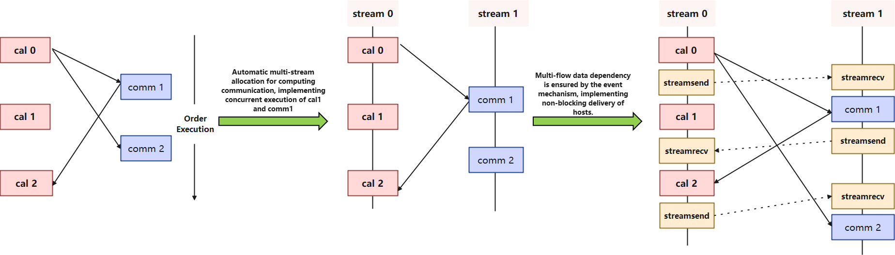

# Multi-Level Compilation Architecture

## Background

With the arrival of the era of deep learning large models, the bigger the network size is,  the bigger the challenge of graph compilation performance, execution performance and debugging and tuning efficiency is. For this reason, MindSpore proposes a multi-level compilation architecture, which provides three compilation and execution modes, O0/O1/O2, which are different from each other in terms of graph optimization, operator fusion, memory management, and execution modes, and is designed to provide a diversity of graph mode. Users can choose the most suitable compilation and execution mode according to their own network characteristics and needs:

1. O0 mode: this is a basic compilation and execution mode, where all optimizations are turned off except those necessary to affect the functionality, and a single-calculus execution is used for execution. Therefore, the execution performance may not be optimal, but it can guarantee the original structure of the graph, which is convenient for users to debug and understand, and the compilation performance is also better. Add and Mul single operator execution is shown in the following figure.
2. O1 mode: this mode performs some basic optimizations, such as common graph optimization and automatic operator fusion optimization, and uses single operator execution for execution. Compared with O0, because of enabling the fusion optimization, the execution performance of O1 can be improved, but it may affect the original structure of the graph, so the compilation performance and debugging and tuning efficiency is lost. In the following figure, Add and Mul are fused into a single fused_op execution.
3. O2 mode: this is a more advanced optimization mode, fundamentally different from O0/O1, using whole graph sinking execution. Due to the increased graph conversion overhead, the compilation performance loss is larger, and will have a greater impact on the original structure of the graph, making debugging and understanding more difficult. Since there is no host scheduling overhead, the performance improvement is more obvious in the host bound scenario. In the following figure. Add and Mul are converted into a whole graph sinking execution.

## Overview of Multi-Level Compilation Architecture

1. Graph representation: configure multiple compilation levels via context interface jit_config={“jit_level”: “O0/O1/O2”}. The default Altas training product is O2, the rest are O0.
2. Graph compilation: different compilation modes are selected according to the configured multi-level compilation levels, where O0 is the most basic native composition and compilation, O1 adds an automatic operator fusion function on the basis of O0, and O2 is mainly a whole graph sink execution.
3. Graph execution: O0 and O1 are both single operator executors, which improve host scheduling performance through runtime multistage pipeline; O2 is a whole graph executor with no host scheduling overhead.

## Introduction to the O0 Model

O0 is the basic graph compilation and execution mode, except for the necessary impact on the functionality of the optimization, other optimizations are turned off, the use of native graph structure for compilation and execution, easy to debug and tuning, with better compilation performance. The following chapters introduce the basic features of O0 one by one.

### Partition Composition

MindIR is a functional IR based on graph representation, with rich expression syntax, supports complex control flow expression and heterogeneous expression. From MindIR to the back-end hardware arithmetic execution process needs to go through the back-end graph processing and runtime scheduling, especially the hardware capacity can not support complex control flow and CPU heterogeneous execution, so MindIR needs to be sliced to construct subgraphs, the sliced subgraphs are optimized in hardware, and the optimized subgraphs are connected to the sliced nodes at runtime to be dispensed for execution.

### Graph Optimization

There are fewer graph optimizations for the O0 mode, and the basic optimizations are mainly back-end LazyInline and No-task node execution optimizations, which are described below.

- **Back-end LazyInline**

  **LazyInline**: The main idea is to postpone the overhead of the function call to the actual need to call , so that you can reduce the compilation overhead, improve compilation efficiency.LazyInline is the same sub-graph structure reuse in the graph compilation phase, do not unfolding placed in the graph , to avoid the graph size is large resulting in the impact of the compilation performance.

  

  **Pipeline Parallelism**: Slicing the operator in the neural network into multiple Stages, and then mapping the Stages to different devices, so that different devices to compute different parts of the neural network. In order to improve efficiency, pipeline parallelism further slices the MiniBatch into finer-grained MicroBatches, in which pipelined scheduling is used, thus achieving the goal of improving efficiency.

  **Back-end LazyInline**: Since MicroBatch slicing of Pipeline parallel leads to the expansion of the entire computational graph to a number of times of the MicroBatch, which results in a huge model size and long compilation performance time (possibly hour-level), and these Micro subgraphs are all structured the same way. In order to solve the compilation performance problem, the LazyInline technique is a great fit, however LazyInline brings problems such as inability to use the optimal way for memory reuse and stream allocation at runtime, inability to perform cross-graph optimization (memory optimization, communication fusion, operator fusion, etc.). For this reason, at the end of the compilation of the graph, before the execution of the graph, these Micro subgraphs are as the actual nodes of Inline in order to form a complete global whole graph, and then through memory optimization, communication optimization, redundant computation elimination after the graph Inline, so as to achieve the goal of compilation performance, execution performance, and execution memory are taken into account.

- **No-task node Execution Optimization**

  

  No-task node refers to Reshape, ExpandDims, Squeeze, Flatten, FlattenGrad, Reformat, etc. There is no computational logic in these algorithms, and they do not modify the memory layout, but only modify the information of the shape, format. At the end of the compilation of the graph, the No-task node is converted to ref node, the output has the same address as the input, and the kernel launch is skipped in the execution process, so as to achieve the purpose of execution performance optimization.

### Operator Selection

Operators are the basic execution units in deep learning frameworks, and they are responsible for performing specific computational tasks, such as matrix multiplication, convolution, pooling. Operator selection requires comprehensive consideration of factors such as operator type, data type, hardware platform, and operator optimization in order to select the optimal operator for deep learning tasks. The operator types in the backend of MindSpore Ascend are Aclnn kernel/Aclop kernel/Hccl kernel /Cpu kernel, and the process of operator selection is shown as follows:

1. operator type: firstly, according to the type of operator, choose whether it is computational operator or communication operator.
2. hardware platform: If there is a corresponding operator on hardware, then the operator on hardware is preferred, otherwise the heterogeneous operator on CPU is chosen, e.g., shape-related computational operators may only be suitable to be supported on CPU, and there is no corresponding operator on hardware.
3. operator efficiency: due to the better performance of Aclnn operator on Ascend, the computational operator will prefer Aclnn kernel if there is a corresponding Aclnn kernel, otherwise Aclop kernel will be chosen.
4. If no operator is selected in any of the above 3 steps, it is an unsupported operator and the operator selection fails to exit.

### Executing Order Organization

Different graph traversal algorithms produce execution orders with large differences in execution performance and memory, as shown in the figure above:

- **Execution order obtained by BFS**: kernel1-> kernel2-> kernel4-> kernel5-> kernel3-> kernel6. Memory peaks at 5G (kernel3 can release kernel1 and kernel2 after execution, and then reuse them when it's kernel6's turn to execute, so kernel6 doesn't need to request extra memory).
- **Execution order obtained by DFS**: kernel1-> kernel2-> kernel3-> kernel4-> kernel5-> kernel6. Memory peaks at 4G (kernel3 can release kernel1 and kernel2 after execution, and then reuse them when it's kernel4 and kernel5's turn to execute, so kernel4 and kernel5 don't need to request extra memory).

Execution order scheduling is a complex problem of solving optimal operator concurrency under certain memory constraints, which not only requires identifying and exploiting concurrency opportunities in the computational graph to improve computational efficiency, but also must consider multiple constraints at the same time to ensure the stability and efficiency of the system.

- First, the optimization module needs to address the complexity of solving for optimal operator concurrency. Due to the large number of operators in the computational graph and their interdependencies, finding an execution order that maximizes concurrency while maintaining the logical correctness of the computational graph is a challenging task.
- Second, memory constraints are a critical factor that cannot be ignored in execution order optimization. Increasing concurrency, while improving computational efficiency, tends to significantly increase peak memory requirements, which may lead to Overflow of Memory (OOM) errors, especially in resource-constrained environments. Therefore, the optimization module must weigh the relationship between concurrency and memory usage to ensure that concurrency is increased without exceeding the memory capacity of the system.
- MindSpore's execution order adjustment module combines rule-based and heuristic-based strategies to provide two execution order scheduling algorithms, bfs/dfs, to realize fine-tuning of the execution order of computational graphs, thus ensuring computational efficiency while effectively coping with multiple challenges such as memory constraints and system stability.

### Compilation Cache

Compilation cache refers to caching the computational graphs that have been compiled during the first compilation of the graph so that they can be used directly in the next training without recompilation, which is mainly used to improve the efficiency of cluster fault recovery training. Under the large model and large cluster training scenario, due to the high probability of failure of large clusters, the frequency of the second breakpoint training is very high, coupled with the large graph scale of the large model, the compilation of the graph often takes a long time, so with the support of the graph compilation cache function, it can greatly improve the efficiency of the cluster failure recovery training.

### Multi-Level Pipeline

Multi-level pipeline is a key performance optimization function point at runtime. For the scheduling of an operator, the runtime needs to process InferShape (with updating shape), Resize (with tiling calculation and updating memory size) and Launch (with memory application and release). If these processes are processed serially at host, it will easily lead to a long processing time at host, which leads to the device waiting for execution and affects the execution performance. For this reason, we have implemented a multilevel pipeline function for operator scheduling, where InferShape, Resize and Launch are pipelined in parallel through three queues: Infer Queue, Resize Queue and Launch Queue, which greatly improves the performance of runtime scheduling:

After the first operator collects the input, it only needs to send the InferShape task to the Infer queue, i.e. to send the output data of the operator to the next operator, after InferShape is completed send the Resize task of that operator to the Resize queue, and finally after Resize is completed send the LaunchKernel task to the Launch queue.

### Multi-Stream Concurrency

In the training process of large-scale deep learning models, in order to achieve as much communication and computation overlap as possible, the importance of communication and computation stream concurrency for execution performance is obvious. To address this challenge, MindSpore implements automatic stream allocation and event insertion in framework to optimize the execution efficiency and resource utilization of the computation graph. The introduction of these features not only improves the concurrency capability of computation graphs, but also significantly reduces device memory overhead, resulting in higher performance and lower latency in large model training.

Traditional multi-stream concurrency methods usually rely on manual configuration, which is not only cumbersome and error-prone, but also difficult to achieve optimal concurrency when facing complex computational graphs. MindSpore's auto-stream allocation feature automatically identifies and allocates concurrency opportunities in computational graphs through intelligent algorithms, and assigns different operators to different streams for execution. This automated allocation process not only simplifies the user's operation, but also dynamically adjusts the stream allocation strategy at runtime to adapt to different computing environments and resource conditions.

### Memory Management

Memory is the most important resource in AI model training, memory management is undoubtedly an extremely critical function in the deep learning framework, responsible for the model's memory allocation and reuse, the performance of memory allocation and release as well as the efficiency of memory reuse are very high requirements. Memory management is mainly about allocating memory to operators before they are sent out, and releasing memory after they are sent out in order to reuse them later, and the key function points are memory pool and memory reuse algorithm.

**memory pool**: As a base for memory management, it mainly uses the BestFit best-fit memory allocation algorithm and supports dynamic expansion of memory blocks and defragmentation:

1. slicing operation: When memory is allocated, free areas are sorted according to their size, the first free area that meets the requirements is found, allocated on demand, the excess is sliced, and a new free memory block is inserted.
2. Merge operation: When memory is reclaimed, neighboring free memory blocks are reclaimed and merged into one large free memory block.
3. Expansion operation: During memory allocation, when there is no free memory in the free area to meet the requirements, the memory pool is expanded by applying for a certain size of memory through the interface.
4. defragmentation: during memory allocation, when a single block of free memory is not enough for allocation, but the actual remaining memory is enough, defragmentation will be triggered to free up a block of free memory.

**memory reuse algorithm**: As the core competitiveness of memory management, it is divided into static SOMAS multiplexing and dynamic reference counting multiplexing, the two algorithms have their own advantages and disadvantages, and more scenarios are the combination of the two algorithms, which are chosen to be used on demand according to the characteristics of the network structure:

- static SOMAS: SOMAS (Safe Optimized Memory Allocation Solver) aggregates and analyzes the computational graph parallel flow and data dependency, obtains the ancestor relationship between operators to construct the tensor global lifetime mutual exclusion constraints, and uses various heuristic algorithms to solve the optimal memory static planning, minimize the memory fragmentation, and achieve memory reuse close to the theoretical limit. Static SOMAS obtains the optimal memory planning for the graph compilation phase analyzing the graph phase, but dynamic shape cannot be used due to the inability to obtain the real shape in the compilation phase.
- Dynamic reference counting: allocate memory during execution, completely dynamic, compilation stage does not analyze the structure of the graph in advance, according to the reference counting to ensure that after ending use, release it immediately, to achieve the effect of dynamic reuse. Dynamic reference counting allocates memory dynamically during execution, which is applicable to any scenario, but is prone to fragmentation.

### Stream Management

MindSpore's device stream management is a key feature in the back-end of the framework, designed to efficiently manage and schedule streams on compute devices to optimize the execution efficiency and resource utilization of compute graphs. Device stream management ensures efficient concurrent execution of computation and communication tasks in a multi-computing resource environment through intelligent stream allocation and scheduling strategies, thus improving overall performance.

The **Stream Manager** plays a central role in MindSpore architecture. It is responsible for the creation, distribution, and destruction of streams, ensuring that each compute task is executed on the appropriate stream. The Stream Manager schedules tasks to different streams based on the type and priority of the task, as well as the load on the device, to achieve optimal resource utilization and task concurrency.
The **Event Manager** monitors and manages synchronization and dependencies between streams. By recording and triggering events, the Event Manager ensures that tasks on different streams are executed in the correct order, avoiding data contention and resource conflicts. The Event Manager also supports the triggering and processing of asynchronous events (e.g., memory reclamation), which further enhances the concurrency and responsiveness of the system.

### HAL Management

In order to decouple the back-end architecture and third-party hardware docking, MindSpore provides a hardware abstraction layer, defines a standardized hardware docking interface, and realizes the decoupling of the framework and the hardware, see [three-party hardware interconnection](https://www.mindspore.cn/docs/en/r2.6.0/design/pluggable_device.html).

## Introduction to the O1 Model

O1 is mainly targeted at implementing general-purpose, generalizable AI compilation optimizations on top of O0 to support better execution performance requirements for most general-purpose training and inference scenarios.

In the current phase, O1 mainly supports graph-kernel fusion optimization. The main idea is to automatically identify neighboring fusable nodes in the computational graph during the static graph compilation phase, and then fuse them into executable operators with larger granularity. Through graph-kernel fusion, optimization effects such as increasing the computational locality of operators and reducing the overall global memory access bandwidth overhead are achieved. As verified by real-world tests on 15+ networks, O1 is able to achieve an average of 15% performance acceleration compared to O0. Especially for access-intensive networks, the optimization effect of O1 is more significant.

### Graph-Kernel Fusion

Mainstream AI computing frameworks such as MindSpore provide operators to users that is usually defined in terms of understandable and easy use for user. Each operator carries a different amount of computation and varies in computational complexity. However, from the hardware execution point of view, this natural, user perspective-based division of operator computation volume is not efficient and does not fully utilize the computational power of hardware resources, which is mainly reflected in the following aspects:

1. Computationally overloaded and overly complex operators, which usually makes it difficult to generate well-cut high-performance operator, thereby reducing equipment utilization.
2. Operators that are too small in computation may also cause latency in computation and thus reduce equipment utilization, as the computation cannot effectively hide the data moving overhead.
3. Hardware Devices are usually multi-core, many-core architectures. When the operator shape is small or other reasons cause insufficient computational parallelism, it may cause some cores to be idle, thus reducing the device utilization. In particular, chips based on Domain Specific Architecture (DSA for short) are more sensitive to these factors. It has been a big challenge to maximize the performance of hardware operator while making the operator easy to use.

In terms of AI framework design, the current industry mainstream adopts a separate layer implementation approach of graph and operator layers. The graph layer is responsible for fusing or regrouping the computational graph, and the operator layer is responsible for compiling the fused or regrouped operators into high-performance executable operators. The graph layer is usually processed and optimized by using Tensor-based High-Level IR, while the operator layer is analyzed and optimized by using computational instruction-based Low-Level IR. This artificial separate-layer process significantly increases the difficulty of performing collaborative optimization in both graph and computational layers.

MindSpore has adopted the technique of graph-kernel fusion to better solve this problem in the past few years. Typical networks in different categories such as NLP and recommendation show significant gains in training speed after enabling graph-kernel fusion. One of the main reasons is the presence of a large number of small operator combinations in these networks, which have more opportunities for fusion optimization.

#### Graph-Kernel Fusion Architecture and Overall Process

The overall architecture of graph-kernel fusion is shown in the figure below. The main idea in the graph layer is to turn on the composite operator, then perform cross-boundary aggregation and optimization, and finally perform Kernel operator splitting. The main steps include:

1. Composite Expansion: Expand the composite operator into the basic operator and form the Composite subgraph to facilitate subsequent cross-boundary optimization and operator splitting.
2. Cross-OP Aggregation: Aggregate adjacent elementary operators or Composite subgraphs to form larger aggregated subgraphs for subsequent cross-boundary optimization and operator splitting.
3. High-Level Optimization: Based on the aggregated subgraphs obtained in the above two steps, we can perform a large number of cross-boundary optimizations, such as algebraic simplification, common subexpression extraction (CSE).
4. Kernel Partition: Based on the computational features and the performance of the fusion operator, the operator splitting is performed on the aggregated computational subgraph.

The optimized computational graph is passed to MindSpore AKG as a subgraph for further back-end optimization and target code generation.

By following these steps, we can obtain two aspects of performance gains:

1. Cross-boundary performance optimization gains between different operators.
2. The optimal granularity of the fusion operator is obtained by reorganizing and splitting the entire computational graph.

#### Fusion Operator Acceleration Optimization (MindSpore AKG)

As mentioned earlier, in scenarios such as HPC and deep neural network training, graph-kernel fusion optimization can bring exponential performance improvements. However, with the increasing capability of graph-kernel fusion, the development of fusion operator becomes a bottleneck point to continue to improve the graph-kernel fusion capability. The automatic generation technology of fusion operators can solve the problem of high programming threshold for developing fusion operators based on DSA, allowing programmers to focus on the implementation logic of operators during operator development without focusing on back-end optimization, which greatly improves their development efficiency. Especially for scenarios with complex back-end hardware architectures and the presence of complex operators and fusion operators, automatic operator generation techniques are more critical.

Therefore, **MindSpore AKG accelerates optimization and automatic generation of fusion operator based on Polyhedral Compilation Technology (Polyhedral Model)**, can help fused operators optimized by MindSpore graph-kernel fusion module to automatically generate high-performance kernel on **heterogeneous hardware platforms** (GPU/Ascend) and improve MindSpore training performance.

Architecture and Overall Process:

The overall framework of MindSpore AKG is shown in the figure above:

- IR Normalization
    - The input of MindSpore AKG is the fused subgraph optimized by MindSpore graph-kernel fusion module, and the operator in the subgraph is expressed by various descriptions such as TVM's Compute/IR Builder/Hybrid. The DSL is then converted to Halide IR ([Halide](https://halide-lang.org/), a common language used to develop high-performance image processing and Array computation, which can be used as an intermediate expression for decoupling algorithms and optimization) and IR normalization.
    - After the initial simplification and optimization is completed, the Halide IR is transformed into the scheduling tree required by the Poly module.
- Poly module scheduling optimization
    - Using the Pluto scheduling algorithm in Polyhedral technology to achieve automatic fusion of loops, automatic rearrangement and other transformations to automatically generate an initial schedule that satisfies parallelism and data locality for the fusion operator.
    - To quickly adapt to different hardware backends, the optimization pass in the Poly module is divided into hardware-independent generic optimizations and hardware-related specific optimizations, which are stitched and combined according to hardware features at compilation time, to achieve fast adaptation of heterogeneous hardware backends. The pass such as Auto-slicing, auto-mapping and auto-memory boosting will give different optimizations depending on the nature of the hardware architecture.
- Backends optimization
    - In order to further improve the performance of the operator, we developed corresponding optimization passes for different hardware backends, such as data alignment and instruction mapping in Ascend backend, vectorized access and insertion of synchronization instructions in GPU backend, and finally generated the corresponding platform code.

### other graph optimization techniques

In addition to graph-kernel fusion, O1 may be gradually extended to add some other graph optimization techniques in subsequent releases. For example:

1. KernelPacket: automatic fusion and optimization of shape computations in dynamic shape scenarios;
2. Communicative-kernel fusion: fusion of communication operators with computational operators.

## Introduction to the O2 Model

The O2 level uses graph sinking execution to execute the computational graph down to the Device side. Compared with O0 and O1 modes, O2 mode can perform large granularity graph optimization based on the global information of the graph, such as graph fusion, communication operator fusion, UB fusion, as well as a separate memory reuse strategy under O2. Most notably, the O2 mode sinks the model to the device side, eliminating the interaction between the operator host and the device, and essentially no host scheduling overhead. However there are some disadvantages of the O2 model, for example:

1. The compilation time of O2 mode is longer, especially when the model size is larger.
2. The execution granularity of O2 mode is computational graphs, which has some differences compared with user scripts at the operator granularity, thus making debugging and tuning more difficult.

Therefore, in small and medium-sized models, it is easy to appear host bound, if you want to get the ultimate execution performance, it is recommended to use O2 mode.
