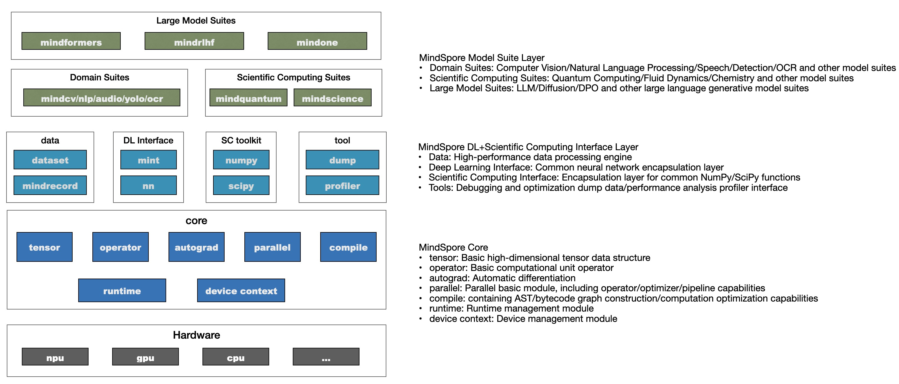

# MindSpore Design Overview

## Introduction

Artificial Intelligence (AI) frameworks have been evolving for over a decade, driven by four main trajectories:

1. Developer-oriented: Balancing algorithm development efficiency and runtime performance.
2. Hardware-oriented: Fully leveraging the performance of chips and clusters.
3. Algorithm and data-oriented: Addressing the challenges of increasingly larger models from a computational scale perspective; handling emerging computational workloads from a computational paradigm perspective.
4. Deployment-oriented: Deploying AI capabilities to every device, application, and industry.

MindSpore is an AI framework designed for "device-edge-cloud" full-scenario applications, aiming to bridge the gap between AI algorithm research and production deployment:

- During algorithm research, it provides developers with a unified programming experience to improve algorithm development efficiency;
- In production, automatic parallelism can greatly accelerate the development and debugging efficiency of distributed training while fully exploiting the computing power of heterogeneous hardware;
- During deployment, it addresses the challenges of enterprise-level deployment and security based on a unified "device-edge-cloud" architecture.

## Overall Architecture

The overall architecture of MindSpore is as follows:

1. Model Suite: Provides developers with ready-to-use models and development kits, such as the large model suite MindSpore Transformers, MindSpore ONE, and scientific computing libraries for hot research areas;
2. Deep Learning + Scientific Computing: Provides developers with various Python interfaces required for AI model development, maximizing compatibility with developers' habits in the Python ecosystem;
3. Core: As the core of the AI framework, it builds the Tensor data structure, basic operation operators, autograd module for automatic differentiation, Parallel module for parallel computing, compile capabilities, and runtime management module.

## Design Philosophy

MindSpore is a full-scenario deep learning framework designed to achieve three major goals: easy development, efficient execution, and unified deployment across all scenarios. Easy development is reflected in API friendliness and low debugging difficulty; efficient execution includes computational efficiency, data preprocessing efficiency, and distributed training efficiency; full-scenario means the framework simultaneously supports cloud, edge, and device-side scenarios.

### Fusion of Functional and Object-Oriented Programming Paradigms

MindSpore provides both object-oriented and function-oriented [programming paradigms](https://www.mindspore.cn/docs/en/master/design/programming_paradigm.html), both of which can be used to construct network algorithms and training processes.

Developers can derive from the nn.Cell class to define AI networks or layers with required functionality, and assemble various defined layers through nested object calls to complete the definition of the entire AI network.

At the same time, developers can also define a pure Python function that can be source-to-source compiled by MindSpore, and accelerate its execution through functions or decorators provided by MindSpore. Under the requirements of MindSpore's static syntax, pure Python functions can support nested subfunctions, control logic, and even recursive function expressions. Therefore, based on this programming paradigm, developers can flexibly enable certain functional features, making it easier to express business logic.

MindSpore implements [functional differential programming](https://www.mindspore.cn/docs/en/master/design/programming_paradigm.html#functional-differential-programming), which performs differentiation based on the call chain according to the calling relationship for function objects that can be differentiated. This automatic differentiation strategy better aligns with mathematical semantics and has an intuitive correspondence with composite functions in basic algebra. As long as the derivative formulas of basic functions are known, the derivative formula of a composite function composed of any basic functions can be derived.

At the same time, based on the functional programming paradigm, MindSpore provides rich higher-order functions such as vmap, shard, and other built-in higher-order functions. Like the differential function grad, these allow developers to conveniently construct a function or object as a parameter for higher-order functions. Higher-order functions, after internal compilation optimization, generate optimized versions of developers' functions, implementing features such as vectorization transformation and distributed parallel partitioning.

### [Unified Programming Experience for Dynamic and Static Graphs](https://www.mindspore.cn/docs/en/master/features/program_form/overview.html)

Traditional AI frameworks mainly have two programming execution forms: static graph mode and dynamic eager mode.

Dynamic eager mode effectively solves the high programming threshold problem of static graphs. Since the program is executed in the order of code writing without whole-graph compilation optimization, there is relatively less room for performance optimization, especially for optimization targeting DSA and other proprietary hardware.

Static graph mode generates the graph structure of a neural network at compile time based on the interfaces called by developers, and then executes the computational operations involved in the graph.

Static graph mode can effectively perceive the relationships between operators at different layers of a neural network and perform effective compilation optimization based on compilation technology to improve performance. However, traditional static graphs require developers to be aware of graph construction interfaces, making network building or debugging more complex, and difficult to interleave with common Python libraries and custom Python functions.

MindSpore builds the graph structure of neural networks based on Python, which provides more usable and flexible expressiveness compared to traditional static graph modes. MindSpore innovatively builds source code conversion capabilities, constructing computational graphs based on Python statements by extracting AST, thus supporting developers' use of native Python syntax (conditions/loops, etc.) and other operations such as tuples, lists, and lambda expressions to build computational graphs and perform automatic differentiation. Therefore, MindSpore can better accommodate both dynamic and static graph programming interfaces, maintaining consistency at the code level, such as control flow writing.

Native Python expressions can directly enable static graph mode execution based on Python control flow keywords, making the programming unification of dynamic and static graphs higher. At the same time, developers can flexibly control Python code fragments in dynamic and static graph modes based on MindSpore's interfaces. That is, local functions can be executed in static graph mode (mindspore.jit) while other functions are executed in dynamic graph mode. This allows developers to flexibly specify function fragments for static graph optimization and acceleration when interleaving with common Python libraries and custom Python functions, without sacrificing the programming ease of interleaved execution.

### [Distributed Parallel Computing](https://www.mindspore.cn/docs/en/master/design/distributed_training_design.html)

As large model parameters continue to grow, complex and diverse distributed parallel strategies are needed to address this challenge. MindSpore has built-in multi-dimensional distributed training strategies that developers can flexibly assemble and use. Through parallel abstraction, communication operations are hidden, simplifying the complexity of parallel programming for developers.

Through automatic parallel strategy search, MindSpore provides transparent and efficient distributed training capabilities. "Transparent" means that developers only need to change one line of configuration and submit one version of Python code to run this version of Python code on multiple devices for training. "Efficient" means that the algorithm selects parallel strategies at minimal cost, reducing computational and communication overhead.

MindSpore introduced Tensor Redistribution (TR) technology in parallel strategy search, which allows the device layout of output tensors to be converted before being input to subsequent operators. MindSpore identifies the output data overlap situation of operators under different input data slices and performs slice inference based on this, automatically generating corresponding tensor rearrangement plans. Based on this plan, various parallel strategies such as data parallelism and model parallelism can be uniformly expressed.

At the same time, MindSpore also provides various parallel strategies such as pipeline parallelism, optimizer parallelism, and recomputation for developers to use.

### High-Performance Hardware Utilization

Based on compilation technology, MindSpore provides rich hardware-independent optimizations such as IR fusion, algebraic simplification, constant folding, and common subexpression elimination. At the same time, it also provides various hardware optimization capabilities for different hardware such as NPU and GPU, thereby better leveraging the large-scale computational acceleration capabilities of hardware.

#### [Graph-Algorithm Fusion](https://www.mindspore.cn/docs/en/master/design/multi_level_compilation.html#graph-kernel-fusion)

Mainstream AI computing frameworks like MindSpore typically define operators from the perspective of developer understanding and ease of use. Each operator carries varying amounts of computation and computational complexity. However, from a hardware execution perspective, this natural operator computational division based on the developer's perspective is not efficient and cannot fully utilize hardware computational capabilities. This is mainly reflected in:

1. Operators with excessive computational volume or complexity are usually difficult to generate well-partitioned high-performance operators, thereby reducing device utilization;
2. Operators with too little computational volume may cause computational waiting latency due to the inability to effectively hide data movement overhead, thereby reducing device utilization;
3. Hardware devices are typically multi-core or many-core structures, and when operator shapes are small or other reasons cause insufficient computational parallelism, some cores may remain idle, thereby reducing device utilization. This is especially sensitive for chips based on Domain Specific Architecture (DSA). How to maximize hardware computational performance while ensuring operators are easy to use has always been a significant challenge.

In terms of AI framework design, the industry mainstream currently adopts a layered implementation method with graph layer and operator layer. The graph layer is responsible for fusing or reorganizing the computational graph, while the operator layer is responsible for compiling the fused or reorganized operators into high-performance executable operators. The graph layer typically uses High-Level IR processing and optimization based on Tensor, while the operator layer uses Low-Level IR analysis and optimization based on computational instructions. This artificial layering significantly increases the difficulty of coordinated optimization between the graph and operator layers.

In its technical practice over the past few years, MindSpore has adopted graph-algorithm fusion technology to better solve this problem. The training speed of mainstream SOTA models has shown significant benefits after enabling graph-algorithm fusion.

#### Competitive Optimization for Ascend Hardware

In "On Device", device typically refers to the Ascend AI processor. Ascend chips integrate AI CORE, AI CPU, and CPU. Among them, AICORE is responsible for large Tensor Vector operations, AICPU is responsible for scalar operations, and CPU is responsible for logical control and task distribution.

The Host-side CPU is responsible for dispatching graphs or operators to the Ascend chip. Since the Ascend chip has the functions of computation, logical control, and task distribution, it does not need to interact frequently with the Host-side CPU, only needing to return the final computed results to the Host side, achieving whole-graph sinking to Device execution, avoiding frequent Host-Device interaction, and reducing overhead.

The computational graph sinks entirely to the Device for execution, reducing Host-Device interaction overhead. It can be combined with loop sinking to achieve multiple Step sinking, further reducing the number of interactions between Host and Device.

Loop sinking is an optimization based on On Device execution, aimed at further reducing the number of interactions between the Host side and the Device side. Typically, each step returns a result, but loop sinking controls how often results are returned, such as every several steps.

Data sinking means that data is directly transmitted to the Device through channels.

### [Unified Deployment Across All Scenarios](https://www.mindspore.cn/docs/en/master/design/all_scenarios.html)

MindSpore is an AI framework that integrates training and inference, supporting both training and inference functions. At the same time, MindSpore supports various chips such as CPU, GPU, and NPU, and provides unified programming interfaces and can generate offline models that can be loaded and executed on various hardware.

According to actual execution environments and business requirements, MindSpore provides multiple specification versions, supporting deployment on cloud, servers, mobile and other embedded devices, and ultra-lightweight devices such as earphones.

### [Third-Party Hardware Integration](https://www.mindspore.cn/docs/en/master/design/pluggable_device.html)

Based on the unified MindIR, MindSpore has built an open AI architecture that supports third-party chip plugins, standardization, and low-cost rapid integration, which can connect to GPU series chips as well as various DSA chips. MindSpore provides two chip integration methods: Kernel mode and Graph mode, allowing chip manufacturers to choose the integration method according to their own characteristics.