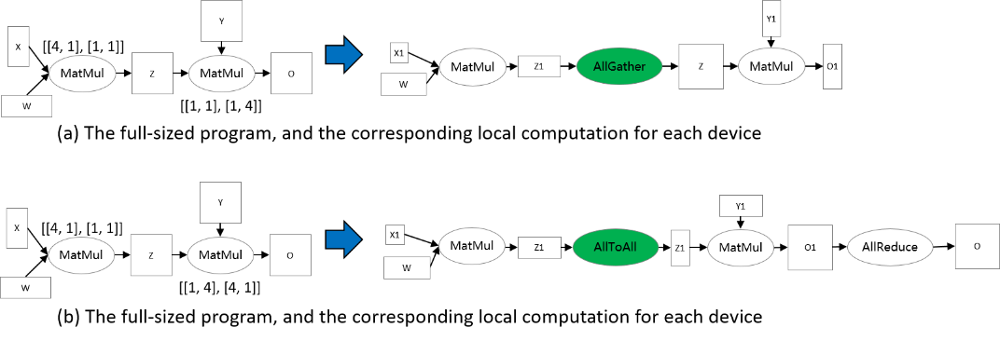

# Sharding Propagation

<a href="https://gitee.com/mindspore/docs/blob/r1.7/docs/mindspore/source_en/design/sharding_propagation.md" target="_blank"></a>

## Background

Distributed operator, Tensor Layout, and Tensor Redistribution are fundamental concepts in op-level parallelism of MindSpore. In [here](https://www.mindspore.cn/docs/en/r1.7/design/distributed_training_design.html#automatic-parallelism), these concepts are introduced by examples. Here, we formally define them.

In op-level parallelism, we conduct SPMD (Single Program Multiple Data) style parallelism, that is, a single program is produced for all partitions. MindSpore transforms a stand-alone program to a parallel one. The transformation is fine-grained in the sense that each operator in the stand-alone program is substituted by (a) distributed operator(s), guaranteeing that the substitution is mathematically equivalent.

### Distributed Operator

Distributed Operator: together, the distributed operators running on multiple devices preserve the same semantics of the stand-alone counterpart. That is, given the same input, the distributed operators’ output is the same as the stand-alone counterpart.

Say a matrix multiplication (MatMul) operator with two matrix X and W as input: Y = MatMul(X, W) is to be parallelized on 4 devices. If X is replicated on 4 devices and W is partitioned along the column dimension, then after the transformation, MatMul is the distributed operator on each device. If X is partitioned along the column dimension and W is partitioned along the row dimension, then MatMul followed by AllReduce are distributed operators on each device.

Besides the SP (Single Program) part, MD (Multiple Data) part also needs to be specified. Before that, we first define the Sharding Strategy.

### Sharding Strategy

Sharding Strategy: a Sharding Strategy for an operator is a two-dimensional array, specifying how many partitions to split each dimension of each input tensor for the operator.

Derived from the Sharding Strategy, Tensor Layout is defined to specify how a tensor is distributed across devices.

### Tensor Layout

Tensor Layout: given a Sharding Strategy for an operator, the Tensor Layout is inferred to describe the distributions of the input tensors of the operator, which includes the **Logical Device Matrix** and the **Tensor Map**. The Logical Device Matrix is an one-dimensional array, describing how devices are arranged for the operator. The Tensor Map the dimensions of input tensors to dimensions of the device matrix, indicating that input tensors are partitioned across the Logical Device Matrix.

Use again the MatMul operator Y = MatMul(X, W). We configure the operator with Sharding Strategy [[2, 1], [1, 4]] and the corresponding Tensor Layout information is demonstrated in the following figure. X is partitioned into 2 parts along the row dimension, and W is partitioned into 4 parts along the column dimension (figure (b)). From the Sharding Strategy, the Logical Device Matrix and the Tensor Map are inferred, as shown in figure (c). The coordinates are also determined to describe the locations of devices in the Logical Device Matrix, based on which the distributions of tensors are determined. From the ‘2’ column in the coordinate table, Device 0—3 are assigned X<sub>0</sub>, while Device 4—7 are assigned X<sub>1</sub>. From the ‘4’ column in the coordinate table, Device 0 and Device 4 are assigned W<sub>0</sub>, Device 1 and Device 5 are assigned W<sub>1</sub>, Device 2 and Device 6 are assigned W<sub>2</sub>, and Device 3 and Device 7 are assigned W<sub>3</sub>. As a result, the local computation is determined, as shown in figure (d).


For two consecutive operators that are dependent, the Tensor Layouts defined by two operators may be inconsistent, due to either Logical Device Matrix or Tensor Map. We propose an algorithm, called Tensor Redistribution, that transforms the inconsistent Tensor Layout. We omit the algorithm here, and only give a definition.

### Tensor Redistribution

Tensor Redistribution: given two inconsistent Tensor Layouts of a tensor, Tensor Redistribution is an algorithm that can transform from the source Tensor Layout to the target Tensor Layout, with minimum communication cost.

Here, the communication cost is measured by the bytes that each device transmits.

Say a two-operator example: Z = MatMul(X, W), O = MatMul(Z, Y). To make Tensor Redistribution effective, two operators are configured Sharding Strategies so that the Tensor Layouts of Z are inconsistent, as shown in the following figure. In figure (a), the output of the first MatMul is row partitioned, while the second MatMul requires that Z are full-sized. Therefore, an AllGather is inferred by Tensor Redistribution to perform the transformation[1]. In figure (b), an AllToAll in inferred to perform the transformation.



## Sharding Propagation

Given a computation graph, Sharding Propagation is a functionality that propagates the Sharding Strategies from configured operator to the whole graph, with the goal of minimizing the communication cost in Tensor Redistribution.

The input of Sharding Propagation is a computation graph, in which nodes represent operators, and edges encode the data-dependency relationship of operators. From a model definition with some operators configured Sharding Strategies, Sharding Propagation executes as follows:

1. Generate possible Sharding Strategies for non-configured operators;
2. Generate Tensor Redistributions and the associated communication costs for each edge;
3. Start from the configured operators, and propagate the Sharding Strategies to non-configured operators using BFS, with the goal of minimizing the communication cost along each edge.

The following figure illustrates an example process of applying Sharding Propagation. Given an computation graph with some configured strategies, it first enumerates possible strategies for non-configured operators, as shown in figure (b). Next, it enumerates possible strategies and the Tensor Redistribution costs for each edge. Demonstrated in figure (c), the strategy for an edge is defined as a pair [*s_strategy*, *t_strategy*], where *s_strategy* and *t_strategy* denote Sharding Strategy for source operator and target operator, respectively. Finally, starting from the configured operator, it determines the next operator’s Sharding Strategy, such that the communication cost in Tensor Redistribution is minimized. The propagation ends when the Sharding Strategies for all operators are settled, as shown in figure (d).


## How to use Sharding Propagation in MindSpore

### Preliminaries

> Download the complete sample code:
>
> <https://gitee.com/mindspore/docs/tree/r1.7/docs/sample_code/sharding_propagation>.

The directory structure is as follows, where `rank_table_8pcs.json` is the IP configuration for Ascend devices (see [here]( https://www.mindspore.cn/tutorials/experts/en/r1.7/parallel/train_ascend.html#configuring-distributed-environment-variables) for the explanation), `train.py` is the model definition, and `run.sh` is the execution script.

```text
└─sample_code
    ├─sharding_propagatinon
    │      rank_table_8pcs.json
    │      run.sh
    │      train.py
    ...
```

### Model definition

We use the FeedForward Network (`FFN`) as an example.

```python
class FFN(Cell):
    def __init__(self):
        super().__init__()
        self.dense1 = Dense(64, 64)
        self.relu = ops.ReLU()
        self.dense2= Dense(64, 64)

    def construct(self, x):
        x = self.dense1(x)
        x = self.relu(x)
        x = self.dense2(x)
        return x
```

### Configuring the Sharding Propagation

Annotate Sharding Strategy for a `MatMul` operator in `FFN`:

```python
self.dense1.matmul.shard(((2, 1), (1, 4)))
```

Configure the search_mode as `sharding_propagation` in Auto_Parallel mode:

```python
context.set_auto_parallel_context(parallel_mode="auto_parallel", search_mode="sharding_propagation")
```

### Training the model and checking the Sharding Strategies

Run the command `bash run.sh 8`. By setting the context: `save_graphs=True`, the IR graphs in the compilation process are saved. We choose the IRs corresponding to device 0.

In `step_parallel_begin_xxx.ir`, each computation operator is annotated with a Sharding Strategy:

```text
...
  %3(x) = MatMul(%1, %2) {instance name: matmul} primitive_attrs: {input_names: [x1, x2], out_strategy: None, transpose_x2: false, transpose_b: false, in_strategy: ((2, 1), (1, 4)), output_names: [output], transpose_a: false, transpose_x1: false}
 {in_strategy: ((2, 1), (1, 4))}      : (<Tensor[Float32], (64, 64)>, <Tensor[Float32], (64, 64)>) -> (<Tensor[Float32], (64, 64)>)
  %4([CNode]453) = Load($(@1_construct_wrapper.298:para4_dense1.bias), %para15_u)
      : (<Ref[Tensor(F32)], (64)>, <UMonad>) -> (<Tensor[Float32], (64)>)
  %5(x) = Add(%3, %4) {instance name: add} primitive_attrs: {output_names: [output], input_names: [x, y]}
 {in_strategy: ((2, 4), (4))}      : (<Tensor[Float32], (64, 64)>, <Tensor[Float32], (64)>) -> (<Tensor[Float32], (64, 64)>)
  %6(x) = ReLU(%5) {instance name: relu} primitive_attrs: {output_names: [output], input_names: [x]}
 {in_strategy: ((2, 4))}      : (<Tensor[Float32], (64, 64)>) -> (<Tensor[Float32], (64, 64)>)
  %7([CNode]447) = Load($(@1_construct_wrapper.298:para5_dense2.weight), %para15_u)
      : (<Ref[Tensor(F32)], (64, 64)>, <UMonad>) -> (<Tensor[Float32], (64, 64)>)
  %8(x) = MatMul(%6, %7) {instance name: matmul} primitive_attrs: {output_names: [output], transpose_a: false, input_names: [x1, x2], transpose_x2: false, transpose_x1: false, transpose_b: false}
 {in_strategy: ((2, 4), (4, 1))}      : (<Tensor[Float32], (64, 64)>, <Tensor[Float32], (64, 64)>) -> (<Tensor[Float32], (64, 64)>)
  %9([CNode]449) = Load($(@1_construct_wrapper.298:para6_dense2.bias), %para15_u)
      : (<Ref[Tensor(F32)], (64)>, <UMonad>) -> (<Tensor[Float32], (64)>)
  %10(x) = Add(%8, %9) {instance name: add} primitive_attrs: {output_names: [output], input_names: [x, y]}
 {in_strategy: ((2, 4), (4))}      : (<Tensor[Float32], (64, 64)>, <Tensor[Float32], (64)>) -> (<Tensor[Float32], (64, 64)>)
...
```

In `xx_validate_xxx.ir`, each input and output tensor in the computation operator is sliced according to the Sharding Strategy.

```text
…
  %2(equivx) = MatMul(%0, %1) {instance name: matmul} primitive_attrs: {input_names: [x1, x2], out_strategy: None, transpose_x2: false, transpose_b: false, in_strategy: ((2, 1), (1, 4)), output_names: [output], transpose_a: false, transpose_x1: false}
 {in_strategy: ((2, 1), (1, 4))}      : (<Tensor[Float32], (32, 64)>, <Tensor[Float32], (64, 16)>) -> (<Tensor[Float32], (32, 16)>)
      # In file ./train.py(33)/        x = self.matmul(x, self.weight)/
  %3(equiv[CNode]453) = Load(%para4_dense1.bias, U)
      : (<Ref[Tensor(F32)], (16)>, <UMonad>) -> (<Tensor[Float32], (16)>)
  %4(equivx) = Add(%2, %3) {instance name: add} primitive_attrs: {output_names: [output], input_names: [x, y]}
 {in_strategy: ((2, 4), (4))}      : (<Tensor[Float32], (32, 16)>, <Tensor[Float32], (16)>) -> (<Tensor[Float32], (32, 16)>)
      # In file ./train.py(34)/        x = self.add(x, self.bias)/
  %5(equivx) = ReLU(%4) {instance name: relu} primitive_attrs: {output_names: [output], input_names: [x]}
 {in_strategy: ((2, 4))}      : (<Tensor[Float32], (32, 16)>) -> (<Tensor[Float32], (32, 16)>)
      # In file ./train.py(48)/        x = self.relu(x)/
  %6(equiv[CNode]447) = Load(%para5_dense2.weight, U)
      : (<Ref[Tensor(F32)], (16, 64)>, <UMonad>) -> (<Tensor[Float32], (16, 64)>)
  %7(equivx) = MatMul(%5, %6) {instance name: matmul} primitive_attrs: {output_names: [output], transpose_a: false, input_names: [x1, x2], transpose_x2: false, transpose_x1: false, transpose_b: false}
 {in_strategy: ((2, 4), (4, 1))}      : (<Tensor[Float32], (32, 16)>, <Tensor[Float32], (16, 64)>) -> (<Tensor[Float32], (32, 64)>)
      # In file ./train.py(33)/        x = self.matmul(x, self.weight)/
  %8(equiv[CNode]493) = AllReduce(%7) {instance name: forward_op_4025687080669949636} primitive_attrs: {group: 4-6301172352641561019, fusion: 0, op: sum, group_ranks: 0-1-2-3, index: 0}
      : (<Tensor[Float32], (32, 64)>) -> (<Tensor[Float32], (32, 64)>)
  %9(equiv[CNode]492) = StridedSlice(%8, (0, 0), (32, 16), (1, 1)) {instance name: redistribution_op_145462406996255498StridedSlice} primitive_attrs: {new_axis_mask: 0, shrink_axis_mask: 0, end_mask: 0, input_names: [x, begin, end, strides], output_names: [output], keep_value_node_input: true, begin_mask: 0, ellipsis_mask: 0}
      : (<Tensor[Float32], (32, 64)>, <Tuple[Int64*2]>, <Tuple[Int64*2]>, <Tuple[Int64*2]>) -> (<Tensor[Float32], (32, 16)>)
  %10(equiv[CNode]449) = Load(%para6_dense2.bias, U)
      : (<Ref[Tensor(F32)], (16)>, <UMonad>) -> (<Tensor[Float32], (16)>)
  %11(equivx) = Add(%9, %10) {instance name: add} primitive_attrs: {output_names: [output], input_names: [x, y]}
 {in_strategy: ((2, 4), (4))}      : (<Tensor[Float32], (32, 16)>, <Tensor[Float32], (16)>) -> (<Tensor[Float32], (32, 16)>)
…
```

[^1]: Note: actually, AllGather+Concat is needed here to perform the transformation.
